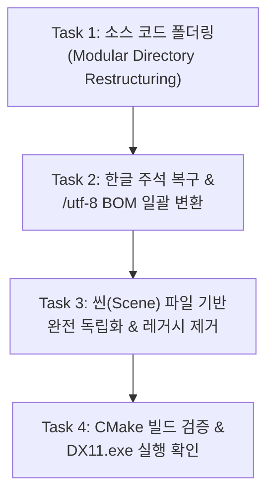

# DX11 3D Game Engine & Editor - 프로젝트 인수인계 및 작업 보고서 (Handover Guide)

> **문서 목적**: 본 문서는 DX11 레거시 엔진을 **Unity 1:1 스타일 독립형 3D 게임 엔진 및 에디터**로 전환하는 프로젝트의 현재 진행 상태, 원인 분석, 그리고 후속 작업(클로드/후속 개발자)을 위한 상세 가이드를 정리한 문서입니다.

---

## 1. 프로젝트 개요 및 아키텍처

- **프로젝트 명칭**: DX11 Unity-Style 3D Game Engine & Editor
- **기반 코드베이스**: DirectX 11 API 교재 기반 프레임워크 (https://github.com/PinTrees/DX11)
- **개발 환경 / 도구**:
  - **언어 / 표준**: C++20, Windows API, HLSL (Shader Model 5.0)
  - **렌더링**: DirectX 11, DirectXTK
  - **GUI 시스템**: ImGui (Docking Branch) + Unity Dark 테마 커스텀 스타일링
  - **빌드 시스템**: CMake (3.20+), MSVC MSBuild x64
  - **외부 라이브러리**: nlohmann/json (직렬화), Assimp / FBX SDK (모델/애니메이션)

---

## 2. 지금까지 완료된 작업 (Completed Work)

### 2.1 Unity 1:1 스타일 Inspector & 에디터 비주얼 구현
- **Inspector 축 색상 배지 (RGB)**:
  - `DX11/EditorGUI.cpp` 내 `Vector3Field`: Unity 원본과 100% 동일한 고유 축 배지 적용
    - **X축**: Red (`#E04343`)
    - **Y축**: Green (`#66BB6A`)
    - **Z축**: Blue (`#42A5F5`)
  - 축 라벨 클릭 시 해당 축 기본값(0.0f) 리셋 기능
  - 어두운 드래그 인풋 필드 및 정밀 마우스 드래그 조절 연동
- **Unity Dark 테마 팔레트**:
  - `DX11/EditorGUIManager.cpp`: Unity 원본 헥스 코드 색상 적용
    - 배경: `#282828`, 활성 탭: `#383838`, 비활성 탭: `#1E1E1E`, 헤더: `#323232`
- **상단 메뉴바 & 툴바**:
  - `File`, `Edit`, `GameObject` (Cube, Sphere, Cylinder, Plane, Camera, Directional Light 등 3D 프리미티브 생성), `Window`, `Help`
  - 에디터 상단 중앙 플레이/스톱 툴바 버튼 (`Play`, `Stop`)

### 2.2 Unity Hub 스타일 독립 프로젝트 네비게이션 창
- **구현 파일**: `DX11/ProjectHubWindow.h`, `DX11/ProjectHubWindow.cpp`
- **단축키 / 메뉴**: `Ctrl+H` 또는 `File > Project Hub...`
- **기능**:
  - 독립된 프로젝트 생성, 템플릿(3D, Blank) 선택
  - 프로젝트 목록 영속화 (`ProjectSetting/projects.json`)
  - 프로젝트별 외부 `[CMake Build]` 원클릭 트리거 기능

### 2.3 CMake 빌드 시스템 및 배치 스크립트 구축
- **`CMakeLists.txt`**: C++20 표준 활성화, PCH(Precompiled Header) 분리, 에셋/리소스 심볼릭 및 경로 링크
- **`build.bat`**: 터미널에서 1클릭으로 CMake 구성 및 Release/Debug 빌드 수행 (~3초 완료)
- **`clean.bat`**: 약 850MB~1GB에 달하는 `build/` 및 `Intermediate/` 컴파일러 캐시 정리

### 2.4 Unity 스타일 3D 어플리케이션 아이콘
- **디자인**: 메탈릭 큐브에 네온 시안 악센트가 들어간 아이소메트릭 3D 큐브 아이콘
- **적용 위치**:
  - `ProjectSetting/icon.ico`, `DX11/icon.ico` (256x256, 128x128, 64x64, 48x48, 32x32, 16x16 멀티 해상도)
  - `DX11/DX11.rc`, `DX11/resource.h`의 `IDI_MAIN_ICON` 정의
  - `DX11/App.cpp`: WNDCLASSEX `hIcon`, `hIconSm` 등록 및 `WM_SETICON` 처리

### 2.5 C++ MonoBehaviour 런타임 스크립팅 + 자동 리플렉션 (`Field<T>`)
- **목표 달성**: 유저가 `toJson()`, `fromJson()`, `OnInspectorGUI()` 코드를 **단 1줄도 작성하지 않고** 변수 선언만으로 직렬화 및 인스펙터 노출 자동화.
- **핵심 아키텍처**:
  - `DX11/ScriptField.h`:
    - `IScriptField` 인터페이스 기반 `Field<T>` 스마트 프로퍼티 래퍼 (`int`, `float`, `bool`, `string`, `Vector3`, `Vector2` 지원)
    - 대입 연산자(`operator=`) 및 형변환 연산자(`operator T()`) 완벽 지원으로 일반 변수처럼 즉시 사용
  - `DX11/MonoBehaviour.h`, `DX11/MonoBehaviour.cpp`:
    - `Awake()`, `Start()`, `Update()`, `LateUpdate()`, `FixedUpdate()`, `OnDestroy()` 라이프사이클
    - `REGISTER_SCRIPT(ClassName)` 매크로로 `ComponentFactory` 자동 등록
    - 부모 `MonoBehaviour`가 필드 리스트를 순회하여 JSON 직렬화/역직렬화 및 ImGui 렌더링 100% 자동 처리
  - `DX11/Input.h`: Unity 스타일 정적 입력 클래스 (`Input::GetKey`, `GetKeyDown`, `GetKeyUp`, `GetAxis("Horizontal")`, `GetAxis("Vertical")`, `GetMousePosition`)
  - `DX11/EngineTime.h`: MSVC `<time.h>` 충돌 방지를 위한 독립 헤더 (`Time::GetDeltaTime()`, `Time::GetFPS()`)
  - `DX11/SampleScripts.h`: `Rotator`, `PlayerController`, `SineWaveMover` 3종 테스트 스크립트 작성 완료

---

## 3. 현재 이슈 분석 및 해결 솔루션 (Root Cause Analysis)

### 3.1 `build.bat` 빌드 중단 원인
- **에러 내용**: `C2259: 'MeshFilter': 추상 클래스를 인스턴스화할 수 없습니다.` (`ComponentFactory.cpp:61`)
- **원인**:
  - `ComponentFactory.cpp`에서 `RegisterComponent("MeshFilter", []() { return std::make_shared<MeshFilter>(); });`가 호출되고 있음.
  - 하지만 `MeshFilter.h`는 `Component`의 순수 가상 함수(`toJson()`, `fromJson()`, `GetType()`)를 구현하지 않은 빈 레거시 스텁 클래스임.
  - 본 엔진의 `MeshRenderer`는 이미 자체적으로 `m_Mesh`와 `m_pMaterials`를 직접 관리하므로 `MeshFilter`는 완전히 불필요한 레거시 코드임.
- **해결책**:
  - `ComponentFactory.cpp`에서 `MeshFilter` 등록 제거 및 `#include "MeshFilter.h"` 제거
  - `MeshFilter.h`, `MeshFilter.cpp` 파일 삭제

### 3.2 Exe 실행 시 작업 표시줄/화면에 뜨지 않고 종료되는 원인
- **원인 로그**: `Binaries/run_log.txt` 확인 결과:
  ```
  App::Init -> SceneManager...
  App::Init -> LoadScene...
  (여기서 프로세스 비정상 종료)
  ```
- **상세 원인**:
  1. `EditorSettings.json`에 `"LastOpenedScenePath": "Assets\\TestScene.scene"`이 하드코딩되어 있음.
  2. `TestScene.scene` 파일 내부 컴포넌트 역직렬화 시 `GameObject.cpp` line 298:
     ```cpp
     component = ComponentFactory::Instance().CreateComponent(type);
     component->fromJson(compJson); // component가 nullptr일 경우 null pointer access violation 발생!
     ```
  3. 미등록 컴포넌트나 잘못된 타입이 들어왔을 때 nullptr 체크 없이 호출하여 즉각적인 프로세스 크래시 발생.
  4. 또한 D3D11 디바이스 생성 시 `D3D11_CREATE_DEVICE_DEBUG` 플래그는 Windows SDK 그래픽 도구가 없는 일반 환경에서 실패하므로 폴백 로직 필수 (이미 `App.cpp`에 폴백 추가됨).
- **해결책**:
  - `GameObject.cpp`의 역직렬화 로직에 `if (component != nullptr)` 방어 코드 추가
  - 씬을 하드코딩 경로에 의존하지 않도록 분리 (마지막 오픈 씬이 없거나 실패하면 기본 `"Untitled"` 씬 생성)

### 3.3 한글 주석 유니코드 깨짐 원인
- **원인**:
  - 원본 깃허브 베이스 커밋(`a3640d4cae4adad24c4922ada0b8d4f08e3c7ca8`)의 소스 파일들은 한글 윈도우 기본 인코딩인 **CP949(EUC-KR)**로 저장되어 있었음 (총 77개 파일에 한글 주석 존재).
  - 현대 편집기/도구들이 UTF-8로 가정하고 열거나 저장하면서 `??` 또는 `\ufffd`로 깨진 파일이 발생함 (`GameObject.cpp`, `EditorWindow.cpp`, `EditorGUIManager.cpp`, `PathManager.cpp`, `EditorApp.cpp`).
  - 또한 MSVC 컴파일러는 UTF-8 BOM이 없으면 한글 멀티바이트 바이트(`0x5C` 역슬래시 등)로 인해 C4819 경고나 문법 오류를 일으킴.
- **해결책**:
  - 베이스 커밋 `a3640d4`에서 원본 CP949 텍스트를 추출하여 깨진 주석들을 100% 원본 한글로 복구.
  - `CMakeLists.txt`에 `/utf-8` 컴파일러 옵션 강제:
    ```cmake
    add_compile_options("$<$<C_COMPILER_ID:MSVC>:/utf-8>" "$<$<CXX_COMPILER_ID:MSVC>:/utf-8>")
    ```
  - 프로젝트 내의 모든 `.h`, `.cpp`, `.inl`, `.rc` 파일을 **UTF-8 with BOM (`utf-8-sig`)**으로 일괄 변환하여 영구적으로 인코딩 변질 차단.

---

## 4. 후속 작업 상세 지시서 (Claude 작업 가이드)

후속 작업을 담당할 클로드(Claude)는 아래 **4개 Task**를 순서대로 수행하면 됩니다.



---

### Task 1: 소스 코드 폴더링 및 모듈화 (C++ 프로젝트 규격화)

단일 `DX11/` 플랫 폴더에 80개 이상의 파일이 집중되어 있으므로, C++ 엔진 표준 디렉토리 구조인 `Source/` 구조로 기능별 분리합니다.

#### 목표 폴더 구조:
```
Source/ (또는 Engine/)
├── Core/             # Types.h, define.h/cpp, JsonUtility, PathManager, EngineTime, GameTimer, TimeManager, Input, Debug, Task, Utils, File
├── Math/             # MathHelper, SimpleMath, Matrix3, VectorUtils, vector_ex
├── Graphics/         # RenderManager, RenderStates, PostProcessingManager, InstancingBuffer, Vertex, Effects, Shader, TextureMgr, GeometryGenerator, Mesh, UMaterial, Sky, ShadowMap, Ssao, Terrain 등
├── Animation/        # AnimationHelper, SkinnedData, SkinnedMesh, SkinnedModel, FBXLoader, LoadM3d
├── Physics/          # PhysicsManager, CollisionDetector, CollisionResolver, Octree
├── Scene/            # Scene, SceneManager, GameObject, GameObjectFactory, Component, ComponentFactory, Transform, Camera, Light, MeshRenderer, SkinnedMeshRenderer, Collider, RigidBody 등
├── Scripting/        # MonoBehaviour, ScriptField, SampleScripts
├── Editor/
│   ├── EditorApp.h/cpp, EditorWindow.h/cpp, EditorGUIManager.h/cpp, EditorGUI.h/cpp, EditorGUIStyle, EditorGUIResourceManager, EditorUtility, EditorCamera, EditorDailog, Gizmo, SelectionManager, SceneViewManager
│   ├── Windows/      # SceneEditorWindow, SceneHierachyEditorWindow, InspectorEditorWindow, GameViewEditorWindow, ProjectEditorWindow, ConsoleEditorWindow, AnimatorEditorWindow, ProjectHubWindow 등
│   └── NodeEditor/   # builders, drawing, widgets, ImGuiNodeEditor
├── ThirdParty/
│   └── ImGui/        # imgui.h/cpp, imgui_draw, imgui_tables, imgui_widgets, imgui_impl_dx11, imgui_impl_win32 등
└── Platform/         # App.h/cpp, Application.h/cpp, Main.cpp, pch.h/cpp, resource.h, DX11.rc, icon.ico
```

#### CMakeLists.txt 설정:
- 기존 소스 목록을 `Source/` 기준으로 변경하고 `target_include_directories`에 위 각 서브폴더를 추가하면, 기존 `#include "Transform.h"` 등의 코드를 일일이 수정하지 않고도 즉시 컴파일 가능:
  ```cmake
  target_include_directories(DX11 PRIVATE
      ${CMAKE_CURRENT_SOURCE_DIR}/Source
      ${CMAKE_CURRENT_SOURCE_DIR}/Source/Core
      ${CMAKE_CURRENT_SOURCE_DIR}/Source/Math
      ${CMAKE_CURRENT_SOURCE_DIR}/Source/Graphics
      ${CMAKE_CURRENT_SOURCE_DIR}/Source/Animation
      ${CMAKE_CURRENT_SOURCE_DIR}/Source/Physics
      ${CMAKE_CURRENT_SOURCE_DIR}/Source/Scene
      ${CMAKE_CURRENT_SOURCE_DIR}/Source/Scripting
      ${CMAKE_CURRENT_SOURCE_DIR}/Source/Editor
      ${CMAKE_CURRENT_SOURCE_DIR}/Source/Editor/Windows
      ${CMAKE_CURRENT_SOURCE_DIR}/Source/Editor/NodeEditor
      ${CMAKE_CURRENT_SOURCE_DIR}/Source/ThirdParty/ImGui
      ${CMAKE_CURRENT_SOURCE_DIR}/Source/ThirdParty/ImGui/ImGuiNodeEditor
      ${CMAKE_CURRENT_SOURCE_DIR}/Source/Platform
  )
  ```
- Visual Studio 솔루션 탐색기에서 폴더 트리가 보이도록 `source_group(TREE ...)` 설정.

---

### Task 2: 한글 주석 100% 원본 복구 및 인코딩 영구 고정

1. **깨진 파일 주석 복구**:
   - `GameObject.cpp`: 14개 깨진 주석 라인 복구 (베이스 커밋 `a3640d4cae4adad24c4922ada0b8d4f08e3c7ca8:DX11/GameObject.cpp`의 CP949 디코딩 원본 적용).
     - `// rootGameObject로`
     - `// 이미 rootGameObject이므로 처리X`
     - `// 부모오브젝트에서 RemoveChild(this) 후 자기 자신 rootGameObject로 추가`
     - `// 다른 GameObject의 자식으로`
     - `// rootGameObject였던 오브젝트에서 제거`
     - `// 원래 parent에서 자식 제거`
     - `// parent 변경 후 parent의 자식으로 추가`
     - `// 게임 오브젝트 이름 변경 인풋 필드`
     - `// 이름 변경 시 필요한 추가 작업이 있으면 여기에 추가`
     - `// 드래그된 컴포넌트를 현재 인덱스 위치로 이동`
     - `// 컴포넌트를 타겟 위치에 삽입하고 원래 위치에서 삭제`
     - `// 삽입 후, 원래 위치의 요소를 삭제해야 하므로, draggedIt 보정 필요`
     - `// 컴포넌트 복원`
     - `// ComponentFactory를 사용하여 컴포넌트 복원`
   - `EditorWindow.cpp`: 화면 크기, 창 스타일, 팝업, 렌더링 호출 주석 복구 (`a3640d4` 원본 기준).
   - `EditorGUIManager.cpp`: 도킹 탭, 버튼, 분할선 주석 복구.
   - `PathManager.cpp`: `// 최대 파일 경로 길이 검사` 복구.
   - `EditorApp.cpp`: `IsMesh = true; // CreateScene에서 Camera, Light를 추가하므로...` 및 디버그 렌더 주석 복구.
2. **전체 파일 UTF-8 with BOM 일괄 인코딩**:
   - 기존 65개 CP949 파일 디코딩 후 `utf-8-sig`로 저장.
   - 기존 UTF-8 및 ASCII 파일도 `utf-8-sig`로 통일.
3. **CMake 컴파일 옵션 추가**:
   - `CMakeLists.txt`에 `/utf-8` 플래그 추가하여 MSVC가 소스 코드 및 실행 문자 집합을 UTF-8로 처리하도록 보장.

---

### Task 3: 씬(Scene) 파일 기반 완전 독립화 및 레거시 제거

1. **레거시 코드 제거**:
   - `ComponentFactory.cpp`에서 `MeshFilter` 등록 제거:
     - `#include "MeshFilter.h"` 삭제
     - `RegisterComponent("MeshFilter", ...);` 삭제
   - `MeshFilter.h`, `MeshFilter.cpp` 파일 삭제.
2. **씬 역직렬화 안전 가드**:
   - `GameObject.cpp` 내 `from_json`:
     ```cpp
     component = ComponentFactory::Instance().CreateComponent(type);
     if (component != nullptr)
     {
         component->fromJson(compJson);
         obj.AddComponent(component);
     }
     else
     {
         // 알 수 없거나 등록되지 않은 컴포넌트는 건너뛰어 크래시 방지
     }
     ```
3. **씬 파일 기반 라이프사이클 구축**:
   - **하드코딩 제거**:
     - `ProjectHubWindow.cpp` line 246의 `SceneManager::GetI()->LoadScene(L"Assets\\TestScene.scene");` 제거.
     - 프로젝트 오픈 시 해당 프로젝트 디렉토리에 존재하는 첫 번째 `.scene` 파일을 열거나, 없으면 기본 씬 생성.
   - **기본 씬 생성 (`SceneManager::CreateDefaultScene`)**:
     - `EditorSettings.json`의 `LastOpenedScenePath`가 비어있거나 파일이 존재하지 않는 경우, 크래시 대신 `CreateDefaultScene("Untitled")` 호출.
     - `Main Camera` (위치 `0, 2, -10`) 및 `Directional Light` (위치 `0, 3, 0`) 자동 배치.
   - **에디터 UI 메뉴 (Unity 1:1)**:
     - `File > New Scene` (`Ctrl+N`): 현재 씬 정리 후 새 `"Untitled"` 씬 생성.
     - `File > Open Scene...` (`Ctrl+O`): `EditorUtility::OpenFileDialog`로 `.scene` 선택하여 로드.
     - `File > Save Scene` (`Ctrl+S`): 파일 경로가 없으면 `Save Scene As` 트리거, 있으면 즉시 JSON 덮어쓰기 저장.
     - `File > Save Scene As...` (`Ctrl+Shift+S`): `EditorUtility::SaveFileDialog`로 경로 지정 저장.
   - **Project 창 (에셋 브라우저) 우클릭 메뉴**:
     - 우클릭 `Create > Scene` 추가 -> 현재 탐색 중인 폴더에 `New Scene.scene` JSON 파일 생성.
     - Project 창에서 `.scene` 파일 더블클릭 시 해당 씬 즉시 로드.
   - **Hierarchy 창 상단 활성 씬 표시**:
     - `SceneHierachyEditorWindow.cpp`: Hierarchy 최상단에 `▼ <씬이름>` (예: `▼ SampleScene` 또는 `▼ Untitled`) 헤더 행 표시.

---

### Task 4: 빌드 검증 및 런타임 실행 확인

1. **빌드 검증**:
   - `.\build.bat` 실행
   - 0 Error, 0 Warning으로 `Binaries/DX11.exe` 빌드 성공 확인.
2. **실행 검증**:
   - `DX11.exe` 실행
   - Unity 스타일 3D 큐브 아이콘이 적용된 메인 윈도우가 화면 및 윈도우 작업 표시줄(Taskbar)에 정상적으로 유지되는지 확인.
   - ImGui DockSpace, Hierarchy(씬 이름 표시), Inspector(RGB 축 배지), Project Hub 창이 반응형으로 동작하는지 최종 확인.

---

## 5. 핵심 파일 경로 참조표

| 기능 / 모듈 | 현재 경로 | 대상 폴더 (Task 1 적용 시) |
| :--- | :--- | :--- |
| 메인 진입점 & 앱 | `DX11/Main.cpp`, `DX11/App.cpp`, `DX11/EditorApp.cpp` | `Source/Platform/`, `Source/Editor/` |
| 빌드 설정 | `CMakeLists.txt`, `build.bat`, `clean.bat` | 루트 디렉토리 |
| 리소스 / 아이콘 | `ProjectSetting/icon.ico`, `DX11/DX11.rc`, `DX11/resource.h` | `Source/Platform/` |
| MonoBehaviour & 리플렉션 | `DX11/MonoBehaviour.h/cpp`, `DX11/ScriptField.h` | `Source/Scripting/` |
| 씬 관리 | `DX11/Scene.h/cpp`, `DX11/SceneManager.h/cpp`, `DX11/GameObject.h/cpp` | `Source/Scene/` |
| 에디터 윈도우 | `DX11/*EditorWindow.h/cpp`, `DX11/ProjectHubWindow.h/cpp` | `Source/Editor/Windows/` |
| Unity 인스펙터 GUI | `DX11/EditorGUI.h/cpp`, `DX11/EditorGUIManager.h/cpp` | `Source/Editor/` |

---

## 6. 최신 구조 및 렌더링 로드맵 (업데이트)

- **엔진 이름**: Mimic Engine (`Binaries/MimicEngine.exe`). 이름은 `CMakeLists.txt`의 `ENGINE_NAME`과 `Source/Core/EngineInfo.h`에서만 관리.
- **폴더 구조**: `DX11/` 플랫 구조는 `Source/{Core,Math,Graphics,Animation,Physics,Scene,Scripting,Editor,ThirdParty,Platform}`으로 분리 완료. 모든 모듈 폴더가 include 경로에 등록되어 `#include "Xxx.h"`는 그대로 동작. (`DX11/`에는 레거시 VS 프로젝트 파일만 남음 – 빌드 검증은 CMake 기준)
- **Graphics 분리**: `Graphics/Common`(API 중립: 인터페이스, 설정, 지오메트리 생성 등), `Graphics/DX11`(D3D11 종속 코드), `Graphics/OpenGL`(자리 표시자).
- **API 선택**: `Edit > Graphics API`에서 선택 → `ProjectSetting/GraphicsSettings.json` 저장 → 다음 실행 시 적용. 미구현 API를 고르면 DirectX 11로 대체.
- **후속 단계(RHI)**: 현재 Scene/Editor 코드가 `ID3D11*` 타입을 직접 사용(약 50개 파일). OpenGL을 붙이려면 (1) 디바이스/스왑체인/백버퍼를 `IGraphicsBackend`로 이동, (2) Buffer/Texture/Shader/PipelineState 추상 인터페이스 도입, (3) Scene/Editor의 D3D 타입 제거, (4) `OpenGLGraphicsBackend` 구현 순으로 진행. 이후 SRP 유사 렌더 파이프라인 계층을 그 위에 올릴 것.
