<p align="center">
  
</p>

<h1 align="center">NOVA Game Engine</h1>

<p align="center">
  <b>Unity 6 에디터를 그대로 옮겨 온 C++20 3D 게임 엔진 + 에디터</b><br/>
  DirectX 11 · OpenGL 4.5 · C# 스크립팅 · Jolt Physics · 절차적 월드 제작<br/>
  <sub>Claude(Opus 5.5)와 함께 기능 하나하나를 Unity 와 1:1 에 가깝게 만들어 가는 프로젝트</sub>
</p>

<p align="center">
  <a href="https://nova-game-engine.web.app"></a>
</p>

<p align="center">
  
  
  
  
  
  
</p>

<p align="center">
  <a href="https://nova-game-engine.web.app"><b>공식 사이트</b></a> ·
  <a href="#빠른-시작"><b>빠른 시작</b></a> ·
  <a href="#주요-기능"><b>주요 기능</b></a> ·
  <a href="#스크린샷"><b>스크린샷</b></a> ·
  <a href="docs/NOVA_CLI.md"><b>NOVA CLI 문서</b></a> ·
  <a href="AGENT_HANDOFF.md"><b>개발 문서</b></a>
</p>

<p align="center">
  
</p>

> 🌐 **공식 사이트: [nova-game-engine.web.app](https://nova-game-engine.web.app)** — 엔진 소개, 기능 둘러보기, 스크린샷 갤러리, 다운로드 안내를 한 곳에서 볼 수 있습니다.

---

## 한눈에 보기

- **Unity 를 써 봤다면 설명 없이 쓸 수 있는 에디터** — 창 배치, 아이콘, Inspector 모양, 단축키, 동작까지 Unity 6 을 따라 합니다.
- **두 그래픽 API, 같은 렌더 코드** — DirectX 11 과 OpenGL 4.5 를 RHI·Gfx 층 하나로 그리고, HLSL 셰이더는 GLSL 로 자동 변환합니다. 에디터와 빌드한 게임 모두 설정에서 고릅니다.
- **Unity 와 같은 C# API** — `MonoBehaviour`, 코루틴, 물리 콜백, UGUI, 파티클… `using UnityEngine;` 을 `using NovaEngine;` 으로 바꾸면 대부분 그대로 동작하고, 저장하면 바로 핫 리로드됩니다.
- **텍스처 파일 없이 수식으로 만드는 월드** — 나무, 숲, 바위·절벽, 풀·꽃, 지형 생성기, 바이옴, 바다·호수·강.
- **터미널·AI 가 다루는 에디터** — `nova` CLI 로 창 포커스 없이 실행 중인 에디터를 만들고, 바꾸고, Play 하고, 찍고, 성능을 잽니다.

## 주요 기능

### 🧭 에디터

| 분야 | 내용 |
|---|---|
| **Hub · 에디터** | NOVA Hub(프로젝트 목록·생성·설치) → 에디터. 도킹 레이아웃(Hierarchy · Scene/Game · Inspector · Project/Console/Animator), **창을 에디터 밖 OS 창으로 빼기**, 시작 로딩 창, Undo/Redo, 에디터 로그(`Logs/Editor.log`) |
| **씬 파일** | New / Open / Save / Save As (`Ctrl+N` · `Ctrl+O` · `Ctrl+S` · `Ctrl+Shift+S`), 저장하지 않은 변경이 있으면 Unity 처럼 *Save / Don't Save / Cancel* 확인, 변경 표시(`*`) |
| **Scene 뷰** | Move/Rotate/Scale/Rect/Transform 핸들, Pivot/Center·Local/Global, 스냅, Scene Camera 패널, 우클릭 비행(WASD·QE), Alt 궤도, F 포커스 |
| **Game 뷰** | 해상도(Free/비율/고정 + 사용자 추가), Scale, Display 1~8, Play Focused/Maximized/Unfocused, Stats(FPS·Batches·Tris·Audio) |
| **Hierarchy / Inspector** | 부모/자식, 복제·잘라내기·붙여넣기, 이름 바꾸기, Unity 식 컴포넌트 헤더와 Add Component 메뉴, Object Picker(⊙) |
| **Project 창** | 2단 레이아웃(폴더 트리 + 목록/격자), breadcrumb, 검색·타입 필터, FBX 하위 에셋, 생성/이름 바꾸기/휴지통 삭제, 드래그 앤 드롭 |
| **프리팹** | Hierarchy → Project 로 끌어 만들기, 인스턴스(파란 표시), 오버라이드 Apply All / Revert All / Unpack, 에셋 변경 자동 반영 |
| **Profiler** (`Ctrl+7`) | CPU / GPU Usage 그래프, 구간 Hierarchy·Timeline, GPU 타임스탬프(DX11·OpenGL), Rendering Statistics, 겹쳐 칠한 픽셀 수, Memory(프로세스·GPU·에셋 종류별) |
| **NOVA Code** | 내장 C# IDE — 구문 강조, 엔진 API 자동 완성, 찾기/바꾸기, 저장하면 바로 컴파일, 오류 줄 밑줄. Visual Studio / VS Code / Rider 로 바꿀 수 있음 |

### 🎨 렌더링 · 그래픽 API

| 분야 | 내용 |
|---|---|
| **그래픽 API** | **DirectX 11 / OpenGL 4.5** — 같은 렌더 코드가 RHI·Gfx 층으로 두 API 에 그린다. HLSL → SPIR-V → GLSL 자동 변환(DXC + SPIRV-Cross, 변환 캐시). 에디터는 *Edit > Preferences > Graphics*, 빌드한 게임은 *Project Settings > Player* 의 우선순위 목록으로 고르고, 시작할 수 없으면 DX11 로 대체. 창 제목에 지금 API 표시(`<DX11>` / `<OpenGL>`) |
| **머티리얼 (URP Lit / PBR)** | `.mat` 에셋, Base Map · Metallic · Smoothness · Normal · Occlusion · Emission(HDR) · Tiling/Offset · Alpha Clipping, 구 미리보기가 있는 Unity 모양 Inspector |
| **그림자 (URP 방식)** | 방향광 Cascaded Shadow Maps(1~4, 텍셀 고정), 스포트·점광 그림자, Hard / Soft(PCF), 빛마다 Strength·Bias, Volume 의 Shadows 오버라이드, 먼 캐스케이드 캐시 |
| **후처리 (Volume)** | Global/Local Volume + Profile 에셋, Bloom · Tonemapping(Neutral/ACES) · Color Adjustments · White Balance · Vignette · Chromatic Aberration · Film Grain · FXAA |
| **대기 · 조명** | 지수 높이 안개(Unreal 식), 대기 원근(레일리·미 산란), 하늘 환경광·반사, 자동 노출 — 모두 Volume 오버라이드로 장소마다 |
| **스카이박스** | Poly Haven CC0 HDRI 큐브맵, 금속 반사와 환경광에 같은 하늘 |
| **성능** | 인스턴싱, Mesh Renderer 자동 묶기, 절두체 컬링 옥트리, 셰이더 캐시(의존성 추적 + 병렬 컴파일), `nova perf` 로 측정 |

<details>
<summary><b>DirectX 11 vs OpenGL 4.5 비교 (펼치기)</b></summary>

같은 프로젝트·같은 카메라로 두 API 를 비교한 결과입니다 (GTX 1660 SUPER, Release, Scene 뷰 240 프레임 평균).

| 씬 | DX11 프레임 (GPU) | OpenGL 프레임 (GPU) | 화면 차이 (픽셀 최대) |
|---|---|---|---|
| Materials | 0.95 ms (0.80) | 1.32 ms (0.84) | 1 |
| Shadows | 1.02 ms (0.88) | 1.49 ms (0.89) | 1 |
| Forest | 0.79 ms (0.64) | 1.14 ms (0.47) | 1 |
| Trees (가장 무거움) | 2.67 ms (2.45) | **2.50 ms (1.67)** | 바람에 흔들리는 잎만 |
| Particles | 0.83 ms (0.67) | 1.08 ms (0.42) | 1 |

GPU 시간은 두 API 가 같거나 OpenGL 이 빠르고, 가벼운 씬에서 남은 차이는 CPU 쪽(드라이버) 입니다.

스킨 메시 캐릭터, Play 중 입자·UI, 에디터 밖으로 뺀 창도 두 API 가 같은 화면입니다. 한 번만 바꿔 실행하려면 `-force-d3d11` / `-force-opengl` 을 붙입니다.

</details>

### 🌍 월드 제작

| 분야 | 내용 |
|---|---|
| **터레인** | 쿼드트리 LOD, 높이 올리기/내리기·평탄화·다듬기, 레이어 칠하기(triplanar, 확률적 텍스처링), Terrain Collider |
| **지형 생성기** | World Creator 식 레이어 스택 + 비파괴 스탬프 — Base 노이즈 → **Terrain Stamp**(산·분화구·화산·메사·협곡·섬·높이맵) → 침식·테라스 필터 → 재질 규칙. 1 km 지형 약 0.5 초(백그라운드) |
| **바이옴** | 색 재질 + 영역별 지형, **프리셋 10 종**(Alpine, Arctic Tundra, Badlands, Desert Dunes, Grassland, Highland Moor, Red Rock Canyon, Savanna, Tropical Islands, Volcanic), **Terrain Biome** 영역, **Terrain Spline**(길·협곡·능선) |
| **나무 (Tree)** | SpeedTree 처럼 절차적으로 — 줄기 → 가지 1~3 단계, 수관 모양, 잎 카드. 수피·잎 텍스처도 실행 중에 수식으로 굽는다. 계층 바람, 프리셋 Oak / Pine / Birch / Bush |
| **숲 (Paint Trees)** | 브러시로 나무 칠하기, 인스턴싱 + LOD(전체 → 중간 → 8 방향 임포스터, 디더 섞기). 1500 그루 약 230 FPS. **나무 충돌**(Terrain Collider 의 Enable Tree Colliders = 줄기 캡슐) |
| **바위 · 절벽 (Rock)** | SDF 조형(절단·지층·주상절리·균열) → Surface Nets 메시, LOD 3 단계, 프리셋 6 종, **Rock Scatter** 로 수천 개를 GPU 인스턴싱 |
| **바닥 디테일** | 풀·꽃·돌을 브러시로, 절차 메시 + 인스턴싱 + 바람 물결, **프리셋 15 종** |
| **물** | **Water Body** 하나로 Ocean(LOD 격자 + Gerstner 파도) / Lake / River(급류·물보라). 굴절, SSR, SSS, 해안 파도·거품, 코스틱, 수중(스넬의 창), **Buoyancy**, 물 프로파일 10 종 |

### 🎮 게임플레이

| 분야 | 내용 |
|---|---|
| **C# 스크립팅** | Unity 와 같은 `MonoBehaviour` API(GameObject, Transform, Vector3, Quaternion, Mathf, Time, Input, Debug, Rigidbody, Physics.Raycast, 코루틴, Invoke …), `.cs` 자동 컴파일 + 핫 리로드, Inspector 필드(`[SerializeField]`, `[Range]`, `[Header]`, enum, 참조), 오류는 Console 에 표시하고 Play 를 막음 |
| **물리** | [Jolt Physics](https://github.com/jrouwe/JoltPhysics) — Rigidbody, Box / Sphere / Capsule / Mesh / Terrain Collider(나무 포함), 트리거, 레이어 오버라이드, 레이캐스트, 충돌 콜백 |
| **애니메이션** | FBX 스킨 메시, Animation 컴포넌트, Animator 창(상태 머신 그래프·전이·파라미터·Play 중 Live 표시) |
| **UI (UGUI)** | Canvas · Canvas Scaler · Event System, Rect Transform, Image(Sliced / Filled), Text(한글), Button, Toggle, Slider, Input Field(한글 IME), Scroll View, Mask |
| **파티클** | Unity Shuriken 모듈(Main, Emission, Shape, over Lifetime, Noise, Collision, Sub Emitters, Trails, Texture Sheet), 곡선·그라디언트 편집기, Scene 뷰 미리 재생, GPU 인스턴싱, C# `ParticleSystem` API |
| **오디오** | XAudio2 — Audio Source / Listener, 3D 감쇠, Loop·Pitch·Pan, WAV, 미리 듣기 |
| **빌드** | Build Settings(씬 목록·순서) + Player Settings → 독립 실행 `<제품>.exe` + `<제품>_Data`(쓰는 에셋만), 그래픽 API 우선순위, C# `SceneManager.LoadScene` · `Application.Quit` |

### 🤖 NOVA CLI (터미널 · AI 에이전트)

Unity CLI 처럼 **실행 중인 에디터를 명령으로** 다룹니다 — 창 포커스·마우스 없이, 백그라운드 에디터도 요청이 오면 깨어납니다. 바꾼 것은 Undo 한 단계("CLI …")로 남고, 이 PC·같은 사용자만 접속합니다(이름 있는 파이프 + 토큰).

```bash
nova open D:\NovaProjects\MyGame --background      # 에디터를 뒤에서 열기 (--graphics opengl 도 가능)
nova create cube --name Box --position 0,1,0         # 오브젝트 만들기 (character, terrain, ocean, rock …)
nova set Box --scale 2,1,2 MeshRenderer.castShadows=1
nova add-component Player PlayerController --values '{"speed":5,"target":"Box"}'   # C# 스크립트도
nova camera --frame Box && nova screenshot box.png   # Scene / Game / 에디터 전체 캡처
nova play && nova wait 120 && nova raycast 0,5,0 0,-1,0
nova perf --frames 240 --depth 3                     # 프레임·CPU·GPU 시간, 단계별 상위
nova log --errors
```

NOVA Hub > **설치** 탭 > **NOVA CLI** 로 설치(PATH 등록)합니다. 모든 명령은 [docs/NOVA_CLI.md](docs/NOVA_CLI.md), AI 에이전트에게는 `nova ai-guide` 를 먼저 실행하게 하세요.

## 스크린샷

> 더 많은 스크린샷은 **[공식 사이트 갤러리](https://nova-game-engine.web.app)** 에서 볼 수 있습니다.

### 에디터

| | |
|:---:|:---:|
| 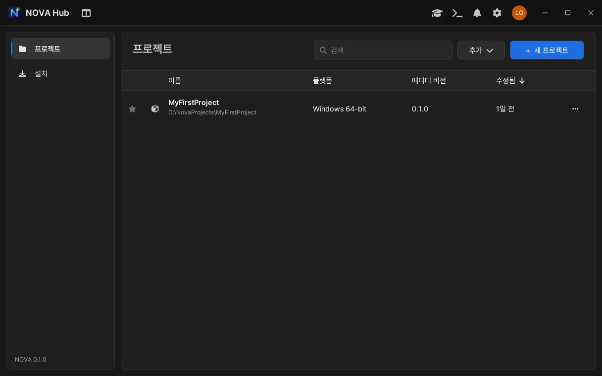<br/>NOVA Hub | <br/>Project 창 (2단 레이아웃) |
| <br/>Animator 창 | <br/>프리팹 인스턴스 |
| <br/>Profiler (CPU 계층 · 통계) | <br/>Game 뷰 (1080x1920 + Stats) |
| <br/>NOVA Code (내장 C# IDE) | <br/>컴파일 오류 표시 |

### 그래픽 API

| | |
|:---:|:---:|
| 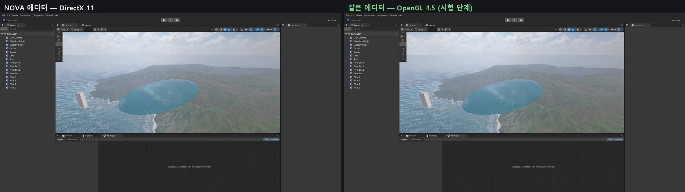<br/>같은 장면 — 왼쪽 DirectX 11, 오른쪽 OpenGL 4.5 | 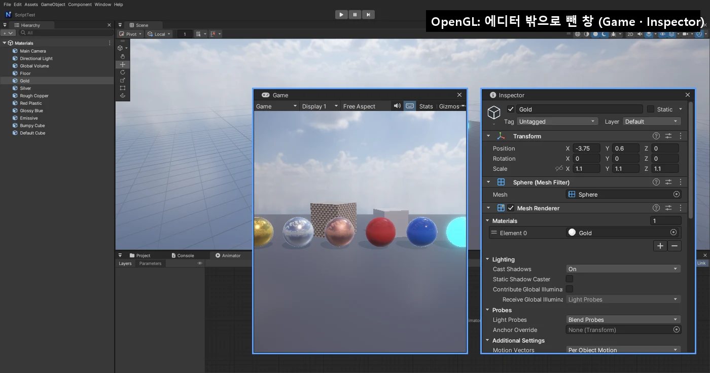<br/>OpenGL 에디터에서 창을 밖으로 빼기 |

### 월드 제작

| | |
|:---:|:---:|
| 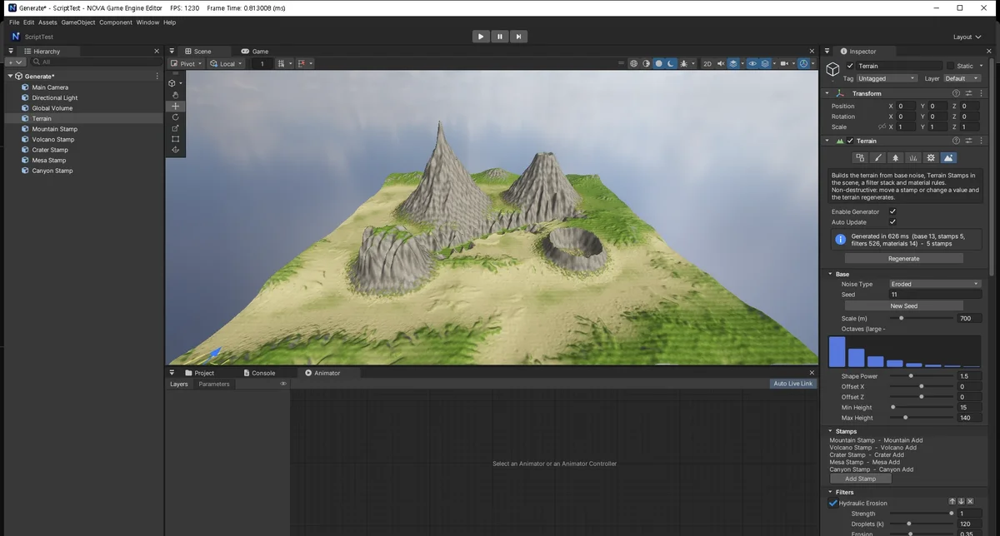<br/>지형 생성기 (노이즈 → 스탬프 → 침식 → 재질) | <br/>바이옴 영역 (초원 위 Alpine · Desert · Canyon) |
| <br/>숲 1500 그루 (인스턴싱 + LOD + 임포스터) | 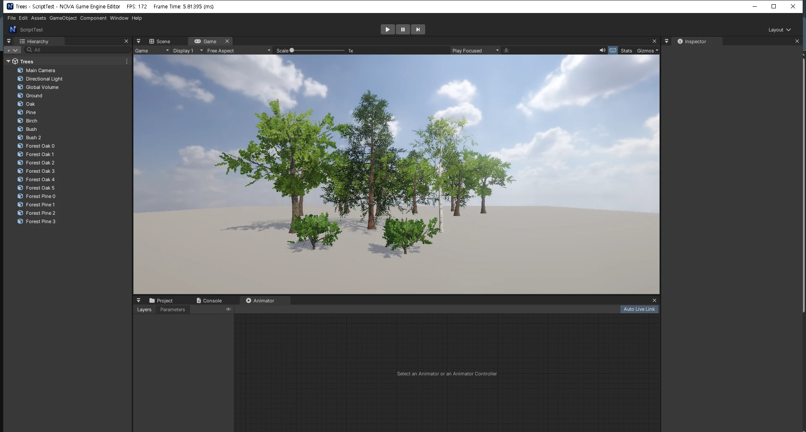<br/>절차적 나무 생성기 |
| 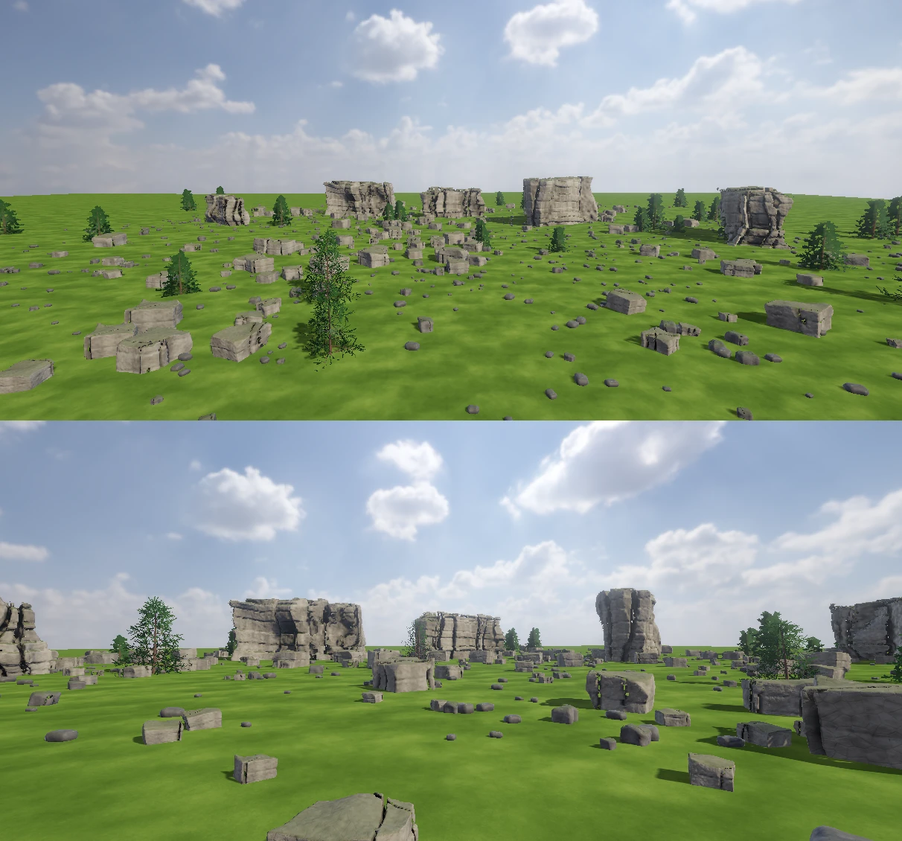<br/>바위 · 절벽 흩뿌리기 (인스턴싱) | 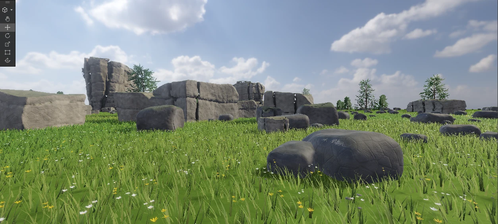<br/>바닥 디테일 (풀 · 들꽃 · 자갈) |
| 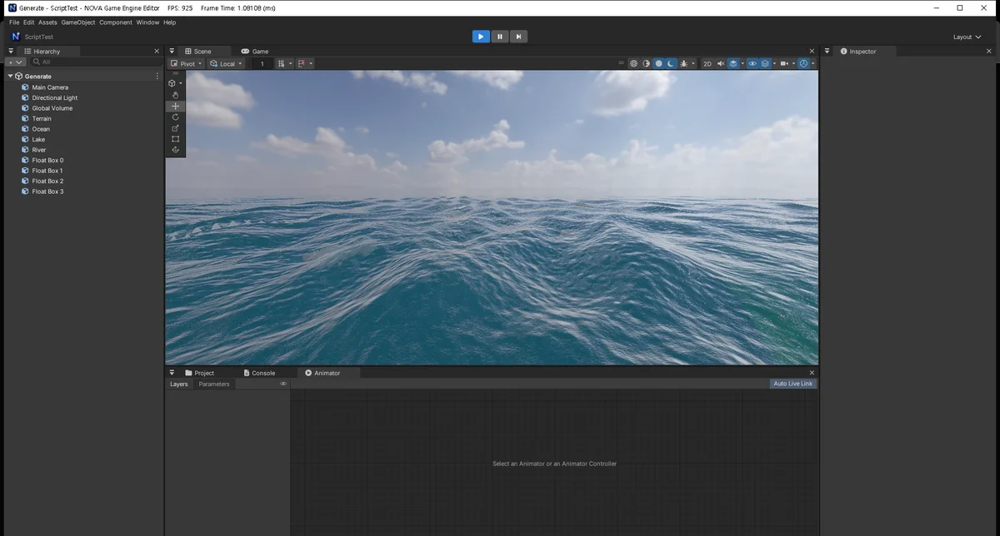<br/>바다 (LOD 격자 + Gerstner 파도) | <br/>해안 · 호수 · 강 |
| 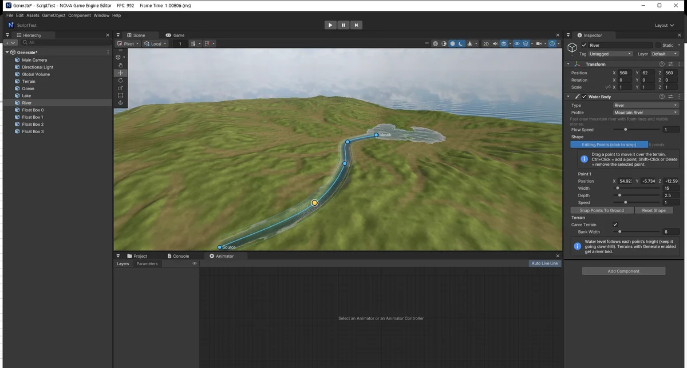<br/>강 점 편집 → 지형이 강바닥을 판다 | 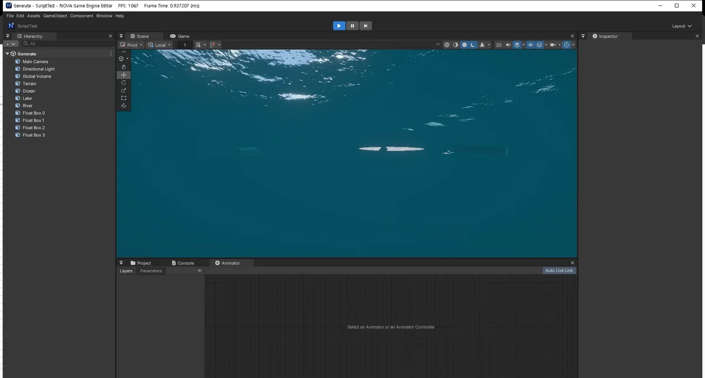<br/>수중 (스넬의 창) + Buoyancy |
| 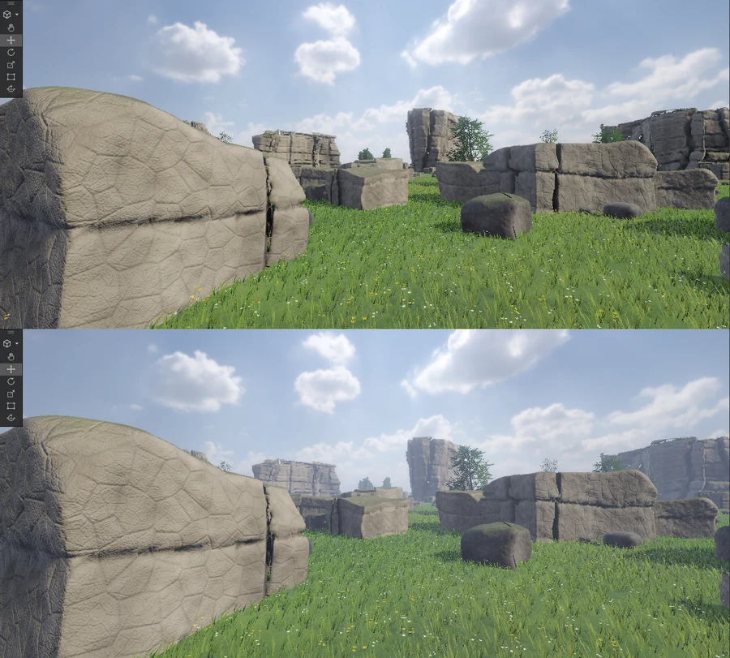<br/>Fog + Atmosphere (위 = 끔, 아래 = 켬) | <br/>터레인 쿼드트리 LOD |

### 게임플레이

| | |
|:---:|:---:|
| 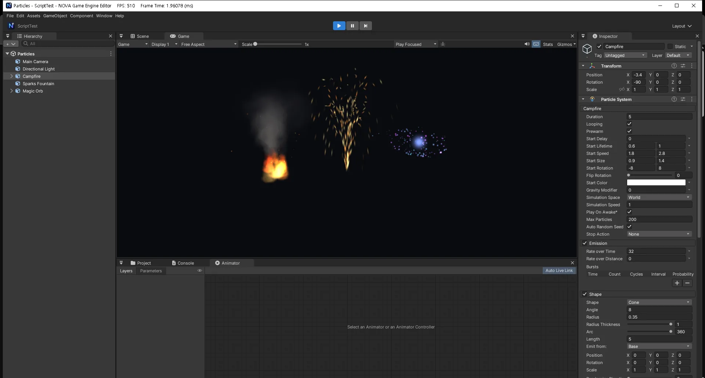<br/>파티클 (모닥불 · 불꽃 분수 · 마법 구슬) | 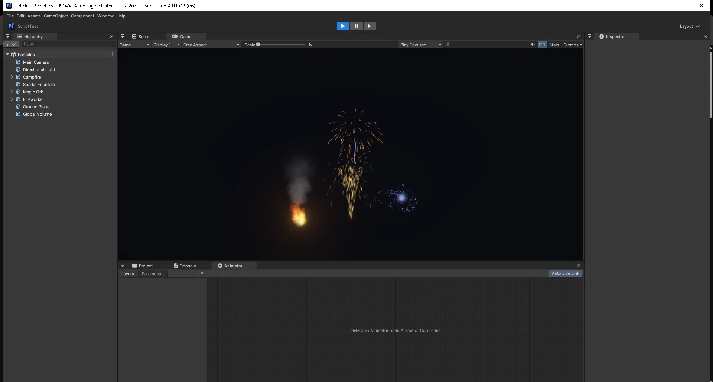<br/>폭죽 (Sub Emitters · Trails · Bloom) |
| <br/>UI Button (Rect Transform · Inspector) | <br/>UI Play: 버튼 → 점수 · 체력 바 (C#) |
| <br/>물리 (지형 위의 공) | <br/>Audio Source |
| 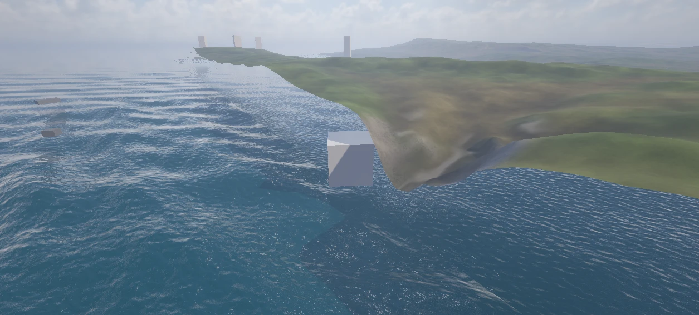<br/>NOVA CLI 명령만으로 만들고 찍은 장면 | <br/>Project Settings > Graphics (Volume) |

<p align="center">
  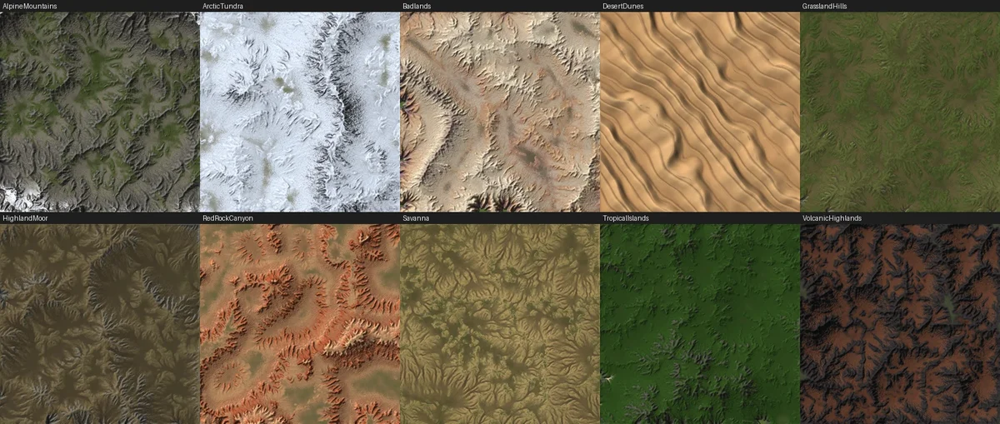<br/>
  바이옴 프리셋 10 종 (위에서 본 생성 결과)
</p>

<p align="center">
  <br/>
  후처리 적용 전 / 후 (Bloom, Vignette, ACES, 채도·대비)
</p>

## 빠른 시작

### 필요한 것

- Windows 10 / 11 (x64)
- Visual Studio 2022 이상 — **C++를 사용한 데스크톱 개발** 워크로드 (MSVC, Windows SDK, CMake 포함)
- DirectX 11 또는 OpenGL 4.5 를 지원하는 GPU
- [.NET SDK 8 이상](https://dotnet.microsoft.com/download) — C# 스크립팅 (없으면 스크립트 없이 동작)

외부 라이브러리(Assimp, DirectXTex, Effects11, ImGui, nlohmann/json, Jolt Physics, DXC, SPIRV-Cross)는 저장소에 들어 있어 따로 설치할 필요가 없습니다.

### 빌드

```bat
build.bat            :: Debug x64 (/O2, D3D 디버그 레이어 · GL 디버그 컨텍스트)
build.bat release    :: Release (디버그 레이어 끔, 셰이더 최적화) — 성능 측정과 게임 빌드용
```

- CMake 가 `build/` 에 Visual Studio 솔루션을 만들고 컴파일합니다. 결과는 `Binaries/NovaEngine.exe` (마지막에 빌드한 구성).
- `build.bat` 의 `CMAKE_PATH` 는 Visual Studio 에 포함된 CMake 경로입니다. 설치 위치가 다르면 이 줄을 고쳐 주세요.
- Visual Studio 에서 열려면 `build/NovaEngine.sln`.

### 실행

| 명령 | 동작 |
|---|---|
| `NovaEngine.exe` | **NOVA Hub** — 프로젝트 목록, 새 프로젝트, 열기, 설치(엔진 · NOVA CLI), 학습·알림·설정 |
| `NovaEngine.exe --project "<프로젝트 폴더>"` | 그 프로젝트를 에디터로 열기 |
| `NovaEngine.exe --project "<폴더>" -force-opengl` | 이번만 OpenGL 로 (`-force-d3d11` = DirectX 11) |
| `NovaEngine.exe --editor` | 엔진 폴더의 샘플 프로젝트로 에디터 열기 (엔진 개발용) |

새 프로젝트 구조는 Unity 와 같습니다: `Assets/`(씬·에셋), `ProjectSettings/`(프로젝트 설정), `UserSettings/`(개인 설정).

### 게임 빌드

1. **File > Build Settings...** (`Ctrl+Shift+B`) → **Add Open Scenes** 또는 Project 창에서 `.scene` 을 끌어 놓기 (0번 = 시작 씬).
2. **Player Settings...** 에서 제품 이름, 화면 모드, 해상도, 그래픽 API 순서를 정합니다.
3. **Build** / **Build And Run** (`Ctrl+B`).

```
<출력 폴더>/
  <제품 이름>.exe          ← 게임 실행 파일 (에디터 없이 첫 씬을 Play)
  *.dll
  <제품 이름>_Data/        ← player.json, 빌드 씬과 쓰는 에셋, 셰이더, Assembly-CSharp.dll
```

## C# 스크립트

Project 창 우클릭 > **Create > Scripting > MonoBehaviour Script** 로 만들고, 더블클릭하면 **NOVA Code** 로 열립니다. 저장(`Ctrl+S`)하면 바로 다시 컴파일되고, GameObject 에 끌어 놓거나 Add Component > Scripts 로 붙입니다.

```csharp
using NovaEngine;

public class Spinner : MonoBehaviour
{
    [Range(0, 360)] public float speed = 90f;
    public GameObject target;

    void Update()
    {
        transform.Rotate(0, speed * Time.deltaTime, 0);
        if (Input.GetKeyDown(KeyCode.Space))
            Debug.Log("Space!");
    }

    void OnCollisionEnter(Collision collision) => Debug.Log($"hit {collision.gameObject.name}");
}
```

<details>
<summary><b>UI · 파티클 예제 (펼치기)</b></summary>

UI 는 `using NovaEngine.UI;` (Unity 의 `UnityEngine.UI`) 이고, `TMPro.TextMeshProUGUI` 도 같은 Text 로 쓸 수 있습니다.

```csharp
using NovaEngine;
using NovaEngine.UI;

public class ScoreUI : MonoBehaviour
{
    public GameObject scoreText, hpBar, button;
    int score;

    void Start()
    {
        button.GetComponent<Button>().onClick.AddListener(() =>
        {
            score++;
            scoreText.GetComponent<Text>().text = "점수: " + score;
            hpBar.GetComponent<Image>().fillAmount -= 0.1f;   // Image Type = Filled
        });
    }
}
```

파티클도 Unity 와 같은 모양입니다 (모듈 구조체의 값을 바꾸면 바로 반영).

```csharp
var ps = GetComponent<ParticleSystem>();
var main = ps.main;
main.startColor = new ParticleSystem.MinMaxGradient(Color.yellow, Color.red);
main.startSize = new ParticleSystem.MinMaxCurve(0.2f, 0.5f);
var emission = ps.emission;
emission.rateOverTime = 50f;
ps.Emit(30);      // 즉시 30개
ps.Stop();        // 방출 멈춤 (남은 입자는 수명대로)
```

</details>

다른 편집기는 **Edit > Preferences... > External Tools** 에서 고릅니다 — NOVA Code(기본), Visual Studio, VS Code, Rider, 확장자 연결 프로그램, 직접 지정(`$(File)`, `$(Line)`, `$(ProjectPath)`). 프로젝트 루트의 `Assembly-CSharp.csproj` 는 에디터가 만들어 외부 편집기 자동 완성에 쓰입니다.

## 단축키 (Unity 와 같음)

| 키 | 동작 |
|---|---|
| `Q` `W` `E` `R` `T` `Y` | Hand / Move / Rotate / Scale / Rect / Transform 도구 |
| `Z` · `X` | Pivot ↔ Center · Local ↔ Global (Scene 뷰) |
| 우클릭 + `W` `A` `S` `D` / `Q` `E` | Scene 카메라 비행 (Shift = 빠르게, 휠 = 속도) |
| `Alt` + 좌클릭 드래그 · 가운데 버튼 드래그 | 궤도 회전 · 화면 이동 |
| `F` | 선택한 오브젝트로 포커스 |
| `Ctrl+N` / `Ctrl+O` | 새 씬 / 씬 열기 (저장 안 한 변경이 있으면 확인) |
| `Ctrl+S` / `Ctrl+Shift+S` | 씬 저장 / 다른 이름으로 저장 |
| `Ctrl+Z` / `Ctrl+Y` | 실행 취소 / 다시 실행 |
| `Ctrl+D` · `Ctrl+C` · `Ctrl+X` · `Ctrl+V` | 복제 · 복사 · 잘라내기 · 붙여넣기 |
| `F2` · `Delete` · `Ctrl+Shift+N` | 이름 바꾸기 · 삭제 · 빈 오브젝트 |
| `Ctrl+P` · `Ctrl+7` | Play / Stop · Profiler |
| `Ctrl+Shift+B` · `Ctrl+B` | Build Settings · Build And Run |

<details>
<summary><b>NOVA Code 단축키 (펼치기)</b></summary>

| 키 | 동작 |
|---|---|
| `Ctrl+S` / `Ctrl+Shift+S` | 저장 / 모두 저장 (저장하면 바로 컴파일) |
| `Ctrl+Space` | 자동 완성 (`.` 뒤와 입력 중에도 자동으로 뜸) |
| `Ctrl+F` / `Ctrl+H` / `F3` | 찾기 / 바꾸기 / 다음 찾기 |
| `Ctrl+G` | 줄로 이동 |
| `Ctrl+/` · `Ctrl+D` | 주석 토글 · 줄 복제 |
| `Tab` / `Shift+Tab` | 들여쓰기 / 내어쓰기 |
| `Ctrl+W` · `Ctrl+B` · `Ctrl+휠` | 탭 닫기 · Explorer 토글 · 글꼴 크기 |

</details>

## 내장 패키지

`Resources/Packages/` 에 바로 쓸 수 있는 에셋 묶음이 들어 있습니다. 모두 저장소 안에서 스크립트·수식으로 만든 것이고, 프리셋은 JSON 이라 복사해 값을 바꾸면 새 프리셋이 됩니다.

| 패키지 | 내용 | 쓰는 곳 |
|---|---|---|
| `Terrain/Layers` | 지형 레이어 4 장 (Grass · Rock · Dirt · Sand) | Paint Texture, 바이옴 |
| `Terrain/Biomes` | 바이옴 프리셋 10 종 (`.biome`) — 지형 모양 + 색 재질 | Terrain > Generate, Terrain Biome |
| `Terrain/Details` | 디테일 프리셋 15 종 (`.detail`) — 풀 7 · 꽃 5 · 돌 3 | Paint Details |
| `Water/Profiles` | 물 프로파일 10 종 (`.waterprofile`) — 바다 · 호수 · 강 | Water Body > Profile |
| `Water/Textures` · `Rock/Textures` | 이음매 없는 물결·거품·코스틱, 바위 균열 디테일 | 물·바위 셰이더 |
| `Character` · `Audio/SFX` | 캐릭터 모델·애니메이션, 테스트 효과음 | 샘플 씬, `nova create character` |

## 폴더 구조

```
Source/
  Platform/     앱 루프, 창, 로딩 창, 자체 검사
  Core/         경로, 로그(EditorLog), Profiler, 메모리 통계, 공용 유틸
  Graphics/
    Common/     API 중립 (GraphicsSettings: API 선택·우선순위·대체, 백엔드 목록)
    RHI/        Rhi.h(깨끗한 API) · RhiFx(Effects11 모양) · Gfx.h(D3D11 모양 층 — 엔진 렌더 코드가 쓰는 것)
    DX11/       Direct3D 11 구현 + 렌더러(이펙트, 셰이더 캐시, 그림자, SSAO, 후처리, 대기, 하늘 …)
    OpenGL/     OpenGL 4.5 구현 (GfxGL, GLRhi, GLContext, GLLoader, GLState)
    ShaderCross/ HLSL → SPIR-V → GLSL 변환 (DXC + SPIRV-Cross, .fx 파서, 변환 캐시)
  Scene/        GameObject, 컴포넌트(Transform, Camera, Light, Renderer, Collider, Volume …), 씬, 프리팹,
                나무(Tree·TreeRenderer), 바위(Rock·RockScatter), 디테일(DetailRenderer)
  Terrain/      TerrainData, 쿼드트리 LOD 렌더러, 지형 생성기, 바이옴, 디테일 프리셋
  Water/        Water Body(바다·호수·강), 파도, 물 프로파일, 물 렌더러, Buoyancy
  Physics/      Jolt Physics 연동 (지형·나무 충돌, 레이캐스트)
  Animation/    스키닝, 애니메이션 클립, Animator 컨트롤러
  Effects/      Particle System (시뮬레이션, 곡선·그라디언트, 인스턴싱 렌더러, 편집기)
  UI/           UGUI (Canvas, RectTransform, Image, Text, Button, InputField, ScrollRect, Mask …)
  Audio/        XAudio2, AudioClip, AudioSource, AudioListener
  Scripting/    .NET 호스팅, C# 컴파일·핫 리로드, C# ↔ C++ 바인딩
  Build/        Build Settings / Player Settings, 빌드 파이프라인, 빌드된 게임 실행
  Editor/       에디터 GUI(UnityGUI), 창들, Undo, NOVA CLI 서버(CliServer · CliCommands), ImGui GL 렌더러
    NovaCode/   내장 C# IDE
  Hub/          NOVA Hub
ScriptCore/     C# 엔진 API (NovaScriptCore.dll — Unity 의 UnityEngine.dll 역할)
Shaders/        HLSL (FX11 이펙트 — OpenGL 은 자동 변환)
Resources/      엔진 기본 리소스와 패키지
Tools/          nova CLI(NovaCli), 아이콘·로고·하늘·효과음 생성 스크립트
docs/           NOVA_CLI.md, 이미지
```

## 문서 · 링크

| | |
|---|---|
| 🌐 [공식 사이트](https://nova-game-engine.web.app) | 엔진 소개, 기능, 갤러리, 다운로드 |
| 📘 [docs/NOVA_CLI.md](docs/NOVA_CLI.md) | `nova` 명령 전체와 동작 방식 |
| 🛠️ [AGENT_HANDOFF.md](AGENT_HANDOFF.md) | 현재 구조, 기능별 구현 설명, 규칙, 자체 검사 방법 |
| 🗂️ [PROJECT_HANDOVER.md](PROJECT_HANDOVER.md) | 이전 구조와 배경 기록 |

## 사용한 오픈소스

| 라이브러리 | 용도 |
|---|---|
| [Dear ImGui](https://github.com/ocornut/imgui) (docking) · [imgui-node-editor](https://github.com/thedmd/imgui-node-editor) | 에디터 UI |
| [Jolt Physics](https://github.com/jrouwe/JoltPhysics) | 물리 |
| [Assimp](https://github.com/assimp/assimp) | FBX / 모델 가져오기 |
| [DirectXTex](https://github.com/microsoft/DirectXTex) · [Effects11](https://github.com/microsoft/FX11) | 텍스처, 셰이더 이펙트 |
| [DXC](https://github.com/microsoft/DirectXShaderCompiler) · [SPIRV-Cross](https://github.com/KhronosGroup/SPIRV-Cross) | HLSL → SPIR-V → GLSL 셰이더 변환 (OpenGL) |
| [nlohmann/json](https://github.com/nlohmann/json) | 씬 / 에셋 저장 |
| [Pretendard](https://github.com/orioncactus/pretendard) (SIL OFL) · [Font Awesome](https://fontawesome.com) | 폰트, 아이콘 |

기본 스카이박스는 [Poly Haven](https://polyhaven.com) 의 CC0 HDRI(Kloofendal 48d Partly Cloudy Pure Sky)입니다 — `Resources/Textures/Skybox/README.md`. 에디터 아이콘과 테스트 효과음은 `Tools/` 의 스크립트로 직접 그리거나 합성한 것이며, Unity 의 아이콘·에셋은 사용하지 않았습니다.

<p align="center">
  <a href="https://nova-game-engine.web.app"><b>nova-game-engine.web.app</b></a>
</p>
