<p align="center">
  
</p>

<h1 align="center">NOVA Game Engine</h1>

<p align="center">
  <b>Unity 6 에디터를 그대로 옮겨 온 C++20 게임 엔진</b><br/>
  DirectX 11 · OpenGL 4.5 · Vulkan 1.3 · 안드로이드 (OpenGL ES 3.2) · C# 스크립팅<br/>
  <sub>Claude(Opus 5.5)와 함께 기능 하나하나를 Unity 와 1:1 에 가깝게 만들어 가는 프로젝트</sub>
</p>

<p align="center">
  
  
  
  
  
  
  
  <a href="https://github.com/PinTrees/Nova-Game-Engine/releases/latest"></a>
</p>

<p align="center">
  <a href="https://nova-game-engine.web.app"><b>공식 사이트</b></a> ·
  <a href="https://github.com/PinTrees/Nova-Game-Engine/releases/latest"><b>다운로드</b></a> ·
  <a href="#빠른-시작"><b>빠른 시작</b></a> ·
  <a href="#주요-기능"><b>주요 기능</b></a> ·
  <a href="#스크린샷"><b>스크린샷</b></a> ·
  <a href="docs/NOVA_CLI.md"><b>CLI</b></a> ·
  <a href="AGENT_HANDOFF.md"><b>개발 문서</b></a>
</p>

<p align="center">
  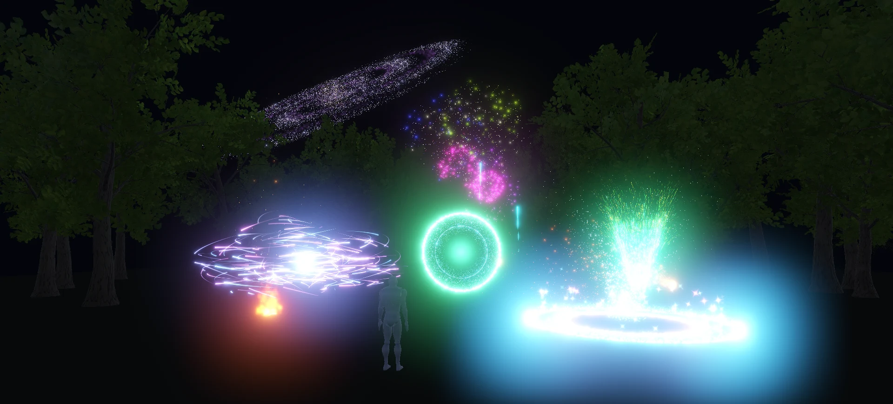<br/>
  <sub>밤 캠프장 데모 — Visual Effect Graph (포털 · 마법진 · 불꽃놀이 · 은하) · 절차적 나무 · HDR Bloom, 실시간 렌더</sub>
</p>

## 한눈에 보기

- **Unity 그대로** — 창 배치 · Inspector · 단축키 · 동작, C# API (`using UnityEngine;` → `using NovaEngine;`), 저장하면 핫 리로드
- **세 그래픽 API + 안드로이드** — 같은 렌더 코드, HLSL 하나 → GLSL · SPIR-V 자동 변환. PC 는 DX11 · OpenGL · Vulkan, 안드로이드는 GLES 3.2 APK
- **수식으로 만드는 월드** — 지형 생성기 · 바이옴 · 나무 · 숲 · 바위 · 풀 · 바다 · 강, 텍스처 파일 없이
- **터미널 · AI 가 다루는 에디터** — `nova` CLI 로 만들고 · 바꾸고 · Play 하고 · 찍고 · 잰다

## 주요 기능

**에디터**

| | |
|---|---|
| 에디터 · Hub | Unity 6 도킹 레이아웃, 창을 OS 창으로 빼기, Undo, 자동 저장 + 충돌 복구, NOVA Hub (프로젝트 · 설치 · 안드로이드 모듈) — [NOVA_HUB](docs/NOVA_HUB.md) |
| 씬 · 뷰 | Scene 뷰 핸들 · 스냅 · 비행 카메라, Game 뷰 해상도 · Stats, Hierarchy · Inspector · 프리팹 (Apply / Revert / Unpack) |
| 에셋 | Project 창 (2단), Import Settings (`.meta` — 텍스처 압축 · 모델 Humanoid · 오디오 Load Type), 모델 끌어 놓기 → 노드마다 GameObject — [MODEL_PLACEMENT](docs/MODEL_PLACEMENT.md) |
| 도구 | Profiler (CPU · GPU · Timeline · Memory), **NOVA Code** (내장 C# IDE — 자동 완성 · 오류 밑줄), Animator 창 |

**렌더링**

| | |
|---|---|
| 그래픽 API | DirectX 11 · OpenGL 4.5 · **Vulkan 1.3** (에디터 · 게임 모두, 화소 차이 최대 1) — [VULKAN_BACKEND](docs/VULKAN_BACKEND.md) |
| 재질 · 셰이더 | URP Lit (PBR), **테셀레이션 높이 변위** (Height Map 만큼 벽 · 바닥 · 지형 레이어를 실제로 민다, Shader Graph Displacement, 먼 곳 · 테셀레이션 없는 기기는 POM — DX11 · OpenGL · Vulkan), **Shader Graph** (노드 65 종 · Vertex 단계 · Sub Graph · Custom Function) — [TESSELLATION](docs/TESSELLATION.md) · [SHADER_GRAPH](docs/SHADER_GRAPH.md) |
| 조명 | Cascaded 그림자, **Adaptive Probe Volume** (굽지 않는 실시간 간접광), **Reflection Probe**, 높이 안개 · 대기 — [APV](docs/ADAPTIVE_PROBE_VOLUME.md) · [Probe](docs/REFLECTION_PROBE.md) |
| 후처리 (Volume) | Bloom · ACES · Color Adjustments · **Depth of Field (Bokeh)** · **Motion Blur** · **SSR** · **SSAO** · **Motion Vectors** · Vignette · Film Grain — [DoF](docs/DEPTH_OF_FIELD_MOTION_BLUR.md) · [SSR](docs/SCREEN_SPACE_REFLECTION.md) · [SSAO](docs/SSAO.md) · [Motion Vectors](docs/MOTION_VECTORS.md). **Rendering Debugger** (깊이 · 노멀 · AO · 모션 벡터 · APV 보기) — [RENDERING_DEBUGGER](docs/RENDERING_DEBUGGER.md). **Forward+** (클러스터 조명 — 한 화면 빛 1024 개) — [FORWARD_PLUS](docs/FORWARD_PLUS.md), 로드맵 (DX12 · Render Graph · Async Compute · VT · Deferred) — [RENDERING_ROADMAP](docs/RENDERING_ROADMAP.md) |
| 안티에일리어싱 | FXAA · SMAA · **TAA** (URP 카메라 4 가지) — [ANTI_ALIASING](docs/ANTI_ALIASING.md) |
| 성능 | **GPU 오클루전 컬링** (굽기 없는 Hi-Z), **LOD Group** (Cross Fade), GPU 인스턴싱 + MaterialPropertyBlock, 자동 묶기, 셰이더 캐시 — [OCCLUSION](docs/OCCLUSION_CULLING.md) · [LOD](docs/LOD_GROUP.md) |
| 기타 | **Decal Projector**, Line · Trail Renderer, 2D Sprite Renderer (Sorting Layer · 시트 자르기), **2D 빛** (Light 2D · Shadow Caster 2D · 노멀 맵), Culling Mask — [DECAL](docs/DECAL.md) · [LINE](docs/LINE_TRAIL_RENDERER.md) · [LIGHT_2D](docs/LIGHT_2D.md) |

**이펙트**

| | |
|---|---|
| **Visual Effect Graph** | GPU 파티클 수십만 개 (compute) — 블록 18 종, **GPU Event**, **연산 노드 ~55 종** (Compare · Branch 포함) · **Sub Graph** (연산 · 블록) · 사용자 속성, **Output Mesh** (모델 파일도), **깊이 버퍼 · SDF 충돌**, 꼬리 (Particle Strip), GPU 정렬, 화면 밖 컬링, 견본 11 개, **VFX Assistant** (로컬 Claude Code 와 대화로 이펙트 만들기) — [VFX_GRAPH](docs/VFX_GRAPH.md) |
| Particle System | Unity Shuriken 모듈 (Sub Emitters · Trails · Collision · Noise …), Lit · Soft · Lights |

**월드 제작**

| | |
|---|---|
| 지형 | 쿼드트리 LOD, 브러시, 레이어 칠하기, **지형 생성기** (노이즈 → 스탬프 → 침식), **바이옴 10 종**, 스플라인 (길 · 협곡) |
| 식생 · 바위 | 절차적 **나무** (Oak · Pine · Birch · Bush, 바람), **숲** (인스턴싱 + 임포스터, 1500 그루 230 FPS), **바위 · 절벽** (SDF), 풀 · 꽃 15 종 |
| 물 | Water Body — 바다 (Gerstner) · 호수 · 강 (급류), 굴절 · SSR · 코스틱 · 수중 · Buoyancy |

**게임플레이**

| | |
|---|---|
| C# | Unity 와 같은 `MonoBehaviour` API, 코루틴, 재질 · Renderer (`material` · `MaterialPropertyBlock` · `sortingOrder`), **씬 Additive · LoadSceneAsync · DontDestroyOnLoad**, **PlayerPrefs** — [MATERIAL_SCRIPTING](docs/MATERIAL_SCRIPTING.md) · [SCENE_MANAGEMENT](docs/SCENE_MANAGEMENT.md) |
| 물리 | [Jolt](https://github.com/jrouwe/JoltPhysics) (Rigidbody · Collider · Character Controller · Joint · Character · Configurable Joint · 래그돌 — [RAGDOLL](docs/RAGDOLL.md) · 차량 Wheel Collider — [WHEEL_COLLIDER](docs/WHEEL_COLLIDER.md) · 천 Cloth (치마 · 망토 같은 캐릭터 옷도) — [CLOTH](docs/CLOTH.md)), **2D 물리** [Box2D](https://github.com/erincatto/box2d) (Collider 2D · Joint 2D), 레이어 충돌 행렬 — [JOINTS_2D](docs/JOINTS_2D.md) |
| 애니메이션 | Animator (Blend Tree · 루트 모션 · **Humanoid 리타게팅**), BlendShape · VRM 표정, 발 · 손 · 시선 IK, Dynamic Bone |
| UI · 오디오 | UGUI + **TextMeshPro 통합** (SDF), 자동 레이아웃, World Space Canvas · XAudio2, 3D 사운드, **Audio Mixer** (리버브 19 종), OGG · MP3 |
| 빌드 | Windows `.exe` · **안드로이드 APK / AAB** (ASTC · ETC2, C# Mono, 터치, 서명 키) — [ANDROID](docs/ANDROID.md) · **웹 (WebGPU)** (WGSL, C# = .NET 웹어셈블리, Build And Run 미리 보기 서버) — [WEB](docs/WEB.md) |

**패키지** (Window > Package Manager — 넣은 것만 불러오고 빌드에 포함) — [PACKAGES](docs/PACKAGES.md)

| 패키지 | 내용 |
|---|---|
| `com.nova.animation` | Animator · Legs / Hands / Look Animator · Dynamic Bone · Expressions |
| `com.nova.cameras` | **Cinemachine** (Unity Cinemachine 3 이름): 가상 카메라 여럿 · Brain 의 Priority · 섞기 (Ease In Out · Cut · Custom Blends), Follow · Orbital Follow (FreeLook) · Third Person Follow · Rotation Composer, Perlin 흔들림 · Impulse — [CINEMACHINE](docs/CINEMACHINE.md) |
| `com.nova.cameras` · `com.nova.starter-assets` | Follow Camera · Third Person Controller (WASD · 달리기 · 점프) · 운전할 수 있는 차 (프리팹) · 맞으면 래그돌로 쓰러지는 표적 — [STARTER_ASSETS](docs/STARTER_ASSETS.md) |
| `com.nova.ai.navigation` | [Recast · Detour](https://github.com/recastnavigation/recastnavigation) — NavMesh Surface · Agent · Link · Obstacle (Carve), 탑다운 2D (XY 평면 — [NAVIGATION_2D.md](docs/NAVIGATION_2D.md)) |
| `com.nova.weather` | 오픈 월드 **날씨** — 비 · 눈 (카메라를 따라가는 GPU 입자), 젖은 표면 · 웅덩이 · 빗방울 물결 (캐릭터 · 물도), **쌓이는 눈 · 발자국** (지형은 실제로 파인다), 지붕 아래는 마른다, 먹구름 · 안개 · 돌풍, 번개 + 천둥, 소리 — [WEATHER](docs/WEATHER.md) |
| `com.nova.daynight` | **낮 · 밤 순환** — 새벽 · 아침 · 낮 · 저녁 · 노을 · 밤 · 은하수, Directional Light 가 해 · 달로 돈다, 하늘 그라데이션 · 노을 빛 · 별 · 은하수, 빛 · 환경광 · 안개 색 (날씨와 함께) — [DAY_NIGHT](docs/DAY_NIGHT.md) |
| `com.nova.modeling` | Blender 식 **Model Editor** (Extrude · Bevel · Subsurf · 리깅 · 가중치 붓 · 셰이프 키), FBX · GLB · VRM 내보내기, 전부 CLI — [MODEL_EDITOR](docs/MODEL_EDITOR.md) |
| `com.nova.animation2d` | Spine 식 **2D 뼈대 애니메이션** — [ANIMATION2D](docs/ANIMATION2D.md) |
| `com.nova.tween` | **트윈** (DOTween 같은 쓰임) — `transform.DOMove(p, 1f).SetEase(Ease.OutBack)`, Sequence, 곡선 30 종, 반복 · Yoyo, 튀기기 · 흔들기 · 뛰기, UI · 빛 · 카메라 · 소리, 코드 없는 Tween Animation 컴포넌트 — [TWEEN](docs/TWEEN.md) |
| `com.nova.tilemap` | Unity 식 **2D Tilemap** — Grid · Tilemap · Tile Palette (붓 · 상자 · 흘려 채우기), 맞닿은 칸을 합치는 Tilemap Collider 2D — [TILEMAP](docs/TILEMAP.md) |
| `com.nova.toon` | [lilToon](https://github.com/lilxyzw/lilToon) 툰 셰이더 (VRM MToon 자동 변환) |

**NOVA CLI** — 실행 중인 에디터를 명령으로 (창 포커스 없이, Undo 로 남음). AI 에이전트는 `nova ai-guide` 부터 — [NOVA_CLI](docs/NOVA_CLI.md)

```bash
nova open D:\NovaProjects\MyGame --background       # 뒤에서 에디터 열기
nova create cube --name Box --position 0,1,0         # terrain · tree · ocean · visual-effect · character …
nova set Box --scale 2,1,2 MeshRenderer.castShadows=1
nova play && nova wait 120 && nova screenshot box.png --view game
nova perf --frames 240                                # 프레임 · CPU · GPU 단계별
nova exec "GameObject.Find(\"Box\").transform.position"
```

## 스크린샷

<p align="center">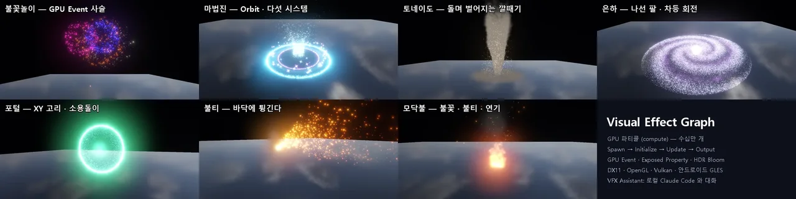<br/><sub>Visual Effect Graph 견본 — 불꽃놀이 · 마법진 · 토네이도 · 은하 · 포털 · 불티 · 모닥불</sub></p>

| | |
|:---:|:---:|
| 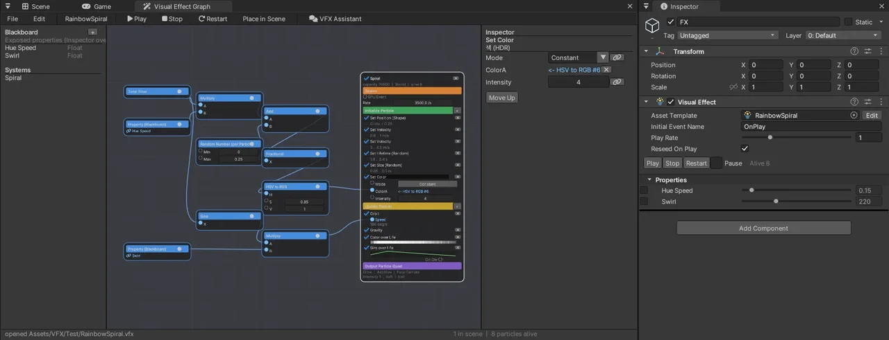<br/>VFX Graph 창 · 연산 노드 | 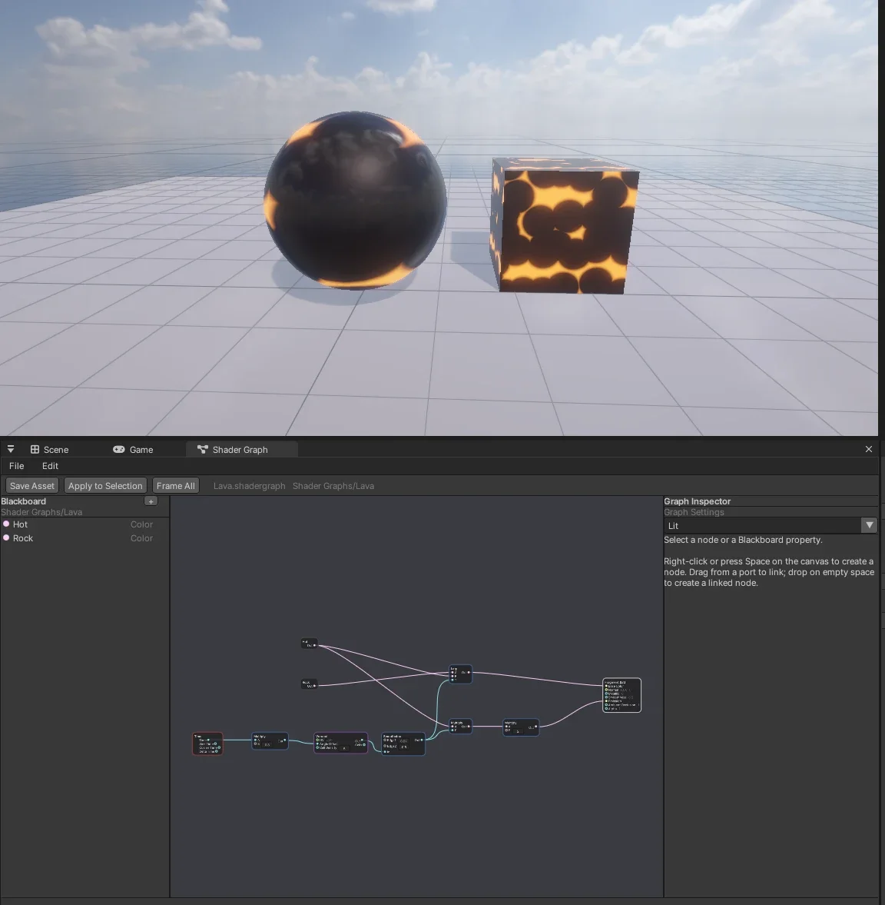<br/>Shader Graph (용암 Voronoi) |
| 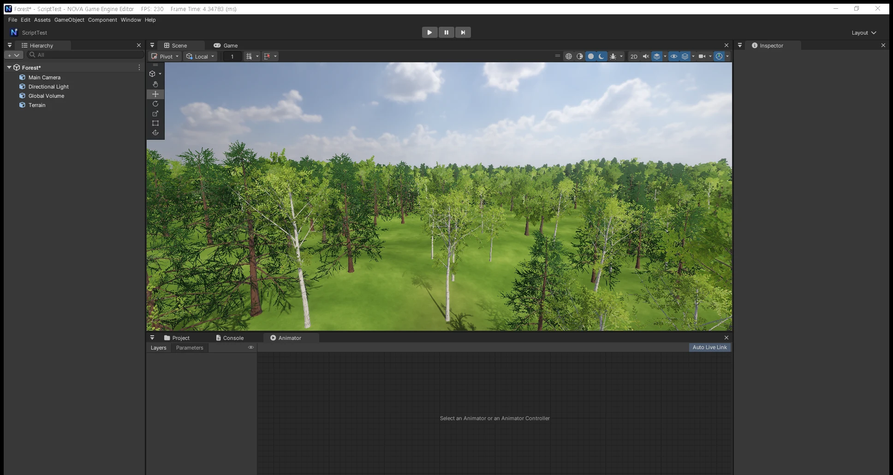<br/>숲 1500 그루 (LOD · 임포스터) | 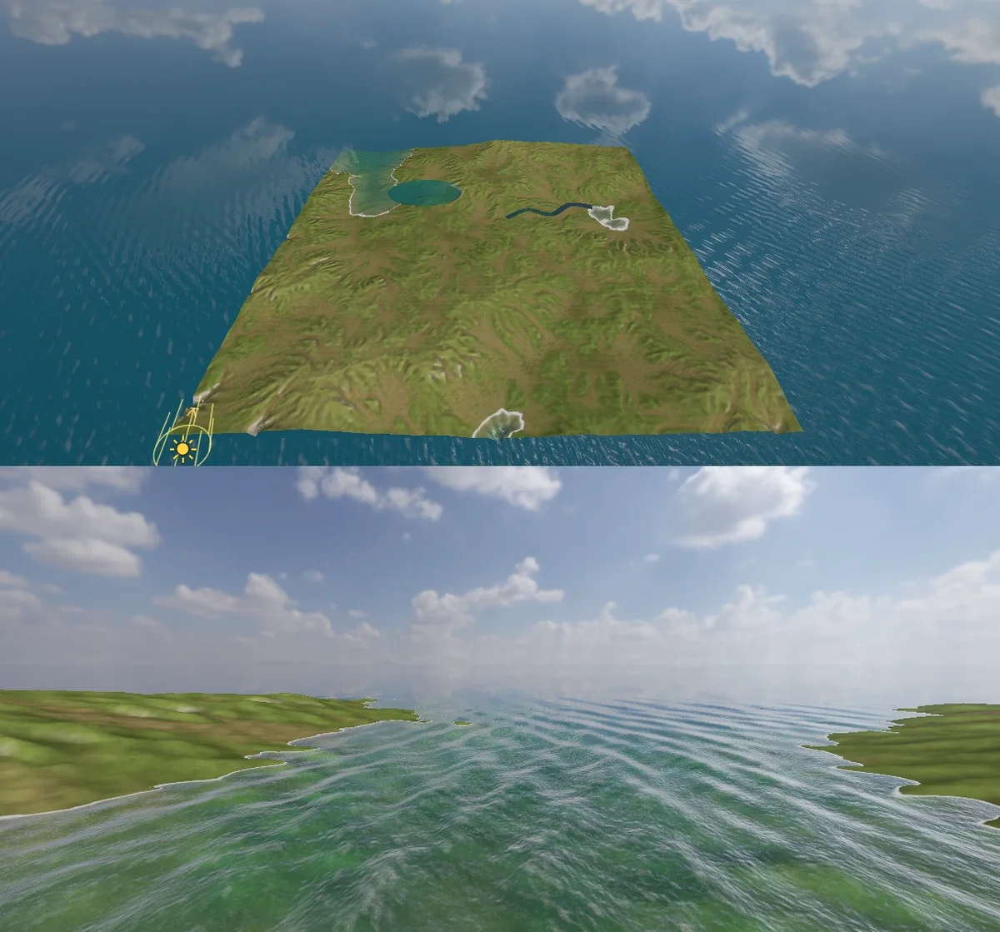<br/>바다 · 해안 · 호수 · 강 |
| 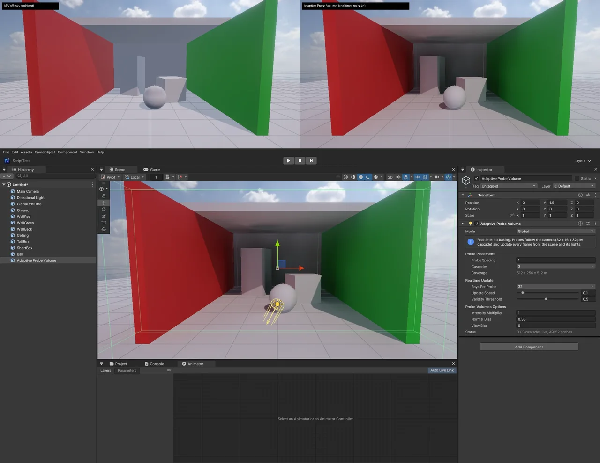<br/>Adaptive Probe Volume (실시간 간접광) | 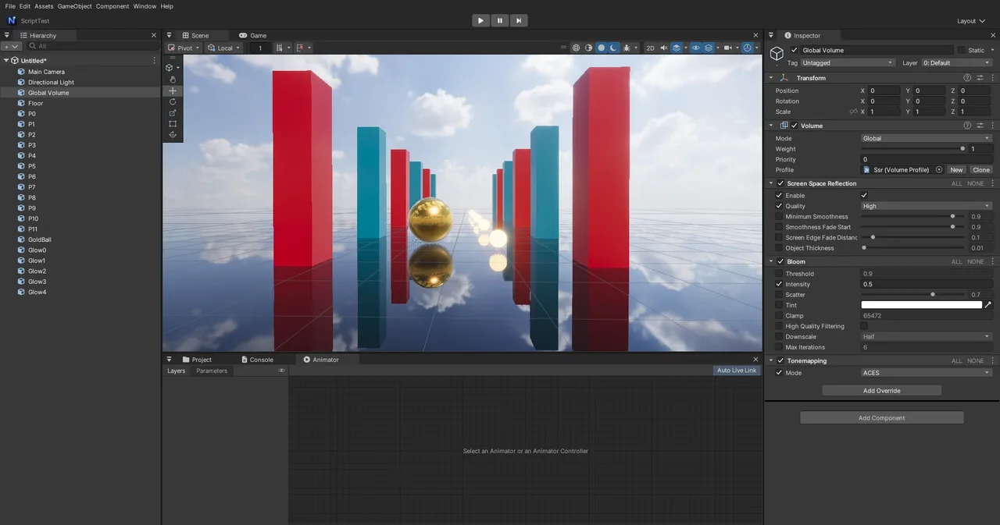<br/>Screen Space Reflection |
| 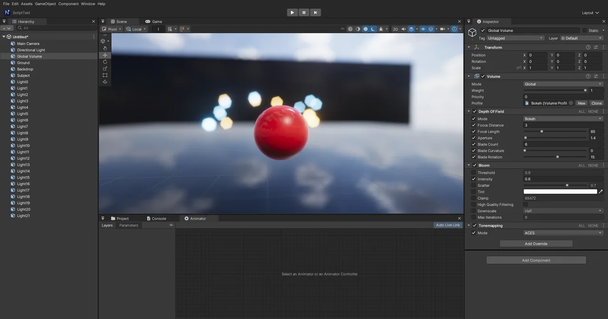<br/>Depth of Field — Bokeh | 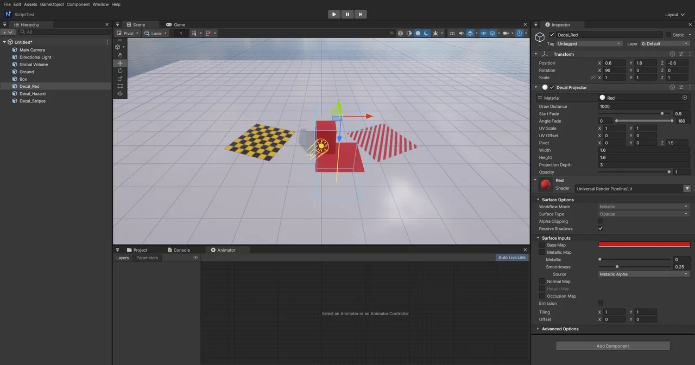<br/>Decal Projector |
| 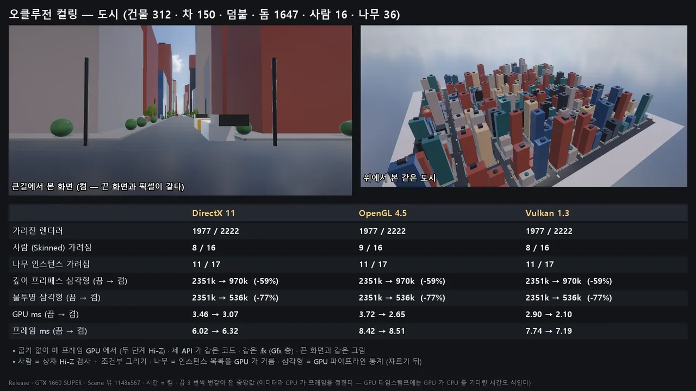<br/>GPU 오클루전 컬링 — DX11 · GL · Vulkan | 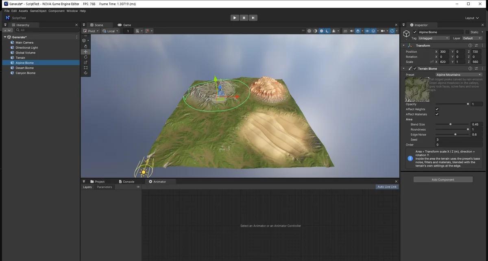<br/>지형 생성기 · 바이옴 |
| <br/>Model Editor (패키지) | 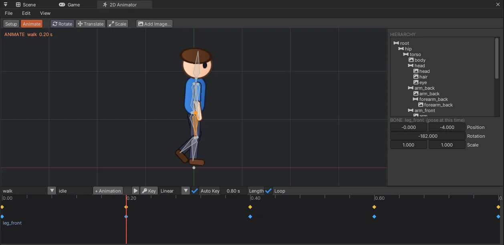<br/>2D Animator (패키지) |
| 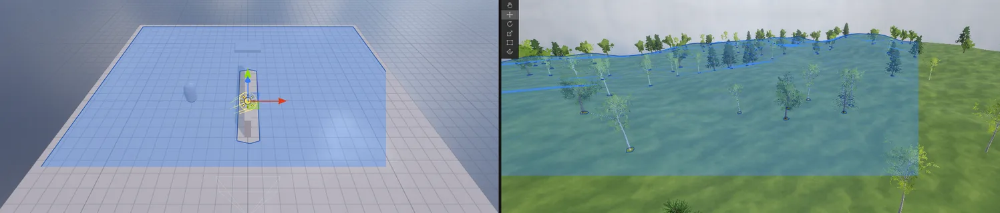<br/>AI Navigation — NavMesh Link · Obstacle | 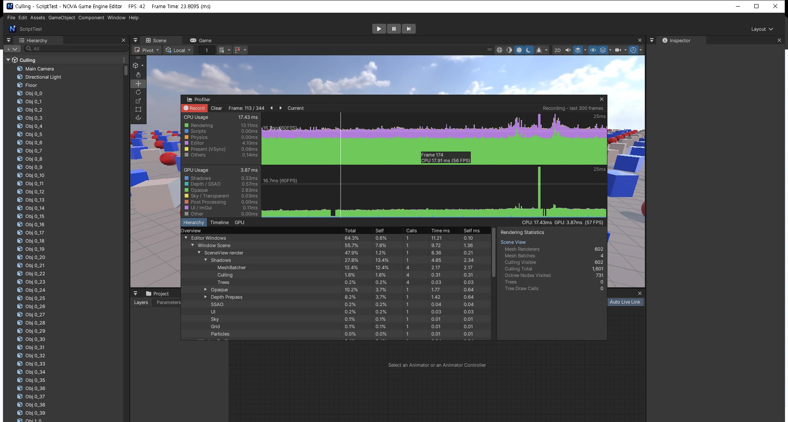<br/>Profiler |

<p align="center">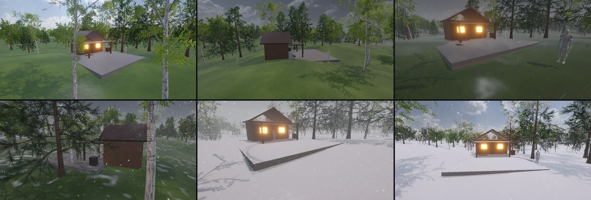<br/><sub>날씨 (패키지) — 숲속 오두막: 맑음 → 비 → 폭풍 (젖은 돌 마당) → 눈 → 눈보라 (발자국) → 갠 뒤</sub></p>

<p align="center">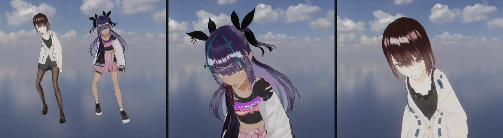<br/><sub>lilToon 툰 셰이더 (VRoid 샘플 캐릭터)</sub></p>

<p align="center">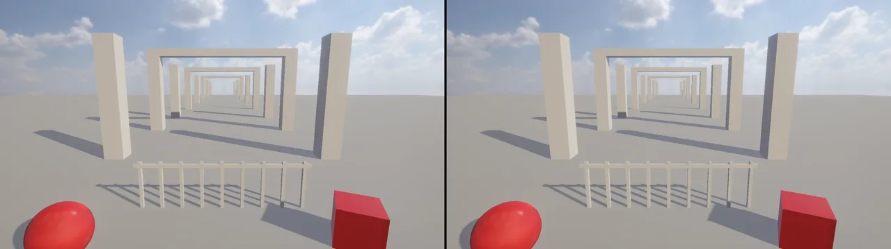<br/><sub>안드로이드 (MuMu · OpenGL ES 3.2) — PC DirectX 11 과 같은 그림</sub></p>

<p align="center"><br/><sub>웹 (Chrome WebGPU) — 엔진 전체를 WebAssembly 로, PC DirectX 11 과 같은 그림</sub></p>

> 더 많은 그림: **[공식 사이트 갤러리](https://nova-game-engine.web.app)**

## 빠른 시작

**바로 쓰기**: [최신 릴리스](https://github.com/PinTrees/Nova-Game-Engine/releases/latest) zip → `Binaries\NovaEngine.exe` (Windows 10 / 11 x64).

**직접 빌드**: Visual Studio 2022+ (C++ 데스크톱 워크로드), [.NET SDK 8+](https://dotnet.microsoft.com/download) (C# 스크립트용). 외부 라이브러리는 저장소에 포함.

```bat
build.bat            :: Debug x64
build.bat release    :: Release (성능 측정 · 게임 빌드용)
```

| 실행 | |
|---|---|
| `NovaEngine.exe` | NOVA Hub (프로젝트 · 설치) |
| `NovaEngine.exe --project "<폴더>"` | 에디터로 열기 (`-force-opengl` · `-force-vulkan` · `-force-d3d11`) |

게임 빌드: **File > Build Settings** (`Ctrl+Shift+B`) → 씬 추가 → Windows / Android / Web → **Build And Run**.
배포 zip: `Tools\package_release.ps1`. 자동 검사: `Tools\tests\run_tests.ps1 [-Only vfx,render …]` (실행 중인 에디터를 CLI 로 확인, 결과 `TestResults\`).

```csharp
using NovaEngine;

public class Spinner : MonoBehaviour
{
    [Range(0, 360)] public float speed = 90f;
    void Update() => transform.Rotate(0, speed * Time.deltaTime, 0);
    void OnCollisionEnter(Collision c) => Debug.Log($"hit {c.gameObject.name}");
}
```

단축키는 Unity 와 같습니다 (`QWERTY` 도구 · `F` 포커스 · `Ctrl+P` Play · `Ctrl+S` 저장 · `Ctrl+D` 복제 …).

## 문서

| | |
|---|---|
| [docs/](docs) | 기능별 문서 (VFX Graph · Shader Graph · 안드로이드 · Vulkan · 오클루전 · 패키지 · CLI …) |
| [AGENT_HANDOFF.md](AGENT_HANDOFF.md) | 구조 · 구현 설명 · 규칙 · 자체 검사 |
| [공식 사이트](https://nova-game-engine.web.app) | 소개 · 갤러리 · 다운로드 |

## 사용한 오픈소스

[Dear ImGui](https://github.com/ocornut/imgui) · [imgui-node-editor](https://github.com/thedmd/imgui-node-editor) · [Jolt Physics](https://github.com/jrouwe/JoltPhysics) · [Box2D v3](https://github.com/erincatto/box2d) · [Assimp](https://github.com/assimp/assimp) · [DirectXTex](https://github.com/microsoft/DirectXTex) · [Effects11](https://github.com/microsoft/FX11) · [DXC](https://github.com/microsoft/DirectXShaderCompiler) · [SPIRV-Cross](https://github.com/KhronosGroup/SPIRV-Cross) · [nlohmann/json](https://github.com/nlohmann/json) · [stb_vorbis](https://github.com/nothings/stb) · [dr_mp3](https://github.com/mackron/dr_libs) · [Recast & Detour](https://github.com/recastnavigation/recastnavigation) · [FastLZ](https://github.com/ariya/FastLZ) · [lilToon](https://github.com/lilxyzw/lilToon) (MIT, © lilxyzw — `Packages/com.nova.toon/LICENSE-lilToon.txt`) · [Pretendard](https://github.com/orioncactus/pretendard) · [Font Awesome](https://fontawesome.com)

그림 속 캐릭터: **Seed-san** © VirtualCast, Inc. ([VRM Public License 1.0](https://vrm.dev/licenses/1.0/)), **VRoid AvatarSample_A · B** (pixiv Inc.) — 모델 파일은 저장소에 없음 (테스트 프로젝트에만).
기본 스카이박스: [Poly Haven](https://polyhaven.com) CC0 HDRI. 에디터 아이콘 · 효과음은 `Tools/` 스크립트로 직접 만든 것 (Unity 에셋 사용 안 함).

<p align="center"><a href="https://nova-game-engine.web.app"><b>nova-game-engine.web.app</b></a></p>
