<p align="center">
  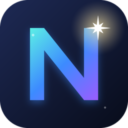
</p>

<h1 align="center">NOVA Game Engine</h1>

<p align="center">
  Unity 에디터를 본뜬 C++20 / DirectX 11 3D 게임 엔진 + 에디터<br/>
  <sub>Claude(Opus 5.5)와 함께 기능 하나하나를 Unity 와 1:1 에 가깝게 만들어 가는 프로젝트</sub>
</p>

<p align="center">
  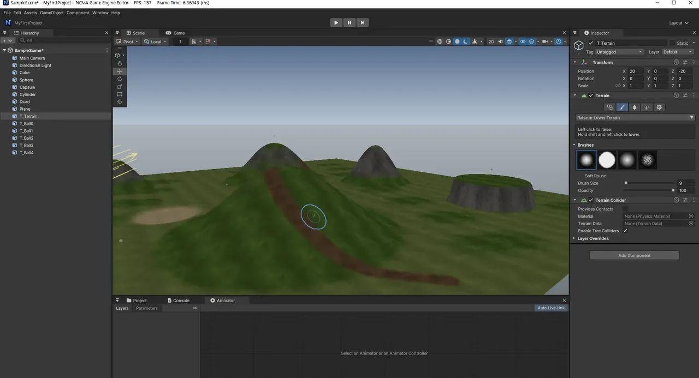
</p>

---

## 특징

Unity 6 에디터의 **창 배치, 아이콘, Inspector 모양, 단축키, 동작**을 최대한 그대로 따라 합니다. Unity 를 써 본 사람이라면 설명 없이 쓸 수 있는 것이 목표입니다.

| 분야 | 내용 |
|---|---|
| **에디터** | Hub(프로젝트 목록/생성) → 에디터, 도킹 레이아웃(Hierarchy · Scene/Game · Inspector · Project/Console/Animator), 시작 로딩 창, Undo/Redo, 에디터 전용 로그(`Logs/Editor.log`) |
| **Scene 뷰** | Move/Rotate/Scale/Rect/Transform 핸들, Pivot/Center·Local/Global, 스냅, Scene Camera 패널(시야각·Near/Far·속도), 우클릭 비행(WASD·QE), Alt 궤도, F 포커스 |
| **Game 뷰** | 해상도(Free/비율/고정 + 사용자 추가), Scale, Display 1~8, Play Focused/Maximized/Unfocused, Stats(FPS·Batches·Tris·Audio) |
| **Hierarchy / Inspector** | 부모/자식, 복제·잘라내기·붙여넣기, 이름 바꾸기, Unity 식 컴포넌트 헤더와 Add Component 메뉴, Object Picker 창(⊙) |
| **Project 창** | 2단 레이아웃(폴더 트리 + 목록/격자), breadcrumb, 검색·타입 필터, FBX 하위 에셋, 생성/이름 바꾸기/휴지통 삭제, 드래그 앤 드롭 |
| **프리팹** | Hierarchy → Project 끌어 놓아 만들기, 인스턴스(파란 표시), 오버라이드 저장/Apply All/Revert All/Unpack, 에셋 변경 자동 반영 |
| **렌더링** | Forward 렌더링, SSAO, 인스턴싱, 셰이더 캐시(의존성 추적 + 병렬 컴파일) |
| **Profiler (Window > Analysis > Profiler, Ctrl+7)** | Unity Profiler 처럼 CPU Usage / GPU Usage 그래프(범주별로 쌓음, 60·30 FPS 선, 최근 300 프레임, 눌러 프레임 고르기), Hierarchy(구간 트리: Total·Self·Calls·ms), Timeline(구간 막대, 휠 확대), GPU(D3D11 타임스탬프 쿼리: 그림자·깊이·SSAO·불투명·나무·후처리·ImGui), Rendering Statistics(드로 콜, 묶음, 삼각형, 컬링 보임/전체, 나무 LOD 수), GPU 구간별 Pixels Shaded(겹쳐 칠한 픽셀 수). 창이 열려 있을 때만 모은다 |
| **그림자 (URP 방식)** | 방향광 Cascaded Shadow Maps(1~4 캐스케이드, 카메라가 움직여도 떨리지 않게 텍셀 고정), 스포트광·점광(큐브 6 면) 그림자, Hard / Soft(PCF Low·Medium·High), 빛마다 Strength · Bias(Depth / Normal) · Near Plane. **Volume 의 Shadows 오버라이드**로 Max Distance · Cascade Count · Split · Last Border · Resolution(512~4096) · Bias · Soft Shadows 품질을 장소마다 바꿀 수 있다(Inspector 에 캐스케이드 막대) |
| **머티리얼 (URP Lit / PBR)** | `.mat` 에셋(Project 창 Create > Material), Unity URP 의 BRDF: Base Map + 색, Metallic(맵/값), Smoothness(Metallic Alpha / Albedo Alpha), Normal Map(세기), Occlusion, Emission(HDR 세기), Tiling/Offset, Alpha Clipping, Receive Shadows, Specular Highlights / Environment Reflections, Lit / Unlit. Unity 모양의 머티리얼 Inspector(텍스처 칸에 끌어 놓기·Object Picker, 구 미리보기 — 드래그로 회전) |
| **스카이박스** | 기본 하늘 = [Poly Haven](https://polyhaven.com/a/kloofendal_48d_partly_cloudy_puresky) CC0 HDRI 를 큐브맵으로 변환(`Tools/hdri_to_cubemap.py`). 카메라 Background = Skybox 면 Game 뷰에, 툴바 Effects > Skybox 면 Scene 뷰에 그리고, 금속 반사와 환경광(Environment Lighting)에도 같은 하늘을 쓴다 |
| **나무 생성기 (Tree)** | SpeedTree 처럼 절차적으로 만드는 우리 엔진 고유의 나무: 줄기 → 가지 1~3 단계(황금각 배치, 처짐·휘어짐), 수관 모양(원뿔·구·불꽃 …), 잎 카드. **텍스처 파일 없이 수학식만으로** 만든다 — 실행 중에 수피(세로 균열 타일)와 잎 아틀라스(카드 한 장에 SDF 로 잎 여러 장·잔가지, 넓은잎·타원·바늘, 덮임을 유지하는 밉맵)를 한 번 구워 두고 셰이더는 한 번 읽어 알파 컷, 이끼·투과광. 계층 바람(줄기·가지·잔가지·잎 떨림), 그림자·SSAO 포함. 프리셋 Oak / Pine / Birch / Bush, Seed 로 모양 바꾸기, GameObject > 3D Object > Tree |
| **숲 (Paint Trees + LOD)** | Unity 처럼 지형에 나무를 브러시로 칠하기(Tree Density, 높이·폭 범위, 색 변화, 무작위 회전, Shift 지우기, Mass Place, Undo). 같은 종류는 인스턴싱으로 한 번에 그리고 거리에 따라 전체 메시 → 중간 메시 → 실행 중에 구운 8 방향 빌보드(임포스터, 알베도+법선이라 다시 조명)로 바뀌며, 경계는 디더로 섞는다. 나무 1500 그루 약 230 FPS(에디터 Scene 뷰) |
| **후처리 (URP Volume)** | Volume(Global/Local) + Volume Profile 에셋, Project Settings 의 Default Volume Profile, Bloom · Tonemapping(Neutral/ACES) · Color Adjustments · White Balance · Vignette · Chromatic Aberration · Film Grain, FXAA |
| **물리** | [Jolt Physics](https://github.com/jrouwe/JoltPhysics) 기반 Rigidbody, Box/Sphere/Capsule/Mesh/Terrain Collider, 트리거, 레이캐스트 |
| **애니메이션** | FBX 스킨 메시, Animation 컴포넌트, Animator 창(상태 머신 그래프, 전이, 파라미터, Play 중 Live 표시) |
| **터레인** | 쿼드트리 LOD(거리에 따라 자동 단순화), 높이 올리기/내리기·평탄화·다듬기, 텍스처 레이어 칠하기, 지형 충돌 |
| **C# 스크립팅** | Unity 와 같은 `MonoBehaviour` API (`NovaEngine` 네임스페이스: GameObject, Transform, Vector3, Quaternion, Mathf, Time, Input, Debug, Rigidbody, AudioSource, Animator, Physics.Raycast, 코루틴, Invoke …), Assets 의 `.cs` 자동 컴파일 + 핫 리로드, Inspector 필드(`public` / `[SerializeField]`, `[Range]`, `[Header]`, enum, Color, GameObject 참조), 컴파일 오류는 Console(파일:줄) 에 표시되고 Play 를 막음 |
| **UI (UGUI)** | Canvas(Screen Space - Overlay, Sort Order) · Canvas Scaler(Constant Pixel Size / Scale With Screen Size) · Graphic Raycaster · Event System, Rect Transform(기준점 프리셋, Pos/Width 또는 Left/Right, Pivot), Image(Simple / Sliced / Filled 가로·세로·원형), Text(한글 포함 기본 글꼴, 줄바꿈·정렬·Best Fit), Button(Color Tint, On Click () 에 C# 메서드), Toggle, Slider(가로·세로, 드래그·클릭), Input Field(한글 IME, 캐럿·선택, Enter/포커스 해제 시 On End Edit), Scroll View(Scroll Rect: 드래그·휠·관성·Elastic), Mask / Rect Mask 2D(잘라내기). GameObject > UI (Canvas) 메뉴, Scene 뷰에 캔버스 표시, Rect 도구로 크기 조절 |
| **파티클 (Particle System)** | Unity Shuriken 과 같은 모듈: Main(Duration, Looping, Prewarm, Start Lifetime/Speed/Size/Rotation/Color, Gravity, Simulation Space, Max Particles, Stop Action), Emission(Rate over Time/Distance, Bursts), Shape(Sphere, Hemisphere, Cone, Box, Circle, Edge), Velocity / Limit Velocity / Force / Color / Size / Rotation over Lifetime, Noise, Collision(평면·콜라이더에 튕기기), Sub Emitters(탄생/충돌/소멸 때 다른 시스템 뿜기 — 폭죽), Trails(입자 꼬리), Texture Sheet Animation, Renderer(Billboard, Stretched, Horizontal, Vertical, Alpha Blended / Additive, 정렬). 값마다 Constant / Curve / Random Between Two Constants / Two Curves, 곡선·그라디언트 편집기. 선택하면 Scene 뷰에서 미리 재생(Particle Effect 창), GPU 인스턴싱으로 그리기, 내장 텍스처(부드러운 원, 빛, 연기, 반짝임, 불꽃 플립북), C# `ParticleSystem` API. 새 씬에는 Unity URP 처럼 Bloom 이 켜진 Global Volume |
| **빌드 (Build Settings)** | File > Build Settings(Scenes In Build 목록: 체크·끌어서 순서·Add Open Scenes), Player Settings(회사·제품 이름, 버전, Fullscreen Window / Maximized / Windowed, 해상도, Run In Background), Build / Build And Run → 독립 실행 `<제품>.exe` + `<제품>_Data`(쓰는 에셋만 복사), C# `SceneManager.LoadScene`, `Application.Quit` |
| **코드 편집기 (NOVA Code)** | 에디터에 내장된 C# IDE(기본 External Script Editor): Explorer, 탭, 구문 강조, 엔진 API 자동 완성, 찾기/바꾸기, 줄 이동, 저장하면 바로 컴파일, 컴파일 오류를 그 줄에 밑줄로. **Edit > Preferences > External Tools** 에서 Visual Studio / VS Code / Rider / 직접 지정으로 바꿀 수 있음 |
| **오디오** | XAudio2 기반 Audio Source / Audio Listener, Play On Awake·Loop·Volume·Pitch·Stereo Pan·3D 감쇠, WAV 클립, 미리 듣기 |

## 스크린샷

| | |
|:---:|:---:|
| 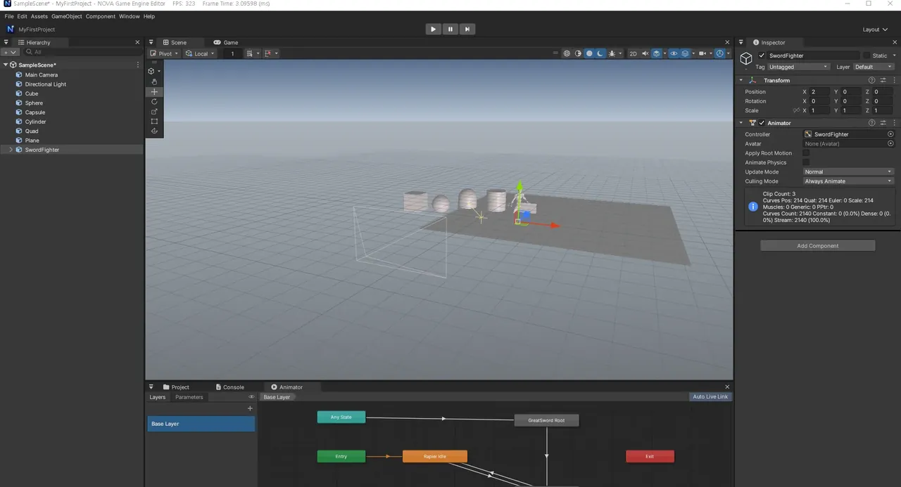<br/>Animator 창 | 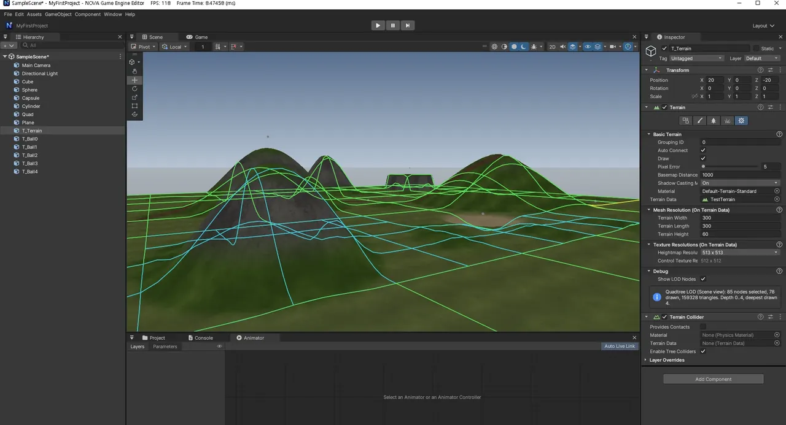<br/>터레인 쿼드트리 LOD |
| 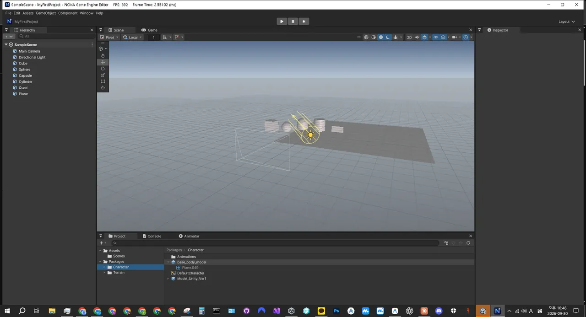<br/>Project 창 (2단 레이아웃) | 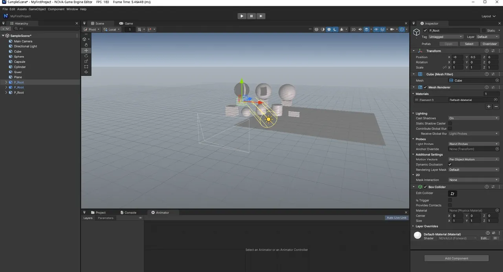<br/>프리팹 인스턴스 |
| 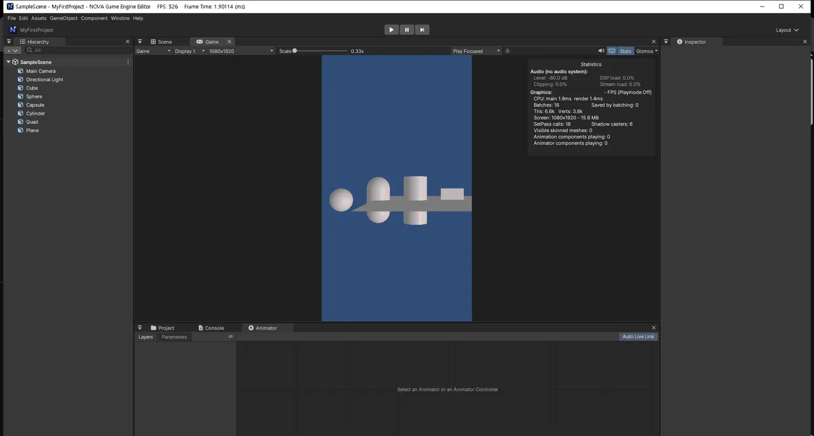<br/>Game 뷰 (1080x1920 + Stats) | 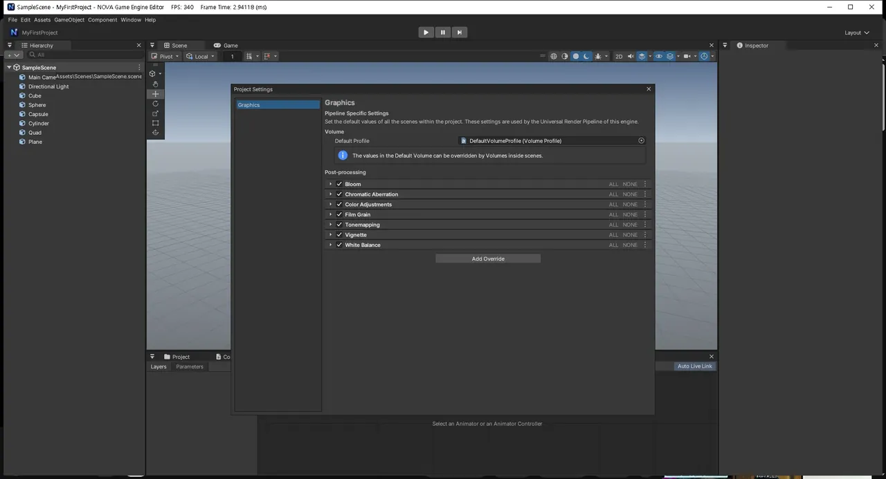<br/>Project Settings > Graphics (Volume) |
| 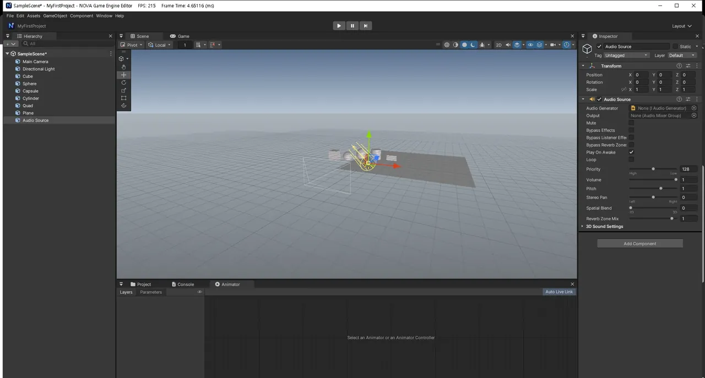<br/>Audio Source | 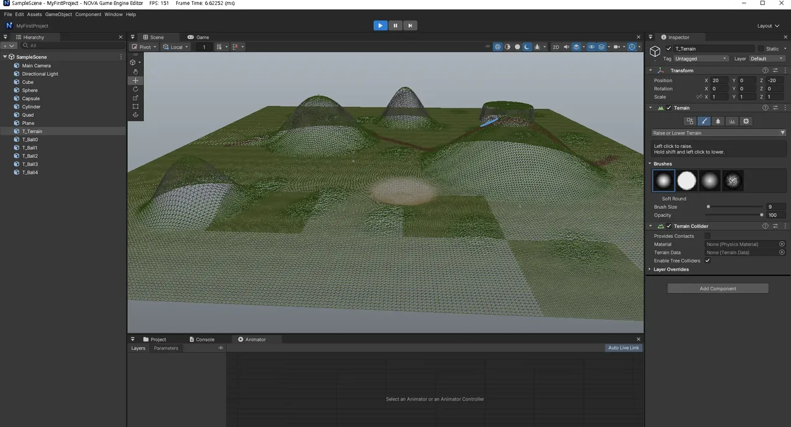<br/>물리 (지형 위의 공) |
| 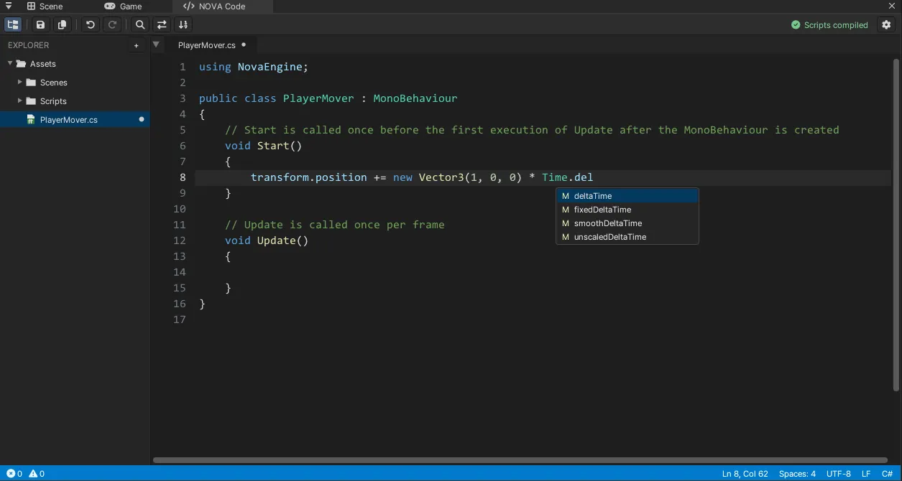<br/>NOVA Code (내장 C# IDE, 자동 완성) | 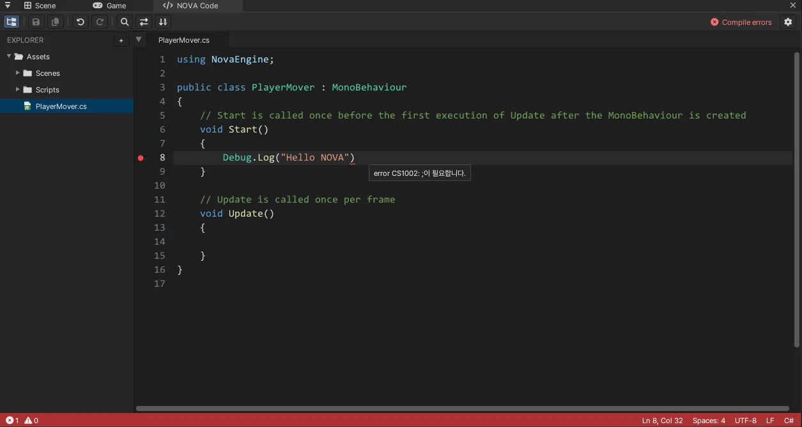<br/>NOVA Code 컴파일 오류 표시 |
| 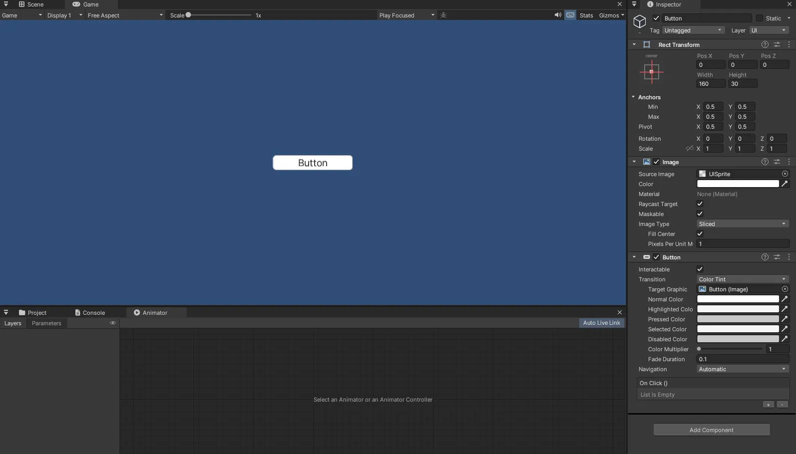<br/>UI Button (Rect Transform / Image / Button Inspector) | 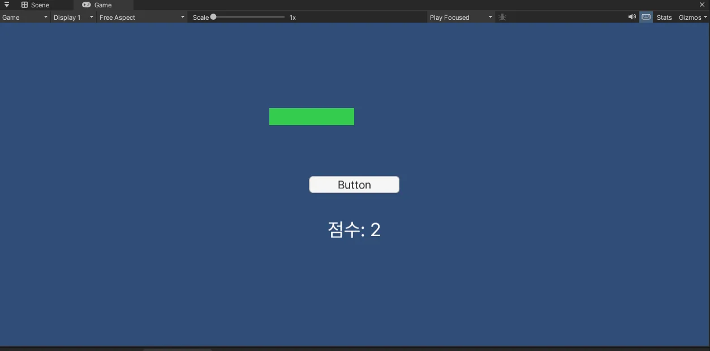<br/>UI Play: 버튼 클릭 → 점수·체력 바 (C#) |

<p align="center">
  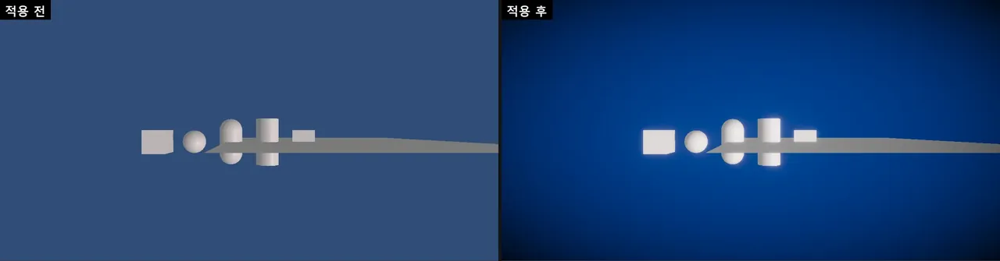<br/>
  후처리 적용 전 / 후 (Bloom, Vignette, ACES, 채도·대비)
</p>

<p align="center">
  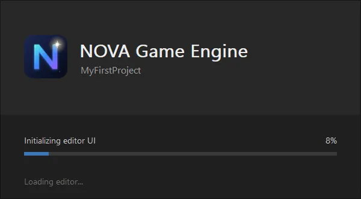<br/>
  시작 로딩 창
</p>

## 빌드

### 필요한 것
- Windows 10 / 11 (x64)
- Visual Studio 2022 이상 — **C++를 사용한 데스크톱 개발** 워크로드 (MSVC, Windows 10/11 SDK, CMake 포함)
- DirectX 11 을 지원하는 GPU
- [.NET SDK 8 이상](https://dotnet.microsoft.com/download) — C# 스크립팅 (없으면 스크립트 없이 동작)

외부 라이브러리(Assimp, DirectXTex, Effects11, ImGui, nlohmann/json, Jolt Physics)는 저장소에 들어 있어 따로 설치할 필요가 없습니다.

### 빌드 방법
```bat
build.bat
```
- CMake 로 `build/` 에 Visual Studio 솔루션을 만들고 Debug x64 로 컴파일합니다 (Debug 도 `/O2` 최적화).
- 결과: `Binaries/NovaEngine.exe`
- `build.bat` 안의 `CMAKE_PATH` 는 Visual Studio 에 포함된 CMake 경로입니다. 설치 위치가 다르면 이 줄을 고쳐 주세요.
- Visual Studio 에서 직접 열려면 `build/NovaEngine.sln` 을 사용합니다.

## 실행

| 명령 | 동작 |
|---|---|
| `NovaEngine.exe` | **NOVA Hub** — 프로젝트 목록, 새 프로젝트 만들기, 열기 |
| `NovaEngine.exe --project "<프로젝트 폴더>"` | 그 프로젝트를 에디터로 열기 |
| `NovaEngine.exe --editor` | 엔진 폴더의 샘플 프로젝트로 에디터 열기 (엔진 개발용) |

작업 디렉터리는 `Binaries/` 입니다 (실행 파일이 시작할 때 자동으로 맞춥니다).

### 게임 빌드 (Unity 의 Build Settings)
1. **File > Build Settings...** (`Ctrl+Shift+B`) → **Add Open Scenes** 또는 Project 창에서 `.scene` 을 끌어 놓습니다. 맨 위(0번) 씬이 시작 씬입니다.
2. **Player Settings...** (Project Settings > Player) 에서 제품 이름, 화면 모드(Fullscreen Window / Maximized Window / Windowed), 해상도를 정합니다.
3. **Build** 로 폴더를 고르면 다음이 만들어집니다. **Build And Run** (`Ctrl+B`) 은 만든 뒤 바로 실행합니다.

```
<출력 폴더>/
  <제품 이름>.exe          ← 게임 실행 파일 (에디터 없이 첫 씬을 Play)
  *.dll
  <제품 이름>_Data/        ← player.json, 빌드 씬과 그 씬이 쓰는 에셋, 셰이더, 컴파일된 C# (Assembly-CSharp.dll)
```

빌드된 게임에서는 C# 의 `SceneManager.LoadScene("이름" 또는 번호)` 로 Build Settings 의 씬을 옮겨 다니고 `Application.Quit()` 으로 끝냅니다. 로그는 `<제품 이름>_Data/Binaries/Logs/Editor.log` 입니다.

새 프로젝트 구조는 Unity 와 같습니다: `Assets/`(씬·에셋), `ProjectSettings/`(프로젝트 설정), `UserSettings/`(개인 설정, Game 뷰 등).

## C# 스크립트

Project 창 우클릭 > **Create > Scripting > MonoBehaviour Script** 로 만들고, 더블클릭하면 내장 코드 편집기 **NOVA Code** 로 열립니다 (Console 의 오류 더블클릭도 그 줄로). 저장(`Ctrl+S`)하면 에디터가 바로 다시 컴파일합니다. GameObject 에 끌어 놓거나 Add Component > Scripts 로 붙입니다.

다른 편집기를 쓰려면 **Edit > Preferences... > External Tools > External Script Editor** 에서 고릅니다 (Unity 와 같음).

| External Script Editor | 여는 방법 |
|---|---|
| NOVA Code (built-in) — 기본값 | 에디터 안의 NOVA Code 탭 |
| Visual Studio (설치된 버전을 vswhere 로 찾음) | `devenv /edit 파일 /command "Edit.GoTo 줄"` |
| Visual Studio Code | 프로젝트 폴더 + `-g 파일:줄` |
| JetBrains Rider | `--line 줄 파일` |
| Open by file extension | Windows 에서 .cs 에 연결된 프로그램 |
| Browse... | 직접 고른 exe + 인자 (`$(File)`, `$(Line)`, `$(ProjectPath)`) |

설정은 사용자별로 `%LOCALAPPDATA%\NOVA\Editor\EditorPrefs.json` 에 저장됩니다 (Unity 의 EditorPrefs).

```csharp
using NovaEngine;

public class Spinner : MonoBehaviour
{
    [Range(0, 360)] public float speed = 90f;
    public GameObject target;

    void Update()
    {
        transform.Rotate(0, speed * Time.deltaTime, 0);
        if (Input.GetKeyDown(KeyCode.Space))
            Debug.Log("Space!");
    }

    void OnCollisionEnter(Collision collision) => Debug.Log($"hit {collision.gameObject.name}");
}
```

UI 는 `using NovaEngine.UI;` (Unity 의 `UnityEngine.UI`) 이고, `TMPro.TextMeshProUGUI` 도 같은 Text 로 쓸 수 있습니다.

```csharp
using NovaEngine;
using NovaEngine.UI;

public class ScoreUI : MonoBehaviour
{
    public GameObject scoreText, hpBar, button;
    int score;

    void Start()
    {
        button.GetComponent<Button>().onClick.AddListener(() =>
        {
            score++;
            scoreText.GetComponent<Text>().text = "점수: " + score;
            hpBar.GetComponent<Image>().fillAmount -= 0.1f;   // Image Type = Filled
        });
    }
}
```

파티클도 Unity 와 같은 모양입니다 (모듈 구조체의 값을 바꾸면 바로 반영).

```csharp
var ps = GetComponent<ParticleSystem>();
var main = ps.main;
main.startColor = new ParticleSystem.MinMaxGradient(Color.yellow, Color.red);   // Random Between Two Colors
main.startSize = new ParticleSystem.MinMaxCurve(0.2f, 0.5f);
var emission = ps.emission;
emission.rateOverTime = 50f;
ps.Emit(30);      // 즉시 30개
ps.Stop();        // 방출 멈춤 (남은 입자는 수명대로)
```

Unity 코드는 `using UnityEngine;` 을 `using NovaEngine;` 으로 바꾸면 대부분 그대로 동작합니다. 프로젝트 루트의 `Assembly-CSharp.csproj` 는 에디터가 만들며, VS Code / Visual Studio 에서 자동 완성에 쓰입니다.

## 단축키 (Unity 와 같음)

| 키 | 동작 |
|---|---|
| `Q` `W` `E` `R` `T` `Y` | Hand / Move / Rotate / Scale / Rect / Transform 도구 |
| 우클릭 + `W` `A` `S` `D` / `Q` `E` | Scene 카메라 비행 (Shift = 빠르게, 휠 = 속도) |
| `Alt` + 좌클릭 드래그 | 궤도 회전 |
| 가운데 버튼 드래그 | 화면 이동 |
| `F` | 선택한 오브젝트로 포커스 |
| `Ctrl+Z` / `Ctrl+Y` | 실행 취소 / 다시 실행 |
| `Ctrl+S` / `Ctrl+Shift+S` | 씬 저장 / 다른 이름으로 저장 |
| `Ctrl+D` · `Ctrl+C` · `Ctrl+X` · `Ctrl+V` | 복제 · 복사 · 잘라내기 · 붙여넣기 |
| `F2` · `Delete` | 이름 바꾸기 · 삭제 |
| `Ctrl+P` | Play / Stop |

NOVA Code 안에서는 (VS Code 와 같음):

| 키 | 동작 |
|---|---|
| `Ctrl+S` / `Ctrl+Shift+S` | 저장 / 모두 저장 (저장하면 바로 컴파일) |
| `Ctrl+Space` | 자동 완성 (`.` 뒤와 입력 중에도 자동으로 뜸) |
| `Ctrl+F` / `Ctrl+H` / `F3` | 찾기 / 바꾸기 / 다음 찾기 |
| `Ctrl+G` | 줄로 이동 |
| `Ctrl+/` · `Ctrl+D` | 주석 토글 · 줄 복제 |
| `Tab` / `Shift+Tab` | 들여쓰기 / 내어쓰기 (여러 줄 선택 가능) |
| `Ctrl+W` · `Ctrl+B` · `Ctrl+휠` | 탭 닫기 · Explorer 토글 · 글꼴 크기 |

## 폴더 구조

```
Source/
  Platform/   앱 루프, 윈도우, 로딩 창, 자체 검사(PhysicsSelfTest)
  Core/       경로, 로그(EditorLog), 공용 유틸
  Graphics/   DX11 렌더러, 이펙트, 셰이더 캐시, 후처리(Volume), 렌더 통계
  Scene/      GameObject, 컴포넌트(Transform, Camera, Light, Renderer, Collider, Volume ...), 씬, 프리팹
  Physics/    Jolt Physics 연동
  Animation/  스키닝, 애니메이션 클립, Animator 컨트롤러
  Terrain/    TerrainData, 쿼드트리 LOD 렌더러
  Audio/      XAudio2, AudioClip(WAV), AudioSource, AudioListener
  Scripting/  .NET 호스팅(hostfxr), 스크립트 컴파일/핫 리로드, C# ↔ C++ 바인딩, CSharpScript 컴포넌트
  UI/         UGUI: Canvas, RectTransform, Image, Text, Button, Toggle, Slider, InputField, ScrollRect, Mask, 글꼴 아틀라스, UI 그리기(42. UI.fx), 입력/레이아웃(UISystem)
  Build/      Build Settings / Player Settings, 빌드 파이프라인(의존 에셋 수집·복사), 빌드된 게임 실행(PlayerRuntime)
  Effects/    Particle System: 시뮬레이션, 곡선/그라디언트 값, 인스턴싱 렌더러(43. Particle.fx), Inspector·미리보기 편집기
  Editor/     에디터 GUI(UnityGUI), 창(Scene/Game/Hierarchy/Inspector/Project/Animator/Preferences ...), Undo, EditorPrefs
    NovaCode/ 내장 C# IDE: CodeEditor(편집 위젯), CSharpLanguage(구문 강조·자동 완성), NovaCodeWindow(창), ExternalScriptEditor(편집기 선택/실행)
  Hub/        프로젝트 Hub
ScriptCore/   C# 엔진 API (NovaScriptCore.dll — Unity 의 UnityEngine.dll 역할)
Shaders/      HLSL (FX11 이펙트)
Resources/    엔진 기본 리소스와 패키지 (Packages/Character, Terrain, Audio)
ProjectSetting/  에디터 아이콘(SVG → PNG), 폰트, 로고
Tools/        아이콘/로고/테스트 효과음 생성 스크립트
```

## 개발 문서

- [`AGENT_HANDOFF.md`](AGENT_HANDOFF.md) — 현재 구조, 기능별 구현 설명, 규칙, 자체 검사(`NOVA_*_TEST` 환경 변수) 방법
- [`PROJECT_HANDOVER.md`](PROJECT_HANDOVER.md) — 이전 구조와 배경 기록

## 사용한 오픈소스

| 라이브러리 | 용도 |
|---|---|
| [Dear ImGui](https://github.com/ocornut/imgui) (docking) · [imgui-node-editor](https://github.com/thedmd/imgui-node-editor) | 에디터 UI |
| [Jolt Physics](https://github.com/jrouwe/JoltPhysics) | 물리 |
| [Assimp](https://github.com/assimp/assimp) | FBX / 모델 가져오기 |
| [DirectXTex](https://github.com/microsoft/DirectXTex) · [Effects11](https://github.com/microsoft/FX11) | 텍스처, 셰이더 이펙트 |
| [nlohmann/json](https://github.com/nlohmann/json) | 씬/에셋 저장 |
| [Pretendard](https://github.com/orioncactus/pretendard) (SIL OFL) · [Font Awesome](https://fontawesome.com) | 폰트, 아이콘 |

기본 스카이박스는 [Poly Haven](https://polyhaven.com) 의 CC0 HDRI(Kloofendal 48d Partly Cloudy Pure Sky)입니다 — `Resources/Textures/Skybox/README.md`.

에디터 아이콘과 테스트 효과음은 `Tools/` 의 스크립트로 직접 그리거나 합성한 것입니다. Unity 의 아이콘·에셋은 사용하지 않았습니다.
