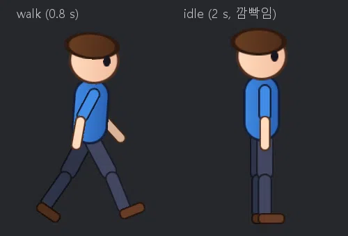

# 2D Animator (com.nova.animation2d) — 편집기 안의 Spine 같은 2D 뼈대 애니메이션 + AI 용 CLI

Spine 처럼 그림 조각을 뼈대에 붙여 움직이는 창과, 같은 연산을 AI 에이전트가 터미널에서 부르는 명령 규격입니다.
Model Editor 와 같은 방식입니다: 창에서 하는 모든 것이 `nova anim2d <op>` 이고, 결과는 JSON, 확인은 PNG 렌더로 합니다.

- 넣기: Window > Package Manager 에서 **2D Animator**, 또는 `nova package add com.nova.animation2d`
- 열기: Window > **2D Animator** (처음 열면 Scene 탭 옆에 붙는다), Project 창 Create > **2D Skeleton (Animator)** (`.skel2d`) 더블클릭, 또는 `nova anim2d window`




## 개념 (Spine 과 같다)

| 이름 | 뜻 |
|---|---|
| 본 (bone) | 부모 · 자식 나무. 값 = 부모 기준 위치 `x, y`, 회전 (도), 크기, 길이. 처음 문서에는 `root` 하나 |
| 슬롯 (slot) | 본에 붙은 그림 자리. **그리는 순서** = 슬롯 순서 (뒤 → 앞), 색 (곱하기 · 알파) |
| 첨부 (attachment) | 슬롯에 넣는 그림 (PNG) + 본 기준 위치 · 회전 · 크기. 슬롯 하나에 여러 개 — 하나만 보인다 (눈 뜸 / 감음, 손 모양 바꾸기) |
| Setup 모드 | 쉬는 자세 (셋업 포즈) 를 만든다: 본 · 그림 배치 |
| Animate 모드 | 지금 시각의 자세를 고치고 **키** 를 찍는다. 키 = 셋업과의 차이 (회전 더하기 · 위치 더하기 · 크기 곱하기) — 셋업을 고쳐도 애니메이션이 따라온다 |
| 곡선 | `linear` · `stepped` · `smooth` (앞 키의 곡선이 다음 키까지). 첨부 키는 늘 계단 |

## 좌표 규칙 (AI 가 꼭 알 것)

| 항목 | 값 |
|---|---|
| 단위 | 픽셀 (그림 1 픽셀 = 1). 캐릭터 키 200 ~ 400 이 알맞다 |
| 축 | **y 위**, x 오른쪽. 땅 = y 0 으로 두면 내보낸 시트의 `pivot` 이 발 밑이 된다 |
| 회전 | 도, **반시계** +. 0 = 오른쪽, 90 = 위, -90 = 아래 |
| 본 값 | 기본은 **부모 기준**. `--world` 를 붙이면 월드 위치 · 월드 회전으로 주고 받는다 (만들 때 편하다) |
| 그림 방향 | 그림의 가로 = 본 방향 (본의 x 축). 아래로 향한 다리 본 (-90) 에 가로로 긴 캡슐 (`--size 60,20`) 을 붙이면 세로로 선다. 그림 가운데가 첨부 위치 — 본 길이 `L` 이면 `--x L/2` |
| 경로 | 프로젝트 기준 (`Assets/...png`) 또는 절대 경로 |

## CLI: `nova anim2d <op> [경로] [--이름 값 …]`

- 값은 JSON 으로 읽히면 그대로, `84,46` · `1,0.5,0.2,1` 처럼 쉼표로 이은 숫자는 배열, 아니면 글자. 값 없는 `--이름` = `true`
- 결과 = JSON 요약: `bones · slots · animations [{name, length, loop, keys}] · mode · time · selectedBone · selectedSlot`, 고친 연산은 `changed`, `undo` (마지막 Undo 이름), 키 안 찍은 자세가 있으면 `unkeyedPose: true`
- 고치는 연산은 하나하나 Undo (`nova anim2d undo` / 창에서 Ctrl+Z). 실패한 연산은 아무것도 바꾸지 않습니다
- `--json` 을 붙이면 결과를 그대로 받는다. 전체 목록: `nova anim2d help`

### 문서 · 출력

| op | 인자 | 설명 |
|---|---|---|
| `info` | | 요약 |
| `new` | `[--name]` | 빈 뼈대 (`root` 본 하나) |
| `open` / `save` | `<파일.skel2d>` | JSON (아래 [파일 형식](#파일-형식-skel2d)) |
| `undo` / `redo` | | |
| `mode` | `--mode setup\|animate` | |
| `select` | `--bone <본> \| --slot <슬롯> \| --none` | 창의 선택 (본을 고르면 그 본이 기본 대상) |
| `render` | `--path <파일.png> [--size 512 \| w,h] [--anim <이름>] [--time <초>] [--bones] [--grid] [--background dark\|white\|none\|#rrggbb] [--center x,y] [--zoom] [--padding 0.08]` | PNG (보이는 것에 맞춰 화면을 채운다). `--anim/--time` 은 그 시각만 그리고 문서 시각은 그대로. **AI 가 결과를 눈으로 확인하는 방법** |
| `export` | `--path <시트.png \| 폴더> [--anim] [--fps 12] [--frames n] [--size w,h (한 칸)] [--columns] [--sequence] [--background none]` | 스프라이트 시트 + `.json`, 또는 `--sequence` = 폴더에 `<애니>_000.png …`. 모든 프레임이 같은 틀 (애니메이션 전체 경계) |
| `image.make` | `--path <Assets/....png> [--shape ellipse\|rect\|roundrect\|capsule\|triangle] [--size w,h] [--color r,g,b,a] [--gradient r,g,b (아래 색)] [--outline r,g,b] [--outlineWidth 3] [--radius 모서리]` | 몸 조각 그림을 만든다 (부드러운 가장자리, 0..1 색). 그림 없이 AI 가 캐릭터를 만들 때 |
| `window` / `view` | `view [--frame] [--bones] [--grid]` | 편집기 창 열기 / 창 보기 |

### 본

| op | 인자 | 설명 |
|---|---|---|
| `bone.add` | `--name <본> [--parent <본> (기본: 고른 본, 없으면 root)] [--x --y] [--rotation] [--length] [--scale s\|sx,sy] [--world]` | 만들고 고른다 |
| `bone.set` | `--name <본> [--x --y --rotation --length --scale --scaleX --scaleY] [--world] [--parent <본>] [--rename <새 이름>]` | 셋업 값 |
| `bone.delete` | `--name <본>` | 자식 · 슬롯은 부모로 (root 는 지울 수 없다) |
| `bone.list` | | 본마다 셋업 값 + `world {head, tail, rotation}` (지금 자세) |

### 슬롯 · 그림

| op | 인자 | 설명 |
|---|---|---|
| `image.add` | `--bone <본> --image <png> [--name <슬롯>] [--attachment <이름>] [--x --y (본 기준)] [--rotation] [--scale] [--width --height] [--order front\|back\|<번호>]` | 새 슬롯 + 그림 (기본: 맨 앞) |
| `attachment.add` | `--slot <슬롯> --name <첨부> --image <png> [--x --y --rotation --scale --width --height]` | 같은 슬롯에 다른 그림 |
| `attachment.set` | `--slot <슬롯> [--name <첨부> (기본: 셋업 첨부)] [--x --y --rotation --scale --width --height] [--image <png>]` | 그림 옮기기 · 바꾸기 |
| `slot.set` | `--name <슬롯> [--attachment <이름> \| ""] [--color r,g,b,a] [--bone <본>] [--order front\|back\|forward\|backward\|<번호>] [--rename]` | 셋업: 보이는 첨부 · 색 · 그리는 순서 |
| `slot.delete` · `slot.list` | | 목록 = 그리는 순서, `attachment` (셋업) · `current` (지금 자세) |

### 애니메이션

| op | 인자 | 설명 |
|---|---|---|
| `anim.new` | `--name <이름> [--length 1] [--loop true]` | 만들고 Animate 모드 · 시각 0 |
| `anim.select` · `anim.set` · `anim.delete` · `anim.list` | `anim.set [--name] [--length] [--loop] [--rename]` | |
| `anim.time` | `--time <초>` | 그 시각으로 (자세 = 그 시각의 키) |
| `pose` | `--bone <본> [--rotation] [--x --y] [--scale] [--world]` 또는 `--slot <슬롯> [--attachment <이름>\|""] [--color r,g,b,a]` | 지금 시각의 자세를 고친다 (Undo 없음 — 키를 찍어야 남는다) |
| `anim.key` | `[--time <초> (기본: 지금)] [--bones a,b (기본: 모든 본 + 바뀐 슬롯)] [--curve linear\|stepped\|smooth] [--slots true]` | 지금 자세를 키로. `--bones` 에 슬롯 이름을 주면 그 슬롯만 |
| `anim.unkey` | `--time <초> [--bones a,b]` | 그 시각의 키 지우기 |
| `batch` | `<파일 \| ->` (CLI) 또는 `--steps [{"op":…}, …]` | 줄마다 연산 하나 (`#` 주석, 앞의 `nova anim2d` 는 있어도 됨). **Undo 한 번**, 한 단계라도 실패하면 모두 되돌린다 |

**키 안 찍은 자세**: Animate 모드에서 `pose` (또는 창에서 끌기) 로 고친 자세는 `info` · `render` · `bone.list` 뒤에도 남고, 시각 · 애니메이션 · 모드를 바꾸면 버려진다 (Spine 과 같다). `unkeyedPose: true` 가 보이면 `anim.key` 를 잊은 것.

### AI 작업 순서 (예: [docs/examples/anim2d_walker.txt](examples/anim2d_walker.txt))

1. `image.make` 로 몸 조각 (몸통 캡슐, 머리 타원, 팔 · 다리 캡슐, 발 둥근 사각형, 눈 + 감은 눈) — 뒤쪽 팔다리는 조금 어둡게
2. `bone.add --world` 로 엉덩이 → 몸통 → 머리, 어깨 → 팔 → 아래팔, 엉덩이 → 허벅지 → 정강이
3. `image.add` 를 **뒤 → 앞 순서로** (뒤 팔 · 뒤 다리 → 앞 다리 → 몸통 → 머리 · 눈 → 앞 팔), `attachment.add` 로 바꿔 끼울 그림
4. `render --bones --grid` 로 셋업 확인
5. `anim.new` → (`anim.time` → `pose … --world` → `anim.key --curve smooth`) 를 키 시각마다. 반복 애니메이션은 처음과 끝 키를 같게
6. `render --anim walk --time 0.2` 로 프레임 확인, `export` 로 시트 · 연속 PNG

## 창

| 조작 | 동작 |
|---|---|
| 휠 | 마우스 자리를 기준으로 확대 · 축소 |
| 가운데 / 오른쪽 끌기 | 화면 이동 |
| 왼쪽 클릭 | 본 (모양 근처) 또는 그림 (그 픽셀의 맨 위 슬롯) 고르기 — 그림을 고르면 그 본이 움직일 대상 |
| 왼쪽 끌기 | 도구: **R** 회전 (본 머리 기준, Ctrl = 15° 눈금) · **T** 이동 · **S** 크기 (Shift = 길이 방향만) · **B** 본 만들기 (Setup 모드: 누른 곳 = 머리, 놓은 곳 = 꼬리, 고른 본의 자식) |
| Auto Key | Animate 모드에서 끌기를 마치면 그 본을 지금 시각에 키 (곡선 = 타임라인 콤보) |
| K · Space · F · Delete | 키 찍기 · 재생 / 멈춤 · 전체 보기 · 고른 슬롯 / 본 지우기 |
| Ctrl+Z / Ctrl+Y / Ctrl+S | 이 창의 Undo / Redo / 저장 (씬 Undo 와 따로) |
| Project 창의 PNG 끌어 놓기 | 놓은 자리에 고른 본의 새 슬롯 |
| 오른쪽 패널 | 본 · 슬롯 나무, 고른 본 값 (Setup = 셋업, Animate = 지금 자세 → 바꾸면 `pose`), 고른 슬롯의 첨부 · 색 · 위치 · 그리는 순서 (Back · Backward · Forward · Front) |
| 타임라인 | 애니메이션 고르기 · 새로, 재생, Key, 곡선, Length · Loop. 노란 마름모 = 모든 키, 파란 = 고른 본의 키. 끌면 시각 이동 (키 가까이면 붙는다) |
| File 메뉴 | New · Open · Save · Save As · Export Sprite Sheet |

## 파일 형식 (.skel2d)

```json
{
  "format": "nova-skel2d", "version": 1, "name": "walker",
  "bones": [ { "name": "root", "parent": "", "x": 0, "y": 0, "rotation": 0, "scaleX": 1, "scaleY": 1, "length": 0 },
             { "name": "hip", "parent": "root", "x": 0, "y": 110, "rotation": 90, "length": 12 } ],
  "slots": [ { "name": "eye", "bone": "head", "attachment": "open", "color": [1, 1, 1, 1],
               "attachments": [ { "name": "open", "image": "Assets/Anim2D/Walker/eye.png", "x": 28, "y": -16, "rotation": 0, "scaleX": 1, "scaleY": 1 } ] } ],
  "animations": [ { "name": "walk", "length": 0.8, "loop": true,
                    "bones": { "leg_front": { "rotate": [[0, 28, "smooth"], [0.2, -2, "smooth"]], "translate": [[0, 0, -4]], "scale": [[0, 1, 1]] } },
                    "slots": { "eye": { "attachment": [[1.6, "closed"], [1.7, "open"]], "color": [[0, 1, 1, 1, 1]] } } } ]
}
```

키 값은 셋업과의 차이: `rotate` = 더할 각도, `translate` = 더할 x, y, `scale` = 곱할 sx, sy. 곡선을 빼면 linear.

스프라이트 시트 JSON: `{ "image": "walk_sheet.png", "animation", "fps", "cell": [w, h], "columns", "pivot": [x, y] (칸 안에서 원점 (0,0) 의 픽셀 — 땅을 0 에 두었으면 발 밑), "frames": [{x, y, w, h}, …] }`

## 로드맵

| 단계 | 내용 |
|---|---|
| 1 (지금) | 본 · 슬롯 · 그림 첨부 · 키 애니메이션 (회전 · 이동 · 크기 · 첨부 · 색), 창 + CLI, PNG 렌더, 시트 · 연속 PNG 내보내기, `image.make` |
| 2 | 씬에서 재생하는 런타임 컴포넌트 (Animator 처럼 상태 · 전환), 메시 첨부 + 가중치 (변형), IK, Spine JSON 가져오기 |
