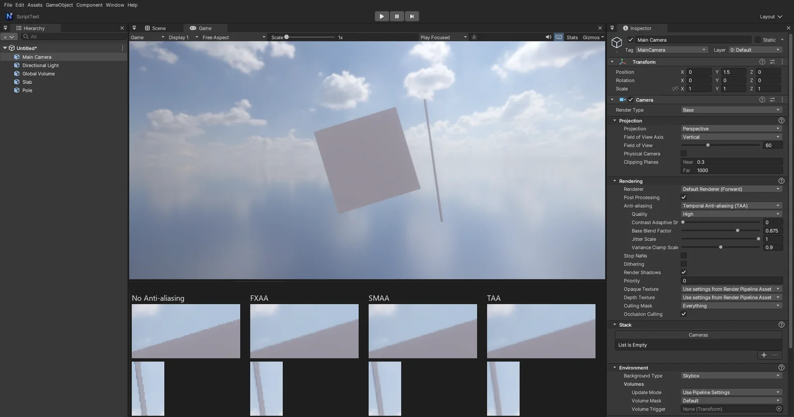

# 카메라 Anti-aliasing (FXAA · SMAA · TAA)

Unity URP 카메라의 **Anti-aliasing** 과 같은 4 가지입니다: No Anti-aliasing · **FXAA** · **SMAA** · **TAA**. 예전에는 SMAA 를 골라도 FXAA 로 처리했습니다.

## 쓰는 법

Camera 컴포넌트 > Rendering > **Anti-aliasing**. Game 뷰 (플레이 · 빌드한 게임) 에 적용됩니다 — Scene 뷰는 없음 (Unity 와 같음).
**새 카메라의 기본값은 TAA** 입니다 (Unity URP 는 No Anti-aliasing) — 잎 · 풀 · 먼 숲의 계단과 반짝임 (열린 월드). 예전 장면은 저장된 값 그대로.

| 방식 | 설정 | 특징 |
|------|------|------|
| FXAA | — | 가장 빠름. 화면 전체를 살짝 흐리게 |
| SMAA | Quality (Low · Medium · High) | 경계 모양을 찾아 그만큼만 섞는다 — FXAA 보다 또렷하고 평평한 곳은 그대로 |
| TAA | Quality (Very Low ~ Very High), Contrast Adaptive Sharpening, Base Blend Factor (0.875), Jitter Scale (1), Variance Clamp Scale (0.9) | 프레임마다 서브픽셀만큼 흔들어 여러 프레임을 섞는다 — 가는 선 · 반짝임 · LOD 크로스페이드 디더 · SSR 잡음까지 매끈. 빠르게 움직이면 약간 흐림 |

## 동작 (엔진 안)

- **FXAA · SMAA** 는 Uber (톤매핑 · 색 보정) 다음의 LDR 화면에서 (`41. PostProcess.fx`)
  - SMAA: ① 루마 경계 (문턱 Low 0.15 · Medium · High 0.1, 둘레에 2 배 넘게 큰 대비가 있으면 약한 경계는 버림 — 국소 대비 적응) → ② 경계마다 양쪽 끝까지 찾고 (Low 4 · Medium 8 · High 16 칸), 끝의 교차 경계로 모양 (L · Z · U) 을 정해 되살린 선이 픽셀을 덮는 **면적을 해석적으로** 계산 (SMAA 의 면적 텍스처 대신) → ③ 이웃과 그 면적만큼 섞기
- **TAA** (URP 와 같은 순서 — 후처리 맨 앞, Depth Of Field 앞):
  - Game 카메라 투영에 Halton (2, 3) 8 개 서브픽셀 지터 × Jitter Scale (`EditorApp::OnSceneRender`). 깊이로 지난 프레임 위치를 되찾을 때는 지터 없는 투영
  - 해결: 깊이 프리패스의 뷰 깊이 → 월드 → 지난 프레임 화면 (카메라 움직임, 하늘은 회전만) 에서 히스토리 → 3x3 이웃 범위로 자르기 (Quality: Very Low = RGB 최소 · 최대, Low = YCoCg, Medium 이상 = 평균 ± 분산 × Variance Clamp Scale, High 이상 = Catmull-Rom 히스토리) → 밝기 가중으로 섞기 (새 프레임 비중 = 1 - Base Blend Factor)
  - 히스토리 두 장을 번갈아 쓰고, 같은 프레임에 다시 그리면 (스크린샷) 바꾸지 않는다. 화면 밖에서 들어온 픽셀 · 첫 프레임은 이번 프레임만
  - Contrast Adaptive Sharpening > 0 이면 결과를 대비가 낮은 곳만 더 날카롭게 (AMD CAS 단순형)
- 물체 자체의 움직임 벡터는 없어 (카메라 움직임만 되찾음) 빠르게 움직이는 물체는 이웃 범위 자르기로 고스트를 줄인다
- DirectX 11 · OpenGL 같은 결과
- 파일: `Source/Scene/Camera.*` (설정 · Inspector · 저장), `Source/Editor/EditorApp.*` (지터 · 옵션), `Source/Graphics/DX11/PostProcessPass.*` (`TemporalAA`, SMAA 세 단계), `Shaders/41. PostProcess.fx` (`PS_Taa` · `PS_TaaSharpen` · `PS_SmaaEdges` · `PS_SmaaWeights` · `PS_SmaaBlend`)

## 검사

`Tools/tests/run_tests.ps1 -Only antialiasing` — 기울어진 어두운 상자 위 모서리의 중간 밝기 픽셀 (열마다, 모서리 ±3 px):

1. 없음 = 0 (계단)
2. FXAA · 3. SMAA (High) · 4. TAA 에서 늘어남
5. TAA 는 가만히 있는 화면에서 프레임끼리 거의 같음, SMAA 는 평평한 곳을 안 건드림
6. Camera 의 설정 (TAA Quality · Base Blend Factor · Sharpening) 저장
7. TAA + Sharpening 도 계단 없음

## 아직

- 물체별 움직임 벡터 (빠르게 움직이는 물체의 TAA 흐림 줄이기), SMAA 의 대각선 · 모서리 둥글리기 (SMAA 1x 의 일부)
