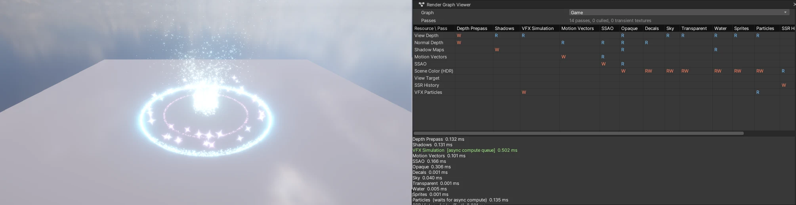

# 비동기 컴퓨트 (Async Compute)

큐가 둘인 백엔드 (DirectX 12 · Vulkan) 에서 컴퓨트 일을 **두 번째 GPU 큐** 로 보내, 같은 프레임의 그래픽 일 (그림자 · 모션 벡터 · SSAO · 불투명 …) 과 겹쳐 돌게 합니다. 렌더링 현대화 4 단계 ([RENDERING_ROADMAP](RENDERING_ROADMAP.md)), [Render Graph](RENDER_GRAPH.md) 위에서 돕니다.

## 쓰는 법

따로 켤 것이 없습니다. DirectX 12 (`-force-d3d12`) · Vulkan (`-force-vulkan`) 으로 실행하면 Render Graph 의 **AsyncCompute** 패스가 컴퓨트 큐로 갑니다. 다른 백엔드 (DX11 · OpenGL · GLES · WebGPU) 는 같은 자리에서 그대로 돕니다 — 결과는 같습니다.

- 지금 비동기로 도는 패스: **VFX Simulation** (Visual Effect Graph 의 GPU 시뮬레이션 — Spawn · Update · GPU Event). 프레임의 첫 뷰에서, 그림자 다음에 컴퓨트 큐로 보내고 **Particles** 패스 앞에서 기다립니다
- 장면 텍스처를 읽는 효과 (Collide with Depth Buffer · Collide with Weather Cover) 가 켜져 있으면 그래픽 큐에서 (그 텍스처를 그래픽 패스가 동시에 바꾸므로)
- 확인: Render Graph Viewer · `nova rendergraph info` 의 패스마다 `queue` (compute / graphics) · `waitsAsync`
- 끄고 켜기 (비교 · 문제 찾기): `nova rendergraph set --async false|true`, 백엔드 쪽은 환경 변수 `NOVA_D3D12_ASYNC=0` · `NOVA_VK_ASYNC=0`

## 동작

- **Render Graph** (`RenderGraph::Graph::Execute`): `Builder::AsyncCompute()` 패스는 `BeginAsyncCompute` ~ `EndAsyncCompute` 사이에서 실행. 그 패스가 쓴 판을 처음 읽는 (또는 다음 판을 쓰는) 패스 앞에서 `WaitAsyncCompute`. 그 사이의 그래픽 패스가 컴퓨트와 겹친다. 컴퓨트가 쓴 임시 텍스처는 기다린 뒤에야 풀로 돌아간다
- **Gfx 층** (`GfxContext::SupportsAsyncCompute · BeginAsyncCompute · EndAsyncCompute · WaitAsyncCompute`): 지원하지 않는 백엔드는 아무 일도 하지 않는다
- **DirectX 12** (`Source/Graphics/DX12/`): 컴퓨트 큐 + 펜스, 컴퓨트 명령 목록.
  - Begin: 그래픽 장벽을 내고 컴퓨트 목록을 연다 — 그 뒤의 기록 (Dispatch · UAV 지우기 · 버퍼 복사) 은 컴퓨트 목록으로
  - End: 그래픽 목록을 제출 → 컴퓨트 큐가 그 펜스 값을 기다린 뒤 컴퓨트 목록 실행
  - Wait: 그 사이의 그래픽 목록을 먼저 제출 (겹쳐 돈다) → 그래픽 큐가 컴퓨트 펜스를 기다린다
  - 상태: 컴퓨트 큐가 다룰 수 없는 상태 (픽셀 셰이더 자원 · 렌더 타깃 · 깊이 · 인덱스) 에서 나오는 장벽은 그래픽 목록에 (컴퓨트가 기다리는 제출), 읽기는 NON_PIXEL_SHADER_RESOURCE. 버퍼는 목록마다 승격 · 감쇠 (Epoch 를 큐마다)
  - 다시 쓰기: 디스크립터 링 · 업로드 링 조각 · 늦은 삭제는 그래픽 값과 **컴퓨트 값이 모두** 끝난 뒤
  - 그리기 · RTV/DSV 지우기 · 밉 만들기 · 오클루전/통계 쿼리가 Begin ~ End 안에 오면 거기서 End (컴퓨트 큐에 없는 일), 화면 표시 · 캡처 앞에서는 End + Wait
- **Vulkan** (`Source/Graphics/Vulkan/`): 그래픽 큐 패밀리의 **두 번째 큐** (같은 패밀리라 자원 소유권 옮기기 · 공유 모드 없이), 컴퓨트 타임라인 세마포어.
  End = 그래픽 제출 (타임라인 G) → 컴퓨트 제출 (G 를 기다리고 컴퓨트 타임라인 C 를 올림), Wait = 그래픽 제출 → 다음 그래픽 제출이 C 를 기다린다. 링 · 디스크립터 풀 · 늦은 삭제는 두 값 모두 끝난 뒤. 패밀리에 큐가 하나뿐이면 같은 큐에서
- **Visual Effect** (`VfxRuntime::SimulateEffects`): 시뮬레이션을 그리기와 나눴다 (Render Graph 의 VFX Simulation 패스). 패스가 없는 뷰 (반사 프로브 등) 는 예전처럼 그리기 때 시뮬레이션

## 검사

- `Tools/tests/run_tests.ps1 -Only vfx12` · `vfxvk`: DirectX 12 · Vulkan 편집기에서 VFX 묶음 전체 (GPU 시뮬레이션 · 이벤트 사슬 · 그리기 …) + VFX Simulation 이 컴퓨트 큐에서 돌고 Particles 가 기다린다 + `--async false` 로 같은 시뮬레이션 (19/19 씩, DX12 디버그 층 · Vulkan 검증 레이어 오류 0)
- `-Only d3d12`: 디버그 층 메시지 없음 (DirectX 12 로그 검사)

## 아직

- 성능 측정 (Release, 파티클이 많은 장면에서 켬 · 끔)
- 더 많은 비동기 패스 후보: 날씨 덮개 (눈 쌓임), 오클루전 컬링의 Hi-Z (깊이를 읽어 그래픽과 순서가 묶여 있다)
