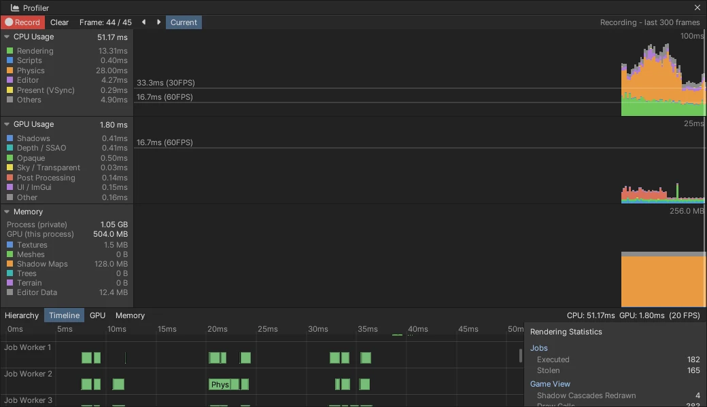

# 물리 ↔ 렌더링 겹치기 (Simulate During Rendering)

프레임의 마지막 고정 스텝을 Job System 일꾼에서 시뮬레이션하고, 그동안 메인 스레드는 프레임의 나머지를 계속합니다.
나머지는 2D 물리 · 에디터 · 오디오 · 입자 · UI · 컬링 · 렌더링입니다.
결과는 무잠금 핑퐁 버퍼로 넘어와 다음 프레임 시작 (스크립트 Update 앞) 에 적용됩니다.
동시성 로드맵 3 단계입니다 ([CONCURRENCY_ROADMAP](CONCURRENCY_ROADMAP.md)).

## 켜기

- **Project Settings > Physics > Simulate During Rendering** (`ProjectSettings/PhysicsSettings.json` 의 `asyncSimulation`).
  - 기본은 꺼짐이다. Unity 는 같은 프레임에 물리 뒤의 자리를 그린다.
- CLI: `nova physics --async true|false`. `nova physics` 의 `async` 에서 비동기 스텝 수 · 프레임 시작에 적용한 수 · 일찍 (물리 API 때문에) 끝낸 수 · 기다린 시간을 본다.
- 검사: `NOVA_PHYSICS_ASYNC=1` 이면 설정과 상관없이 켠다. 기존 물리 스위트를 겹치기 모드로 돌릴 때 쓴다.

## 순서

| | 꺼짐 (메인 스레드) | 켬 (겹치기) |
|---|---|---|
| 프레임 N | Update → FixedUpdate → **시뮬레이션** → 바디 → Transform · OnCollision → 렌더 | Update → FixedUpdate → 바디 동기화 → **시뮬레이션 잡 시작** → 렌더 (일꾼은 시뮬레이션) |
| 프레임 N+1 시작 | — | 잡을 기다림 (보통 이미 끝남) → 바디 → Transform · OnCollision · 보간 → Update … |

- 스크립트가 보는 순서는 같다: FixedUpdate → (시뮬레이션) → 충돌 · 트리거 이벤트 → 다음 Update.
- 그려지는 그림은 물리보다 한 스텝 늦다.
- 한 프레임에 스텝이 여러 개면 앞의 스텝은 그대로 메인에서 돌고, 마지막 하나만 겹친다.

## 구조 (`Source/Physics/PhysicsManager.cpp`)

**스텝을 셋으로 나눔**
- `StepBegin` (메인): FixedUpdate · 바디 동기화 · Transform → 바디.
- `SimulateAndCapture` (메인 또는 일꾼): Jolt 스텝을 돌린 뒤, 동적 바디의 자리 · 회전을 **핑퐁 버퍼**의 뒤 칸에 쓰고 `front` 를 원자 교환한다. 메인은 Jolt 를 다시 읽지 않는다.
- `StepEnd` (메인): Joint 끊어짐 · 앞 칸 → Transform · 충돌 이벤트.

**기다림 · 마무리**
- `CompleteAsync()` 를 부르는 곳:
  - App 이 프레임 시작에.
  - 모든 물리 API (Raycast · AddForce · 천 · Character Controller · Joint …, 35 개) 가 들어올 때. 진행 중인 스텝과 물리 월드를 함께 만지지 않게 한다.
  - `Scene::FlushDestroyed` 가 지운 오브젝트를 해제하기 전에.
- 마무리 중의 스크립트 (OnCollision) 가 물리 API 를 불러도 다시 들어오지 않는다. 대기 표시를 먼저 내린다.

**접촉**
- Jolt 가 일꾼들에서 알리는 접촉은 **무잠금 MPMC 링** (32768) 에 넣는다. 예전에는 뮤텍스였다.
- 한 스텝에 그보다 많으면 드물게 잠근 목록으로 받는다 (잃지 않는다).

**Jolt 잡**
- 2 단계부터 Nova Job System 위에서 돈다 (`JoltNovaJobSystem.h` — 스레드 풀 하나).

## 검사

`Tools/tests/run_tests.ps1 -Only physicsasync` (4 항목):

| 검사 | 결과 |
|------|------|
| 설정 저장 | Project Settings 에 저장된다 |
| 공 하나 + 상자 다섯 쌓기 | 켬 · 끔에서 **같은 자리**에 멈춘다 (공 y 0.495 / 0.495, 맨 위 상자 4.497 / 4.497) |
| 비동기 스텝 158 개 | 모두 다음 프레임 시작에 적용됐다 (물리 API 때문에 일찍 끝낸 것 0, 기다린 시간 합 0.1 ms) |
| 떨어지는 상자 800 개 | 메인 스레드의 물리 시간 15.5 → 8.5 ms (Debug) |

기존 물리 스위트 (physics · cloth · ragdoll · wheel) 는 `NOVA_PHYSICS_ASYNC=1` 로도 모두 통과한다.

## 아직

- 스텝이 여러 개인 프레임: 앞 스텝도 겹치기 (FixedUpdate 를 스텝마다 메인에서 불러야 해서 지금은 마지막만)
- 겹치는 동안의 Raycast: 앞 칸 (지난 스텝) 으로 답하기 — 지금은 스텝을 끝내고 답한다
- 2D 물리 (Box2D) 겹치기
