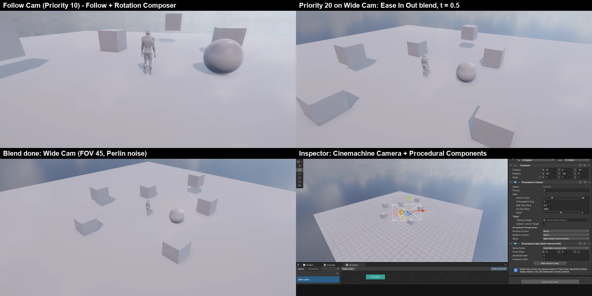

# Cinemachine (가상 카메라 · 섞기 · 흔들림)

**Cameras 패키지 (`com.nova.cameras`)** 에 들어 있는 Unity **Cinemachine 3** 와 같은 이름 · 구조의 카메라 시스템입니다. 가상 카메라를 여럿 두면 **Cinemachine Brain** 이 Priority 로 하나 (Live) 를 골라 실제 Camera 를 움직이고, 바뀔 때 부드럽게 **섞습니다**. 위치 · 회전은 가상 카메라에 붙인 단계 컴포넌트가 정하고, **흔들림** (Perlin 노이즈) · **충격** (Impulse) 은 출력에만 더해집니다.



## 쓰는 법

1. `nova package add com.nova.cameras` (또는 Window > Package Manager)
2. **GameObject > Cinemachine >** — Hierarchy 에서 따라갈 오브젝트를 고르고 (또는 오른쪽 클릭) 만들면 그것이 Tracking Target 이 됩니다. Main Camera 에 Cinemachine Brain 이 없으면 붙입니다
   - **Cinemachine Camera**: 빈 가상 카메라 (Transform 그대로 — 고정 카메라)
   - **Targeted Cameras > Follow Camera**: Follow + Rotation Composer (대상 뒤를 따라가며 화면 가운데에)
   - **Targeted Cameras > FreeLook Camera**: Orbital Follow (세 고리, World Space) + Rotation Composer — 마우스로 돌리려면 C# **Cinemachine Input Axis Controller** 를 붙입니다
   - **Targeted Cameras > Third Person Aim Camera**: Third Person Follow (벽 피하기 켬) — 대상 (예: 플레이어의 카메라 루트) 을 돌리면 그 방향을 봅니다
3. 가상 카메라마다 **Priority**. 가장 높은 켜진 것이 Live (같으면 가장 늦게 켜진 것). 끄거나 · Priority 를 바꾸거나 · `Prioritize()` 하면 Brain 이 섞어서 옮깁니다
4. 편집 중에도 Main Camera 가 Live 가상 카메라의 모습을 그대로 보여 줍니다 (섞기 · 흔들림은 Play 에서만)

## 컴포넌트

| 컴포넌트 | 단계 | 하는 일 |
|------|------|------|
| **Cinemachine Brain** | — (Camera 에) | Live 고르기, Default Blend (모양 · 시간), Custom Blends (From → To 이름, `**ANY CAMERA**`), 상태 표시 |
| **Cinemachine Camera** | — | Priority, Lens (Field Of View · Orthographic Size · Near · Far · Dutch), Tracking Target · Look At Target, Procedural Components (Position · Rotation Control · Noise 를 Inspector 에서 고른다) |
| Cinemachine Follow | Position | 대상 + Follow Offset. **Binding Mode** (Lock To Target On Assign · With World Up · No Roll · Lock To Target · World Space · Lazy Follow), Position · Rotation Damping |
| Cinemachine Orbital Follow | Position | 대상 둘레의 **구** (Radius) 또는 **세 고리** (Top · Center · Bottom 의 높이 · 반지름, Spline Curvature). 축 Horizontal (도) · Vertical · Radial (값 · 범위 · Wrap · Center) |
| Cinemachine Third Person Follow | Position | 대상 → 어깨 (Shoulder Offset, Camera Side) → 손 (Vertical Arm Length) → 카메라 (Camera Distance). Damping, **Avoid Obstacles** (Collision Filter · Ignore Tag · Camera Radius · Damping Into / From Collision). 회전은 대상의 회전 |
| Cinemachine Rotation Composer | Rotation | 보는 대상을 **Screen Position** 에 (가운데 0, 가장자리 ±0.5, y + = 아래). Damping, Dead Zone, Hard Limits, Center On Activate, Target Offset |
| Cinemachine Hard Look At | Rotation | 대상을 화면 가운데에 바로 |
| Cinemachine Rotate With Follow Target | Rotation | Tracking Target 의 회전을 따라 (Damping) |
| Cinemachine Basic Multi Channel Perlin | Noise | 손에 든 카메라 · 흔들림. **Noise Profile** (6D Shake · Handheld_normal / tele / wideangle _mild · _strong · _extreme), Amplitude · Frequency Gain, Pivot Offset |
| Cinemachine Impulse Source | — (아무 오브젝트) | `GenerateImpulse…()` 로 충격. Impulse Shape (Recoil · Bump · Explosion · Rumble), Duration, Impulse Type (Uniform · Dissipating · Propagating), Default Velocity, Inspector 의 Invoke 단추 |
| Cinemachine Impulse Listener | 확장 | 같은 채널의 충격만큼 가상 카메라 출력을 흔든다 (Gain, Use Camera Space, Use 2D Distance) |

**Blend 모양**: Cut · Ease In Out (기본, 2 초) · Ease In · Ease Out · Hard In · Hard Out · Linear. 섞는 동안 위치는 직선, 회전은 구면 보간, 렌즈 (시야각 · 기울임 · 면) 는 직선. 섞는 중에 또 바뀌면 **지금 화면에서** 새로 섞습니다 (튀지 않음, 정보에 `Mid-Blend`).

## C#

`using NovaEngine.Cinemachine;` (Unity 의 `Unity.Cinemachine` 과 같은 이름)

```csharp
var cam = GetComponent<CinemachineCamera>();
cam.Priority = 20;                    // 섞기 시작
cam.Lens.FieldOfView = 40f;           // 바로 쓰인다
cam.Follow = player.transform;
cam.Prioritize();

var orbit = GetComponent<CinemachineOrbitalFollow>();
orbit.HorizontalAxis.Value += 30f;

var brain = Camera.main.GetComponent<CinemachineBrain>();
brain.DefaultBlend = new CinemachineBlendDefinition(CinemachineBlendDefinition.Styles.EaseInOut, 1.5f);
Debug.Log(brain.ActiveVirtualCamera.name + " " + brain.IsBlending);

GetComponent<CinemachineImpulseSource>().GenerateImpulse(2f);   // 맞았을 때 · 착지 · 폭발
GetComponent<CinemachineBasicMultiChannelPerlin>().AmplitudeGain = 3f;
```

- Unity 와 다른 점: 묶음 설정 (`Lens` · `Target` · `TrackerSettings` · `Composition` · 축 · `AvoidObstacles` · `ImpulseDefinition`) 이 struct 가 아니라 **바로 쓰이는 class** 입니다 — `cam.Lens.FieldOfView = 40` · `orbit.HorizontalAxis.Value += 10` 이 그대로 됩니다. `Priority` 는 int 로 (`cam.Priority = 10`, `int p = cam.Priority`). Noise Profile 은 에셋 대신 열거형 `NoiseProfiles`
- **Cinemachine Input Axis Controller** (C# MonoBehaviour): Mouse X → 가로 축, Mouse Y → 세로 축, 휠 → 거리 (Gain · Invert Y · 누르고 있을 Mouse Button)

## CLI

```bash
nova cinemachine info                                   # Brain (Live · 섞기 from / to / t · 출력 자세) · 가상 카메라 (Priority · 자세 · 보정 · 단계)
nova cinemachine create --kind follow --target Player   # camera | follow | freelook | thirdperson (GameObject 메뉴와 같다)
nova cinemachine priority CamB --value 20               # Play 중에도 (set 은 Play 중에 막혀 있다)
nova cinemachine prioritize CamA
nova cinemachine enable CamA --value false
nova cinemachine axis Free --horizontal 90 --vertical 45
nova cinemachine blend --style Linear --time 1          # Default Blend, --from A --to B 면 Custom Blend
nova cinemachine impulse Boom --force 2
```

## 동작 (엔진 안)

- Brain 의 LateUpdate (편집 중에는 `_Editor_Update` — 엔진의 Unity `[ExecuteAlways]` 같은 편집 중 갱신): 모든 켜진 가상 카메라를 갱신 → Live 고르기 → 섞기 → Camera 의 Transform · 시야각 · 면 · 직교 크기에 쓴다 (편집 중에는 바뀔 때만)
- 가상 카메라 갱신: Transform 에서 시작 → Body → Aim → Noise → 확장. **원래 자세는 가상 카메라 Transform 에 남고** (Scene 에서 가상 카메라가 따라 움직인다), 흔들림 · 충격 · 기울임은 출력에만
- 따라가기는 Unity `Damper.Damp` 와 같다: Damping 초에 99 % (프레임 수와 무관)
- 처음 · 다시 켜진 프레임 · 편집 중은 따라가기 없이 바로 (Unity `PreviousStateIsValid = false`)
- 파일: `Packages/com.nova.cameras/Source/Cinemachine*.{h,cpp}`, `Package.cpp` (메뉴 · CLI · C# 함수), `Runtime/Cinemachine.cs`

## 검사

`Tools/tests/run_tests.ps1 -Only cinemachine` (19 항목, 창 없는 편집기 + CLI 만): 메뉴가 Brain 을 붙임, 편집 중 Main Camera = Live (Follow 오프셋), 같은 Priority 면 늦게 켜진 것 · Prioritize · 높은 Priority,
Orbital Follow 세 고리 (−4, 2.75, 0) · 위 고리 · 구 (−7.07, 7.57, 0) · Composer 가 대상을 봄, Third Person Follow (0.5, 0.5, −2) · 대상이 90 도 돌면 (−2, 0.5, −0.5), 씬 저장 · 열기,
Play: Ease In Out 2 초 섞기 (중간에 위치 · 시야각이 사이), 끝나면 출력 그대로, Perlin 은 출력만, Mid-Blend 다시 섞기 (튀지 않음), Custom Blend Cut, 충격 (아래로 −1.9 → 0), 벽 앞으로 당기기 (−2 → −0.9),
Follow 따라가기 (3 m/s 대상보다 0.56 m 늦음), C# API, 끄면 다음 카메라로.

## 아직 · 한계

- Spline Dolly · Target Group · Clear Shot · State-Driven Camera · Sequencer · Mixing Camera · Confiner · Deoccluder (일반 가상 카메라용 벽 피하기) · Third Person Aim 의 조준점 · Group Framing 은 아직
- Blend Hint (Spherical Position · Inherit Position …) · Custom 곡선 · Noise Settings 에셋 (직접 만든 프로필) · 충격의 2 차 반응 (Reaction Settings) · Channel 이름 에셋은 아직
- Brain 의 Update Method 는 LateUpdate 만 (물리 갱신이 LateUpdate 뒤라 Rigidbody 를 따라갈 때는 한 프레임 늦다), Time.timeScale 은 엔진에서 늘 1
- 게임 뷰의 구도 가이드 (Dead Zone · Hard Limits 사각형) 는 아직 — Scene 뷰에는 가상 카메라 절두체 (Live = 빨강) 를 그린다
