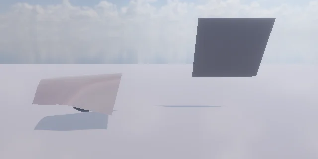

# 천 — Cloth

Unity 의 Cloth 와 같은 쓰임: 메시가 있는 오브젝트 (Plane 등 — Mesh Filter) 에 **Add Component > Physics > Cloth**. Play 하면 그 메시가 천이 된다
([Jolt](https://github.com/jrouwe/JoltPhysics) Soft Body). 장면의 콜라이더 (상자 · 구 · 캡슐 · 메시 · 지형 · Rigidbody) 와 부딪힌다.

<p align="center"><br/><sub>구 위로 떨어져 덮인 천 · 위쪽 가장자리를 고정하고 바람을 받은 커튼</sub></p>

## 항목

| 항목 | 기본 | 내용 |
|---|---|---|
| Stretching Stiffness | 1 | 0 ~ 1 (1 = 늘지 않음) |
| Bending Stiffness | 0 | 0 ~ 1 (0 = 잘 접힌다) |
| Use Gravity | 켬 | |
| Damping | 0 | 0 ~ 1 (출렁임이 가라앉는 빠르기) |
| External Acceleration | 0 | 바람 (m/s², 모든 움직이는 정점에) |
| Random Acceleration | 0 | 출렁이는 바람 (축마다 ± 크기, 천천히 바뀐다) |
| Friction | 0.5 | 콜라이더와의 마찰 |
| Thickness | 0.02 | 콜라이더에서 떨어지는 거리 (m) |
| Cloth Solver Frequency | 120 | 반복 수 = ÷ 20 |
| Pin | None | **Top Edge** = 가장 높은 정점 줄, **Top Corners** = 그 줄의 양 끝 (+ `pinnedVertices` 로 고른 정점) |

고정점은 오브젝트를 따라간다 (나머지가 끌려온다). 한 스텝에 1 m 넘게 옮기면 (순간 이동) 천 전체가 같이 옮겨 휘날리지 않는다 — 직접 부르려면 `ClearTransformMotion()`.
자기 오브젝트의 콜라이더 (Plane 의 Mesh Collider 등) 와 트리거는 부딪히지 않는다.

```csharp
var cloth = GetComponent<Cloth>();
cloth.externalAcceleration = new Vector3(0, 0, 6);   // 바람
cloth.randomAcceleration = new Vector3(0, 0, 2);
Vector3[] v = cloth.vertices;                         // 메시 정점마다 지금 위치 (로컬)
```

C#: `stretchingStiffness · bendingStiffness · useGravity · damping · friction · thickness · clothSolverFrequency · pin (ClothPinMode) ·
externalAcceleration · randomAcceleration · isSimulating · vertices · ClearTransformMotion()`.

## 계산

`Source/Scene/Cloth.cpp` · `PhysicsManager::CreateCloth · DriveCloth · ShiftCloth · GetClothVertices`:
1. 메시 정점을 위치로 묶는다 (이음매 · 법선이 다른 같은 자리 정점은 하나) → Soft Body 정점 + 삼각형 → 늘어남 · 비틀림 · 접힘 (dihedral) 구속,
   고정점이 있으면 LRA (고정점에서 처음 거리보다 멀어지지 않게 — 늘어짐 방지)
2. 고정 스텝마다 고정점을 오브젝트 자리로 (속도 = 옮긴 만큼), 바람 가속을 더한다
3. 그리기: 메시 사본 (이 오브젝트만) 의 정점 · 법선 · 접선을 프레임마다 고쳐 동적 정점 버퍼에 (`MeshGeometry::UpdateVertices` — 원래 메시 파일은 그대로)

## 검사

`Tools/tests/run_tests.ps1 -Only cloth` — 2 x 2 m 천이 구 위로 떨어져 덮인다 (가운데 = 구 꼭대기, 구 안 · 바닥 아래 없음, 자기 Mesh Collider 무시),
커튼 (위쪽 고정 + 바람): 고정점 그대로 · 천은 바람 쪽으로, 오브젝트를 2 m 순간 이동 → 천이 같이 (휘날리지 않음), C# API (4 항목).

## 아직 없는 것

정점마다 칠하는 고정 · 최대 거리 (Unity 의 Cloth Constraints 붓), 자기 충돌 · 천끼리 충돌, Skinned Mesh 위의 천 (캐릭터 옷), 고를 콜라이더만 (지금은 장면 전체).
