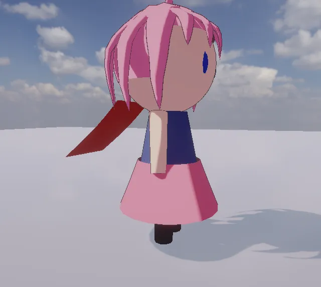

# 천 — Cloth

Unity 의 Cloth 와 같은 쓰임: 메시가 있는 오브젝트 (Plane 등 — Mesh Filter, 또는 캐릭터의 치마 · 망토 — Skinned Mesh Renderer) 에 **Add Component > Physics > Cloth**. Play 하면 그 메시가 천이 된다
([Jolt](https://github.com/jrouwe/JoltPhysics) Soft Body). 장면의 콜라이더 (상자 · 구 · 캡슐 · 메시 · 지형 · Rigidbody) 와 부딪힌다.

<p align="center"><br/><sub>구 위로 떨어져 덮인 천 · 위쪽 가장자리를 고정하고 바람을 받은 커튼</sub></p>

## 항목

| 항목 | 기본 | 내용 |
|---|---|---|
| Stretching Stiffness | 1 | 0 ~ 1 (1 = 늘지 않음) |
| Bending Stiffness | 0 | 0 ~ 1 (0 = 잘 접힌다) |
| Use Gravity | 켬 | |
| Damping | 0 | 0 ~ 1 (출렁임이 가라앉는 빠르기) |
| External Acceleration | 0 | 바람 (m/s², 모든 움직이는 정점에) |
| Random Acceleration | 0 | 출렁이는 바람 (축마다 ± 크기, 천천히 바뀐다) |
| Friction | 0.5 | 콜라이더와의 마찰 |
| Thickness | 0.02 | 콜라이더에서 떨어지는 거리 (m) |
| Cloth Solver Frequency | 120 | 반복 수 = ÷ 20 |
| Pin | None | **Top Edge** = 가장 높은 정점 줄, **Top Corners** = 그 줄의 양 끝 (+ `pinnedVertices` 로 고른 정점) |

고정점은 오브젝트를 따라간다 (나머지가 끌려온다). 한 스텝에 1 m 넘게 옮기면 (순간 이동) 천 전체가 같이 옮겨 휘날리지 않는다 — 직접 부르려면 `ClearTransformMotion()`.
자기 오브젝트의 콜라이더 (Plane 의 Mesh Collider 등) 와 트리거는 부딪히지 않는다.

```csharp
var cloth = GetComponent<Cloth>();
cloth.externalAcceleration = new Vector3(0, 0, 6);   // 바람
cloth.randomAcceleration = new Vector3(0, 0, 2);
Vector3[] v = cloth.vertices;                         // 메시 정점마다 지금 위치 (로컬)
```

C#: `stretchingStiffness · bendingStiffness · useGravity · damping · friction · thickness · clothSolverFrequency · pin (ClothPinMode) ·
externalAcceleration · randomAcceleration · isSimulating · vertices · coefficients (ClothSkinningCoefficient[]) · ClearTransformMotion()`.

## 캐릭터 옷 (Skinned Mesh Renderer)

<p align="center"><br/><sub>망토 (어깨 줄 고정 · 바람) 와 치마 (허리 고정 · 뒤 막이) — 모델 편집기로 만든 치비</sub></p>

Unity 처럼 Cloth 를 **Skinned Mesh Renderer** 가 있는 오브젝트 (치마 · 망토처럼 따로 나눈 메시) 에 붙이면 천이 뼈대를 따라간다:
천 정점마다 그 메시의 본 가중치로 **피부 자리** (애니메이션 자세 — 엔진 GPU 스키닝과 같은 선형 블렌드) 를 스텝마다 다시 계산하고,

| `coefficients[i]` (천 정점마다) | 기본 | 내용 |
|---|---|---|
| `maxDistance` | 제한 없음 (`float.MaxValue`) | 피부 자리에서 벗어날 수 있는 거리 (m). **0 = 피부에 붙음** (고정) |
| `collisionSphereDistance` | 제한 없음 | 피부 안쪽으로 들어갈 수 있는 거리 (뒤 막이) — 0 ~ 수 cm 로 두면 치마가 다리 · 안의 옷을 뚫지 않는다 |

Pin (Top Edge · Top Corners · `pinnedVertices`) 은 `maxDistance = 0` 과 같다 — 치마는 **Top Edge** (허리 줄), 망토는 Top Edge (어깨 줄) 가 보통.
천 정점 = 같은 자리 메시 정점을 하나로 묶은 것 (`coefficients.Length`, Play 전에도 읽고 쓸 수 있다). 순간 이동 (1 m 넘게 · `ClearTransformMotion`) 은 천 전체를 피부 자리로.

```csharp
// 망토: 어깨 줄은 Pin 으로, 나머지는 피부에서 30 cm 까지만 (뒤집혀 머리로 넘어가지 않게)
var cape = GameObject.Find("Cape").GetComponent<Cloth>();
var k = cape.coefficients;
for (int i = 0; i < k.Length; i++) k[i].maxDistance = 0.3f;
cape.coefficients = k;
// 치마: 안쪽으로 1 cm 넘게 들어가지 않게 (뒤 막이)
var skirt = GameObject.Find("Skirt").GetComponent<Cloth>();
var s = skirt.coefficients;
for (int i = 0; i < s.Length; i++) s[i].collisionSphereDistance = 0.01f;
skirt.coefficients = s;
```

모델 편집기 예제 [model_chibi_cloth.txt](examples/model_chibi_cloth.txt) — 치비 (`model_chibi.txt`) 에 치마 (뚜껑 없는 원뿔대) 와 망토 (판) 를 더하고
리깅 (치마 = Hips, 망토 = Chest 한 본 — 흔들림은 천이 맡는다) → `export *.vrm` → `nova create character --model …` → Skirt · Cape 에 Cloth.

## 계산

`Source/Scene/Cloth.cpp` · `PhysicsManager::CreateCloth · DriveCloth · ShiftCloth · GetClothVertices`:
1. 메시 정점을 위치로 묶는다 (이음매 · 법선이 다른 같은 자리 정점은 하나) → Soft Body 정점 + 삼각형 → 늘어남 · 비틀림 · 접힘 (dihedral) 구속,
   고정점이 있으면 LRA (고정점에서 처음 거리보다 멀어지지 않게 — 늘어짐 방지)
2. 고정 스텝마다 고정점을 오브젝트 자리로 (속도 = 옮긴 만큼), 바람 가속을 더한다
3. 그리기: 메시 사본 (이 오브젝트만) 의 정점 · 법선 · 접선을 프레임마다 고쳐 동적 정점 버퍼에 (`MeshGeometry::UpdateVertices` — 원래 메시 파일은 그대로)

스킨 (Skinned Mesh Renderer) 은 Jolt 의 skinned constraint (`PhysicsManager::CreateCloth` 의 `ClothSkin` · `SkinCloth`):
1. rest 모양 = 바인드 자세 (메시 노드 · 단위 변환 → 이 오브젝트 → 월드), 역바인드 = 그 역행렬 하나, 본 행렬 = 렌더러 팔레트 × 오브젝트 월드
   → 피부 자리 = Σ 가중치 × 본 × 역바인드 × rest = GPU 스키닝과 같은 값. 처음엔 모든 정점을 지금 자세의 피부 자리로 (`hardSkinAll`)
2. `maxDistance` 0 = 키네마틱 (피부 자리), 나머지는 그 반지름 안으로, 뒤 막이 = 피부 법선 뒤 (반지름 1 m 구) — 삼각형 감김을 메시 법선 (바깥) 과 맞춘다
3. 그리기: 렌더러 (`SkinnedMeshRenderer::SetSimulatedVertices`) 가 천 정점 (이 오브젝트 공간) 을 동적 정점 버퍼에 — 정점은 팔레트 끝에 더한 단위 본 하나에 묶어 같은 셰이더 (lilToon 포함) 로 그린다

## 검사

`Tools/tests/run_tests.ps1 -Only cloth` — 2 x 2 m 천이 구 위로 떨어져 덮인다 (가운데 = 구 꼭대기, 구 안 · 바닥 아래 없음, 자기 Mesh Collider 무시),
커튼 (위쪽 고정 + 바람): 고정점 그대로 · 천은 바람 쪽으로, 오브젝트를 2 m 순간 이동 → 천이 같이 (휘날리지 않음), C# API (4 항목).
`-Only clothskin` — 모델 편집기로 치마 · 망토 치비 (VRM) → 캐릭터, C# coefficients, 치마 허리는 피부에 · 나머지는 늘어짐, 망토 maxDistance 3 cm (바람에도),
치마 뒤 막이 2 cm (흔들어도 안쪽으로 2 cm 안), 캐릭터를 3 m 순간 이동 → 치마가 같이 (6 항목).

## 아직 없는 것

Inspector 에서 정점마다 칠하는 고정 · 최대 거리 (Unity 의 Cloth Constraints 붓 — 지금은 C# `coefficients` · Pin), 자기 충돌 · 천끼리 충돌,
고를 콜라이더만 (Unity 의 capsuleColliders · sphereColliders — 지금은 장면 전체), 스킨 천의 BlendShape (천이 켜지면 BlendShape 정점 대신 천 정점).
