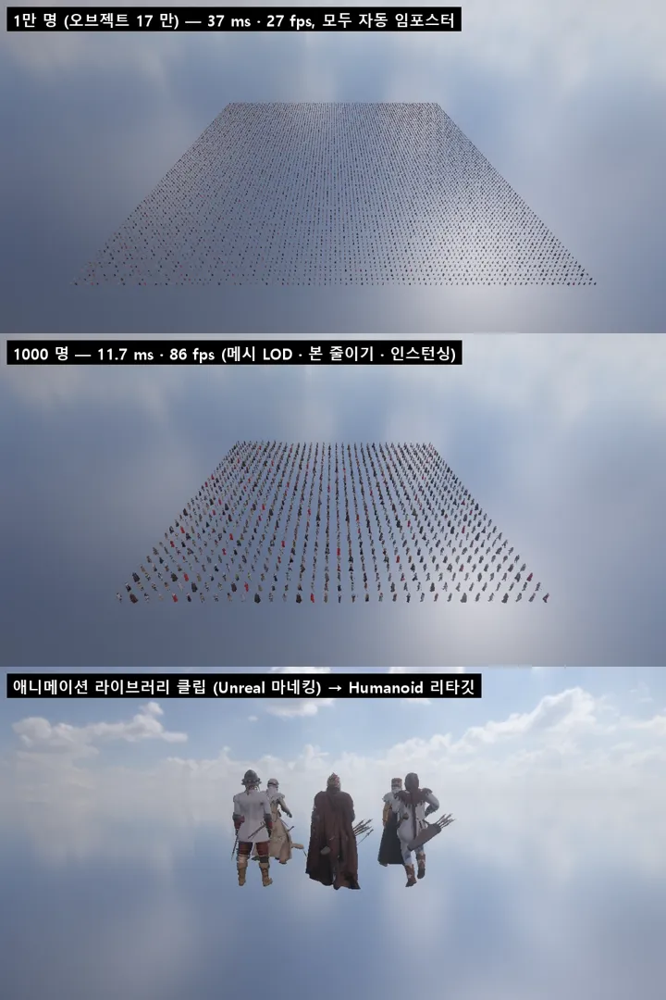

# 군중 (애니메이션 캐릭터 대량 배치)

애니메이션 캐릭터 (FBX · 프리팹) 를 씬에 1000 개, 10000 개 놓아도 **따로 설정하지 않고** 최적화가 적용됩니다. 토탈 워 · Unreal City Sample (Mass) 같은 대규모 군중 기법을 엔진 기본 동작으로 넣었습니다. 전투 전용 셰이더나 군중 전용 컴포넌트가 없고, 보통의 Skinned Mesh Renderer · Animator 가 그대로 이 경로를 탑니다.



## 무엇이 자동으로 되나

| 단계 | 하는 일 | 기본 |
|---|---|---|
| **Auto LOD** (메시 단순화) | 화면 높이 (캐릭터 스켈레톤 크기 기준 — 부위가 작아도 캐릭터 단위) 로 LOD 0 ~ 3 을 고른다. LOD 는 meshoptimizer 로 부위 (서브셋) 마다 단순화 (삼각형 100 · 30 · 10 · 3.5 %), 단계마다 쓰는 정점만 모은 정점 버퍼 | 켬 (Skinned Mesh Renderer 의 Auto LOD) |
| **Skeletal LOD** (본 줄이기) | 먼 캐릭터는 본 수를 줄인다: LOD 2 = 사람 본 12 개, LOD 3 = 7 개 + 정점마다 본 하나. 빠진 본 (손가락 · 트위스트 · 천 · 얼굴) 의 가중치는 남는 가장 가까운 조상으로. Animator 는 그 단계에서 쓰는 본만 계산 | 켬 |
| **임포스터** | 아주 멀면 (화면 높이 3.5 % 아래) 메시 대신 그림 한 장 — 재생 중인 클립을 8 방향 × 8 프레임으로 구운 아틀라스 (처음 필요할 때 자동으로 굽는다). Animator · Animation 이 렌더러에 클립 · 시간을 알려 준다 | 켬 |
| **GPU 인스턴싱** | 같은 메시 (LOD) · 재질 · 레이어의 캐릭터를 한 번에 그린다. 본 팔레트는 구조 버퍼 하나에 모으고 (이번 · 지난 프레임 두 벌 — 모션 벡터), 인스턴스 = 월드 · 팔레트 자리 · 임포스터 줄 | 켬 (깊이 · 본 · 그림자 · SSAO 깊이 · 모션 벡터 패스, Alpha Clipping 재질 포함) |
| **부위 합치기** | 모듈형 캐릭터 (한 부모 밑 같은 스켈레톤 부위 17 개) 를 Play 시작에 한 메시로 합친다 (팔레트 ≤ 255). 합쳐진 부위는 컬링 · 그리기 · 자세 목록에서 빠진다 | Play 에서 |
| **애니메이션** | 상태 머신은 Update, 자세 계산은 모든 Update 뒤 작업 스레드에서 한 번에. 화면에 작으면 덜 자주 (LOD 2 · 3 · 임포스터 = 2 · 4 · 8 프레임에 한 번, 캐릭터마다 엇갈려), 임포스터로만 그리고 그림자에도 안 보이면 자세를 계산하지 않는다 (메시로 돌아오면 바로). Culling Mode (Unity) 그대로 | 켬 |

한 캐릭터만 끄려면 Skinned Mesh Renderer 의 **Auto LOD** 를 끕니다 (씬에는 끈 경우만 `autoLod: false` 로 저장).

## 결과 (Release, GTX 1660 SUPER)

| 장면 | 처음 | 지금 |
|---|---|---|
| 기본 캐릭터 1000 명 | 64.9 ms | 6.5 ms |
| TheTalesFactory 모듈형 캐릭터 (부위 17 개) 1000 명 | 58 ms | 11.7 ms (86 fps) |
| 같은 캐릭터 3000 명 | — | 23.5 ms (42 fps) |
| 같은 캐릭터 10000 명 (오브젝트 17 만 개, 모두 임포스터) | 284 ms | **37 ms (27 fps)**, GPU 4 ~ 9 ms |

10000 명에서 남은 CPU (37 ms): 깊이 프리패스 10 (인스턴스 모으기 · 팔레트), 컴포넌트 Update 5.7 (Animator 1 만 개), 컬링 갱신 4.6, 본 패스 4.8, 모션 벡터 3.9.

편집기 작업 (10000 명):

| | 처음 | 지금 |
|---|---|---|
| `crowd spawn` | 38.6 s | 16.8 s |
| Play | (스냅숏 · 자동 저장 · Undo 직렬화 3 번) | 2.3 s |
| Stop | 88 s + 그 뒤 90 s 멈춤 | 29 s (JSON 읽기 8 · 오브젝트 만들기 18 · 지우기 3) |

## 큰 씬에서 고친 것 (오브젝트 17 만 개)

군중을 재 보니 캐릭터가 아니라 **오브젝트 수에 비례하거나 제곱인 엔진 경로**가 대부분이었습니다.

- 프레임마다
  - Update · LateUpdate · `_Editor_Update` 는 업데이트할 컴포넌트가 있는 오브젝트만 (`Scene::UpdateList` — Transform · 렌더러 · Mesh Filter 는 `Component::SkipUpdate`)
  - 컬링의 살아 있는 자리만 도는 목록 (합쳐진 부위 15 만 자리가 비어 있었다), Mesh Batcher 의 Mesh Renderer 목록 캐시 (프레임마다 GetComponent 17 만 번)
  - Scene 카메라의 옛 절두체 컬링 (모든 오브젝트를 복사해 걸렀지만 결과를 아무도 안 읽었다 — 52 ms)
  - 물리 1 초마다 전체 훑기 · FixedUpdate 목록에서 렌더러만 있는 오브젝트를 뺌, LateUpdate 의 `IsAlive` (잠금 + 해시) 는 지운 오브젝트가 있을 때만
  - Animator: 그리는 렌더러 (합쳐진 부위 제외) 목록 캐시, 렌더러가 지워졌는지는 물리 번호가 바뀔 때만 확인
  - 인스턴싱: 깊이 프리패스와 본 패스가 같은 묶음 · 인스턴스 버퍼를 같이 쓰고, 묶음 키 · 인스턴스 쓰기는 병렬
- Play · Stop
  - Play 스냅숏을 Undo 의 루트 문자열 캐시에서 (바뀐 루트만 직렬화), 자동 저장도 같은 문자열 — Stop 뒤 Undo 기준은 그 스냅숏 그대로
  - Undo 가 돌아가며 다시 직렬화하는 양을 오브젝트 수로 제한 (루트가 적고 크면 확정마다 씬 전체였다)
  - 씬 불러오기: 프리팹 인스턴스 (부모 밑도) 를 병렬로 에셋과 합침, 에셋 파일 시각은 1 초에 한 번, 메시 바인드 · 바인드 자세 상자 · 바인드 자세 행렬을 메시 · 스켈레톤마다 한 번
  - 오브젝트 목록의 제곱 경로 (등록 · 지우기 · 떼기 · `~Scene`) → 오브젝트 표시 (`GameObject::SceneListed` · `PendingDelete`) + 한 번에 지우기
  - 제목 줄의 "저장 안 됨" 검사가 0.25 초마다 씬 전체를 직렬화하던 것 (Undo 기준이 없을 때) — 큰 씬은 지난 값
- 그 밖: `SceneCulling::Stamp` 등이 헤더 `inline` 변수라 패키지 DLL 이 자기 사본을 봤다 (Animator 의 Culling Mode 가 늘 "안 보임") → NovaCore 하나로 내보냄

## 참고한 기법

- GPU Gems 3, 2 장 "Animated Crowd Rendering" (Dudash, NVIDIA) — 본 팔레트를 텍스처 · 버퍼에 두고 인스턴싱: https://developer.nvidia.com/gpugems/GPUGems3/gpugems3_ch02.html
- Beacco et al., "A Survey of Real-Time Crowd Rendering" (Computer Graphics Forum 2016) — LOD · 임포스터 · 인스턴싱의 조합: https://diglib.eg.org/handle/10.1111/cgf12774
- Kavan et al., "Polypostors: 2D Polygonal Impostors for 3D Crowds" (I3D 2008) — 애니메이션 임포스터
- Unreal Engine City Sample · Mass Entity · MetaHuman 군중 — 먼 캐릭터의 본 수 줄이기 · 애니메이션 갱신 빈도 줄이기 · 정점 애니메이션 임포스터
- vkguide "GPU Driven Rendering" — 컴퓨트 컬링 (아직 넣지 않음, 아래)

## CLI (`nova crowd`)

```
nova crowd spawn --count 1000 [--spacing 2] [--origin x,y,z] [--model <fbx>] [--controller <.controller>] [--prefabs <폴더 또는 .prefab>] [--lod true|false]
nova crowd info          # 캐릭터 · 렌더러 · 합쳐진 부위 · 보임 · LOD 별 수 · 단계별 삼각형 · 본 · 인스턴싱 통계
nova crowd lod --on true|false [--bias 1] [--force -1..4] [--impostors true|false] [--impostorScreen 0.035]
nova crowd instancing --on true|false
nova crowd clear
```

## 아직 (다음 후보)

- GPU 컬링 · 인스턴스 모으기 (컴퓨트) — 지금은 CPU 가 1 만 개를 모은다 (깊이 프리패스 10 ms)
- Stop 의 오브젝트 다시 만들기 (17 만 개 18 s) — JSON 대신 이진 스냅숏, 또는 Play 가 씬을 복제
- 임포스터 빛: 구울 때의 노멀로 다시 비추지만 그림자는 받지 않는다
- 애니메이션 상태 머신을 데이터 지향으로 (Animator 1 만 개 Update 5.7 ms)

## 파일

- `Source/Animation/SkinnedLod.*` — 메시 LOD · 본 줄이기 (meshoptimizer, `ThirdParty/meshoptimizer`)
- `Source/Scene/SkinnedInstancing.*`, `Shaders/66. SkinInstancing.fx` (공용 include), `32. InstancedBasic.fx` · `26. BuildShadowMap.fx` · `28. SsaoNormalDepth.fx` · `63. MotionVectors.fx` 의 Skinned 인스턴싱 · 임포스터 기법
- `Source/Scene/CrowdAnimation.*` — 클립 굽기 (팔레트 · 임포스터 아틀라스)
- `Source/Scene/SkinnedMeshRenderer.*` — Auto LOD · 부위 합치기 · 애니메이션 힌트 · 바인드 캐시
- `Packages/com.nova.animation/Source/Animator.*` — 자세 모으기 · 갱신 빈도 · 본 줄이기
- `Source/Editor/CliCommands.cpp` — `crowd`
