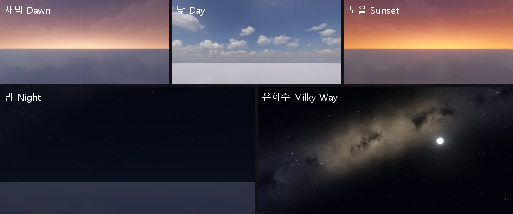
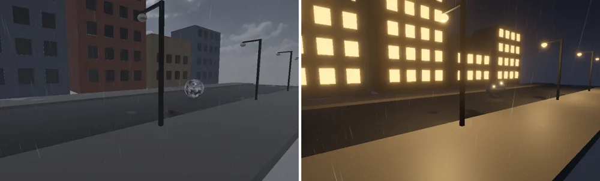

# 낮 · 밤 순환 (com.nova.daynight)

장면에 **Day Night Cycle** 컴포넌트 하나를 두면 시각이 흐르며 장면 전체가 바뀐다 (전역 — 하나만 쓴다).
**새벽 → 아침 → 낮 → 저녁 → 노을 → 밤 → 은하수 → 새벽 …** 단계마다 모습이 있고 그 사이를 부드럽게 섞는다.
날씨 패키지 (com.nova.weather) 와 함께 쓰면 둘이 곱해진다 (먹구름 밤 = 별이 가려진 어두운 밤).

<p align="center"><br/><sub>새벽 (동쪽) · 낮 · 노을 (서쪽) · 밤 · 은하수 (달과 함께)</sub></p>

**Package Manager > Day Night Cycle** 를 넣고 **Add Component > Environment > Day Night Cycle**.

## 단계

| 단계 | 시작 | 모습 |
|---|---|---|
| 새벽 Dawn | 4:30 | 해가 뜨기 전 — 동쪽 지평이 붉고 별이 사라져 간다 |
| 아침 Morning | 6:30 | 따뜻하고 낮은 해 (6 시에 동쪽에서 뜬다) |
| 낮 Day | 10:00 | 스카이박스 · 빛 그대로 |
| 저녁 Evening | 16:00 | 해가 기울며 노랗게 |
| 노을 Sunset | 18:00 | 해가 진 (18 시) 서쪽 하늘이 주황 · 붉게, 위는 보라 |
| 밤 Night | 19:30 | 푸른 달빛, 별 |
| 은하수 Milky Way | 23:00 | 가장 어두운 밤 — 별과 은하수가 가장 밝다 |

단계마다 (Inspector 의 **Looks**): Sun Color · Intensity, Ambient, Skybox Brightness, Gradient (스카이박스 → 천정 · 지평 그라데이션), Zenith · Horizon,
Glow (해 쪽 지평 빛) · Strength, Stars, Milky Way, Fog (안개 색 배율). **Reset Looks** = 기본.

## 항목

| 항목 | 내용 |
|---|---|
| Time Of Day | 0 ~ 24 시. 단계 단추로 바로 가기. 편집 중에는 멈춰 그 시각을 보여 준다 |
| Day Length (min) | Play 중 실제 몇 분에 하루 (0 = 멈춤), Paused |
| Sun Light | 해로 돌릴 Directional Light (비우면 장면의 첫 Directional Light) — 해가 지면 반대편 **달빛** (그림자도 따라온다). 지평 가까이에서 세기가 0 이라 바뀔 때 튀지 않는다 |
| Sun Azimuth | 해가 뜨는 방위 (0 = +X 에서 떠서 -X 로) |
| Max Elevation | 정오의 해 높이 (정오에는 -Z 쪽) |
| Stars · Milky Way | 밤하늘 밝기 배율 |
| Probe Refresh (game min) | 반사 프로브를 시각이 이만큼 흐를 때마다 다시 찍는다 (기본 30, 0 = 안 함) — 아래 |

## 그리기

엔진의 `DayNightState` (Source/Graphics/Common) 를 프레임마다 쓴다 — 장면에 저장되지 않고, 패키지가 없거나 꺼지면 아무것도 바뀌지 않는다.
- 빛: 방향광 · 환경광 · 반사 (32. InstancedBasic 의 WeatherSkyGrade) · 물 · 안개 색 (하늘색 모드는 하늘처럼 어둡게) — 날씨 값에 곱한다 (`WeatherState::SkyScale · AmbientScale · ApplySun`)
- 하늘 (`Shaders/21. Sky.fx`): 스카이박스 위에 천정 · 지평 그라데이션, 해 쪽 지평 빛, 해 · 달 원반, 별 두 겹 (방향의 3D 칸마다 하나 — 약 1 화소, 반짝임), 은하수 (기울어진 큰 원을 따라 fbm 구름 + 먼지 띠 + 밝은 중심, 별이 더 많다). 먹구름이면 별 · 달이 가려진다
- DirectX 11 · OpenGL · Vulkan 같은 값

## 반사 프로브 (시각마다 다시 찍기)

[Reflection Probe](REFLECTION_PROBE.md) 는 구운 때의 모습을 비춘다 — 낮에 구우면 밤에도 낮 구름이 (어둡게) 비친다.
Day Night Cycle 이 있으면 시각이 **Probe Refresh** (게임 분) 만큼 흐를 때마다 장면의 프로브를 다시 찍는다:
- **Baked · Custom** 도 실행 중의 큐브로 다시 찍는다 (구운 DDS 파일은 그대로 — 끄면 그 파일로 돌아간다). Realtime 은 그 프로브의 찍기 요청
- 처음 한 번은 6 면을 한꺼번에, 그 뒤로는 프레임마다 한 면씩 (Time Slicing — 프레임이 튀지 않게)
- 다시 찍은 큐브에는 그 시각의 하늘 · 빛 (켜진 가로등 · 창문) 이 이미 들어 있어, 셰이더가 날씨 · 낮밤 하늘 보정을 **또 하지 않는다** (구운 큐브 · 하늘만 보정)
- 바로 다시 찍기: `DayNight.RefreshReflectionProbes()` · `nova daynight probes` (가로등을 모두 켠 뒤 등). `nova probe info` 의 `relit` · `capturedTime`

<p align="center"><br/><sub>비 오는 거리 (예제 스크립트): 낮 · 밤 — 가로등 · 창문이 켜지고, 거울 구에 밤 하늘과 켜진 가로등이 비친다</sub></p>

## 가로등 · 창문 (NightLight)

**Add Component > Scripts > NightLight** (C#, 이 패키지): 해가 **Turn On Below** (도, 기본 -2) 아래로 지면 켜고 **Turn Off Above** (2) 위로 뜨면 끈다
(사이에서는 그대로 — 깜빡이지 않게). 이 오브젝트와 자식의 Light 를 켜질 때의 세기까지 **Fade Seconds** 동안, **Emissive** 렌더러 (비우면 이 오브젝트의 렌더러)
는 **Emission Color** 로 함께 빛난다. **Random Delay** 만큼 늦춰 가로등 · 창문이 하나씩 켜진다. Day Night Cycle 이 없으면 늘 켠다.
전구 (Sphere + 발광 재질) 에 NightLight, 그 아래 자식으로 Point Light — 그대로 가로등이 된다. 읽기: `isOn` · `level` (0 ~ 1).

## 데모 장면 (비 오는 거리)

[examples/daynight/build_street_scene.ps1](examples/daynight/build_street_scene.ps1) — 에디터를 연 뒤 `powershell build_street_scene.ps1 -Project <프로젝트>`:
길 · 보도, 건물 5 채 (창문마다 NightLight), 가로등 6 개 (전구 NightLight + Point Light), 거울 구, 구운 반사 프로브, Day Night Cycle (3 분에 하루, 17:30 부터), Weather Controller (비).
Play 하면 노을 → 가로등 · 창문이 하나씩 켜지는 밤 → 새벽으로, 젖은 길과 거울 구에 그 시각의 하늘 · 등불이 비친다.

## C# · CLI

```csharp
DayNight.timeOfDay = 18.5f;                  // 노을
DayNight.dayLengthMinutes = 12f;
DayNight.SetPhase(DayPhase.MilkyWay);
if (DayNight.isNight) streetLights.SetActive(true);
float elevation = DayNight.sunElevation;     // 도 (밤 = 음수)
```

`DayNight.exists · timeOfDay · dayLengthMinutes · paused · phase (DayPhase) · sunElevation · sunDirection · isNight · sunAzimuth · starBrightness · milkyWayBrightness · probeRefreshMinutes · SetPhase · RefreshReflectionProbes`

CLI: `nova daynight status` · `nova daynight set --time 18.5 [--minutes 24] [--paused true] [--azimuth 0] [--probes 30]` · `nova daynight phase --name Sunset` · `nova daynight probes` (반사 프로브 지금 다시)
(시각 · 단계 · 해 높이 · 해 방향 · 빛 방향 · 세기 · 별 · 은하수 · 달).

## 검사

`Tools/tests/run_tests.ps1 -Only daynight` — 시각 → 단계 이름, 정오 = 해 / 자정 = 달 (빛이 위에서), 낮 하늘 밝음 · 밤 어두움, 노을 (서) · 새벽 (동) 지평이 붉다,
은하수 시각에 별 (밝은 점 수백), Play 중 7 단계가 차례로, C# API,
거리: create point-light = Point (정수 JSON 도), 구운 프로브가 정오 · 자정에 다시 찍힘, 밤 반사 (구에 밤 하늘 · 비친 바닥이 바닥만큼 — 두 번 어두워지지 않음, 끄면 낮 구름),
NightLight 가로등 (낮 꺼짐 · 밤 켜짐 · 아침 꺼짐) (12 항목).

## 아직 없는 것

달의 위상, 계절 · 위도 (해 길이), 별자리, 구름의 해 · 달 빛 받기 (스카이박스의 구름은 그라데이션에 섞인다), Adaptive Probe Volume (확산 환경광) 을 시각마다 다시 굽기.
