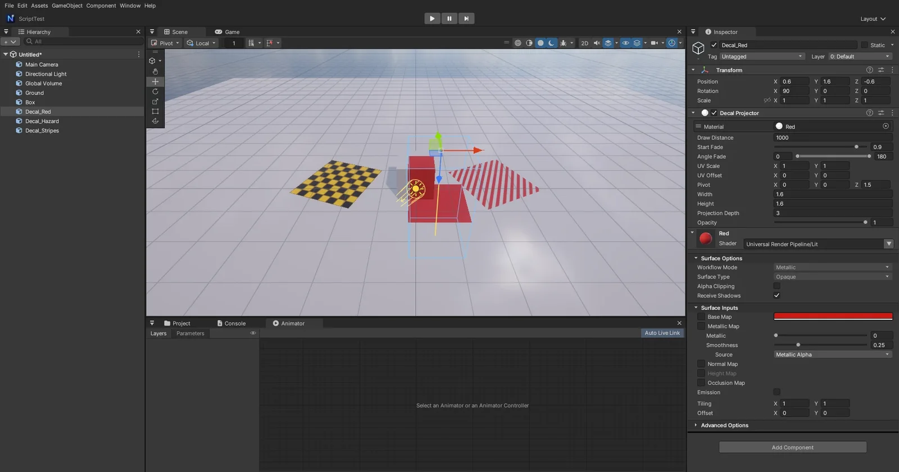

# Decal Projector

Unity URP 의 **Decal Projector** 처럼 재질을 상자 모양으로 **표면에 투영**합니다 (총알 자국 · 얼룩 · 표지 · 바닥 표시). 엔진 코어 기능이라 패키지 없이 쓸 수 있고, 게임 빌드에서도 동작합니다.



## 쓰는 법

1. 빈 GameObject 에 **Add Component > Rendering > Decal Projector**
2. **Material** 칸에 재질을 넣습니다
   - 엔진 **Lit / Unlit** 재질: Base Map × Base Color (Base Map **알파 = 덮는 정도**), Normal Map (Scale), Metallic · Smoothness, Emission
   - **Shader Graph** 재질: Graph Settings 의 **Material = Decal** 인 그래프 (아래)
3. 상자 (Width · Height · Projection Depth) 안의 표면만 칠합니다. 투영 방향 = GameObject 의 **앞 (+Z)** — 바닥에 찍으려면 X 를 90 도 돌립니다. 고르면 파란 상자 기즈모와 노란 투영 방향 선이 보입니다
4. 데칼은 물체가 아니라 **화면의 깊이 · 노멀** 로 표면을 찾으므로, 벽 모서리 · 계단 · 움직이는 물체 위에도 그대로 붙고 빛 · 그림자를 받습니다

## Inspector (Unity 와 같은 이름)

| 항목 | 뜻 |
|------|-----|
| Material | 투영할 재질 (아래에 재질 Inspector 가 이어짐) |
| Draw Distance | 카메라에서 이 거리 (상자 중심) 보다 멀면 그리지 않음 (기본 1000) |
| Start Fade | Draw Distance 의 이 비율부터 흐려지기 시작 (0 ~ 1, 기본 0.9) |
| Angle Fade | 표면 노멀과 투영 방향의 각도 (도) 로 흐리게 — Min ~ Max 사이에서 사라짐. 0 ~ 180 = 흐리지 않음 (옆면에도 늘어난 그림) |
| UV Scale · UV Offset | 투영 UV (상자 왼쪽 위 = 0,0) 의 배율 · 이동 |
| Pivot | 상자 중심의 위치 (GameObject 기준, 기본 Z = 0.5 → 상자가 앞쪽으로) |
| Width · Height · Projection Depth | 상자 크기 (X · Y · 투영 방향 Z) |
| Opacity | 전체 불투명도 (0 = 안 보임) |

Camera 의 Culling Mask 에서 데칼 GameObject 의 레이어를 빼면 그 카메라에는 그리지 않습니다. 꺼진 컴포넌트 · 비활성 GameObject 도 그리지 않습니다.

## Shader Graph 데칼

Shader Graph 창 Graph Settings 의 **Material = Decal** (또는 `nova shadergraph new X.shadergraph --material Decal`).

- Master 는 Fragment 만 (Vertex 단계 없음): Base Color · Normal (Tangent Space) · Metallic · Smoothness · Emission · Ambient Occlusion · Alpha
- 입력 값: **UV = 투영 UV** (UV Scale · Offset 적용), **Position (Object) = 상자 안 위치** (-0.5 ~ 0.5), Position (World) · Normal Vector = 칠하는 표면, Screen Position · View Direction · Time 은 보통 그래프와 같음
- Alpha × Opacity × 거리 · 각도 페이드 = 덮는 정도 (조명은 엔진 Lit 그대로 — Base Color 만 쓰면 Unlit 처럼은 아님)
- 셰이더가 백그라운드에서 만들어지는 동안은 엔진 데칼이 재질 값으로 그립니다

## 동작 (엔진 안)

- **화면 공간 데칼** (URP 의 Screen Space 방식): 불투명 물체 다음에 상자 뒷면을 그려, 깊이 프리패스 (`SsaoNormalDepth`, 뷰 노멀 + 뷰 깊이) 에서 화면 점의 위치를 되살리고 상자 밖이면 버립니다. 원근 · 직교 카메라 모두
- 색만 섞고 (알파 채널은 그대로 — Scene 뷰 합성이 알파를 씀) 깊이를 쓰지 않으므로 하늘 · 투명 물체 · 물 · 입자에는 묻지 않습니다
- 노멀 맵은 투영 축 (X · Y · Z) 을 접선 공간으로, 빛 · 그림자 · 반사 · SSAO 는 엔진 Lit 과 같은 `ShadeLit` · `FinishLit`
- Game 뷰 · Scene 뷰 (Wireframe 모드 제외) · 게임 빌드. DirectX 11 · OpenGL 같은 결과
- 파일: `Source/Scene/DecalProjector.*` (컴포넌트), `Source/Graphics/DX11/DecalRenderer.*` (그리기), `Shaders/52. Decal.fx` (엔진 데칼) · `Shaders/53. DecalCommon.fx` (재구성 · 페이드 · 노멀 — Shader Graph 데칼도 씀)

## CLI

```bash
nova create empty --name Decal --position 0,0.5,0 --rotation 90,0,0
nova add-component Decal DecalProjector
nova set Decal --component DecalProjector --values '{"material":"Assets/Red.mat","size":[2,2,2],"pivot":[0,0,1],"uvScale":[2,2],"angleFade":[0,90],"fadeFactor":0.8}'
```

JSON 키: `material` · `size` [w,h,depth] · `pivot` · `uvScale` · `uvOffset` · `fadeFactor` (Opacity) · `drawDistance` · `startFade` · `angleFade` [min,max] · `enabled`.

## 아직

- Unity 의 DBuffer 방식 (불투명 물체를 그리기 전에 표면 값을 바꿈) · Decal Layers (Rendering Layer Mask) — 지금은 Camera Culling Mask 만
- 투명 물체에는 묻지 않음 (Unity 와 같음)
- Shader Graph 데칼의 Affects (Base Color · Normal · MAOS 를 따로 끄기)
