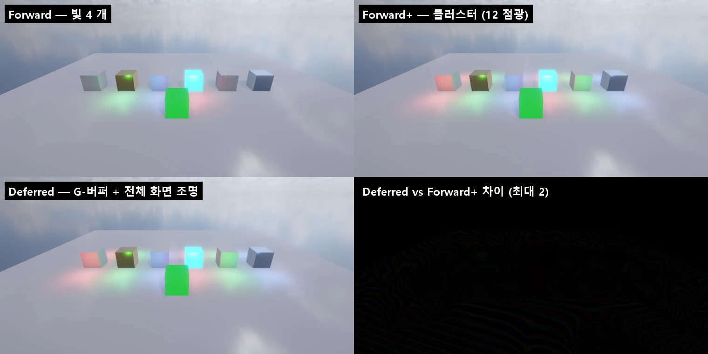

# Rendering Path — Forward · Forward+ · Deferred

URP 의 Universal Renderer 처럼 **Rendering Path** 를 고릅니다. 렌더링 현대화 6 단계 ([RENDERING_ROADMAP](RENDERING_ROADMAP.md)).
Deferred 는 표면을 먼저 G-버퍼에 쓰고, 전체 화면 한 번으로 픽셀마다 비춥니다. 이때 1 단계의 Forward+ 클러스터를 그대로 씁니다 (Clustered Deferred).
DX11 · DX12 · OpenGL · Vulkan 모두 같은 그림입니다.

## 쓰는 법

**Project Settings > Graphics > Rendering > Rendering Path** 에서 고릅니다 (`ProjectSettings/GraphicsSettings.json` 의 `renderingPath`, 빌드에도 들어간다).

| Rendering Path | 무엇 |
|------|------|
| Forward | 앞의 빛 4 개만 (그림자 칸) — 클러스터 끔 |
| **Forward+** (기본) | 4 개 밖의 점광 · 스포트광을 클러스터로 (한 화면 1024 개) — [FORWARD_PLUS](FORWARD_PLUS.md) |
| Deferred | 엔진 Lit 재질 → G-버퍼 → 전체 화면 조명 (클러스터 포함). 나머지는 그 뒤에 포워드로 (URP 의 Forward Only) |

CLI: `nova renderpath get` · `nova renderpath set --path Deferred` (`Forward` · `Forward+` · `Deferred`). `get` 은 뷰마다의 G-버퍼 크기 · 그린 프레임 수도 돌려준다.

## 동작

Render Graph ([RENDER_GRAPH](RENDER_GRAPH.md)) 에 패스 둘이 생깁니다: `Depth Prepass → Shadows → … → SSAO → GBuffer → Deferred Lighting → Opaque → Decals → Sky → …`

- **GBuffer** — MeshBatcher 의 본 패스가 엔진 URP Lit 재질 묶음만 `BatchGBufferTech` 로 그린다. 깊이는 프리패스 그대로 쓴다 (EQUAL — 덧그리기 없음). 표면 계산 (텍스처 · 알파 자르기 · 노멀 맵 · 메탈릭 · Occlusion · 발광 · 가상 텍스처) 은 포워드와 같은 `LitSurfaceOf` 한 함수다.

  | 타깃 | 형식 | 내용 |
  |------|------|------|
  | G0 | RGBA8 sRGB | 알베도, a = Occlusion |
  | G1 | RGBA8 | Metallic · Smoothness · 표시 (Specular Highlights · Environment Reflections · Receive Shadows · 있음 · 안개) · 레이어 |
  | G2 | RGBA16F | 월드 노멀 |
  | G3 | RGBA16F | 발광 (HDR) |

- **Deferred Lighting** — 전체 화면 삼각형 하나 (`DeferredLightTech`). 하드웨어 깊이와 역 ViewProj 로 월드 자리를 되살린다.
  - 포워드와 같은 `ShadeLit` 으로 비춘다: 주 빛 4 개 + 그림자 (계단식), Forward+ 클러스터, APV · 반사 프로브 · SSR · SSAO, 날씨.
  - 마무리는 `FinishLit` (안개) 이다.
  - 빛의 Culling Mask 는 G-버퍼의 레이어로 맞춘다.
  - G-버퍼 물체가 없는 픽셀은 건너뛴다.
- **Opaque (Forward Only)** — 디퍼드 조명이 그린 장면 위에 나머지를 포워드로 그린다:
  - Skinned Mesh · 지형 · 나무 · 풀 · 바위
  - Shader Graph · 패키지 셰이더 (lilToon · Toon …)
  - Unlit · 테셀레이션
  - LOD 크로스페이드 중인 물체
- 투명 · 물 · 입자 · 스프라이트는 언제나 포워드다 (URP 와 같다).
- 반사 프로브 · GI 찍기 · 와이어프레임 보기는 포워드로 그린다.

코드: `Source/Graphics/DX11/DeferredRenderer.*` (뷰마다 G-버퍼 — Game · Scene), `Source/Scene/MeshBatcher.*` (`SetDeferredSplit` · `DeferredCapable`), `Shaders/32. InstancedBasic.fx` (`PS_BatchGBuffer` · `PS_DeferredLight`), `Source/Graphics/Common/RenderPipelineSettings.*`.

## 검사

`Tools/tests/run_tests.ps1 -Only deferred` (12 항목). 장면은 Lit 상자 6 개 (Red Plastic · Gold · Glossy Blue · Emissive · Rough Copper · Silver), 점광 12 개, Unlit 상자 하나다.

- `renderpath set` 이 저장되고, G-버퍼가 프레임마다 그려진다.
- Render Graph 순서가 GBuffer → Deferred Lighting → Opaque 이다 (Forward+ 에는 없다).
- **Deferred 그림 = Forward+ 그림** (최대 차 2, 평균 0.18). Scene 뷰도 자기 G-버퍼로 같다.
- Unlit 상자 (Forward Only) 를 Lit 로 바꿔도 Forward+ 와 같다.
- Forward 는 클러스터를 끈다.
- OpenGL · Vulkan · DX12 의 디퍼드 그림 = DX11 (평균 차 0.01).

## 아직

- Rendering Debugger 의 G-버퍼 보기 (알베도 · 노멀 · 메탈릭 · 스무스니스)
- Skinned Mesh · 지형 · 나무를 G-버퍼로 (지금은 Forward Only)
- 빛 볼륨 (구 · 원뿔) 으로 그리기, 타일 / 컴퓨트 조명 — 지금은 전체 화면 한 번 + 클러스터
- Decal 을 G-버퍼에 (URP 의 DBuffer · Screen Space Decal), Rendering Layers
- GLES · WebGPU 는 셰이더만 컴파일 확인 (안드로이드 · 웹 플레이어 검사 안 함)
