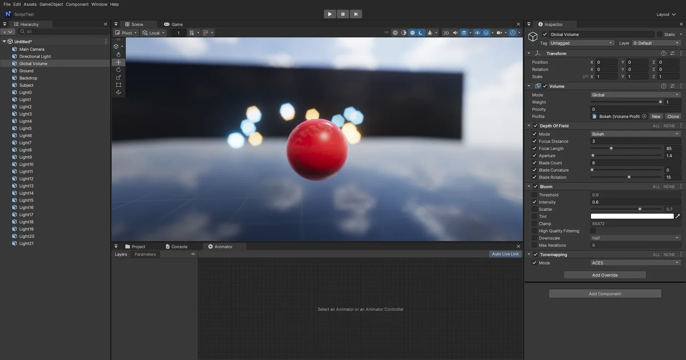

# Depth Of Field · Motion Blur (Volume 후처리)

Unity URP 의 Volume 후처리 **Depth Of Field** (Gaussian · Bokeh) 와 **Motion Blur** (Camera Only) 를 같은 이름 · 같은 필드로 넣었습니다. Volume Profile 의 **Add Override** 에서 고릅니다.

## 쓰는 법

1. 씬의 **Global Volume** (또는 Local Volume) 을 고르고 Profile 의 **Add Override > Depth Of Field** 또는 **Motion Blur**
2. Depth Of Field: **Mode** 를 Gaussian 이나 Bokeh 로 (Off 면 꺼짐 — Unity 와 같음). 고른 방식의 필드만 Inspector 에 보입니다
3. Motion Blur: **Intensity** 를 0 보다 크게. 카메라가 움직이거나 돌 때 Game 뷰 (플레이 · 빌드한 게임) 에서 번집니다. Scene 뷰에는 없습니다 (Unity 와 같음)
4. 카메라의 **Post Processing** 이 켜져 있어야 합니다 (Scene 뷰는 툴바 Effects > Post Processing)

## Depth Of Field

| 항목 | 뜻 |
|------|-----|
| Mode | **Off** · **Gaussian** · **Bokeh** |
| **Gaussian** | 먼 곳만 흐림 (빠름) |
| Start | 이 거리 (m) 부터 흐려지기 시작 |
| End | 이 거리에서 가장 흐림 |
| Max Radius | 흐림 크기 (0.5 ~ 1.5) |
| High Quality Sampling | 표본을 늘려 계단 · 번쩍임을 줄임 |
| **Bokeh** | 실제 렌즈 — 초점 앞 · 뒤 모두 흐리고, 밝은 점이 조리개 모양으로 번짐 |
| Focus Distance | 초점 거리 (m) |
| Focal Length | 렌즈 초점 거리 (mm, 1 ~ 300). 길수록 얕은 심도 |
| Aperture | 조리개 f 값 (1 ~ 32). 작을수록 많이 흐림 |
| Blade Count | 조리개 날 수 (3 ~ 9) — 보케 다각형의 변 수 |
| Blade Curvature | 0 = 곧은 날 (다각형), 1 = 둥근 날 (원) |
| Blade Rotation | 보케 모양 회전 (도) |

## Motion Blur

| 항목 | 뜻 |
|------|-----|
| Mode | **Camera Only** (기본 — 카메라 움직임만) · **Camera And Objects** ([모션 벡터](MOTION_VECTORS.md) — 움직이는 물체 · 스킨 애니메이션도) — Unity URP 와 같은 두 가지 |
| Quality | Low · Medium · High = 표본 8 · 12 · 16 |
| Intensity | 번짐 세기 (0 ~ 1, 0 이면 꺼짐) |
| Clamp | 한 프레임 번짐 길이의 최대 (화면 비율, 0 ~ 0.2) |

## 동작 (엔진 안)

- 순서: **Depth Of Field → Motion Blur → Bloom → Uber (색 · 톤매핑 · 비네트 …) → FXAA**. 깊이는 깊이 프리패스의 노멀 · 깊이 (Game 뷰) / SSAO 의 것 (Scene 뷰) 을 씁니다
- **Gaussian** (URP 와 같은 먼 곳 전용): 흐림 원 = saturate((z − Start) / (End − Start)). 반 해상도로 줄이며 흐림 원을 알파에 → 가로 · 세로 가우스 (표본마다 흐림 원으로 가중 — 초점 맞은 앞 물체가 뒤로 번지지 않게) → 전체 해상도에서 흐림 원으로 섞기
- **Bokeh**: 얇은 렌즈 공식 흐림 원 (센서) = A · f / (P − f) · (1 − P / z), A = f / 조리개, 센서 높이 24 mm → 화면 px. 최대 반지름 1080p 기준 32 px (해상도에 비례). 반 해상도에서 가운데 + 고리 4 개 = 71 표본 gather — 표본 위치를 조리개 날 수 · 곡률 · 회전으로 다각형으로 펴서 밝은 점이 다각형 보케가 됩니다. 뒤 표본은 가운데 흐림 원으로 묶고 (초점 맞은 물체에 뒤 배경이 번져 들어오지 않게), 앞 표본은 자기 흐림 원이 닿는 만큼 덮어 초점 맞은 물체 위로 번집니다
- **Motion Blur**: 깊이 → 뷰 위치 (원근 · 직교) → 월드 → **지난 프레임** 뷰 · 투영 → 화면 위치 차 = 속도 (x Intensity, Clamp 로 자름) → 그 선을 따라 표본 평균. 지난 프레임 카메라는 프레임 번호로 한 번만 넘겨, 스크린샷처럼 한 프레임에 다시 그려도 속도가 0 이 되지 않습니다. Game 뷰 · Scene 뷰는 후처리 상태가 따로라 서로 섞이지 않습니다
- 컴퓨트 없이 픽셀 셰이더만 — DirectX 11 · OpenGL 같은 결과
- 파일: `Source/Graphics/Common/VolumeProfile.*` (필드 · 켜짐 규칙, `ShowIf` = 다른 Enum 값에 따라 보이기), `Source/Editor/VolumeEditor.cpp`, `Source/Graphics/DX11/PostProcessPass.*` (`DepthOfField` · `MotionBlur`), `Shaders/41. PostProcess.fx` (`Dof*Tech` · `MotionBlurTech`)

## 검사

`Tools/tests/run_tests.ps1 -Only depthoffield` — 4 m · 20 m 상자 윤곽의 밝기 계단으로:

1. Gaussian (Start 8, End 16): 4 m 상자는 그대로, 20 m 상자는 흐림
2. Bokeh (초점 20 m, 85 mm f/1.4): 20 m 상자가 또렷, 4 m 상자가 흐림
3. Mode Off = 덮어쓰기 없음과 같은 그림
4. Motion Blur: 플레이 중 카메라가 프레임마다 2° 돌면 Game 뷰의 윤곽이 옆으로 번짐
5. Scene 뷰에는 Motion Blur 없음

## 아직

- Camera And Objects 는 픽셀마다 자기 속도로만 모은다 — 움직이는 물체가 배경 쪽으로 번지지는 않는다 (타일 최대 속도는 아직)
- 카메라의 Physical Camera 값 (URP 의 Focal Length · Aperture 를 카메라에서 가져오기)
- C# 에서 Volume 값 바꾸기
