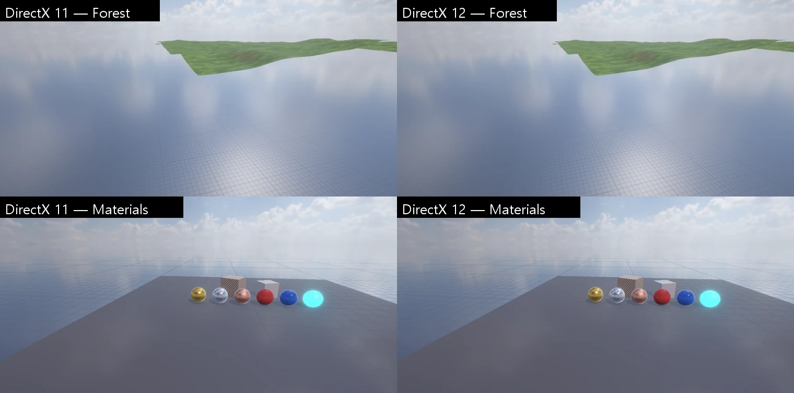

# DirectX 12 그래픽 백엔드

DirectX 11 · OpenGL 4.5 · Vulkan 1.3 에 이은 네 번째 데스크톱 그래픽 API (렌더링 현대화 3 단계 — [RENDERING_ROADMAP](RENDERING_ROADMAP.md)).
엔진 렌더러는 지금처럼 Gfx 층(`Gfx.h`, D3D11 모양)과 효과(`FxEffect`)만 쓰고, DirectX 12 구현이 그 뜻을 명시적 API (명령 목록 · 디스크립터 힙 · 루트 시그니처 · 리소스 상태 장벽) 로 바꾼다. Vulkan 백엔드와 같은 구조다.

## 진행 단계

| 단계 | 내용 | 상태 |
|---|---|---|
| 1 | 셰이더: 모든 `.fx` → DXIL (`nova d3d12 shaders`) | **완료** — 효과 54/54, pass 528/528, 바인딩 이름 모두 이어짐 |
| 2 | 화면 없는 DX12 장치 + Gfx 검사 장면이 DX11 과 같다 (`nova d3d12 gfx-test`) | **완료** — 화소 차이 최대 1, 디버그 층 오류 0 |
| 3 | 에디터가 DX12 로 실행 (스왑체인 · ImGui · `-force-d3d12` · 안 되면 DX11) | **완료** — 상자 · 바닥 장면의 Game · Scene 뷰가 DX11 과 화소 평균 차 0.00 |
| 4 | 그래픽 회귀 스위트를 DX12 편집기로 (`NOVA_TEST_GRAPHICS=d3d12`) | **완료** — 21 스위트 (render · ssao · forwardplus · rendergraph · renderingdebug · motionvectors · layers · reflectionprobe · probevolume · decal · weather · ssr · depthoffield · antialiasing · occlusion · material · vfx · linetrail · sprites …) 통과, `d3d12` 스위트: 렌더 장면 7/7 DX11 = DX12, 디버그 층 메시지 0 |
| 5 | 비동기 컴퓨트 (두 번째 큐) | **완료** — [ASYNC_COMPUTE](ASYNC_COMPUTE.md) |
| 6 | 빌드한 게임 · Release 성능 | 다음 |

DX12 로 돌리며 고친 것: 텍스처 · 쿼리가 놓일 때 기록된 명령이 아직 가리키던 것 (늦은 삭제로), BC 텍스처의 작은 밉 (4 x 4 보다 작은) 올리기 상자 — 명령 목록 Close 가 실패해 그 프레임의 명령이 통째로 버려졌다, 3D 텍스처 캡처 · 밉 만들기 (APV), 실패한 명령 목록은 새로 만든다

- 고르기: 실행 인자 `-force-d3d12` (`-force-directx12`), CLI `nova open <프로젝트> --graphics d3d12`, Graphics API 설정 · Player Settings 의 API 목록 (DirectX 12 — 시험 단계).
  DX12 장치를 못 만들면 DirectX 11 로 대체한다 (`[Graphics] DirectX 12 failed to start - using DirectX 11`)
- 창 표시 (`GfxD3D12Swapchain.cpp`): 엔진은 백버퍼 텍스처 (RGBA8) 에 그리고 Present 가 플립 스왑체인 버퍼로 복사 (3 버퍼, FLIP_DISCARD, 수직 동기 0 = 찢어짐 허용). CPU 는 GPU 보다 2 프레임 넘게 앞서 가지 않는다
- 에디터 UI: Vulkan 과 같은 `ImGuiGfx` (Gfx 층 + `56. ImGui.fx`). 창 밖으로 뺀 창은 창마다 스왑체인 (`GfxD3D12::PresentWindow`)
- 빌드한 게임: Player Settings 에 DirectX 12 가 있으면 셰이더 변환기 (dxcompiler · dxil) 를 같이 넣는다

## 셰이더 (`ShaderCross::CompileEffectDxil`)

- 효과 전체의 자원 정보 (cbuffer 배치 · 이름마다 고정 바인딩 번호 · 상태 블록 · 초기값) 는 Vulkan 경로 (`CompileEffectSpirv`) 의 것을 같이 쓴다 (cbuffer 는 D3D 패킹 그대로라 CPU 쪽 값 배치가 같다)
- pass 의 단계마다 DXC 로 DXIL (`*_6_0`, `-O3`, dxil.dll 이 서명) — 좌표 · 깊이 범위 · 인스턴스는 D3D 그대로라 고칠 것이 없다
- 레지스터는 DXC 가 단계마다 정한다 → `ID3D12ShaderReflection` 으로 (종류, 레지스터, 개수, 이름, 모양) 을 모아 이름으로 효과 바인딩 번호에 잇는다. 픽셀 셰이더의 SV_Target 번호도 (쓰지 않는 색 타깃은 쓰기 마스크 0)
- 캐시: `Binaries/ShaderCache/DXIL/<이름>_<해시>.json` (DXIL base64 + 바인딩)

## 장치 구조 (`Source/Graphics/DX12/`)

- **제출**: 직접 큐 하나 + 펜스. 제출마다 값 +1 — 명령 할당기 · 업로드 링 조각 · 디스크립터 링 · 늦은 삭제 (자원 · 뷰 칸 · PSO) 는 그 값이 끝난 뒤. 10 초 넘게 끝나지 않으면 장치를 잃은 것으로 (PC 가 굳지 않게)
- **상태 장벽**: 텍스처는 서브리소스 (밉 · 배열 · 깊이/스텐실 면) 마다 상태를 CPU 가 따라가 그리기 · 복사 앞에서 모아 낸다 (늘 명시적). 버퍼는 제출이 끝나면 COMMON 으로 감쇠하므로 새 명령 목록의 첫 사용은 장벽 없이 승격, 그 뒤만 명시적. 버퍼 읽기는 GENERIC_READ 하나 (정점 · 인덱스 · 상수 · SRV · 간접 인자 · 복사 원본 사이에 장벽이 없게), 깊이 텍스처 읽기 = DEPTH_READ + 셰이더 자원 (읽기 전용 DSV 와 같이 묶여도 장벽 없음). 앞 그리기 · 디스패치가 UAV 에 썼으면 다음 앞에 UAV 장벽
- **디스크립터**: 뷰 (SRV · UAV · RTV · DSV · 샘플러) 는 CPU 전용 힙에 한 번 만들고, 그리기 때 셰이더에서 보이는 링 힙 (50 만 칸) 으로 복사. pass 마다 루트 시그니처 = 단계마다 표 하나 (CBV · SRV · UAV, 레지스터 0..최대) + 샘플러 표 (조합마다 캐시). 빈 칸 = 셰이더 선언 모양의 널 디스크립터 (D3D11 의 빈 SRV 처럼 0), 값이 없는 cbuffer = 0 으로 채운 64 KB
- **상수 · DYNAMIC 버퍼**: 업로드 힙 링 (16 MB 조각, 늘 매핑). DYNAMIC 버퍼는 CPU 사본 + Map 마다 새 링 자리 (구조 버퍼 SRV 도 그 자리로 디스크립터를 새로)
- **STAGING**: CPU 가 읽고 쓰는 CUSTOM 힙 버퍼 (WRITE_BACK · L0) — 텍스처는 서브리소스마다 `GetCopyableFootprints` 배치
- **PSO**: (프로그램 · 입력 배치 · 래스터 · 블렌드 · 깊이 해시 · 타깃 형식 · 표본 · 위상 종류 · 스트립 끊기) 키로 캐시. 실패도 기억
- **그 밖**: GenerateMips = 작은 셰이더로 밉마다 그리기 (2D · 배열 · 큐브), 간접 그리기 = ExecuteIndirect (D3D 인자 그대로), 오클루전 예측 = 쿼리 결과를 기본 힙 버퍼로 풀어 SetPredication (그리기에만), 타임스탬프 · 파이프라인 통계 쿼리, ClearUnorderedAccessViewUint
- 디버그 층: Debug 빌드는 켬 (`NOVA_D3D12_DEBUG=0/1`), 오류 · 경고는 `Editor.log` 의 `[DX12] [debug layer …]` (같은 번호는 3 번까지). 걸러 내는 것: 지우기 값 차이 (성능 경고), 3D 텍스처의 서로 다른 깊이 조각 RTV 여럿 (APV 판 찍기 — 밉 전체를 한 서브리소스로 보아 겹친다고 하지만 조각은 겹치지 않는다). `NOVA_D3D12_DEVICE=<이름 일부>` 로 GPU 를 고른다 (기본: 고성능)

## 아직 없는 것

- 스트림 출력 (DrawAuto · SOSetTargets), append · counter UAV, MSAA 캡처
- 빌드한 게임에서의 확인 · Release 성능 비교

## 검사

- `nova d3d12 shaders | gfx-test [--out] | rhi-test [--out]` (Vulkan 도구와 같은 장면 · 같은 비교)
- `run_tests.ps1 -Only d3d12`: 모든 .fx → DXIL · 바인딩 이름, gfx-test · rhi-test (DX11 과 화소 비교), 렌더 7 장면 DX11 = DX12, DirectX 12 로그 (디버그 층) 깨끗
- `-Only vfx12`: DX12 편집기에서 VFX 묶음 + 비동기 컴퓨트
- 회귀 스위트를 DX12 편집기로: `$env:NOVA_TEST_GRAPHICS='d3d12'; Tools/tests/run_tests.ps1 -Only …` (`Start-TestEditor` 가 `--graphics d3d12` 로 연다)
