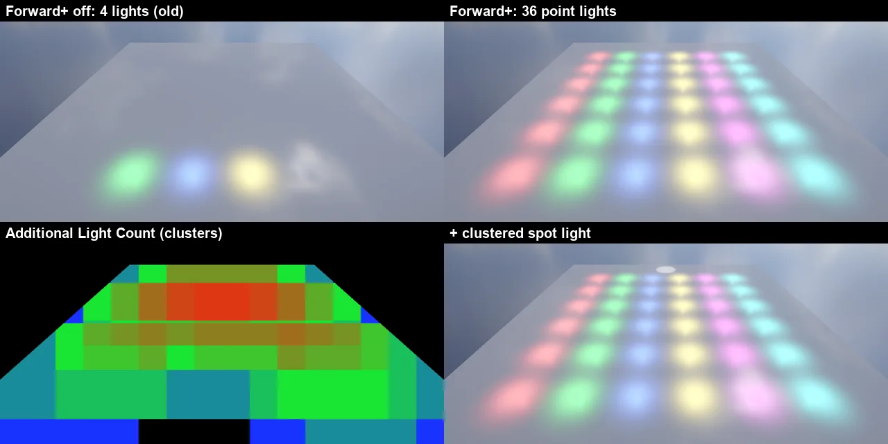

# Forward+ (클러스터 조명)

예전에는 화면 전체에 빛이 **4 개** 까지였습니다 (방향광 · 점광 · 스포트광 합쳐서, 카메라에서 가까운 순). Forward+ 는 Unity URP 의 **Forward+** 렌더링 경로와 같은 방법으로, 그 4 개 (그림자 칸) 밖의 점광 · 스포트광 · 입자 빛을 **클러스터** 로 나눠 픽셀마다 자기 둘레의 빛만 계산합니다 — 한 화면에 **1024 개** 까지.

## 쓰는 법

따로 켤 것이 없습니다 (기본으로 켜짐). 빛을 더 놓으면 됩니다.

- **앞의 4 개** (방향광 먼저, 그다음 가까운 점광 · 스포트광) = 예전 그대로 — **그림자** 를 받는 빛
- **나머지** = 클러스터 빛 (**그림자 없음**) — Light 의 Color · Intensity · Range · Spot Angle · **Culling Mask** 는 그대로
- Particle System 의 **Lights** 모듈: 남은 점광 칸에, 다 차면 클러스터로 (예전에는 4 개를 넘으면 버렸다)

## 동작 (엔진 안)

- 클러스터: 화면 **16 x 9 타일 x 24 깊이 조각** (로그 간격, 카메라 가까운 면 ~ 먼 면, 최대 5000 m)
- **CPU 가 짓는다** (URP Forward+ 처럼): 빛마다 경계 구 (스포트광은 원뿔을 감싸는 더 작은 구) → 깊이 조각마다 그 안의 구 단면을 투영한 타일 사각형에만 넣는다 — 일은 빛 수에 비례 (36 빛 0.2 ms)
- GPU 로는 **텍스처 하나** (RGBA32F 1024 x 24): 빛 (빛마다 4 텍셀) · 클러스터 표 (시작, 개수) · 번호 목록 (텍셀마다 4 개), 쓴 줄만 올린다. 컴퓨트 · 스토리지 버퍼 없이 `Load` 만 → DirectX 11 · OpenGL · Vulkan · 안드로이드 GLES · 웹 WebGPU 모두 같다
- 텍스처를 하나로 묶은 까닭: OpenGL 은 프로그램마다 샘플러 32 개 한도 — 지형 셰이더가 이미 32 개라 하나만 늘어도 깨졌다. 그래서 **그림자 맵도 빛 종류마다 Texture2DArray 하나** 로 묶었다 (방향광 조각 = 빛 x 4 + 캐스케이드, 스포트광 = 빛, 점광 = 빛 x 6 + 면 — 예전 12 장 → 3 장, 샘플러 9 개 여유)
- 셰이더 (`Shaders/32. InstancedBasic.fx` 의 ShadeLit): 픽셀의 화면 자리 · 뷰 깊이 → 클러스터 → 그 빛만 (Light Layer 마스크 · 범위 감쇠 · 스포트 원뿔 — 앞의 빛과 같은 식)
- 뷰마다 (Game · Scene · 반사 프로브 면) 다시 짓는다. 파일: `Source/Graphics/DX11/ClusteredLighting.*`, `Source/Scene/LightManager.*` (AdditionalLight)
- 함께 고침: 카메라 절두체 (`Camera::FrustumUpdate`, `EditorCamera::FrustumUpdate`) 가 투영 x 뷰 의 행에서 평면을 뽑아 엉뚱했다 → 뷰 x 투영 의 열 (Gribb-Hartmann, D3D 깊이). 빛이 많으면 대부분이 걸러졌다

## 확인 · CLI

- **Rendering Debugger > Additional Light Count** (`nova debugview lights`): 클러스터마다 추가 빛 수 (검정 0, 파랑 1, 초록 4, 노랑 8, 빨강 16 이상)
- `nova forwardplus info`: 마지막에 지은 뷰의 클러스터 빛 · 화면 밖으로 뺀 빛 · 목록 칸 · 클러스터당 최대 · 짓는 시간
- `nova forwardplus set --enabled false`: 앞의 4 개만 — 비교용 (저장되지 않음). 프로젝트 설정은 Rendering Path ([DEFERRED_RENDERING](DEFERRED_RENDERING.md)) — Forward 면 끈다

## 검사

`Tools/tests/run_tests.ps1 -Only forwardplus` (6 항목): 6 x 6 점광 (범위 4 m) 바닥 — 빛마다 바로 아래 바닥 (카메라 투영으로 자리) 을 Forward+ 켬 · 끔으로 비교: 클러스터 빛 33 개는 켤 때만 밝고 앞의 3 개는 같다, Light Culling Mask 로 Default 레이어를 뺀 빛만 어두워진다, 클러스터 스포트광 (원뿔 안 밝음 · 옆 어두움), Additional Light Count 보기, **OpenGL · Vulkan** 에서도 33 개.

## 아직 · 한계

- 클러스터 빛은 그림자가 없다 (URP 는 추가 빛 그림자 아틀라스) — 그림자는 앞의 4 개만
- 투명 (Shader Graph Transparent) · 물 · 입자 · 지형 디테일 셰이더 중 `ShadeLit` 을 쓰지 않는 것은 앞의 4 개만
- GPU 컴퓨트로 짓기 · 디퍼드 (Clustered Deferred) 는 다음 단계 ([RENDERING_ROADMAP](RENDERING_ROADMAP.md))
