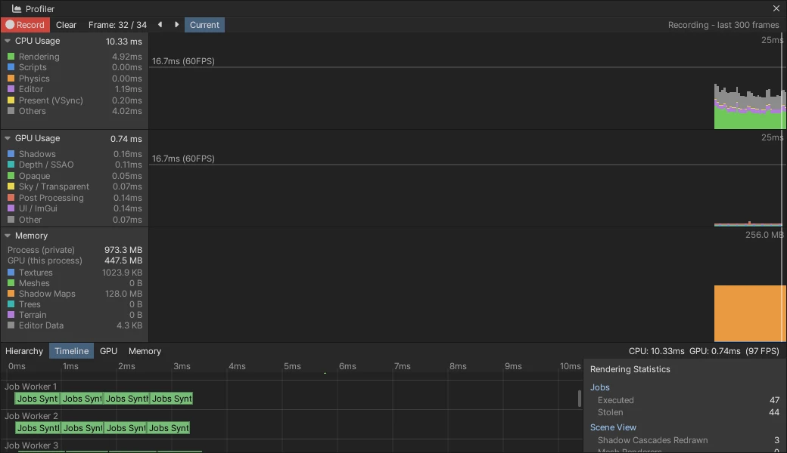

# Job System (작업 훔치기 · 파이버) · 무잠금 자료 구조

엔진 공용 Job System입니다. 일꾼 스레드 수는 코어 − 1 이고, 메인 스레드도 기다리는 동안 돕습니다.
작업 훔치기 (work-stealing) 로 일을 고르게 나누고, Windows 에서는 잡 안에서 기다릴 때 **파이버**를 내려놓습니다.
동시성 로드맵 1 단계입니다 ([CONCURRENCY_ROADMAP](CONCURRENCY_ROADMAP.md)).



## 쓰는 법 (`Source/Core/JobSystem.h`)

```cpp
Jobs::Counter done;
Jobs::Run([&] { BuildSomething(); }, &done);              // 잡 하나 (Priority::Normal)
Jobs::Run([] { LoadFile(); }, nullptr, Jobs::Priority::Background, "Load");   // 오래 걸리는 일 — 일꾼만 돌린다
Jobs::ParallelFor(count, 64, [&](int begin, int end) { ... });   // 부른 스레드도 한 몫 + 끝날 때까지 기다림
Jobs::Wait(done);
```

- **Counter**: 남은 잡 수를 센다. 같은 Counter 를 여러 번 (0 → n → 0) 써도 된다.
- **Priority**: `High` (ParallelFor 기본) · `Normal` · `Background`. Background 는 일꾼만 돌린다 — 메인이 기다리며 돕다가 긴 일을 잡지 않게 한다.
- 잡 안의 규칙 (Unity 의 Job 과 같다):
  - 엔진 객체 (GameObject · 컴포넌트) 를 만들거나 지우지 않는다. 읽기와 자기 몫 쓰기만 한다.
  - `Wait` 를 사이에 둔 `thread_local` 값을 믿지 않는다. 파이버가 다른 스레드에서 이어질 수 있다.

## 구조 (`Source/Core/JobSystem.cpp`, `LockFree.h`)

**스레드**
- 일꾼 = 코어 − 1 (`NOVA_JOB_WORKERS` 로 바꾼다). 이름은 `Nova Job Worker N` (디버거 · Profiler).
- 메인 스레드는 일꾼 0 번 덱을 가진다.

**큐**
- 스레드마다 **Chase-Lev 덱** (4096): 주인은 아래에서 넣고 꺼낸다 (LIFO — 캐시가 따뜻하다). 다른 스레드는 위에서 훔친다.
  - 약한 메모리 모델 판 (Lê 외, PPoPP 2013) 이다.
- 우선순위마다 **공용 MPMC 링** (Vyukov, 65536): 일꾼이 아닌 스레드가 넣을 때, 덱이 가득 찼을 때, Background 일 때 쓴다.
- 잡 고르기 순서: 자기 덱 → 공용 High · Normal → 아무 스레드에서 훔치기 (무작위 시작) → Background.

**잡 저장**
- 잡은 미리 만든 풀 (16384) 에서 꺼낸다. 람다는 64 바이트 안이면 잡 안에, 더 크면 힙에 둔다.

**잠들기**
- 256 번 돌다가 원자 값 위에서 잔다 (`std::atomic::wait` — WaitOnAddress / futex, 잠금 없음).
- 넣는 쪽은 잠든 일꾼이 있을 때만 깨운다 (Dekker 순서 — 깨움을 놓치지 않는다).

**파이버** (Windows)
- 일꾼은 스케줄러 파이버가 되고, 잡은 풀의 파이버 128 개 (1 MB 예약 · 64 KB 확정) 에서 돈다.
- 잡이 `Wait` 하면:
  1. 파이버는 스케줄러로 돌아간다.
  2. 스케줄러가 *다 빠져나온 뒤에* Counter 의 대기 목록 (무잠금 스택) 에 올린다.
  3. Counter 가 0 이 되면 준비 큐로 옮겨지고, 아무 일꾼이 이어 돌린다.
- 잡이 끝난 파이버는 다음 잡을 바로 이어 돌린다 (전환을 아낀다 — 잡당 비용이 파이버 없을 때와 같다).
- 이 파일 · Profiler 는 `/GT` (fiber-safe TLS) 로 컴파일한다.

**돕기**
- 메인 스레드, 파이버가 없는 플랫폼 (안드로이드 · `NOVA_JOB_FIBERS=0`), 파이버가 모자랄 때는 `Wait` 가 기다리는 동안 다른 잡을 직접 돌린다.

**웹 · 인라인**
- 스레드 없는 wasm 은 일꾼 0 — 잡을 부른 자리에서 돌린다.
- `nova jobs set --inline true` 도 같다 (비교 · 문제 찾기).

**Counter 수명**
- `Busy` 를 센다. 마지막 잡을 끝낸 스레드가 Counter 를 아직 만지는 동안 기다리던 쪽이 Counter 를 지우지 않게 한다.

## 무잠금 자료 구조 (`Source/Core/LockFree.h`)

| 이름 | 쓰기 · 읽기 | 쓰는 곳 |
|------|------|------|
| `SpscRing<T>` | 한 스레드 → 한 스레드, 순서 그대로 | Profiler 스레드 구간, (4 단계) 렌더 명령 스트림 |
| `MpmcRing<T>` | 여럿 → 여럿 (칸마다 순번) | 공용 잡 큐, 잡 · 파이버 풀, 준비 큐 |
| `WorkStealingDeque<T*>` | 주인 넣고 꺼내기 + 남이 훔치기 | 스레드마다 잡 덱 |
| `TripleBuffer<T>` | 한 스레드가 쓰고 한 스레드가 읽는다, 서로 기다리지 않음 | (3 단계) 물리 → 메인 바디 상태 |

## Profiler

- 메인 밖 스레드의 `PROFILE_SCOPE` 는 스레드마다 SPSC 링에 쌓인다. 메인이 프레임 끝에 모아 시작 시각으로 제 프레임에 넣는다.
- 잡은 이름으로 구간이 된다.
- **Timeline** 에 스레드 줄 (`Job Worker 1 …`) 이 생긴다.
  - 끌면 시간 · 줄이 움직이고, Shift + 휠은 줄을 넘긴다.
  - CLI: `nova window profiler --category threads`.
- 통계 `Jobs/Executed` · `Jobs/Stolen` (프레임마다).
- `nova perf` 결과에 `threads` (스레드마다 프레임 평균 구간 수 · 바쁜 ms) 가 들어간다.

## CLI

- `nova jobs info` — 일꾼 · 파이버 (풀 · 쉬는 · 준비 · 스레드를 옮겨 이어진 수) · 큐 · 스레드마다 돌린 · 훔친 · 도운 · 잠든 수
- `nova jobs test [--kind all|deque|mpmc|spsc|triple|jobs|parallelfor|nested|tree|background]` — 편집기 안의 스트레스 검사
- `nova jobs bench` — 무거운 반복 차례로 vs ParallelFor, 빈 잡 하나의 비용
- `nova jobs set --inline true|false` · `--load N` (프레임마다 합성 ParallelFor N 개 — Timeline 보기) · `nova jobs reset`

## 검사

`Tools/tests/run_tests.ps1 -Only jobs` 는 23 항목이다. 파이버 켬 · 끔 두 편집기에서 돈다.

| 검사 | 내용 | 결과 |
|------|------|------|
| deque | 100 만 항목, 주인 넣고 꺼내기 + 도둑 3 | 빠짐 · 겹침 0 |
| mpmc | 넣는 4 · 꺼내는 4, 100 만 | 빠짐 · 겹침 0 |
| spsc | 200 만, 순서 그대로 | 순서 어긋남 0 |
| triple | 50 만 판 | 찢긴 판 · 거꾸로 0 |
| jobs | 잡 20 만 | 합이 맞다 · 11 스레드가 돌림 · 잡당 0.7 µs (Debug) |
| parallelfor | 차례로 돌린 값 | 같다 |
| nested | 부모 64 x 자식 32 (잡 안의 Wait) | 파이버 대기 61 · 다른 스레드에서 이어짐 43 |
| tree | 깊이 6 x 4 갈래 (5461 잡, 잡마다 자식을 기다림) | 잎 4096 |
| background | — | 일꾼에서만 돈다 |

그 밖의 항목:
- ParallelFor 가 **9.3 배** 빠르다 (12 스레드, Debug).
- 인라인도 같은 결과다.
- Profiler 에 일꾼 줄이 생긴다.

## 엔진에 적용 (동시성 로드맵 2 단계)

| 어디 | 무엇 |
|------|------|
| Jolt 물리 | `JoltNovaJobSystem` (JobSystemWithBarrier) — 물리 잡이 엔진 일꾼에서 돈다. 예전: Jolt 자기 스레드 풀 (코어 − 1) 을 따로 띄워 코어를 다퉜다 |
| MeshBatcher.Collect · SceneCulling | 오브젝트 훑기를 둘로: **병렬** (읽기만 — 컴포넌트 찾기 · 월드 행렬 · 메시 · 레이어) → **차례로** (재질 — MaterialPropertyBlock 파생 재질을 만들 수 있다, 묶음 번호 · 메시 상자 캐시 · 옥트리) |
| Forward+ 클러스터 짓기 | 빛 16 개 묶음마다 병렬, 번호 매기기 · 모으기는 빛 순서대로 — 차례로 지을 때와 같은 결과 |
| 백그라운드 일 | `Jobs::Async` (Background, `std::async` 처럼 지울 때 기다리는 Future): 씬 비동기 읽기 · 지형 생성 · 바이옴 미리 보기 · 셰이더 그래프 컴파일. 가상 텍스처 페이지 읽기 = 잠금 + 조건 변수 스레드 → SPSC 링 둘 + Background 잡 하나 |
| 메인 스레드 작업 큐 | `TaskSystem::Post` — 무잠금 MPSC (Vyukov). 예전: 동기화 없는 `std::queue` |
| Background 상한 | 동시에 도는 Background 잡은 일꾼의 절반까지 (긴 백그라운드 일이 프레임 잡의 일꾼을 다 차지하지 않게) |

Release 측정 (12 스레드, 잡 켬 vs `jobs set --inline true`, 번갈아 3 번 중앙값):

| 장면 | 항목 | 잡 | 한 스레드 | |
|------|------|------|------|------|
| 도시 (렌더러 수천) | 프레임 | 5.86 ms | 6.44 ms | 1.10 배 |
| | MeshBatcher.Collect | 0.40 ms | 0.57 ms | 1.42 배 |
| | CullingUpdate | 0.59 ms | 0.86 ms | 1.46 배 |
| 점광 512 | 클러스터 짓기 | 0.21 ms | 0.24 ms | 1.15 배 |
| 상자 1000 개 (Play) | Physics.Update | 0.67 ms | 1.45 ms | 2.18 배 |

물리 ↔ 렌더링 겹치기 (3 단계): [ASYNC_PHYSICS](ASYNC_PHYSICS.md)

## 아직

- 렌더 스레드 (4 단계): 그리기 명령을 렌더 스레드로
- MeshBatcher 패스마다의 인스턴스 쌓기 · 스키닝 · 애니메이터 평가를 잡으로
