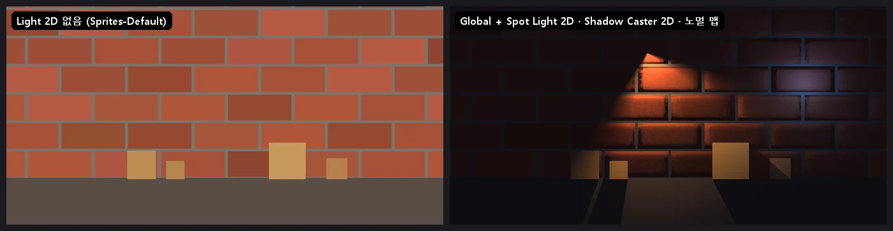

# 2D 빛 (Light 2D · Shadow Caster 2D · 노멀 맵)

Unity (URP 2D) 의 2D 빛과 같은 쓰임. 씬에 켜진 **Light 2D** 가 하나라도 있으면 스프라이트 (Sprite Renderer · Tilemap · 2D 뼈대) 가 빛을 받는다 —
빛이 없는 곳은 어둡다 (Global Light 2D 로 바탕 밝기). Light 2D 가 없으면 예전처럼 조명 없이 (Sprites-Default).

<p align="center"><br/><sub>빛 없음 · Global + Spot Light 2D (그림자 · 노멀 맵)</sub></p>

**GameObject > Light > Global Light 2D / Spot Light 2D**, **Add Component > Rendering > Light 2D / Shadow Caster 2D**

## Light 2D

| 항목 | 내용 |
|---|---|
| Light Type | **Global** = 화면 전체에 색 × 세기 (바탕 밝기), **Spot** = 반지름 · 원뿔 (Unity 6 의 Spot, 예전 Point) |
| Color · Intensity | 빛 색 · 세기 (스프라이트 색에 곱한다) |
| Radius (Inner / Outer) | 안쪽은 가장 밝고 바깥 반지름에서 0 |
| Inner / Outer Spot Angle | 원뿔 (360 = 원). 방향 = 오브젝트의 위 (Y) — Z 축으로 돌린다 |
| Falloff Strength | 0 = 곧게 줄어든다, 1 = 가운데에 몰린다 |
| Shadows · Strength | 켜면 Shadow Caster 2D 뒤를 Strength 만큼 가린다 (빛 8 개까지) |
| Normal Maps · Distance | 노멀 맵이 있는 스프라이트에서 빛의 높이 (작을수록 비스듬히 — 결이 진하다) |

## Shadow Caster 2D

모양 = 같은 오브젝트의 **2D 콜라이더 윤곽** (Box · Circle · Capsule · Polygon · Tilemap Collider 2D), 없으면 스프라이트 사각형.
빛을 등진 모서리를 빛 반대쪽으로 늘려 가린다. **Self Shadows** 를 켜면 자기 모양도 그림자 (끄면 빛을 받는 자기 면은 밝다).

## 노멀 맵

Sprite Renderer 의 **Normal Map** 칸에 노멀 그림 (스프라이트 그림과 같은 배치 — 잘라 놓은 시트면 같은 자리) 을 넣는다
(Unity 는 그림의 Secondary Texture `_NormalMap`). 정점에 접선이 없어도 화면 미분으로 접선 틀을 만든다 (회전 · 뒤집기 · 시트 모두).

## C#

```csharp
using NovaEngine.Rendering.Universal;

var torch = GetComponent<Light2D>();
torch.intensity = 1.5f;
torch.color = new Color(1f, 0.8f, 0.5f, 1f);
torch.pointLightOuterRadius = 6f;
torch.shadowsEnabled = true;
GetComponent<ShadowCaster2D>().selfShadows = true;
```

`lightType` (Global · Point) · `color` · `intensity` · `pointLightInnerRadius` · `pointLightOuterRadius` · `pointLightInnerAngle` · `pointLightOuterAngle` ·
`falloffIntensity` · `shadowsEnabled` · `shadowIntensity` · `normalMapDistance`, `ShadowCaster2D.castsShadows` · `selfShadows`.
트윈 패키지 (com.nova.tween): `light2D.DOIntensity` · `DOColor` · `DOShadowIntensity` · `DORadius`.

## 그리기

`Source/Effects/SpriteBatch.cpp` · `Shaders/51. Sprite.fx`:
1. 그림자 빛마다 가림 모양 (빛을 등진 모서리를 민 사각형) 을 화면 크기 텍스처의 한 채널에 MAX 로 (RGBA 두 장 = 빛 8 개)
2. 스프라이트를 Lit 기법으로: 색 × (Global 의 합 + Spot 마다 반지름 · 원뿔 · 노멀 (N·L) · 그림자). 빛 32 개까지

DirectX 11 · OpenGL · Vulkan 같은 값. CLI: `nova create global-light-2d` · `spot-light-2d`, 값은 `set <대상> --component Light2D --values {...}`.

## 검사

`Tools/tests/run_tests.ps1 -Only light2d` — 직교 카메라 · 흰 바탕의 밝기로: 빛 없음 = 그대로, Global 0.5 = 절반, Spot 거리별 값 · 반지름 밖,
그림자 (상자 뒤 = 바탕, 반대쪽 = 그대로), 자기 그림자, 원뿔, 노멀 맵, C# API (8 항목).

## 아직 없는 것

Freeform · Sprite 모양의 빛, 빛마다 비출 Sorting Layer 고르기 (지금은 모두), Blend Style, 그림자 부드럽게 (지금은 또렷하게).
