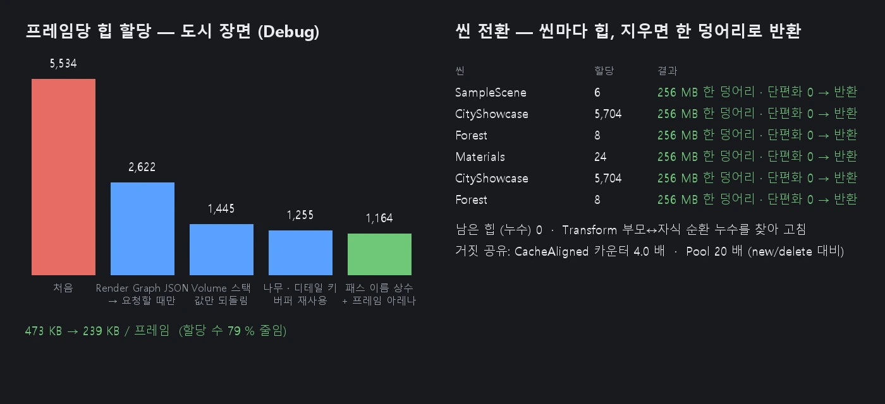

# 메모리 알로케이터 · 캐시 라인 정렬 · 씬 전환 단편화 0

엔진 공용 알로케이터 (Linear · Stack · Pool · Buddy) 와 씬마다의 힙, 프레임 아레나, 거짓 공유 (false sharing) 정리입니다.
씬을 몇 번 오가도 그 씬이 쓴 메모리가 한 덩어리로 합쳐져 운영체제에 돌아가므로 단편화가 남지 않습니다.

## 알로케이터 (`Source/Core/Allocators.h`)

| 이름 | 무엇 | 쓰는 곳 |
|------|------|------|
| `LinearAllocator` | 앞으로만 자르고 한 번에 비운다. `AllocateAtomic` = 여러 스레드 (무잠금 CAS) | 프레임 아레나 |
| `StackAllocator` | 표시까지 되돌리기 · 맨 위만 놓기 (LIFO — 아래 블록 놓기는 거절) | 불러오기 같은 범위 안 임시 |
| `PoolAllocator` | 같은 크기 블록, 빈 블록 목록 (침입형), 묶음 (chunk) 을 위 힙에서 | 씬 힙의 크기별 풀 |
| `ConcurrentPool` | 무잠금 풀 (블록 번호를 MPMC 링으로) | 여러 스레드가 같은 크기를 주고받을 때 |
| `BuddyAllocator` | 2 의 거듭제곱 블록을 나누고 합친다. 다 놓으면 처음 한 덩어리 (단편화 0) | 씬 힙 |
| `Region` | 가상 주소 예약 → 쓰는 만큼 64 KB 단위 확정 → 비면 되돌림 (Windows. 안드로이드 · 웹은 바로 할당) | 모든 알로케이터의 바탕 |
| `CacheAligned<T>` | 한 캐시 라인 (64 B) 을 혼자 쓰는 값 | 스레드마다 바뀌는 값 |
| `LinearResource` | `std::pmr::memory_resource` 어댑터 | `std::pmr::vector` 등 |

- 모든 블록은 64 바이트 (캐시 라인) 에 맞는다.
  - Pool 블록 크기는 64 의 배수로 올린다.
  - Buddy 의 가장 작은 블록은 64 (씬 힙은 1 KB) 다.
- Buddy 는 블록 칸마다 두 바이트 지도를 둔다 (빈 블록의 시작 · 할당한 블록의 시작). 그래서 짝 (buddy) 합치기가 O(1) 이고, 놓을 때 크기를 몰라도 된다.

## 씬 힙 — 씬 전환 단편화 0 (`Source/Core/MemoryHeaps.*`)

**힙 구성**
- 씬 (`Scene`) 마다 힙 하나:
  - 가상 주소 256 MB 를 예약한다 (쓰는 만큼만 확정).
  - Buddy (1 KB 블록) 위에 크기별 Pool 16 종 (64 ~ 1024 B) 을 둔다. Pool 의 묶음 (64 KB) 은 Buddy 에서 받는다.

**힙에서 받는 것**
- `GameObject` — 클래스 `operator new` / `delete`.
- 컴포넌트:
  - `AddComponent<T>` 와 컴포넌트 팩토리가 `std::allocate_shared` + `SceneAllocator` 를 쓴다. 컴포넌트와 shared_ptr 제어 블록이 한 덩어리로 씬 힙에 놓인다.
  - 알로케이터 함수는 NovaCore 가 내보내므로 어느 DLL 이 놓아도 같은 힙으로 돌아간다.

**어느 힙에서 받나**
- 불러오는 씬 (`Scene::Load` 의 `ActiveScope`) 이 있으면 그 씬의 힙이다.
- 없으면 현재 씬의 힙이다.
- 그 밖 (힙 없음 · 가득 · 정렬이 1 KB 넘음) 은 시스템 힙으로 가고, 통계 `fallbacks` 에 센다.
- 놓을 때는 주소로 힙을 찾는다. 어느 힙도 아니면 시스템 힙으로 돌려준다.

**씬을 지울 때** (`Scene::~Scene`)
1. 오브젝트를 다 지운다.
2. Pool 묶음을 Buddy 로 돌려준다.
3. 짝끼리 모두 합쳐져 처음의 한 덩어리가 된다.
4. 영역째 운영체제에 돌려준다.

다른 씬의 메모리와 섞이지 않으므로 몇 번을 오가도 단편화가 남지 않는다.

**남은 힙 (누수 찾기)**
- 씬을 지웠는데 블록이 남으면 (누수, 씬 밖으로 옮긴 오브젝트) 힙은 남은 힙으로 남는다.
- 마지막 블록이 놓일 때 돌려준다.
- Editor.log 에 몇 개 · 몇 바이트, 그리고 무엇이 남았는지 꼬리표별 개수를 적는다. 꼬리표는 Debug 빌드 또는 `NOVA_HEAP_TRACK=1` 일 때 적는다.

**이것으로 찾아 고친 누수**
- **`Transform` 의 부모 ↔ 자식 순환** (`_parent` · `_children` 이 둘 다 `shared_ptr`).
  - 계층이 있는 모든 씬의 Transform 이 해제되지 않았다 (도시 장면: 32 개).
  - 고침: `_parent` 를 `weak_ptr` 로.
- `LightManager::DeleteLight`:
  - 정렬된 빛 목록 (그 뷰를 그릴 때만 다시 만든다) 이 지운 빛을 붙잡았다.
  - 지운 다음 칸을 건너뛰었다.

## 프레임 아레나 (`Source/Core/FrameArena.*`)

- 16 MB `LinearAllocator` 두 개를 프레임마다 번갈아 쓴다. 이번 프레임 칸을 앞으로만 잘라 쓰고, 두 프레임 뒤에 통째로 비운다.
- 놓기는 아무것도 하지 않는다.
- 여러 스레드 (잡) 가 함께 잘라 써도 된다.
- `std::pmr::vector<T> v(FrameArena::Resource());` 처럼 쓴다. 그 프레임 안에서만 쓰고 다음 프레임까지 들고 있으면 안 된다.
- 지금 쓰는 곳: Forward+ 클러스터 짓기의 표 (개수 · 시작 · 채움), 투명 패스의 정렬 목록.

## 프레임당 힙 할당 줄이기 — `nova memory allocs`

Debug CRT 의 할당 훅 (`_CrtSetAllocHook`) 으로 모든 모듈 · 모든 스레드의 힙 할당을 센다 (`Source/Core/AllocTracker.*`).
- 메인 스레드 할당은 그 순간의 Profiler 구간으로 나눈다.
- `--stacks true --scope "…"` 면 호출 스택 표본을 함수 이름 · 줄로 보여 준다.
- 훅 안에서는 할당하지 않는다 (고정 표 · 원자 값 · `RtlCaptureStackBackTrace`).

도시 장면 (Game 뷰, Debug):

| 고침 | 프레임당 할당 |
|------|------|
| 처음 | 5534 (473 KB) |
| Render Graph 정보 (JSON) 를 프레임마다 만들던 것 → 목록을 바꿔치기해 두고 요청할 때만 | 2622 |
| Volume 스택: 프레임마다 효과를 새로 만들어 매개변수 문자열을 복사 → 기본값을 한 번만 만들고 값만 되돌림 | 1445 |
| 나무 · 디테일 메시 찾기 키: 임시 문자열 → 다시 쓰는 버퍼 | 1255 |
| Render Graph 패스 · 자원 이름: `std::string` → 문자열 상수, 프레임 아레나 | **1164 (239 KB) — 79 % 줄임** |

## 거짓 공유 (false sharing)

여러 스레드가 자주 쓰는 값은 캐시 라인을 따로 쓴다.
- Job System:
  - 잠들기 · 깨우기 · Background 수 · 그만두기 · 옮겨진 수를 `alignas(64)` 로 둔다.
  - `Job` 을 64 바이트에 맞춘다. 풀에서 이웃한 잡을 다른 일꾼이 동시에 돌리기 때문이다.
- 렌더 스레드: 메인이 쓰는 제출 번호와 렌더 스레드가 쓰는 완료 번호를 다른 줄에 둔다.
- Profiler: 스레드마다 버퍼를 다른 줄에 둔다.
- 측정: 8 스레드가 각자 카운터를 5 백만 번 올릴 때, 나란히 두면 306 ms, `CacheAligned` 면 80 ms 로 **3.7 ~ 4 배** 빠르다.

## CLI

- `nova memory info` — 씬 힙마다 (예약 · 확정 · 할당 수 · 바이트 · 최고 · Buddy 사용 · 가장 큰 빈 블록 · Pool) · 남은 힙 · 돌려준 수 · 마지막으로 돌려준 힙 (한 덩어리 · 단편화) · 시스템 힙으로 간 수 · 프로세스 개인 메모리 · 프레임 아레나
- `nova memory test [--kind all|linear|stack|pool|concurrentpool|buddy|sceneheap|falsesharing|speed]`
- `nova memory allocs --start true [--stacks true --scope "GameView render"]` → (읽기) `nova memory allocs [--stop true]` — Debug 빌드

## 검사

`Tools/tests/run_tests.ps1 -Only memory` 는 11 항목이다.

| 검사 | 결과 |
|------|------|
| Linear | 8 스레드 x 2 만 무잠금 할당이 겹치지 않는다 |
| Stack | LIFO 를 지킨다 |
| Pool | 100 만 번에 겹침이 없다 |
| ConcurrentPool | 8 스레드에서 한 블록을 두 스레드가 갖는 일이 없다 |
| Buddy | 20 만 번 무작위 · 구조 검사 뒤 다 놓으면 한 덩어리 (단편화 0) · 확정 메모리 64 KB 로 돌아온다 |
| 씬 힙 | 블록이 남으면 남은 힙 → 마지막을 놓으면 돌려준다 |
| 거짓 공유 | 4 배 |
| 속도 (new/delete 대비) | Pool 약 20 배, Buddy 2 배 |
| 씬 전환 8 번 | 매번 앞 씬의 힙이 한 덩어리로 돌아가고 남은 힙이 없다 |
| 프로세스 메모리 | 전환을 거듭해도 자라지 않는다 (같은 씬이면 같은 값) |
| Play → Stop | 힙이 돌아간다 |

## 아직

- 패키지 DLL 이 만드는 컴포넌트 (패키지 안의 `make_shared`) 는 시스템 힙으로 간다. 맞게 동작한다. 패키지의 등록 도우미를 `Heaps::MakeShared` 로 바꾸면 씬 힙으로 간다.
- Render Graph 의 패스마다 작은 목록 (읽기 · 쓰기) 을 프레임 아레나로 옮기기. 뷰마다 남겨 두는 마지막 그래프와 수명을 맞춰야 한다.
- 씬 불러오기의 JSON 파싱 임시 값을 Stack 알로케이터로
