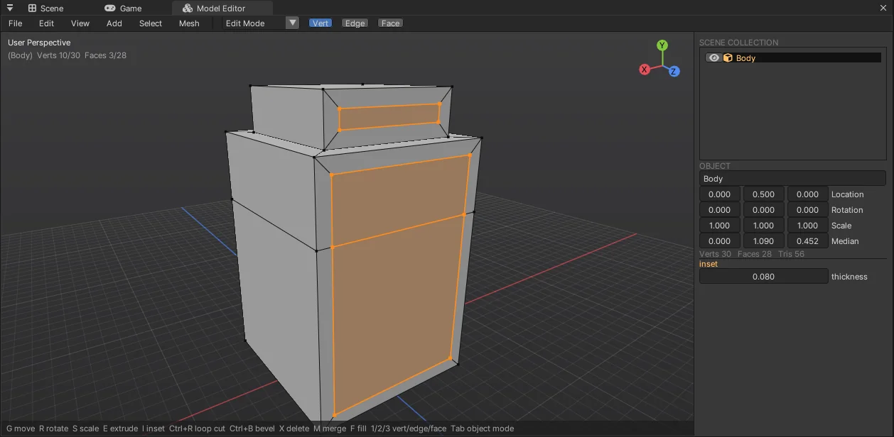
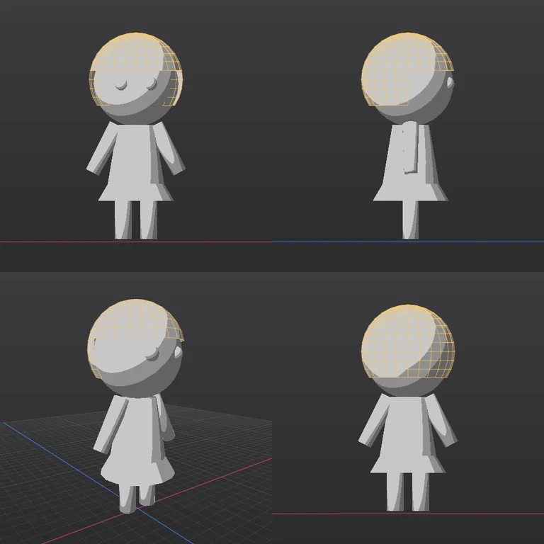

# Model Editor (com.nova.modeling) — 편집기 안의 가벼운 모델링 + AI 용 CLI

Blender 처럼 메시를 고치는 창과, 같은 연산을 AI 에이전트가 터미널에서 부르는 명령 규격입니다.
최종 목표는 AI 가 CLI 만으로 서브컬처(애니메이션풍) 캐릭터를 모델링하고 리깅까지 하는 것입니다 (아래 [로드맵](#로드맵)).

- 넣기: Window > Package Manager 에서 **Model Editor**, 또는 `nova package add com.nova.modeling`
- 열기: Window > **Model Editor** (처음 열면 Scene 탭 옆에 붙는다), Project 창 Create > **Model (Editable Mesh)** (`.nmodel`) 더블클릭, 또는 `nova model window`



## 좌표 · 단위 규칙 (AI 가 꼭 알 것)

| 항목 | 값 |
|---|---|
| 축 | 엔진과 같은 왼손 좌표, **Y 위**, 캐릭터 앞 = **+Z**, 캐릭터 오른쪽 = **+X** |
| 단위 | 미터 (사람 키 ≈ 1.6 ~ 1.8, 2 등신 치비 ≈ 1.0 ~ 1.5) |
| 면 방향 | 점 순서 = 엔진(DirectX) 과 같다: 법선 = (b−a)×(c−a) 가 바깥 (`face.add` 로 직접 만들 때) |
| 좌표 인자 | 모두 **월드** 좌표 (오브젝트 위치 · 회전이 있어도 알아서 바꾼다) |
| 점 · 면 번호 | 활성 오브젝트 메시의 번호. 연산 뒤 바뀔 수 있으니 `get` 으로 다시 읽는다. 번호 없이 고를 수 있는 `select.box` · `select.normal` 을 먼저 쓸 것 |
| 시점 이름 | `front` = +Z 쪽에서 얼굴을 본다 (화면 왼쪽 = 캐릭터 오른손), `back`, `right` = +X 쪽에서, `left`, `top`, `bottom`, `persp`, `three-quarter`, `front-persp` |

## CLI: `nova model <op> [경로] [--이름 값 …]`

- 값은 JSON 으로 읽히면 그대로 (`0.5`, `true`, `[1,2,3]`, `{"a":1}`), `1,2,3` 은 배열, 아니면 글자. 값 없는 `--이름` = `true`
- 결과 = JSON 요약: `objects · verts · faces · tris · min · max · size`, Edit 모드면 `selection {verts, edges, faces, center}` · `boundaryEdges`(열린 변) · `nonManifoldEdges`, 고친 연산은 `changed {무엇: 수}`, `undo`(마지막 Undo 이름)
- 고치는 연산은 하나하나 Undo 됩니다 (`nova model undo` / 창에서 Ctrl+Z). 실패한 연산은 아무것도 바꾸지 않습니다
- `--json` 을 붙이면 결과를 그대로 받는다 (에이전트는 늘 붙일 것). 전체 목록: `nova model help`

### 문서

| op | 인자 | 설명 |
|---|---|---|
| `info` | | 요약 + 오브젝트 목록 (이름 · 점 · 면 · 경계 상자 · 위치) |
| `get` | `--what verts\|faces\|edges [--selected] [--limit 2000]` | 활성 메시의 점 `[i,x,y,z]` · 면 `[i,[점],법선,중심]` · 변 `[i,a,b,면수]` (월드) |
| `new` | | 빈 문서 |
| `open` / `save` | `<파일.nmodel>` | NOVA 모델 (JSON: 오브젝트 · 변환 · 다각형 · UV · 재질 번호) |
| `import` | `<파일> [--append]` | Assimp: FBX · OBJ · glTF/GLB · DAE · 3DS … **사각형 · n 각형 그대로**, 노드 변환은 점에 굽고, FBX 단위 → 미터, 같은 위치 점은 합침 (UV 는 면 모서리에 남음), 부드러운 면 = 파일 법선으로 판단 |
| `export` | `<파일.fbx\|obj\|glb> [--selected]` | FBX 7.4 바이너리 (미터, Y 위, n 각형 + 모서리 법선 · UV · 재질), OBJ, GLB (삼각형). 엔진 · Unity · Blender 에서 읽힌다 |
| `undo` / `redo` | | |
| `render` | `--dir <폴더> [--views front,right,back,top,persp] [--size 768\|[w,h]] [--shading solid\|toon\|normals] [--wire true\|false] [--selection] [--grid] [--xray] [--zoom 1] [--target x,y,z]` | 시점마다 PNG (`<폴더>/<시점>.png`, 또는 `--path 파일.png` 하나). 보이는 것 전체에 맞춰 화면을 채운다. **AI 가 결과를 눈으로 확인하는 방법** |
| `window` / `view` | `view --preset front [--frame]` | 편집기 창 열기 / 창 카메라 |

### 오브젝트

| op | 인자 | 설명 |
|---|---|---|
| `add` | `--type cube\|plane\|circle\|cylinder\|cone\|uvsphere\|icosphere\|torus [--size 1] [--dimensions x,y,z] [--radius] [--radiusTop] [--depth] [--vertices 32] [--segments 32 --rings 16] [--subdivisions 2] [--majorRadius --minorRadius] [--cutsX --cutsZ] [--location x,y,z] [--name] [--smooth]` | Object 모드 = 새 오브젝트 (활성 · 선택), **Edit 모드 = 활성 메시에 더함** (Blender 와 같음) |
| `mode` | `--mode object\|edit [--select vertex\|edge\|face]` | |
| `object.select` | `--name N \| --names [..] [--extend] \| --all true\|false` | 첫 이름 = 활성 |
| `object.transform` | `[--object N] [--location] [--rotation x,y,z (도)] [--scale s\|x,y,z]` | |
| `object.duplicate` · `object.delete` · `object.join` · `object.apply` · `object.rename --name` · `object.visible --visible` | | join = 고른 것을 활성에 합침, apply = 변환을 점에 굽기 |

### 고르기 (활성 메시)

| op | 인자 |
|---|---|
| `select.all` · `select.none` · `select.invert` · `select.linked` · `select.grow` · `select.shrink` | |
| `select.box` | `--min x,y,z --max x,y,z [--extend] [--faces]` — 월드 상자 안의 점 (`--faces` = 면 중심) |
| `select.normal` | `--direction x,y,z [--angle 30] [--extend]` — 법선이 그쪽을 보는 면 |
| `select.verts` · `select.faces` | `--ids [..] [--extend]` |
| `select.edges` | `--ids [..] \| --pairs [[a,b],..] [--extend]` |
| `select.loop` · `select.ring` | `--edge <번호>\|[a,b] [--extend]` — 변 고리 / 변 링 (사각형을 따라) |

### 변환 (Edit = 고른 점, Object = 고른 오브젝트)

| op | 인자 |
|---|---|
| `translate` | `--delta x,y,z \| --to x,y,z` (선택 중심을 그 점으로) |
| `rotate` | `--angle <도> --axis x\|y\|z\|[x,y,z] [--pivot x,y,z]` (기본 = 선택 중심) |
| `scale` | `--factor s\|[x,y,z] [--pivot x,y,z]` |
| `set.positions` | `--positions [[i,x,y,z],..]` (월드) |

### 메시 편집 (고른 것에)

| op | 인자 | 설명 |
|---|---|---|
| `extrude` | `[--distance 0.2] [--direction x,y,z] [--individual]` | 면 영역을 법선 쪽으로 (경계에 옆면), 면이 없으면 고른 경계 변. 새 뚜껑이 선택됨 |
| `inset` | `--thickness 0.05 [--depth 0] [--individual]` | 안쪽 테두리 고리 |
| `loopcut` | `--edge <번호>\|[a,b] [--cuts 1] [--factor 0.5]` | 그 변을 지나는 사각형 고리를 자른다 (고리 끝 삼각형에도 점을 넣어 구멍 없음) |
| `bevel` | `--offset 0.05` | 고른 변 모서리 깎기 (1 단) |
| `subdivide` | `[--cuts 1]` | 고른 면 나누기 (이웃 면에도 중점 → 구멍 없음) |
| `subsurf` | `[--levels 1]` | Catmull-Clark (메시 전체, 부드럽게) |
| `mirror` | `--axis x [--merge true]` | 로컬 축으로 뒤집은 복제 + 가운데 용접 — 반쪽만 만들고 붙이기 |
| `symmetrize` | `--direction +x` | +X 쪽을 −X 로 복사 (가운데를 넘는 면은 지워진다) |
| `merge` | `--type center\|distance [--distance 0.0001]` | |
| `fill` · `bridge` · `delete --type verts\|faces\|only_faces` · `duplicate [--offset]` | | bridge = 두 경계 고리를 사각형으로 |
| `flip` · `recalc_normals [--inside]` · `smooth [--factor --iterations]` · `shade --smooth true\|false` · `triangulate` | | |
| `face.add` | `--points [[x,y,z],..]` | 점들로 면 하나 (같은 자리 점은 합쳐 이어 붙인다) |
| `material.set` | `--index n [--name]` | 고른 면의 재질 칸 (FBX 에 재질로) |

## AI 작업 순서 (권장)

1. `nova model new` → 큰 덩어리부터 `add` (머리 = uvsphere, 몸 = cylinder `--radiusTop`, 팔다리 = cylinder + `object.transform --rotation`)
2. 자주 `render --dir <폴더> --views front,right,three-quarter --shading toon --wire false` 로 **보고 고친다** (그림을 열어 비례 · 대칭 확인)
3. 모양 다듬기: `mode --mode edit` → `select.box` / `select.normal` 로 고르고 `extrude` · `inset` · `scale` · `translate`
4. 대칭: 오른쪽 반(+X)만 만들고 `mirror --axis x`, 또는 `symmetrize --direction +x`
5. 부드럽게: `subsurf --levels 1` + `shade --smooth true`
6. 확인: `info` 의 `boundaryEdges` (닫힌 몸이면 0), `nonManifoldEdges` (0 이 정상)
7. `save <파일.nmodel>`, `export <Assets\…\이름.fbx>` → 엔진에서 바로 쓴다

```bash
nova package add com.nova.modeling
nova model new
nova model add --type cylinder --vertices 16 --radius 0.2 --radiusTop 0.13 --depth 0.42 --location 0,0.62,0 --name Body --smooth
nova model mode --mode edit --select face
nova model select.normal --direction 0,-1,0 --angle 10
nova model extrude --distance 0.12
nova model scale --factor 1.35,1,1.35
nova model mode --mode object
nova model add --type uvsphere --radius 0.3 --location 0,1.12,0 --name Head --smooth
nova model render --dir shots --views front,three-quarter --shading toon --wire false --json
nova model export Assets/Models/Chibi.fbx
```



## 편집기 창

| 조작 | 키 |
|---|---|
| 돌리기 · 옮기기 · 확대 | 가운데 버튼 끌기 (Alt + 왼쪽) · Shift + 가운데 · 휠 |
| 시점 | 숫자 패드 1 / 3 / 7 (Ctrl = 반대쪽), 5 = 원근 ↔ 직교, `.` = 고른 것에 맞춤, Home = 전체 |
| 모드 | Tab = Object ↔ Edit, 1 / 2 / 3 = 점 · 변 · 면 (Edit), 오브젝트 두 번 클릭 = Edit |
| 고르기 | 클릭 (Shift = 더하기/빼기), 끌기 = 상자 (Shift 더하기, Ctrl 빼기), Alt + 클릭 = 변 고리, A / Alt+A / Ctrl+I, L 연결 |
| 변환 | G 옮기기 · R 돌리기 · S 크기 — 그 뒤 X / Y / Z 축 제한, 숫자 입력, Ctrl = 눈금 맞춤, 클릭 · Enter 확정, 오른쪽 · Esc 취소 |
| 편집 | E 돌출 (법선 방향으로 끌기), I Inset (끌기), Ctrl+B Bevel (끌기), Ctrl+R Loop Cut (휠 = 자르는 수, 클릭할 변), Shift+D 복제, X / Delete 지우기, M 합치기, F 채우기, Shift+Ctrl+N 법선 다시 |
| 보기 | Alt+Z X-Ray, View 메뉴: Solid · Toon · Normals, 선 겹쳐 보기, 격자 |
| Undo | Ctrl+Z / Ctrl+Shift+Z (이 창이 포커스면 씬 Undo 대신 이 창의 Undo) |

오른쪽 패널: Outliner(눈 = 보이기), 활성 오브젝트 이름 · 위치 · 회전 · 크기, Edit 모드면 고른 점의 **Median**(값을 바꾸면 옮김), 점 · 면 · 삼각형 수와 열린 변, **Last Operation**(마지막 연산의 값 — 바꾸면 되돌리고 다시, Blender 의 Adjust Last Operation).

## 구조

| 파일 | 내용 |
|---|---|
| `Source/ModelMesh.*` | 편집 메시 (점 + n 각형 + 모서리 UV, 변은 면에서 만든다), 선택 (점 · 변 · 면, Flush), 프리미티브, 모든 편집 연산, 귀 자르기 삼각형 |
| `Source/ModelDocument.*` | 오브젝트 · 모드 · Undo(문서 스냅숏 64 개 / 256 MB), `.nmodel`, Assimp 가져오기 (FBXLoader 와 같은 축 변환) |
| `Source/ModelExport.cpp` | FBX 7.4 바이너리 · OBJ · GLB 를 직접 쓴다 (Assimp Exporter 는 헤더와 DLL 의 구조체 크기가 달라 쓰지 않음) |
| `Source/ModelRaster.*` | CPU 래스터라이저 — 뷰포트와 `render` 가 같은 그림 (DX11 / OpenGL 무관, 창 없이도), 픽셀마다 깊이 · 면 번호 → 고르기 |
| `Source/ModelOps.*` | 연산 표 (이름 → 인자 → 함수). 창 · CLI 가 같은 표를 쓴다, Last Operation |
| `Source/ModelEditorWindow.*` | 창 (뷰포트 · 단축키 · 끌기 연산 · 패널) |
| `Source/Package.cpp` | 창 · `.nmodel` 에셋 · CLI 명령 `model` 등록 |

엔진 쪽: `CliServer::Register / Unregister` 를 패키지에 내보냄 (NOVA_API), `Undo::BlockShortcuts()` (자체 Undo 가 있는 창), NovaCli 의 `model` 하위 명령 (값 없는 플래그가 뒤 `--옵션` 을 먹지 않게 고침).

검사: `Tools\tests\run_tests.ps1 -Only model` (돌출 · Inset · Undo · FBX/OBJ/GLB 내보내기 → 다시 가져와 같은 모양 · Loop Cut · Bevel · Subsurf · Mirror · 렌더 · .nmodel).

## 로드맵

| 단계 | 내용 | 상태 |
|---|---|---|
| 1 | 메시 편집 기본 · 창 · Undo · FBX/OBJ/GLB 가져오기 · 내보내기 · CLI · 시점별 PNG | **완료 (0.1.0)** |
| 2 | AI 모델링 규격 다듬기: 이름 붙인 선택 집합, 기준 이미지(앞 · 옆 그림) 겹쳐 보기, 실루엣 비교 점수, 여러 연산을 한 번에 (`model batch`) | 다음 |
| 3 | 캐릭터 도구: Mirror 모디파이어(실시간 대칭), 비례 편집(Proportional Editing), Subsurf 미리보기, 머리카락 카드 · 커브, UV 펼치기 · 자동 시임, 툰 셰이딩 미리보기 · 외곽선 | |
| 4 | 리깅: 아마추어(본) 편집, Humanoid 템플릿, 자동 가중치(열 확산), 가중치 페인트, 스킨 FBX 내보내기 → 엔진 Animator / Humanoid 리타게팅 | |
