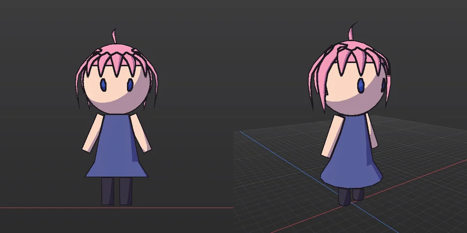
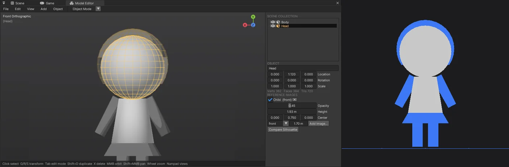
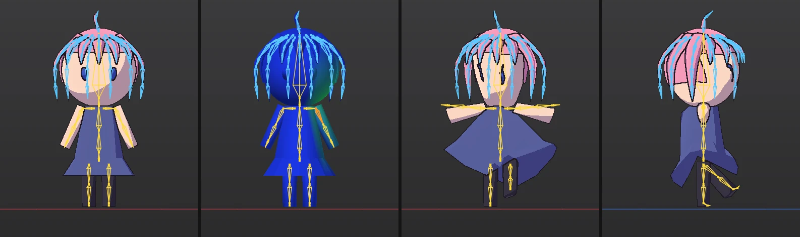
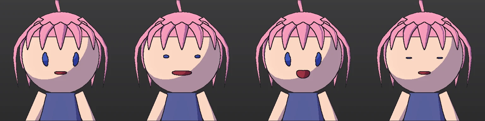

# Model Editor (com.nova.modeling) — 편집기 안의 가벼운 모델링 + AI 용 CLI

Blender 처럼 메시를 고치는 창과, 같은 연산을 AI 에이전트가 터미널에서 부르는 명령 규격입니다.
최종 목표는 AI 가 CLI 만으로 서브컬처(애니메이션풍) 캐릭터를 모델링하고 리깅까지 하는 것입니다 (아래 [로드맵](#로드맵)).

- 넣기: Window > Package Manager 에서 **Model Editor**, 또는 `nova package add com.nova.modeling`
- 열기: Window > **Model Editor** (처음 열면 Scene 탭 옆에 붙는다), Project 창 Create > **Model (Editable Mesh)** (`.nmodel`) 더블클릭, 또는 `nova model window`


## 좌표 · 단위 규칙 (AI 가 꼭 알 것)

| 항목 | 값 |
|---|---|
| 축 | 엔진과 같은 왼손 좌표, **Y 위**, 캐릭터 앞 = **+Z**, 캐릭터 오른쪽 = **+X** |
| 단위 | 미터 (사람 키 ≈ 1.6 ~ 1.8, 2 등신 치비 ≈ 1.0 ~ 1.5) |
| 면 방향 | 점 순서 = 엔진(DirectX) 과 같다: 법선 = (b−a)×(c−a) 가 바깥 (`face.add` 로 직접 만들 때) |
| 좌표 인자 | 모두 **월드** 좌표 (오브젝트 위치 · 회전이 있어도 알아서 바꾼다) |
| 점 · 면 번호 | 활성 오브젝트 메시의 번호. 연산 뒤 바뀔 수 있으니 `get` 으로 다시 읽는다. 번호 없이 고를 수 있는 `select.box` · `select.normal` 을 먼저 쓸 것 |
| 시점 이름 | `front` = +Z 쪽에서 얼굴을 본다 (화면 왼쪽 = 캐릭터 오른손), `back`, `right` = +X 쪽에서, `left`, `top`, `bottom`, `persp`, `three-quarter`, `front-persp` |

## CLI: `nova model <op> [경로] [--이름 값 …]`

- 값은 JSON 으로 읽히면 그대로 (`0.5`, `true`, `[1,2,3]`, `{"a":1}`), `1,2,3` · `800,600` 처럼 쉼표로 이은 숫자는 배열 (개수 상관없이), 아니면 글자. 값 없는 `--이름` = `true`
- 결과 = JSON 요약: `objects · verts · faces · tris · min · max · size`, Edit 모드면 `selection {verts, edges, faces, center}` · `boundaryEdges`(열린 변) · `nonManifoldEdges`, 고친 연산은 `changed {무엇: 수}`, `undo`(마지막 Undo 이름)
- 고치는 연산은 하나하나 Undo 됩니다 (`nova model undo` / 창에서 Ctrl+Z). 실패한 연산은 아무것도 바꾸지 않습니다
- `--json` 을 붙이면 결과를 그대로 받는다 (에이전트는 늘 붙일 것). 전체 목록: `nova model help`

### 문서

| op | 인자 | 설명 |
|---|---|---|
| `info` | | 요약 + 오브젝트 목록 (이름 · 점 · 면 · 경계 상자 · 위치) |
| `get` | `--what verts\|faces\|edges [--selected] [--limit 2000]` | 활성 메시의 점 `[i,x,y,z]` · 면 `[i,[점],법선,중심]` · 변 `[i,a,b,면수]` (월드) |
| `new` | | 빈 문서 |
| `open` / `save` | `<파일.nmodel>` | NOVA 모델 (JSON: 오브젝트 · 변환 · 다각형 · UV · 재질 번호) |
| `import` | `<파일> [--append]` | Assimp: FBX · OBJ · glTF/GLB · DAE · 3DS … **사각형 · n 각형 그대로**, 노드 변환은 점에 굽고, FBX 단위 → 미터, 같은 위치 점은 합침 (UV 는 면 모서리에 남음), 부드러운 면 = 파일 법선으로 판단 |
| `export` | `<파일.fbx\|obj\|glb\|vrm> [--selected] [--title] [--author] [--outlineWidth 0.003]` | FBX 7.4 바이너리 (미터, Y 위, n 각형 + 모서리 법선 · UV · 재질, 아마추어가 있으면 **본 (LimbNode) + Skin / Cluster + BindPose** — Unity · Blender 가 그대로 읽는다), OBJ, GLB (삼각형, 아마추어가 있으면 **스킨**), **VRM 1.0** (스킨 + humanoid + spring bone + MToon 재질 + 표정 — [리깅](#리깅-4-단계)). OBJ 에는 본이 들어가지 않는다 (결과에 `warning`) |
| `undo` / `redo` | | |
| `render` | `--dir <폴더> [--views front,right,back,top,persp] [--size 768\|[w,h]] [--shading solid\|toon\|normals\|weights --bone <본>] [--bones true] [--wire true\|false] [--selection] [--grid] [--xray] [--zoom 1] [--target x,y,z]` | 시점마다 PNG (`<폴더>/<시점>.png`, 또는 `--path 파일.png` 하나). 보이는 것 전체에 맞춰 화면을 채운다. **AI 가 결과를 눈으로 확인하는 방법** |
| `window` / `view` | `view --preset front [--frame]` | 편집기 창 열기 / 창 카메라 |

### 오브젝트

| op | 인자 | 설명 |
|---|---|---|
| `add` | `--type cube\|plane\|circle\|cylinder\|cone\|uvsphere\|icosphere\|torus [--size 1] [--dimensions x,y,z] [--radius] [--radiusTop] [--depth] [--vertices 32] [--segments 32 --rings 16] [--subdivisions 2] [--majorRadius --minorRadius] [--cutsX --cutsZ] [--location x,y,z] [--name] [--smooth]` | Object 모드 = 새 오브젝트 (활성 · 선택), **Edit 모드 = 활성 메시에 더함** (Blender 와 같음) |
| `mode` | `--mode object\|edit [--select vertex\|edge\|face]` | |
| `object.select` | `--name N \| --names [..] [--extend] \| --all true\|false` | 첫 이름 = 활성 |
| `object.transform` | `[--object N] [--location] [--rotation x,y,z (도)] [--scale s\|x,y,z]` | |
| `object.duplicate` · `object.delete` · `object.join` · `object.apply` · `object.rename --name` · `object.visible --visible` | | join = 고른 것을 활성에 합침, apply = 변환을 점에 굽기 |

### 고르기 (활성 메시)

| op | 인자 |
|---|---|
| `select.all` · `select.none` · `select.invert` · `select.linked` · `select.grow` · `select.shrink` | |
| `select.box` | `--min x,y,z --max x,y,z [--extend] [--faces]` — 월드 상자 안의 점 (`--faces` = 면 중심) |
| `select.normal` | `--direction x,y,z [--angle 30] [--extend]` — 법선이 그쪽을 보는 면 |
| `select.verts` · `select.faces` | `--ids [..] [--extend]` |
| `select.edges` | `--ids [..] \| --pairs [[a,b],..] [--extend]` |
| `select.loop` · `select.ring` | `--edge <번호>\|[a,b] [--extend]` — 변 고리 / 변 링 (사각형을 따라) |

### 변환 (Edit = 고른 점, Object = 고른 오브젝트)

| op | 인자 |
|---|---|
| `translate` | `--delta x,y,z \| --to x,y,z` (선택 중심을 그 점으로) |
| `rotate` | `--angle <도> --axis x\|y\|z\|[x,y,z] [--pivot x,y,z]` (기본 = 선택 중심) |
| `scale` | `--factor s\|[x,y,z] [--pivot x,y,z]` |
| `set.positions` | `--positions [[i,x,y,z],..]` (월드) |

### 메시 편집 (고른 것에)

| op | 인자 | 설명 |
|---|---|---|
| `extrude` | `[--distance 0.2] [--direction x,y,z] [--individual]` | 면 영역을 법선 쪽으로 (경계에 옆면), 면이 없으면 고른 경계 변. 새 뚜껑이 선택됨 |
| `inset` | `--thickness 0.05 [--depth 0] [--individual]` | 안쪽 테두리 고리 |
| `loopcut` | `--edge <번호>\|[a,b] [--cuts 1] [--factor 0.5]` | 그 변을 지나는 사각형 고리를 자른다 (고리 끝 삼각형에도 점을 넣어 구멍 없음) |
| `bevel` | `--offset 0.05` | 고른 변 모서리 깎기 (1 단) |
| `subdivide` | `[--cuts 1]` | 고른 면 나누기 (이웃 면에도 중점 → 구멍 없음) |
| `subsurf` | `[--levels 1]` | Catmull-Clark (메시 전체, 부드럽게) |
| `mirror` | `--axis x [--merge true]` | 로컬 축으로 뒤집은 복제 + 가운데 용접 — 반쪽만 만들고 붙이기 |
| `symmetrize` | `--direction +x` | +X 쪽을 −X 로 복사 (가운데를 넘는 면은 지워진다) |
| `merge` | `--type center\|distance [--distance 0.0001]` | |
| `fill` · `bridge` · `delete --type verts\|faces\|only_faces` · `duplicate [--offset]` | | bridge = 두 경계 고리를 사각형으로 |
| `flip` · `recalc_normals [--inside]` · `smooth [--factor --iterations]` · `shade --smooth true\|false` · `triangulate` | | |
| `face.add` | `--points [[x,y,z],..]` | 점들로 면 하나 (같은 자리 점은 합쳐 이어 붙인다) |
| `material.set` | `--index n [--name]` | 고른 면의 재질 칸 (FBX 에 재질로) |

### 캐릭터 도구 (3 단계)

| op | 인자 | 설명 |
|---|---|---|
| `modifier.mirror` | `--enable true\|false [--clip true]` | **실시간 X 거울**: 반쪽(+X)만 만들면 나머지가 늘 따라온다 (원래 메시는 반쪽 그대로). Clipping = 가운데(X = 0) 점은 옮겨도 0 에 남는다 |
| `modifier.subsurf` | `--levels 0..3` | Subdivision Surface **미리보기** (원래 메시는 거친 그대로 편집) |
| `modifier.apply` | | 결과를 원래 메시로 굽고 모디파이어를 끈다 |
| (변환) `--proportional` | `translate / rotate / scale … --proportional <반경 m> [--falloff smooth\|sphere\|root\|sharp\|linear\|constant]` | **비례 편집**: 고른 점 = 100 %, 반경 안 점 = 거리에 따라 덜 — 얼굴 · 몸 모양을 부드럽게 끌기 |
| `hair.strand` | `--points [[x,y,z],..] (뿌리 → 끝) [--width 0.08] [--thickness 0.03] [--tip 0] [--sides 4] [--center 머리 중심] [--segments] [--material n] [--name Hair]` | **애니메이션풍 머리 다발**: 점들을 부드러운 곡선으로 잇고 납작한 단면이 끝으로 갈수록 가늘어진다 (끝 뾰족, 뿌리 막힘, 닫힌 메시). 단면은 center 에서 바깥을 본다. Edit 모드면 활성 메시에, 아니면 새 오브젝트 |
| `hair.card` | 같은 인자 (`--sides` 없음) | 평평한 머리카락 카드 (앞면 = 머리 바깥), UV u = 가로 · v = 뿌리 → 끝 |
| `uv.smart` | `[--angle 66] [--margin 0.02]` | **Smart UV Project**: 법선 각도로 덩어리 → 평면 투영 → 0..1 에 쌓기 (자동 이음매) |
| `uv.project` | `--mode box\|cylinder\|sphere\|planar` | 투영 UV (0..1 에 맞춤) |
| `material.set` | `--index n [--name] [--color r,g,b] [--only]` | 고른 면 (없으면 전체) 의 재질 + **색** (툰 미리보기 · FBX Diffuse · OBJ .mtl) |
| `material.list` | | 번호 · 이름 · 색 · 쓰는 면 수 |
| `render` | `--shading toon` (외곽선 기본 켬) `\| uv` `[--outline] [--outlineWidth px]` | 툰 = 2 톤(그림자 = 푸르스름) + 잉크 외곽선, uv = 바둑판 (늘어남 확인, UV 없는 면 = 분홍) |

UV 는 Subdivide · Loop Cut · Subsurf 를 거쳐도 남는다 (모서리 UV 를 보간). 결과(`info`)에 `uvFaces`(UV 있는 면 수), 모디파이어가 있으면 `modifiers` · `evaluated {verts, faces, boundaryEdges}`. 내보내기 · 렌더 · 비교는 모디파이어 결과를 쓴다.



예: [examples/model_chibi.txt](examples/model_chibi.txt) — `nova model new` 뒤 `nova model batch docs/examples/model_chibi.txt` 한 번 (연산 62 개) 으로 위 캐릭터.

### 버텍스 그룹 (이름 있는 선택 집합)

점마다 그룹 · 가중치(0..1) 를 가진다. **연산을 거쳐도 따라간다**: 돌출 · Inset · 복제 = 복사, Subdivide · Loop Cut · Subsurf 의 새 점 = 양쪽 가중치 보간, Mirror X = `.L ↔ .R` (`_L/_R`, `Left/Right`) 이름을 바꿔 붙인다. 점 번호가 바뀌어도 `group.select` 로 다시 고를 수 있어 AI 가 부위(머리 · 팔 · 앞머리 …)를 이름으로 다룬다. 리깅 단계에서는 이 가중치가 스킨 가중치가 된다.

| op | 인자 |
|---|---|
| `group.assign` | `--name <그룹> [--weight 1]` — 고른 점을 그룹에 (없으면 만든다) |
| `group.remove` | `--name` — 고른 점을 그룹에서 뺀다 |
| `group.select` | `--name [--extend] [--deselect]` |
| `group.delete` · `group.list` | list = 이름 · 점 수 · 경계 상자 (월드) |

### 체크포인트 · 여러 연산 한 번에

| op | 인자 | 설명 |
|---|---|---|
| `checkpoint` | `--save <이름> \| --restore <이름> \| --delete <이름> \| --list` | 문서 상태에 이름을 붙여 두고 되살린다 (되살리기도 Undo 된다). 시도해 보고 마음에 안 들면 돌아가기 |
| `batch` | `nova model batch <파일 \| ->` (줄마다 `add --type cube …`, 앞의 `nova model` 있어도 됨, `#` 주석) 또는 `--steps [{"op":…}, …]` `[--atomic true]` | **Undo 한 번**으로 차례로 실행. 실패하면 그 단계 번호 · 이유를 알리고 (atomic) 모두 되돌린다. 결과 = 요약 + 단계마다 `changed` 등. `new` · `open` · `undo` · `redo` 는 안에 못 쓴다 |

### 기준 그림 · 실루엣 비교 (AI 가 그림에 맞춰 모델링)

| op | 인자 | 설명 |
|---|---|---|
| `ref.add` | `<그림> [--view front\|back\|left\|right\|top] [--height 1.7] [--center x,y,z] [--opacity 0.5] [--name]` | 그 시점에서 볼 때 모델 뒤에 까는 그림 (Blender 의 Reference). 높이 = 그림 세로가 차지하는 미터, 기본 위치 = 아래 끝이 바닥 (y = 0). 창 · `render` 에서 그 시점을 볼 때만 보인다. `.nmodel` 에 경로로 저장 |
| `ref.set` · `ref.remove` · `ref.list` | `--name [--height] [--center] [--opacity] [--visible]` | |
| `compare` | `[--ref 이름] [--bands 12] [--out diff.png] [--size 512] [--threshold 0.2]` | 기준 그림의 시점 · 크기 그대로 보이는 메시 전체를 그려 겹쳐 본다. `iou`(1 = 같음), `extra`(기준 밖으로 나간 메시), `missing`(못 덮은 기준), 높이 띠마다 `refWidth` · `meshWidth` · 가운데, **`hints`**(예: `near (0.00, 0.63, 0.00): mesh 0.37 m wide, reference 0.71 m (widen by 0.34 m)`), `--out` = 차이 그림 (회색 겹침 · 빨강 메시만 · 파랑 기준만). 기준 그림 = 투명 PNG 면 알파, 아니면 네 모서리 색 (배경) 과 다른 픽셀 |



## 리깅 (4 단계)

본 = 문서 (월드) 좌표의 머리 → 꼬리. **스킨 가중치 = 본 이름과 같은 버텍스 그룹** (Blender 와 같은 규칙) 이라 `group.*` 으로 손으로 고칠 수 있고, 연산을 거쳐도 따라가며 X 거울은 `Left ↔ Right` 를 바꿔 단다. 사람 본 이름 = Unity HumanBodyBones (`Hips`, `LeftUpperArm` …).

| op | 인자 | 설명 |
|---|---|---|
| `rig.humanoid` | `[--style auto\|chibi\|adult] [--points {"LeftHand":[x,y,z], …, "Head.end":[x,y,z]}] [--upperChest]` | Humanoid 뼈대 21 개 (+ UpperChest) 를 메시에 맞춘다. **부위는 오브젝트 · 버텍스 그룹 이름으로** 찾는다: `Head`/`Face`, `Body`/`Torso`/`Chest`/`Dress`, `Arm…`, `Hand…`, `Leg…`/`Thigh`/`Stocking`, `Foot`/`Shoe` — 왼쪽 / 오른쪽은 위치 (X < 0 = 왼쪽). 팔 = 주축의 양 끝 (몸 쪽이 어깨), 다리 = 위 · 아래 띠 중심, 발끝 = 가장 앞 점. 못 찾은 부위는 키 비율 틀 (`style`), 결과의 `note` 에 무엇을 못 찾았는지. 사람 본이 아닌 본 (사슬) 은 이름으로 다시 붙는다 |
| `rig.weights` | `[--objects A,B] [--method auto\|nearest] [--smooth 4] [--keepSpring true]` | 자동 가중치: 메시 덩어리마다 **그 안을 지나는 본** (덩어리 굵기 안) 만 후보 → 거리⁻⁴ → 변으로 이웃과 섞기 (열 확산 근사) → 점마다 최대 4 본. 흔들림 사슬 점은 그대로 |
| `rig.chain` | `--objects Bang*,Back* \| (Object 모드에서 고른 것) [--group <그룹>] [--radial 8] [--bones auto] [--parent Head] [--name] [--stiffness 0.75] [--drag 0.4] [--gravity 0.05] [--radius 0.02] [--minVerts 6]` | **흔들림 사슬**: 덩어리 (머리 다발) 마다 부모 본에 가장 가까운 점 = 뿌리 → 측지 거리로 끝까지 마디를 나눠 본 (`이름_0, _1 …`) + 가중치 (마디 사이 선형, 뿌리는 부모와 섞음). `--radial N` = 치마: 둘레를 N 조각 (위 → 아래). 이름 끝 `*` = 그 이름으로 시작하는 모두. 몸 충돌체가 없으면 만든다 |
| `rig.colliders` | `[--scale 0.9] [--clear]` | 머리 = 구, 몸통 · 팔 · 다리 = 캡슐. 굵기 = 그 본이 주인 점까지 거리의 중앙값 |
| `rig.bone` | `--name <본> [--head x,y,z] [--tail x,y,z] [--parent <본>] [--rename] [--human <이름>] [--deform] [--spring true --stiffness …] [--delete] \| --add` | 본 하나 고치기 (이름을 바꾸면 그룹 이름도) |
| `rig.pose` | `--bone <본> --rotation x,y,z (도, 월드 축, 부모 위에) \| --reset` | **포즈 미리보기**: 창 · `render` 가 스킨 메시를 그린다 (가중치 확인 — 팔을 들어 보고, 무릎을 굽혀 본다). 저장 · 내보내기 하지 않음 |
| `rig.paint` | `--bone <본> --center x,y,z --radius 0.05 [--weight 1] [--strength 1] [--mode add\|subtract\|smooth] [--normalize true] [--object]` | **가중치 붓**: 월드 구 안 점의 그 본 가중치를 부드러운 감쇠로 칠한다. normalize = 다른 본을 줄여 합 1 (Blender 의 Auto Normalize). 창: 본을 고르고 **Paint** → 메시 위를 왼쪽 끌기 (한 획 = Undo 하나, Add / Subtract / Smooth, 반경 px · 세기 · 값) |
| `rig.list` · `rig.check` · `rig.clear [--weights true]` | | 본 목록 · 문제 (가중치 없는 점, 빠진 사람 본) · 지우기 |

내보내기 `export Chibi.vrm` = **VRM 1.0**: 본 노드 (회전 없음) + skin, `VRMC_vrm` humanoid · meta, `VRMC_springBone` (사슬 + 끝 노드, 충돌체), `VRMC_materials_mtoon` (재질 색 → 그림자 = 푸르스름하게, 외곽선). 엔진에서 `nova create character --model Assets/…/Chibi.vrm` 한 번으로 **Humanoid Idle 리타게팅 + Dynamic Bone (머리카락) + lilToon 툰** 이 붙는다. 메시 노드 이름이 본과 겹치면 `_Mesh` 를 붙인다 (메시 `Head` · 본 `Head` — FBX 도 같다), 재질은 처음 쓰는 순서로 쓴다 (Assimp 가 그 순서로 읽는다).
`export Chibi.fbx` 도 엔진에서 같은 모양 · 재질 색으로 (`Chibi_FBX.Materials` 의 Lit 재질 — 툰 재질은 VRM).

예: [examples/model_chibi_rig.txt](examples/model_chibi_rig.txt) — `model_chibi.txt` 뒤 `nova model batch docs/examples/model_chibi_rig.txt`, `nova model export Assets/Models/Chibi.vrm --title Chibi`.
천 옷 (치마 · 망토 — 엔진의 [Cloth](CLOTH.md#캐릭터-옷-skinned-mesh-renderer)): [examples/model_chibi_cloth.txt](examples/model_chibi_cloth.txt) — `model_chibi.txt` 뒤에 (리깅까지 들어 있다).



창: 오른쪽 패널 **ARMATURE** (Humanoid · Auto Weights · Chains (고른 오브젝트) · Colliders, 본 목록 — 고르면 Show Weights · 포즈 X Y Z 끌기 · Reset Pose), View 메뉴 **Weights (selected bone)** · **Bones**.

## 셰이프 키 (표정)

Blender 의 Shape Keys: 점마다 셰이프별 위치 차이를 갖고 (버텍스 그룹처럼 돌출 · 나누기 · Mirror 를 따라간다, X 거울은 `blinkLeft ↔ blinkRight` 이름도 바꾼다). **고치는 셰이프가 있으면 `translate` · `rotate` · `scale` · `set.positions` 는 그 셰이프의 차이만 바꾼다** (기본 메시는 그대로). 이름이 VRM 표정 이름이면 `export *.vrm` 에서 그 표정이 된다 (`happy angry sad relaxed surprised aa ih ou ee oh blink blinkLeft blinkRight neutral lookUp …`, 아니면 custom).

| op | 인자 | 설명 |
|---|---|---|
| `shape.add` | `--name <키> [--object]` | 새 셰이프 (고치는 셰이프가 된다) |
| `shape.edit` | `--name <키> \| --basis` | 무엇을 고치나 (basis = 메시 자체) |
| `shape.value` | `--name <키> --value 0..1` | 미리보기 (창 · `render`) |
| `shape.list` · `shape.delete --name` | | 이름 · 움직이는 점 수 · 값 · 고치는 중 |
| `shape.mirror` | `--name blinkLeft --to blinkRight` | 반대쪽으로 복사 (X 거울 짝이 있는 점) |

내보내기: GLB · VRM 의 모프 타깃 (`targets` POSITION 차이 + `extras.targetNames`), VRM 은 `VRMC_vrm.expressions` (같은 이름 셰이프가 여러 오브젝트에 있으면 묶음 여러 개 — 예: `blink` = 왼눈 + 오른눈, 웃음 · 화남 · 슬픔 · 놀람 · relaxed 는 `overrideBlink: block`). 엔진에서는 **Expressions** 컴포넌트 (자동 깜빡임) + Skinned Mesh Renderer 의 BlendShape.

예: [examples/model_chibi_face.txt](examples/model_chibi_face.txt) — 입 + 눈 `blink · blinkLeft/Right · happy`, 입 `aa ih ou ee oh happy`. 창: 오른쪽 **SHAPE KEYS** (Basis, 셰이프마다 연필 = 고치기 · 값 끌기 = 미리보기, + Shape).



## 애니메이션 (5 단계)

리깅한 캐릭터에 클립을 만든다: `rig.pose` 로 자세를 잡고 `anim.key --time t` 로 그 시각에 **전체 자세 키** (흔들림 본 제외), 루트 (Hips) 는 `rig.pose --bone Hips --move x,y,z` 의 이동도 키. 키 사이 = slerp / lerp, 루프 클립은 끝 → 처음. 내보내기 `export *.glb` / `*.vrm` 에 glTF 애니메이션 (본 rotation + Hips translation, 루프면 끝에 처음 키를 한 번 더) — GLB 도 사람 본이 다 있으면 `VRMC_vrm.humanoid` 를 넣어 엔진이 정확한 매핑으로 **어떤 캐릭터에든 Humanoid 리타게팅**.

| op | 인자 | 설명 |
|---|---|---|
| `anim.new` | `--name <클립> [--length 1] [--fps 30] [--loop true]` | 새 클립 (활성, 자세 초기화) |
| `anim.key` | `--time <초> [--bones A,B]` | 지금 자세를 그 시각에 (같은 시각 키는 바꾼다) |
| `anim.time` | `--time <초>` | 활성 클립의 그 시각 자세로 (`render` 로 확인) |
| `anim.select` · `anim.list` · `anim.delete` | `--name` | |
| `rig.pose` | `... [--move x,y,z]` | 루트 본 이동 (걸음의 오르내림 등) |

회전 = 도 (월드 축, 부모 위에): 다리 `pitch −` = 앞으로, 아래팔 `pitch −` = 팔꿈치를 앞으로, 왼팔 `roll −` / 오른팔 `roll +` = 몸 밖으로, `yaw +` = 캐릭터 오른쪽으로. 리타게팅은 **쉬는 자세에서의 회전** 을 옮기므로 원본 캐릭터의 쉬는 자세 (예: 팔이 25° 벌어진 치비) 를 보고 값을 정한다.

예: [examples/anim_basic.txt](examples/anim_basic.txt) — Idle (숨쉬기 · 무게 이동) · Walk (제자리 걸음) · Wave (손 흔들기) · GetUpBack · GetUpFront (래그돌에서 일어나기 — 한 번 재생, `--loop false`). 이것을 내보낸 것이 엔진의 **기본 캐릭터 애니메이션** `Resources/Packages/Character/Animations/Nova_Basic.glb` (DefaultCharacter.controller: Idle 기본 + Walk · Wave 상태, C# `Animator.Play("Wave")`).

## AI 작업 순서 (권장)

0. (그림이 있으면) `ref.add front.png --view front --height 1.5`, `ref.add side.png --view right --height 1.5` — 같은 키로
1. `nova model new` → 큰 덩어리부터 `add` (머리 = uvsphere, 몸 = cylinder `--radiusTop`, 팔다리 = cylinder + `object.transform --rotation`)
2. 자주 `render --dir <폴더> --views front,right,three-quarter --shading toon --wire false` 로 **보고 고친다** (그림을 열어 비례 · 대칭 확인)
3. 모양 다듬기: `mode --mode edit` → `select.box` / `select.normal` 로 고르고 `extrude` · `inset` · `scale` · `translate`
4. 대칭: `modifier.mirror --enable true` 를 켜고 +X 반쪽만 고친다 (끝나면 `modifier.apply`), 또는 `mirror --axis x` / `symmetrize --direction +x`
5. 부드럽게: `modifier.subsurf --levels 2` 로 보면서 거친 메시를 고치고, 모양은 `--proportional 0.2` 로 부드럽게 끈다. `shade --smooth true`
5-1. 머리카락: 머리 중심을 `--center` 로 주고 `hair.strand` 를 뿌리 → 끝 점으로 (앞머리 · 옆머리 · 뒷머리 · 아호게), 색은 `material.set --index 1 --color …` + `--material 1`
5-2. UV: `uv.smart`, 확인 `render --shading uv`
6. 확인: `info` 의 `boundaryEdges` (닫힌 몸이면 0), `nonManifoldEdges` (0 이 정상), 기준 그림이 있으면 `compare` 의 `hints` 를 따라 고치고 `iou` 가 오르는지 본다
   - 부위마다 `group.assign --name Head` 처럼 이름을 붙여 두면, 번호가 바뀐 뒤에도 `group.select` 로 다시 고른다
   - 큰 변경 전 `checkpoint --save v1`, 여러 연산은 파일에 적어 `batch` 로 (한 번에 되돌릴 수 있다)
7. 리깅: 부위 이름을 `Head` · `Body` · `ArmL` · `ArmR` · `LegL` · `LegR` 처럼 붙여 두고 `rig.humanoid` → `rig.weights` → `rig.chain --objects <머리카락 오브젝트>* --parent Head` → `rig.check` (`ok`), `rig.pose` 로 팔다리를 굽혀 `render` 로 확인 (팔이 원기둥 하나면 팔꿈치가 안 굽는다 — `loopcut` 으로 마디를 넣는다)
7-1. 표정: `object.select --name <눈 · 입>` → `mode --mode edit` → `select.all` → `shape.add --name happy` → `scale` / `translate` (그 셰이프만) → `shape.edit --basis`, 확인 `shape.value --name happy --value 1` + `render`
8. `save <파일.nmodel>`, `export <Assets\…\이름.fbx>` (메시만) 또는 `export <Assets\…\이름.vrm>` (리깅 캐릭터) → 엔진에서 바로 쓴다

```bash
nova package add com.nova.modeling
nova model new
nova model add --type cylinder --vertices 16 --radius 0.2 --radiusTop 0.13 --depth 0.42 --location 0,0.62,0 --name Body --smooth
nova model mode --mode edit --select face
nova model select.normal --direction 0,-1,0 --angle 10
nova model extrude --distance 0.12
nova model scale --factor 1.35,1,1.35
nova model mode --mode object
nova model add --type uvsphere --radius 0.3 --location 0,1.12,0 --name Head --smooth
nova model render --dir shots --views front,three-quarter --shading toon --wire false --json
nova model export Assets/Models/Chibi.fbx
```


## 편집기 창

| 조작 | 키 |
|---|---|
| 돌리기 · 옮기기 · 확대 | 가운데 버튼 끌기 (Alt + 왼쪽) · Shift + 가운데 · 휠 |
| 시점 | 숫자 패드 1 / 3 / 7 (Ctrl = 반대쪽), 5 = 원근 ↔ 직교, `.` = 고른 것에 맞춤, Home = 전체 |
| 모드 | Tab = Object ↔ Edit, 1 / 2 / 3 = 점 · 변 · 면 (Edit), 오브젝트 두 번 클릭 = Edit |
| 고르기 | 클릭 (Shift = 더하기/빼기), 끌기 = 상자 (Shift 더하기, Ctrl 빼기), Alt + 클릭 = 변 고리, A / Alt+A / Ctrl+I, L 연결 |
| 변환 | G 옮기기 · R 돌리기 · S 크기 — 그 뒤 X / Y / Z 축 제한, 숫자 입력, Ctrl = 눈금 맞춤, 클릭 · Enter 확정, 오른쪽 · Esc 취소 |
| 비례 편집 | O 켜고 끄기, G/R/S 하는 동안 휠 = 반경 (흰 원), 패널에서 감쇠 · 반경 |
| 편집 | E 돌출 (법선 방향으로 끌기), I Inset (끌기), Ctrl+B Bevel (끌기), Ctrl+R Loop Cut (휠 = 자르는 수, 클릭할 변), Shift+D 복제, X / Delete 지우기, M 합치기, F 채우기, Shift+Ctrl+N 법선 다시 |
| 보기 | Alt+Z X-Ray, View 메뉴: Solid · Toon · Normals · UV Checker, Toon Outline, 선 겹쳐 보기, 격자, 기준 그림. Mesh > UV: Smart UV Project · Cube · Cylinder · Sphere · Project From Normal |
| Undo | Ctrl+Z / Ctrl+Shift+Z (이 창이 포커스면 씬 Undo 대신 이 창의 Undo) |

오른쪽 패널: Outliner(눈 = 보이기), 활성 오브젝트 이름 · 위치 · 회전 · 크기, Edit 모드면 고른 점의 **Median**(값을 바꾸면 옮김), 점 · 면 · 삼각형 수와 열린 변, **Modifiers**(Mirror X · Clipping · Subdivision 0..3 · Apply, Proportional 감쇠 · 반경), **Materials**(Edit: 색 · Assign · + Slot), **Vertex Groups**(Assign · Remove · Select · Deselect · 지우기), **Reference Images**(보이기 · 투명도 · 높이 · 중심, 시점 고르고 Add Image… → 그 시점으로, Compare Silhouette), **Last Operation**(마지막 연산의 값 — 바꾸면 되돌리고 다시, Blender 의 Adjust Last Operation).

## 구조

| 파일 | 내용 |
|---|---|
| `Source/ModelMesh.*` | 편집 메시 (점 + n 각형 + 모서리 UV, 변은 면에서 만든다), 선택 (점 · 변 · 면, Flush), 프리미티브, 모든 편집 연산, 귀 자르기 삼각형 |
| `Source/ModelDocument.*` | 오브젝트 · 모드 · Undo(문서 스냅숏 64 개 / 256 MB), `.nmodel`, Assimp 가져오기 (FBXLoader 와 같은 축 변환) |
| `Source/ModelExport.cpp` | FBX 7.4 바이너리 · OBJ · GLB 를 직접 쓴다 (Assimp Exporter 는 헤더와 DLL 의 구조체 크기가 달라 쓰지 않음) |
| `Source/ModelRaster.*` | CPU 래스터라이저 — 뷰포트와 `render` 가 같은 그림 (DX11 / OpenGL 무관, 창 없이도), 픽셀마다 깊이 · 면 번호 → 고르기 |
| `Source/ModelOps.*` | 연산 표 (이름 → 인자 → 함수). 창 · CLI 가 같은 표를 쓴다, Last Operation |
| `Source/ModelMesh.*` (셰이프 키) | `Vert::K` (셰이프 번호, 차이), `Mesh::Shapes`, `ApplyShapes`, Mirror 의 Left ↔ Right |
| `Source/ModelRig.*` | 아마추어 (본 · 충돌체 · 포즈), Humanoid 맞추기, 자동 가중치, 흔들림 사슬, 포즈 스킨 (창 · 렌더) |
| `Source/ModelEditorWindow.*` | 창 (뷰포트 · 단축키 · 끌기 연산 · 패널) |
| `Source/Package.cpp` | 창 · `.nmodel` 에셋 · CLI 명령 `model` 등록 |

엔진 쪽: `CliServer::Register / Unregister` 를 패키지에 내보냄 (NOVA_API), `Undo::BlockShortcuts()` (자체 Undo 가 있는 창), NovaCli 의 `model` 하위 명령 (값 없는 플래그가 뒤 `--옵션` 을 먹지 않게 고침).

검사: `Tools\tests\run_tests.ps1 -Only model` (돌출 · Inset · Undo · FBX/OBJ/GLB 내보내기 → 다시 가져와 같은 모양 · Loop Cut · Bevel · Subsurf · Mirror · 렌더 · .nmodel).

## 로드맵

| 단계 | 내용 | 상태 |
|---|---|---|
| 1 | 메시 편집 기본 · 창 · Undo · FBX/OBJ/GLB 가져오기 · 내보내기 · CLI · 시점별 PNG | **완료 (0.1.0)** |
| 2 | AI 모델링 규격: 버텍스 그룹(이름 있는 선택 + 가중치, 연산을 따라감), 체크포인트, `batch`(Undo 한 번), 기준 그림 겹쳐 보기, 실루엣 비교(IoU · 높이 띠 · 힌트 · 차이 그림) | **완료 (0.2.0)** |
| 3 | 캐릭터 도구: Mirror 모디파이어(실시간 대칭 + Clipping), 비례 편집, Subsurf 미리보기 · 적용, 머리 다발 · 카드, Smart UV · 투영 UV (연산을 거쳐도 UV 유지), 재질 색, 툰 2 톤 + 외곽선 · UV 바둑판 | **완료 (0.3.0)** |
| 5 | 애니메이션: 자세 → 키 (`anim.*`), glTF 애니메이션 + humanoid 로 내보내기 → 엔진 기본 Idle · Walk · Wave | **완료 (0.6.0)** — 남음: 창의 타임라인, FBX 애니메이션 |
| 4 | 리깅: Humanoid 뼈대 맞추기 (부위 이름), 자동 가중치 (덩어리 안 본 + 이웃 섞기), 흔들림 사슬 (머리 다발 · 치마 방사) + 몸 충돌체, 포즈 미리보기 · 가중치 보기 · **가중치 붓**, 셰이프 키 (표정), 스킨 **FBX** · GLB · **VRM 1.0** 내보내기 → 엔진 Humanoid · Dynamic Bone · Expressions · lilToon | **완료 (0.5.0)** |
