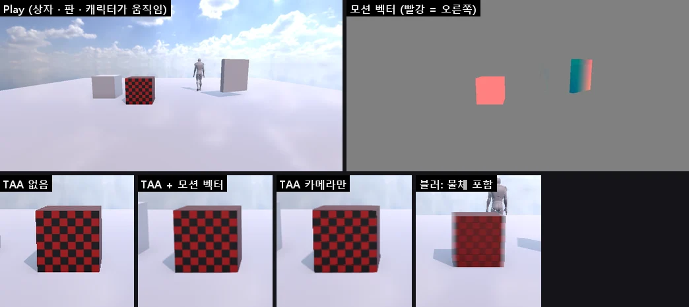

# Motion Vectors (모션 벡터)

화면의 픽셀마다 **이번 프레임과 지난 프레임 사이에 얼마나 움직였는지** (화면 속도) 를 그리는 패스입니다. Unity URP 의 모션 벡터 패스와 같은 두 단계로 만들고, **Volume** 의 **Motion Vectors** 효과로 켜고 끕니다. 움직이는 물체 · 스킨 애니메이션의 속도를 아는 것은 이것뿐이라 다른 효과가 읽습니다.

| 쓰는 곳 | 모션 벡터가 있으면 | 없으면 (예전) |
|------|------|------|
| TAA | 히스토리를 물체를 따라 찾는다 — 움직이는 물체의 무늬가 덜 뭉개진다 | 카메라만 되돌린다 |
| Motion Blur (Mode = **Camera And Objects**) | 움직이는 물체 · 애니메이션도 번진다 | Camera Only 만 |
| SSAO 시간 누적 | 움직이는 물체 위에서도 히스토리를 이어 쓴다 | 카메라만 |



## 쓰는 법

1. 기본으로 켜져 있습니다. 끄거나 나누어 켜려면 Global Volume (또는 Local Volume) 의 Profile 에 **Add Override > Rendering > Motion Vectors**
2. 렌더러마다 (Unity 와 같음): **Mesh Renderer · Skinned Mesh Renderer > Additional Settings > Motion Vectors** — Camera Motion Only · **Per Object Motion** (기본) · Force No Motion, Skinned Mesh Renderer 의 **Skinned Motion Vectors**
3. 물체가 움직이는 Motion Blur 는 **Motion Blur > Mode = Camera And Objects** (기본은 URP 와 같이 Camera Only)

## Volume: Motion Vectors

| 항목 | 기본 | 뜻 |
|------|------|-----|
| Enable | 켬 | 끄면 만들지 않는다 (TAA · Motion Blur · SSAO 는 카메라만) |
| Object Motion | 켬 | 움직인 렌더러의 속도. 끄면 모든 픽셀이 카메라 움직임만 |
| Skinned Motion | 켬 | Skinned Mesh Renderer 의 본 애니메이션. 끄면 그 물체는 이동만 |

## 동작 (엔진 안)

- 값 = **지터를 뺀 화면 좌표 (uv) 의 이번 − 지난 프레임**, R16G16F, Game 뷰 크기. TAA 는 `지난 자리 = (uv − 지터) − 속도`
- 순서: 깊이 프리패스 → **모션 벡터** → SSAO → 본 패스 → 후처리 (TAA · Motion Blur)
- 1) **카메라** (`CameraMotionTech`, 전체 화면): 프리패스의 뷰 깊이로 위치를 되짚어 (TAA 지터한 투영 그대로) 지난 카메라로. 하늘은 방향만 (회전)
- 2) **물체** (`ObjectMotionTech` · `SkinnedMotionTech`): 지난 프레임보다 움직인 렌더러만 다시 그린다 — Mesh Renderer 는 지난 월드 행렬, Skinned Mesh Renderer 는 지난 월드 행렬 · 지난 본 팔레트. 깊이 버퍼 대신 픽셀 셰이더에서 프리패스 깊이와 비교해 다른 면이면 버린다 (두 셰이더의 계산이 조금 달라도 구멍이 없고, 잘라낸 투명 부분 · 앞을 가린 물체에는 쓰지 않는다)
  - 렌더러마다 마지막으로 본 월드 행렬 · 팔레트를 기억한다 (지난 렌더 프레임에 보였을 때만 이어 쓴다 — 처음 · 오래 안 보였으면 움직임 없음)
  - Force No Motion = 0 (카메라 움직임도 없음), Camera Motion Only = 다시 그리지 않음
- MeshBatcher 의 인스턴스 버퍼 (오클루전 컬링 · 여러 그래픽 API 와 묶인 112 바이트) 는 그대로 두고, 움직인 것만 따로 그린다 (URP 와 같은 방법)
- Game 뷰만 (Unity 와 같이 Scene 뷰에는 TAA · Motion Blur 가 없다). 반사 프로브 · APV 찍기에는 없다. Scene 뷰는 [Rendering Debugger](RENDERING_DEBUGGER.md) 의 Motion Vectors 보기일 때만 따로 그린다 (뷰마다 기록이 따로)
- 파일: `Source/Graphics/DX11/MotionVectors.*`, `Shaders/63. MotionVectors.fx`, `Shaders/41. PostProcess.fx` (TAA · Motion Blur), `Shaders/28. Ssao.fx` (시간 누적), `Source/Graphics/Common/VolumeProfile.cpp` (효과 정의)

## CLI

```bash
nova motionvectors info
nova motionvectors map mv.png --rect 0.3,0.4,0.7,0.8
```

- `info`: 켜짐 · Object · Skinned, 만들었나 (`valid`), 크기, 이번 프레임에 다시 그린 물체 (`objectsDrawn` · `skinnedDrawn` · `forcedNoMotion`)
- `map`: 속도를 색으로 (가운데 회색 = 0, 빨강 쪽 = 오른쪽, 초록 쪽 = 아래, 픽셀 x 8) + 영역 (화면 비율) 의 평균 · 최대 속도 (픽셀) · 움직인 비율

## 검사

`Tools/tests/run_tests.ps1 -Only motionvectors` — 검사 스크립트 `Tools/tests/motion_probe.cs` (오른쪽으로 가는 상자 · 도는 판 · 카메라 이동), 물체 영역은 카메라 투영으로 계산, Play 중에는 CLI set 이 막혀 설정마다 Play 를 다시:
편집 중 0, Play 에서 상자는 +x · 멈춘 상자 0 · 판 · 걷는 캐릭터 (스킨) 움직임, Object Motion 끄면 0, Skinned Motion 끄면 캐릭터만 0, Force No Motion = 0, Enable 끄면 만들지 않음,
카메라가 오른쪽으로 가면 바닥이 왼쪽으로 (−2.1 px), TAA: 움직이는 체커 상자의 대비 (TAA 없음 56.6 · 모션 벡터 53.1 · 카메라만 51.3 — 뭉개짐 약 35 % 줄어듦),
Motion Blur Camera And Objects 가 움직이는 상자를 번지게, 타일 최대 속도로 상자 바깥 배경 위에 옅은 빨강이 번짐 (행마다 0 → 7 픽셀, 예전 방식은 0), OpenGL (12 항목).

## 아직 · 한계

- 지형 · 나무 (바람에 흔들림) · 바위 · 디테일 · 입자 · 투명은 카메라 움직임만
- BlendShape 의 변화는 속도에 들지 않는다 (같은 정점 버퍼로 그리므로 위치는 맞음)
- Motion Blur 는 타일 최대 속도로 모은다 (움직이는 물체가 멈춘 배경 위로 번진다 — [DEPTH_OF_FIELD_MOTION_BLUR](DEPTH_OF_FIELD_MOTION_BLUR.md))
- C# `Renderer.motionVectorGenerationMode` · `Camera.depthTextureMode` 는 아직
