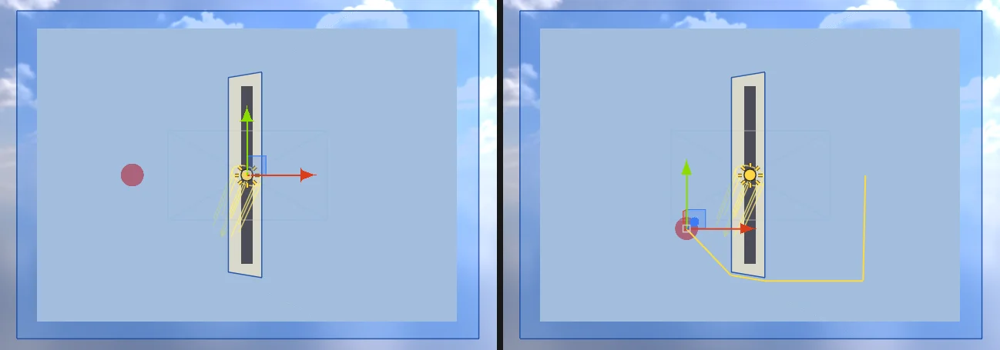

# 2D 내비게이션 (탑다운 2D 의 NavMesh)

패키지 `com.nova.ai.navigation` (Recast · Detour) 의 **NavMesh Surface** 를 **Plane = 2D (XY, top-down)** 로 두면
XY 평면에서 길을 찾는다 (Unity 에서 NavMeshPlus 가 하는 일). 같은 NavMesh Agent · `NavMesh.CalculatePath` · `SamplePosition` 을 그대로 쓴다.

<p align="center"><br/><sub>왼쪽: 굽기 (파랑 = 걸을 수 있는 곳, 벽 둘레는 반지름만큼 비었다) · 오른쪽: 걷는 에이전트와 남은 길 (노랑)</sub></p>

## 굽기

| 항목 | 내용 |
|---|---|
| 바닥 | **All Game Objects** = 2D 콜라이더 · 스프라이트를 모두 담는 사각형 (+ 반지름), **Volume** = Center · Size 의 XY 사각형 |
| 벽 | 켜진 **정적** 2D 콜라이더의 윤곽 — Box · Circle · Capsule · Polygon · **Tilemap Collider 2D**, Edge Collider 2D (선) |
| 빼는 것 | Is Trigger, Dynamic · Kinematic **Rigidbody 2D** 가 붙은 것 (움직이는 것 — Unity 와 같이 정적인 것만) |
| Agent Radius | 벽에서 이만큼 물러난다. 2D 에서는 Height · Max Slope · Step Height 를 쓰지 않는다 (Inspector 에서 숨김) |
| Voxel Size | 칸 크기. 칸보다 얇은 벽 (Edge Collider 2D) 도 빠지지 않게 벽을 반 칸 키워 표시한다 |

굽기 파일 (`.navmesh`, 버전 3) 머리에 2D 표시가 들어가 다시 열어도 2D. 예전 (버전 2) 파일은 그대로 읽는다.

## 에이전트

NavMesh Agent 는 서 있는 표면이 2D 면 X · Y 로 걷는다 — **z 는 그대로**, **돌지 않는다** (Unity 2D 의 `updateRotation = false` · `updateUpAxis = false`),
Base Offset 과 바닥 붙이기 (Raycast) 를 쓰지 않는다. `destination` · `velocity` · `steeringTarget` · `path.corners` 는 모두 월드 (x, y).

```csharp
using NovaEngine.AI;

var agent = GetComponent<NavMeshAgent>();
agent.SetDestination(new Vector3(5, 0, 0));          // 월드 XY

var path = new NavMeshPath();
NavMesh.CalculatePath(transform.position, target, NavMesh.AllAreas, path);
NavMesh.SamplePosition(clickPoint, out var hit, 2f, NavMesh.AllAreas);   // 벽 안을 누르면 가장 가까운 걸을 수 있는 점
```

## 구현

내비 공간 = (x, 0, y). `NavMeshSurface::Bake2D` 가 바닥 사각형 (위를 보는 삼각형 두 개) 과 2D 콜라이더 윤곽 (귀 자르기로 삼각형) 을 만들고,
`NavData::Bake` 가 벽 삼각형을 `rcMarkConvexPolyArea(RC_NULL_AREA)` 로 깎기 (`rcErodeWalkableArea`) 전에 표시한다.
질의 (`FindPath` · `Sample` · `MoveAlongSurface`) 는 늘 내비 공간, 월드 ↔ 내비 바꾸기는 에이전트 · C# 경계에서 (`NavData::ToNav` · `ToWorld`).

## 검사

`Tools/tests/run_tests.ps1 -Only nav2d` — Box Collider 2D 벽을 돌아가는 길 (z = 0), 벽 안 SamplePosition, 에이전트가 XY 로 도착 (z · 회전 그대로) ·
걷는 중 속도가 XY, Dynamic Rigidbody 2D 는 굽지 않음, 칸 사이의 얇은 Edge Collider 2D 도 벽, 저장한 씬을 다시 열어도 2D, Tilemap Collider 2D 로 둘러싼 방 (안은 곧은 길 · 밖으로 나가는 길 없음) (8 항목).
3D 는 `-Only packages` (굽기 · 에이전트 · 링크 · Carve).

## 아직 없는 것

2D 의 NavMesh Obstacle (지금은 3D 모양 — 2D 에서는 무시, 움직이는 벽은 Play 중 `BuildNavMesh()` 로 다시 굽기), 2D 의 NavMesh Link, 영역 (Area) 마다 비용.
