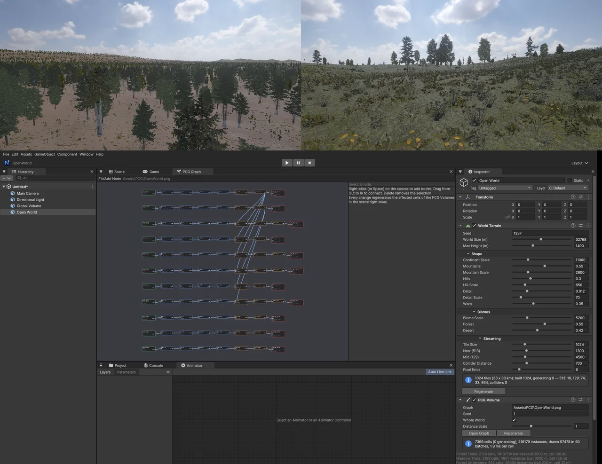

# PCG — 초대형 열린 월드 (World Terrain + PCG Graph)

Unreal 의 PCG (Procedural Content Generation) 와 같은 생각입니다. **규칙 (그래프)** 을 정하면 월드가 **자동으로 채워지고**, 규칙을 고치면 바로 다시 채워집니다. 32 km × 32 km 월드를 메뉴 한 번으로 만듭니다.



## 딸깍 — 시작

**GameObject > Open World > Open World 32 km (PCG)** (또는 `nova create open-world`)

1. **World Terrain** — 32 × 32 km 지형 (1 km 타일 1024 개). 높이 · 바이옴 (숲 · 초원 · 사막 · 바위) 은 위치만으로 정해지는 함수라 어디서나 같은 땅
2. **PCG Volume** — 그래프 `Assets/PCG/OpenWorld.pcg` 를 월드 전체에 적용. 그래프가 없으면 **프로젝트의 모델을 이름으로 나눠** (큰 나무 · 작은 나무 · 덤불 · 고사리 · 풀 · 숲 바닥 · 바위 · 잔해 · 버섯 · 선인장 · 마른 풀) 숲 · 초원 · 사막 · 바위 규칙 11 개를 만든다
3. Main Camera 의 Far 를 20 km 로

카메라를 움직이면 그 둘레만 만들어지고 (작업 스레드), 멀어진 곳은 버립니다.

## 결과 (Release, GTX 1660 SUPER, SeedMesh 숲 · 초원 · 사막 모델 84 개)

| 자리 | 프레임 | 살아 있는 인스턴스 | 그린 수 · 묶음 |
|---|---|---|---|
| 숲 (땅 위 2 m) | 16.4 ms (GPU 12.6) | 15.9 만 | 5.6 만 · 64 |
| 하늘 (450 m, 1.8 km 뒤) | 15.1 ms (GPU 9.1) | 25.8 만 | 3.9 만 · 22 |
| 초원 | 17.0 ms (GPU 10.5) | 28.7 만 | 3.5 만 · 49 |
| 사막 | 14.9 ms (GPU 8.9) | 23.0 만 | 2.1 만 · 36 |

- 지형 1024 타일 (32 km) 모두 지어진 상태. 채워지는 동안 가장 긴 프레임 약 40 ms
- 모델 처음 읽기: 84 개 합 0.41 s (가장 긴 37 ms) — 텍스처 디코드 · 모델 캐시를 작업 스레드에서 미리 (예전 7.9 s, 가장 긴 967 ms)
- 셀 하나 만들기 평균 수 ms (작업 스레드)

## PCG Graph (Window > PCG Graph)

노드를 이어 규칙을 만듭니다 — Unreal PCG Graph 와 같은 노드들:

| 노드 | 하는 일 |
|---|---|
| **Surface Sampler** | 지형 표면에서 점 (Points Per m², Looseness, Point Extents). 점은 **월드 격자에 고정** — 셀 경계가 정확히 맞는다 |
| **Density Noise** | 점 밀도에 노이즈 (Scale, Octaves, Contrast, Offset, Multiply · Set · Min · Max) — 무리 · 빈터 |
| **Height Filter** · **Slope Filter** | 높이 (m) · 경사 (도) 범위 밖의 밀도를 0 으로 (Falloff 로 부드럽게) |
| **Biome Filter** | World Terrain 의 바이옴 (Forest · Meadow · Desert · Rock) 비중으로 거른다 (비중을 밀도에 곱하면 경계가 옅어진다) |
| **Density Filter** | 밀도로 남기기 (Randomize = 밀도가 남을 확률) |
| **Self Pruning** | 반지름 안에 겹친 점을 지운다 (밀도가 큰 것을 남김, 크기를 곱할 수 있다) |
| **Difference** | 다른 줄기 (Exclusions) 의 점 근처를 뺀다 — 예: 나무 밑에는 덤불 · 풀을 덜. 이웃 셀의 점까지 본다 |
| **Transform Points** | 방향 (Yaw) · 크기 · 지형 기울기 따르기 (Align To Normal) · 기울임 · 높이 오프셋 — 점마다 무작위 (같은 점 = 같은 값) |
| **Merge** | 여러 줄기를 하나로 |
| **Static Mesh Spawner** | 점마다 메시 (가중치로 고른다). Cull Distance = 생성 · 그리기 반지름, Cell Size, Cast Shadows · Shadow Distance, LOD Bias |

- 오른쪽 클릭 · Space = 노드 추가, Out 에서 In 으로 끌어 잇기, Delete = 지우기
- 오른쪽 **Details**: 값 · 끄기 · 이름, 스포너의 메시 목록 (Project 에서 고른 모델 넣기 · 역할로 한꺼번에 · 가중치)
- 값을 바꾸면 **바로** 장면이 다시 채워진다 (그동안 예전 결과를 그린다 — 깜빡이지 않는다). 마우스를 놓을 때 `.pcg` 저장
- Project 창 Create > PCG Graph (`.pcg`), 더블클릭 = 열기. PCG Volume 인스펙터의 Open Graph

## 동작 (엔진 안)

- **Runtime Generation (Partitioned)**: 스포너마다 격자 셀 (Cell Size — 자동 = Cull Distance / 8, 32 ~ 128 m). Scene 뷰 · Game 뷰 카메라에서 Cull Distance 안의 셀을 가까운 것부터 작업 스레드에서 만든다 (동시에 16 개). 90 프레임 안 쓰인 셀은 버린다
- 셀 결과 = 메시마다 월드 행렬. 규칙 · World Terrain 값 · Seed · 영역 해시가 다르면 다시 만든다
- **점 높이** = 가까운 지형 타일 (513, 2 m 격자) 과 같은 격자 · 같은 삼각형 — 그려진 땅 위에 정확히
- **그리기 (GameObject 없음)**: 셀마다 GPU 인스턴스 버퍼 (그 LOD 를 처음 그릴 때 한 번 올림). 보이는 셀의 버퍼를 (메시 · LOD · 파트) 마다 **GPU 복사로 하나로** 모아 그리기 한 번 — 14 만 개 = 묶음 81 개. Mesh Renderer 묶음과 같은 길 (`MeshBatcher::SetExternalSource`) 이라 깊이 프리패스 · 그림자 · Alpha Clipping · 디퍼드 · 사용자 셰이더가 그대로
- **LOD**: 모델의 `_LOD0 … _LODn` 노드 (Unity 프리팹 · SpeedTree 식, 마지막은 빌보드). 전환 화면 높이 = 모델 옆 `<모델>.lod.json` (Unity LOD Group 값) 또는 0.5 · 0.25 …. 셀 거리로 고르고, 가까운 무거운 모델 (LOD 0 이 1500 삼각형 넘게) 은 인스턴스마다. 그림자는 한 단계 거칠게. 마지막 LOD (빌보드) 는 Cull Distance 까지
- **모델 읽기**: 처음 필요할 때 재질 텍스처 디코드 · 모델 캐시 파일 읽기를 작업 스레드에 맡기고 (`Utils::PrefetchTexture`), 다 되면 메인이 GPU 로 올린다 (프레임마다 두 개). FBX 재질 칸 목록은 모델 옆 `.materials.json` 에 기억 (FBX 를 다시 읽지 않게)
- **잎**: Alpha Clipping 재질 = 양면 (뒷면 컬링 끔, 뒷면은 법선을 뒤집어 비춘다 — `PS_BatchFace`)
- **World Terrain**: 거리로 해상도 513 (2 m) · 129 (8 m) · 33 (32 m), 작업 스레드에서 높이 · 스플랫 (바이옴), 메인은 프레임마다 4 ms 만 바꿔 끼운다. 해상도가 다른 이웃 타일 사이의 틈은 **스커트** (가장자리 정점을 내린 띠). 만든 타일은 캐시 (256 MB — Play / Stop 에 다시 계산하지 않는다). Play 중 가까운 타일에 Terrain Collider. 지형 레이어 높이 배열은 레이어 조합마다 한 장 (타일마다가 아니다)

## Unity 에셋 가져오기

나무 · 풀 · 바위 팩 (예: SeedMesh — 숲 · 초원 · 사막, FBX 378 개) 은 `Tools/unity_import/unity_env_import.py` 로:

```
python Tools/unity_import/unity_env_import.py --src <Unity Assets/.../SeedMesh> --project <NOVA 프로젝트> --dest Assets/Environment/SeedMesh [--max-texture 1024]
```

- FBX 를 종류별 폴더로 복사, FBX `.meta` 의 externalObjects (FBX 재질 이름 → Unity .mat) 로 재질을 NOVA 가 읽는 자리 (`<모델>_FBX.Materials/<재질>.mat`) 에
- HDRP · Shader Graph 재질: `_BaseColorMap` · `_NormalMap` (`Normal_vegetation`) · `_MaskMap` (`mask_vegetation`), 잎은 Alpha Clipping · 매끄러움 0.35 이하
- **TIFF 의 알파가 '지정 안 된 추가 샘플'** (SeedMesh 의 잎 · 빌보드 불투명도, 마스크의 매끄러움) — PIL 은 버려서 `tifffile` 로 읽는다
- 프리팹의 LOD Group 화면 높이 → `<모델>.lod.json`, `.terrainlayer` → NOVA 지형 레이어, 목록 `catalog.json`

## CLI

```
nova create open-world [--size 32768]           # World Terrain + PCG Volume
nova world info | height --x 0 --z 0 | set --values '{"seed":5,"mountains":0.7}' | regen
nova pcg info                                   # 셀 · 인스턴스 · 그린 수 · 묶음 · 셀마다 ms · 스포너별
nova pcg set --node 3 --param pointsPerSquaredMeter --value 0.02   # 그래프 값 (저장 · 바로 다시 만든다)
nova pcg enable --node 3 --enabled false | regen | graph | save
```

## 아직

- 모델 GPU 올리기 (메시 · 텍스처) 는 메인 — 프레임마다 두 개까지 (디코드는 작업 스레드)
- 나무 충돌체 (Play 에서 가까운 인스턴스에 캡슐)
- 32 km 가장자리 (원점에서 16 km) 의 float 정밀도 ≈ 2 mm — 카메라 기준 렌더링 · 원점 옮기기는 아직
- 바람 (잎 흔들림)
