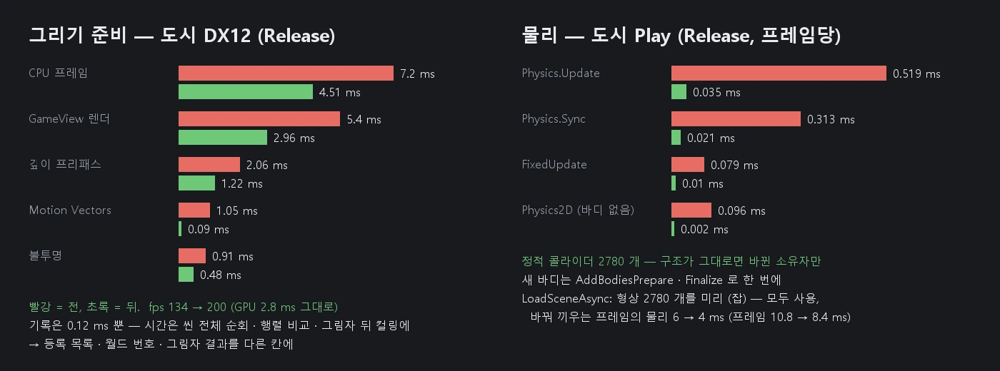

# 물리 동기화 — 데이터 지향 (바뀐 것만)

2026-10-09. 사용자 요청: "물리를 데이터 지향으로 — Transform 버전 번호로 바뀐 바디만 동기화합니다. 씬 스트리밍 중에 바디를 미리 만들어 두었다가 바꿔 끼울 때 한 번에 넣습니다 (Jolt AddBodiesPrepare · Finalize)".

## 예전

고정 스텝 (50 Hz) 마다 `PhysicsManager::StepBegin` 이:

- 씬의 모든 GameObject 를 훑어 콜라이더 · Rigidbody 를 모으고, 소유자 (Rigidbody 가 있는 조상) 를 찾고, 소유자끼리 정렬했다.
- 소유자마다 서명 (크기 · 콜라이더 · Rigidbody 값의 해시) 을 계산해 바디가 바뀌었는지 보았다.
- 모든 바디의 Transform 자리 · 회전을 읽어 비교했다 (Transform → 바디).
- 동적 바디 목록을 얻으려고 스텝과 프레임마다 바디 표 전체를 훑었다.

도시 장면 (정적 콜라이더 약 2200 개) 에서는 아무것도 바뀌지 않는 스텝에도 이 일을 다 했다.

## 지금

| 무엇 | 어떻게 |
|------|------|
| 물리 번호 | `Component::s_PhysicsSerial` — 바디가 달라질 수 있는 변경마다 +1: 오브젝트 만들기 · 지우기, `SetActive`, 부모 · 레이어, 미리 짓기 표시, 컴포넌트 지우기 · 켜고 끄기 (헤더 체크박스 포함), 콜라이더 · Rigidbody · Character Controller 의 설정 함수 · 인스펙터 · `fromJson` (nova set · Undo · 프리팹) |
| 소유자 묶음 | 전체 훑기가 소유자마다 콜라이더 · 종류 · 지켜볼 Transform (소유자와 콜라이더 오브젝트) 과 그 월드 번호를 연속 배열에 기억한다 |
| 바뀐 것만 | 물리 번호 · 연결 번호 (메시) · 씬 · 오브젝트 수가 그대로면 씬을 훑지 않는다. 묶음마다 월드 번호만 비교해, 바뀐 (또는 더러운) 소유자만 서명을 다시 계산한다 |
| 안전망 | 스텝마다 돌아가며 64 묶음은 서명을 실제로 계산하고, 50 스텝 (1 초) 마다 전체 훑기. 번호를 올리지 않는 경로가 있어도 바로잡힌다 (Debug 는 로그 한 번, `verifyFixes`) |
| 지형 | 높이 · 나무 번호는 Transform 이 아니라서 지형 소유자는 스텝마다 확인한다 (몇 개뿐) |
| Transform → 바디 | 정적 바디는 마지막으로 맞춘 월드 번호가 그대로면 건너뛴다 |
| 동적 바디 목록 | 바디 번호 (만들기 · 지우기) 와 물리 번호가 그대로면 지난 목록 그대로 (보간도 이 목록) |
| 바디 넣기 · 빼기 | 새 바디는 `CreateBody` 로 만들어 모았다가 동기화 끝에 `AddBodiesPrepare` · `AddBodiesFinalize` 로 한 번에. 빼는 것도 `RemoveBodies` · `DestroyBodies` 로 한 번에. 많이 뺄 때 (씬 바꾸기) 는 둘레 깨우기를 전체 상자 하나로 |
| FixedUpdate 호출 목록 | 켜진 오브젝트마다 컴포넌트 (MonoBehaviour 는 따로 표시) 를 기억한다. 씬 · 물리 번호 · 연결 번호 · 오브젝트 수가 그대로면 다시 모으지 않는다 (예전: 스텝마다 모든 오브젝트 · 컴포넌트에 `dynamic_cast`). 앞 스크립트가 이 스텝에 끈 오브젝트 · 스크립트는 그때 확인해 건너뛴다 |
| 2D 물리 | 2D 컴포넌트가 하나도 없는 씬 (3D 게임) 은 구조가 그대로면 2D 동기화 · Joint 2D 동기화가 씬을 훑지 않는다 |
| 씬 스트리밍 | `LoadSceneAsync` 가 루트를 다 지으면 `PhysicsManager::PrebuildStaged` 가 미리 지은 (꺼진) 씬의 소유자 묶음 · 서명을 메인에서 모으고, 형상 (상자 · 메시 · 볼록 껍질 · 합성) 은 미리 데우기 잡이 만든다. 바꿔 끼운 뒤 첫 동기화가 같은 소유자 · 서명 · 자리 · 동적 여부면 그 형상을 쓰고, 새 바디를 한 번에 넣는다 |

결과는 예전과 같아야 한다: 검사가 같은 순서를 스텝마다 전체 훑기 (`nova physics --full-sync true`) 로도 돌려 비교한다.

## 측정

Release, CityShowcase Play (Game 뷰, 정적 콜라이더 2780 개 · 고정 스텝 50 Hz, 약 190 fps — 프레임당 스텝 0.27 번). 프레임당 평균 ms:

| 구간 | 전 | 뒤 |
|------|------|------|
| Physics.Update (전체) | 0.519 | **0.035** |
| Physics.Sync | 0.313 | 0.021 |
| Physics.FixedUpdate | 0.079 | 0.010 |
| Physics.TransformToBody | 0.027 | < 0.002 |
| Physics2D.Update (2D 바디 없음) | 0.096 | 0.002 |
| GameUpdate (스크립트 · 물리 · 2D 물리 …) | 1.21 | 0.66 |

- 스텝 한 번의 동기화: 약 1.16 → 0.08 ms. 가만히 있는 스텝은 돌아가며 확인하는 64 소유자와 움직인 소유자만 서명을 계산한다.
- 씬 바꾸기 (`LoadSceneAsync` 로 도시): 바꿔 끼우는 프레임 10.8 → 8.4 ~ 8.9 ms, 그중 물리 6 → 4 ms (형상 2780 개를 미리 만들어 둠 — 잡 1.8 ~ 2.8 ms, 바디를 한 번에 넣기).
  그 뒤 스텝마다 Sync 1 ms → 0.08 ms. 남은 4 ms 는 바디 2780 개를 만들고 콜라이더 표 · 소유자 묶음을 채우는 일이다 (다음: 미리 짓기 때 모은 묶음 · 서명을 그대로 쓰기).

## 2D 물리

2D 컴포넌트 (Collider 2D · Rigidbody 2D · Joint 2D) 가 하나도 없는 씬이면, 구조 (물리 번호 · 연결 번호 · 오브젝트 수) 가 그대로인 동안 2D 동기화와 Joint 2D 동기화가 씬을 훑지 않는다.
2D 컴포넌트를 붙이거나 (연결 번호) 켜거나 값을 바꾸면 (물리 번호 — 2D 컴포넌트의 fromJson 도 올린다) 다시 훑는다.

## CLI

- `nova physics` — `sync`: 전체 훑기 · 바뀐 것만 수, 다시 본 소유자, 확인이 바로잡은 수, 묶음 · 지켜보는 Transform 수, 바디 · 한 번에 넣은 바디, 건너뛴 정적 Transform → 바디, 미리 만든 형상 (쓴 · 못 쓴 · 남은 · 잡 시간)
- `nova physics --full-sync true|false` — 검사용: 스텝마다 전체 훑기 (예전 방식)

## 검사

`Tools/tests/run_tests.ps1 -Only physicssync`:

- 스크립트 · `nova set` 으로 콜라이더 크기 · 켜고 끄기 · Transform 옮기기 · 크기 · `SetActive` · 트리거를 바꾸면 다음 스텝에 바디가 따른다 (레이캐스트 높이 · 떨어지는 공)
- 같은 순서를 스텝마다 전체 훑기로도 돌려 결과가 같다
- 가만히 있는 스텝은 씬을 훑지 않고 몇 소유자만 본다, 정적 바디의 Transform → 바디를 건너뛴다
- 도시를 `LoadSceneAsync` 로 불러오면 미리 만든 형상을 바꿔 끼울 때 쓴다
