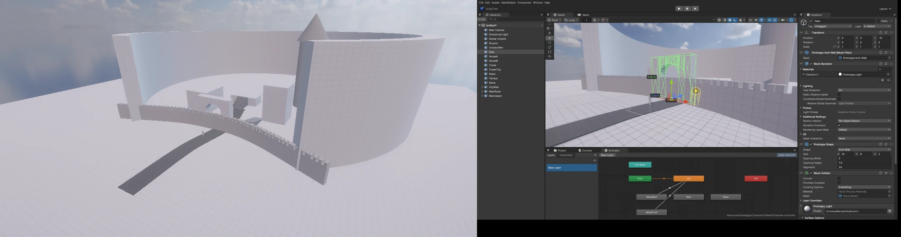
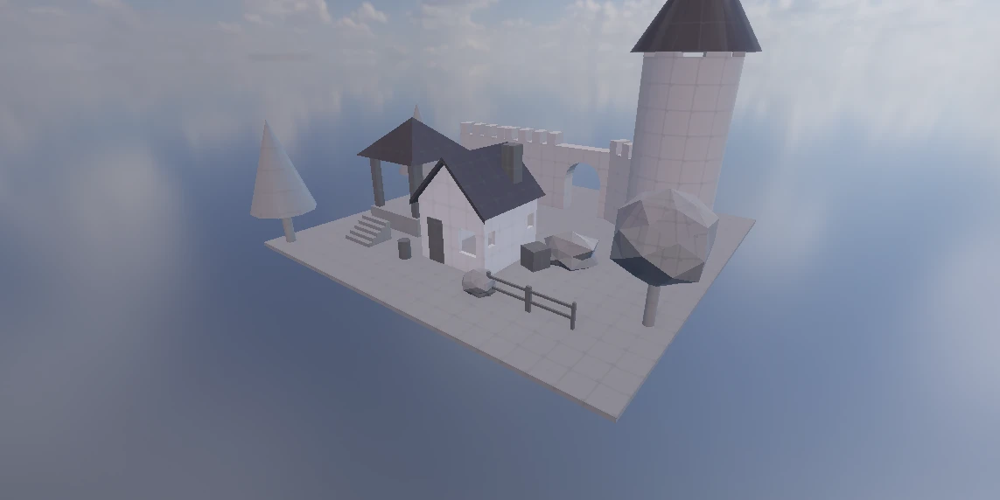

# 블록아웃 (대규모 레벨 디자인 프로토타입)

2026-10-09 ~ 10. 사용자 요청: "기본 패키지에 프로토타입 텍스쳐 (미터 단위 격자, 흰색 ~ 어두운 회색)", "다양한 다각형 — 오픈월드 판타지를 구성하기 편하게 (지붕 · 창문 …)",
"성벽 · 길을 스플라인으로 배치 (휘게 / 휘지 않고 반복)", 그리고 영상 [Speed Level Design — Volcanic Heist](https://www.youtube.com/watch?v=b_SI_gHHKS4) 같은 거대한 규모의 레벨 디자인.

영상 (UE5) 의 블록아웃 방식을 따랐다.
- 월드에 붙은 격자 재질을 쓴다. 상자를 몇 십 m 로 늘려도 칸이 1 m 다.
- 기본 도형을 크기 그대로 늘려 도시 · 화산 · 동굴을 짠다.
- 계단 · 문 · 점프 높이를 치수로 확인하고, 마네킹으로 걸어 본다.

| 도구 | 어디 |
|------|------|
| 격자 텍스처 · 재질 (World Space UV) | Packages > Prototype > Textures · Materials |
| 조각 프리팹 57 개 (벽 · 창 · 문 · 아치 · 지붕 · 탑 · 성벽 · 계단 · 소품 · 나무) | Packages > Prototype > Prefabs |
| Prototype Shape (크기를 숫자로 — 상자 · 계단 · 경사 · 원기둥 · 원뿔 · 아치 벽 · 원호 벽) | GameObject > Prototype |
| Spline Container + Spline Instantiate (성벽 · 길 · 울타리 · 판자) | GameObject > Spline — [SPLINE](SPLINE.md) |
| Selection Dimensions (선택한 것의 너비 · 높이 · 깊이) | Scene 뷰 Gizmos 메뉴 |
| 마네킹 · 걸어 보기 | GameObject > Character, Starter Assets (Third Person Controller) |
| 격자 스냅 | Scene 뷰 툴바 Grid Snapping (또는 Ctrl) |



## 격자 텍스처 · 재질

`Textures/Prototype_<색>.png` · `Materials/Prototype_<색>.mat` — 흰색에서 어두운 회색까지 다섯 가지:
`Light` · `LightGray` · `Gray` · `DarkGray` · `Charcoal`.

- 1024 px = 1 m. 0.25 m 가는 선, 0.5 m 중간 선, 1 m 테두리, 0.1 m 눈금, 모서리에 "1m".
- 재질은 **World Space UV** 가 켜져 있다 (Lit 재질의 Surface Inputs). 월드 위치를 면 방향 (법선의 가장 큰 축) 으로 투영해 텍스처를 읽는다.
  - 그래서 기본 Cube 를 12 배로 늘려도 격자는 1 m 칸 그대로다. Tiling 으로 칸 크기를 바꾼다.
  - UE 의 World Aligned Texture 와 같다. 기울인 면은 가까운 축으로 투영된다.
- 모든 Lit 재질에서 쓸 수 있다. `PbrMaterial.UVMode` 가 추가돼 상수 버퍼가 112 → 128 바이트가 됐다.

## 조각 프리팹



단위는 m, 원점은 바닥 가운데다. 벽은 X 를 따라 서고, 두께 (0.2 m) 는 Z 가운데다. 벽 높이는 3 m 다.
지붕은 처마 바닥이 y = 0 이라, 3 m 벽 위에 y = 3 으로 놓는다. 모든 프리팹에 Mesh Collider 가 있다.

| 갈래 | 조각 |
|------|------|
| Shapes (1 m) | Cube · Wedge · Cylinder · Cone · HalfCylinder · Pyramid · Sphere · Stairs |
| Floor | Floor 1x1 · 2x2 · 4x4 (윗면 y = 0), Platform 4x4 (높이 1 m), Road 4 m (스플라인 길) |
| Walls | Wall 1 · 2 · 4 m, Half 2 m (1 m 높이), Window 2 m, Window Arch 2 m, Window Small 1 m, Door 2 m, Door Arch 2 m, Archway 4 m, Gable 4 · 6 m (박공 세모 벽) |
| Structure | Pillar Square · Round 3 m, Beam 4 m, Chimney, Fence 2 m, Door Slab, Bridge 4 m |
| Stairs | Stairs 2 m (1 m · 3 m 오르기), Ramp 2x4 |
| Roof | Gable 4x4 · 4x8 · 6x8 (박공), Hip 4x4 · 6x6 (모임), Shed 4x2 (외쪽), Cone Tower · Small (탑 고깔) |
| Castle | Castle Wall 4 m (총안), Castle Gate 4 m (아치), Tower Round 4 m (지름 4 m, 쌓아 올린다), Tower Round Top (총안), Tower Square 4x4 |
| Props | Barrel · Crate 1 m · Table · Plank 2 m (판자 길) |
| Nature | Tree Pine · Tree Round · Rock Large · Rock Small · Bush |

## Prototype Shape (크기를 숫자로)

Transform 크기로 늘리면 계단 단도 같이 커진다. Prototype Shape 는 **크기 (m) 를 숫자로** 받아 메시를 다시 만든다.

- 계단은 단 높이를 지킨다 (Step Height 0.2 m → 단 수 = 높이 / 0.2).
- 아치 벽은 구멍 크기 (Opening Width · Height) 를 따로 받는다.
- 원호 벽은 반지름 · 각도 · 두께 · 높이를 받는다. 360 도면 원통 껍질이 된다 (화산 테두리 · 원형 광장 · 탑).

| 도형 | 값 |
|------|------|
| Box · Ramp | Size (너비 X · 높이 Y · 깊이 Z) — 경사는 +Z 쪽이 높다 |
| Stairs | Size, Step Height — +Z 쪽으로 오른다 |
| Cylinder · Cone | Size (X · Z 지름, Y 높이), Segments |
| Arch Wall | Size (너비 · 높이 · 두께), Opening Width · Opening Height (반원 꼭대기) |
| Curved Wall | Radius (안쪽), Angle (도), Height, Thickness, Segments |

메시는 저장하지 않는다. 숫자만 저장하고, 열 때 다시 만든다. UV 는 미터 단위이고, Mesh Collider 가 그 메시로 부딪힌다.

## 치수 (Selection Dimensions)

Scene 뷰에서 오브젝트를 고르면, 자식까지 합친 메시 월드 범위의 너비 (X, 빨강) · 높이 (Y, 초록) · 깊이 (Z, 파랑) 를 m 로 보인다.
Gizmos 메뉴의 Selection Dimensions 로 켜고 끈다. CLI 는 `nova dimensions <오브젝트>` 다.

## 다시 만들기 · CLI

```bash
python Tools/prototype/make_prototype.py
```

```bash
powershell -File Tools/prototype/bake_prefabs.ps1
```

- `make_prototype.py` — 텍스처 · 재질 · GLB 메시 (조각 목록은 `pieces()`).
- `bake_prefabs.ps1` — 창 없는 검사 에디터로 메시를 놓고, 재질 · 그림자 · Mesh Collider 를 정해 프리팹으로 저장한다 (`nova prefab save`).
- `nova prefab place --path Resources/Packages/Prototype/Prefabs/Walls/Wall_Door_2m.prefab --position 0,0,-2 --rotation 0,90,0`
- `nova create prototype --preset 1 --name Stairs` (0 상자 1 계단 2 경사 3 원기둥 4 원뿔 5 아치 벽 6 원호 벽), 값은 `nova set Stairs --component PrototypeShape --values "{...}"`
- `nova dimensions <오브젝트>` — 월드 크기 (m)

## 검사

`Tools/tests/run_tests.ps1 -Only blockout` (7 항목):
- 프리팹 57 개가 놓이고, Mesh Collider 와 World Space UV 재질을 갖는다.
- 12 배 늘린 큐브에도 1 m 격자가 보인다 (화면 가운데 줄의 선 수).
- Prototype Shape 의 치수 (상자 · 계단 · 아치 · 원호 · 원기둥) 가 맞는다.
- 스플라인 성벽이 휘고, 울타리가 반복된다.
- 저장에는 만든 조각이 빠지고, 다시 열면 다시 만든다.
- Bake 하면 보통 오브젝트로 바뀐다.
- Play 에서 공이 도형 상자와 휜 성벽 위에 선다.
