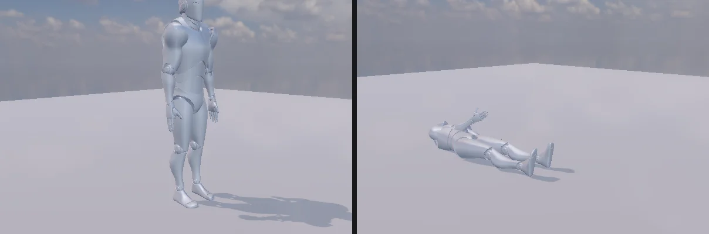

# 래그돌 · Character Joint · Configurable Joint

Unity 의 3D 관절 두 가지와 Ragdoll Wizard. 물리 = [Jolt](https://github.com/jrouwe/JoltPhysics) (Character Joint = SwingTwistConstraint, Configurable Joint = SixDOFConstraint).

<p align="center"><br/><sub>Ragdoll Wizard 로 만든 기본 캐릭터: 서 있는 자세 (꺼짐 — 바디가 애니메이션을 따라감) · 켜면 쓰러진다</sub></p>

## Ragdoll Wizard

휴머노이드 캐릭터 (Skinned Mesh — `create character`, FBX · VRM) 를 고르고 **GameObject > 3D Object > Ragdoll...**
(또는 `nova ragdoll create <대상> [--mass 20]`). 지금 자세로 바디 11 개를 캐릭터 아래에 만든다 — Unity Wizard 와 같은 구성 · 밀도 · 한계:

| 바디 | 본 | 콜라이더 | 관절 (이은 바디) | 한계 (비틀기 · 흔들기) |
|---|---|---|---|---|
| Pelvis | Hips | 상자 | — | |
| Left · Right Hips | UpperLeg | 캡슐 (길이 × 0.3) | Pelvis | -20 ~ 70, 30 |
| Left · Right Knee | LowerLeg | 캡슐 (× 0.25) | Hips | -80 ~ 0, 0 |
| Middle Spine | Chest (없으면 Spine) | 상자 | Pelvis | -20 ~ 20, 10 |
| Left · Right Arm | UpperArm | 캡슐 (× 0.25) | Middle Spine | -30 ~ 70, 50 |
| Left · Right Elbow | LowerArm | 캡슐 (× 0.2) | Arm | 0 ~ 90, 0 |
| Head | Head | 구 (어깨 너비 / 4) | Middle Spine | -40 ~ 25, 25 |

바디의 틀: Y = 뼈 방향 (자식 본 쪽), Z = 캐릭터 앞 → 관절 축 = 로컬 X (굽힘), Swing Axis = 로컬 Z. **+ = 앞으로 굽힘** (무릎은 뒤로만).
질량 = Total Mass (기본 20 kg) 를 밀도 비율로. 쉬는 자세에서 겹치는 바디 쌍 (왼 · 오른 넓적다리 등) 은 서로 부딪히지 않는다 (`Physics.IgnoreCollision`).

### Ragdoll 컴포넌트

Unity 는 본이 Transform 이라 바디를 본에 바로 붙이지만, NOVA 의 본은 스키닝 자세 안에 있어 캐릭터의 **Ragdoll** 컴포넌트가 둘을 잇는다.

| Active | 동작 |
|---|---|
| 켜짐 (Wizard 기본) | 바디가 뼈대 자세를 정한다. Animator · Animation 을 끄고 바디를 다이내믹으로 — Play 하면 쓰러진다 |
| 꺼짐 | 바디가 애니메이션 자세를 따라간다 (키네마틱 — 다른 물체를 밀어낸다). 켜는 순간 그 자세 · 속도로 쓰러진다 |

```csharp
var ragdoll = GetComponent<Ragdoll>();
ragdoll.active = true;          // 맞았다 → 쓰러짐 (Animator 는 자동으로 꺼진다)
int n = ragdoll.bodyCount;      // 11
```

맞으면 쓰러지는 예제: **GameObject > 3D Object > Ragdoll Target** (`nova create ragdoll-target`) — 클릭으로 쏘는 `RagdollShooter` 와 함께 ([STARTER_ASSETS](STARTER_ASSETS.md)).

CLI: `nova ragdoll info <대상>` (바디 · 위치 · 질량 · 키네마틱 · 관절), `nova ragdoll active <대상> --value false`.

### 일어나기

Play 중 켜져 있던 Ragdoll 을 끄면 (쓰러졌다가 일어나기):

1. 루트 GameObject 를 쓰러진 골반 바디의 자리 (높이는 그대로) 로 옮기고, 등을 대고 누웠으면 **발 쪽**, 엎드렸으면 **머리 쪽** 을 보게 돌린다 (`Align Root`)
2. 쓰러진 자세를 기억해 Animator 가 내는 자세로 **Blend Time** (기본 0.5 초, smoothstep) 동안 섞는다 — 노드마다 위치 · 회전 (slerp) · 크기. 바디는 섞인 자세를 따라간다

누운 방향은 `ragdoll.isFaceUp` (골반 바디의 배 쪽이 위) — 끄기 전에 읽어 그에 맞는 일어나기 클립을 재생한다 (Unity 에서 흔한 방법, 예: `RagdollTarget.Recover`).
기본 캐릭터 컨트롤러에 **GetUpBack** · **GetUpFront** 상태가 있다 ([STARTER_ASSETS](STARTER_ASSETS.md)).

```csharp
bool faceUp = ragdoll.isFaceUp;
ragdoll.active = false;                                   // 이번 프레임 끝에 루트 맞추기 + 섞기 시작
animator.Play(faceUp ? "GetUpBack" : "GetUpFront", 0, 0f);
// ragdoll.blendTime = 0.5f; ragdoll.alignRoot = true; ragdoll.isBlending
```

## Character Joint

| 항목 | 내용 |
|---|---|
| Axis | 비틀기 축 — Low · High Twist Limit (도) |
| Swing Axis | 흔들기 1 축 — Swing 1 Limit 은 이 축 둘레 회전 |
| (Axis × Swing Axis) | 흔들기 2 축 — Swing 2 Limit (타원 원뿔) |
| Break Force · Torque | 넘으면 끊어지고 `OnJointBreak(float)` 후 컴포넌트가 지워진다 |

## Configurable Joint

조인트 틀: X = Axis, Y = Secondary Axis, Z = X × Y. 축마다 **Locked / Limited / Free**:

| 항목 | 내용 |
|---|---|
| X · Y · Z Motion | 이동. Limited = ±Linear Limit (Linear Limit Spring 이 있으면 부드럽게) |
| Angular X Motion | Low ~ High Angular X Limit |
| Angular Y · Z Motion | ±Angular Y · Z Limit |
| X · Y · Z Drive | Position Spring · Damper · Maximum Force → **Target Position / Velocity** |
| Rotation Drive Mode | X and YZ (Angular X Drive · YZ Drive) 또는 Slerp (Slerp Drive) → **Target Rotation / Angular Velocity** |

Unity 와 같이 Target Position · Target Rotation 은 이은 바디 쪽 목표라 이 바디는 **반대로** 간다 (targetPosition (1, 0, 0) → -X 로 1, targetRotation X 30° → -30°).
드라이브 목표는 Play 중 바꿔도 구속을 다시 만들지 않는다.

## 쉬는 자세

Character · Configurable Joint 는 Play 중 처음 구속을 만들 때의 상대 자세를 기억한다 (`Joint::Rest`). 키네마틱 ↔ 다이내믹 전환 등으로 바디를 다시 만들어도
한계는 처음 자세 기준 — 애니메이션 도중 래그돌을 켜도 무릎이 바인드 자세 기준으로 -80 ~ 0.

## 같이 고친 것

- 겹친 다이내믹 바디 (부모 · 자식 모두 Rigidbody): Transform 에 부모 먼저 쓴다 (자식을 먼저 쓰면 부모가 움직일 때 끌려가 순간 이동으로 처리됐다)
- `Animator.enabled` · `Animation.enabled` 를 끄면 멈춘다 (Unity 와 같이 — 전에는 계속 돌았다)
- 한 번도 갱신되지 않은 Transform 의 월드 크기가 0 이었다 (그 아래 콜라이더가 1 mm) → 기본 1, 예전 씬의 0 도 고쳐 읽는다
- `Physics.IgnoreCollision(Collider, Collider, bool)` · `GetIgnoreCollision` (Play 중)

## 검사

`Tools/tests/run_tests.ps1 -Only ragdoll` — 검사 스크립트 `Tools/tests/joints3d_probe.cs`: 흔들기 1 · 2 (옆 힘에서 30 · 15 도, 자유면 60), 비틀기 10 도, 끊어짐 · OnJointBreak,
선 한계 0.5, X 드라이브 (반대로 1), Slerp 드라이브 (-30), 겹친 바디 간격. Wizard: 바디 11 · 20 kg · 관절 사슬, 쓰러져 바닥 위, 무릎은 뒤로만,
꺼짐 = 키네마틱으로 서 있다 → C# 으로 켜면 쓰러짐 (9 항목).

## 아직 없는 것

Soft 한계 (Twist · Swing Limit Spring — Jolt 는 회전 한계 스프링이 없다), Projection, Configured In World Space · Swap Bodies, Mass Scale, Articulation Body.
