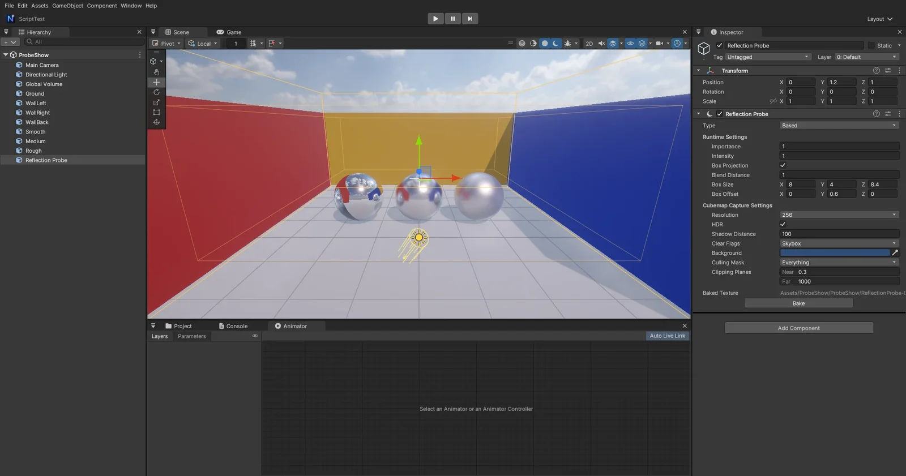

# Reflection Probe

Unity 의 **Reflection Probe** 처럼 한 점에서 본 주변을 큐브맵으로 찍어, 상자 안의 물체가 **하늘 대신 그 장면을 반사**하게 합니다 (방 안의 금속 · 유리 · 젖은 바닥). 엔진 코어 기능이라 패키지 없이 쓸 수 있습니다.



## 쓰는 법

1. **GameObject > Light > Reflection Probe** (또는 GameObject > Rendering > Reflection Probe, Add Component > Rendering > Reflection Probe)
2. 반사를 받을 공간을 **Box Size** 로 감쌉니다 (상자는 월드 축 정렬 — 회전 · 크기는 쓰지 않음, Unity 와 같음). 찍는 점은 GameObject 의 위치, 상자 중심은 위치 + **Box Offset**
3. Type 에 따라
   - **Baked** (기본): 씬을 저장한 뒤 **Bake** — `Assets/.../<씬 이름>/ReflectionProbe-<n>.dds` 에 저장되고 다음부터 그 파일을 읽습니다. 장면을 바꾸면 다시 Bake
   - **Custom**: 직접 고른 큐브맵 (`.dds`, Project 창에서 Cubemap 칸으로 끌기)
   - **Realtime**: 실행 중 다시 찍기 — Refresh Mode **On Awake** (처음 한 번 · 설정을 바꿀 때), **Every Frame**, **Via Scripting** (Inspector 의 Render Probe / `nova probe render`). Time Slicing **Individual Faces** = 프레임마다 한 면 (6 프레임에 한 바퀴)
4. 상자 안의 물체는 그 프로브를, 밖은 하늘을 반사합니다. 상자 가장자리 **Blend Distance** 안에서는 다음 프로브 · 하늘로 부드럽게 넘어갑니다

## Inspector (Unity 와 같은 이름)

| 항목 | 뜻 |
|------|-----|
| Type | Baked · Custom · Realtime |
| Importance | 겹친 프로브 중 높은 것이 먼저 (같으면 작은 상자가 먼저) |
| Intensity | 반사 밝기 배율 |
| Box Projection | 반사 방향을 상자 벽에 맞춤 — 방처럼 가까운 벽이 제자리 · 제 크기로 비침 (찍는 점에서 떨어진 물체일수록 차이가 큼) |
| Blend Distance | 상자 안쪽 이 폭에서 섞임 (0 = 딱 끊김) |
| Box Size · Box Offset | 영향 상자 크기 · 중심 이동 |
| Resolution | 한 면의 크기 (16 ~ 2048, 기본 128) |
| HDR | 16 비트 실수 (밝은 빛 · 발광이 1 을 넘어도 그대로) |
| Shadow Distance | 찍을 때의 그림자 거리 |
| Clear Flags · Background | Skybox 또는 단색 배경 |
| Culling Mask | 찍을 때 그릴 레이어 |
| Clipping Planes | 찍는 카메라의 Near · Far |

고르면 Scene 뷰에 주황 영향 상자, 옅은 안쪽 상자 (Blend Distance), 찍는 점 (흰 십자) 이 보입니다.

## 동작 (엔진 안)

- **찍기**: 한 면 = Game 뷰와 같은 그리기 (그림자 · 하늘 · 대기 · 물 · 입자 · 데칼) 를 90° 카메라로 6 번. SSAO · 후처리는 없고, 찍는 동안 다른 프로브 반사는 끕니다 (Unity 의 1 바운스). Realtime 프로브의 찍기는 프레임마다 뷰를 그리기 전에
- **필터**: 뷰마다 보이는 프로브를 Importance · 크기 순으로 **최대 8 개** 골라 큐브 배열 (R16G16B16A16 float, 해상도 = 고른 것 중 가장 큰 것, 최대 512) 의 칸에 넣고, 밉마다 **GGX 중요도 샘플링** 으로 거칠기별로 흐리게 합니다 (내용이 바뀐 칸만 다시). 매끈한 면은 또렷하게, 거친 면은 흐리게
- **셰이더** (`32. InstancedBasic.fx` 의 `ProbeReflection`): 픽셀마다 프로브를 순서대로 — 상자 안 가중치 (Blend Distance) 만큼 더하고, 남는 몫은 하늘. URP Forward+ 의 프로브 블렌드와 같은 방식이라 큰 물체도 위치마다 맞는 프로브를 씁니다
- **낮 · 밤** ([DAY_NIGHT](DAY_NIGHT.md#반사-프로브-시각마다-다시-찍기)): Day Night Cycle 이 시각마다 프로브를 다시 찍습니다 (Baked 도 실행 중의 큐브로 — 파일은 그대로).
  실행 중에 찍은 큐브 (Realtime · 다시 찍은 것) 는 그때의 하늘이 들어 있어 날씨 · 낮밤 하늘 보정을 하지 않고, 구운 큐브와 하늘만 보정합니다
- **반사 (스페큘러) 만** 바꿉니다 — 확산 환경광은 [Adaptive Probe Volume](ADAPTIVE_PROBE_VOLUME.md) (없으면 하늘)
- Mesh Renderer · Skinned Mesh · 지형 · 나무 · Shader Graph (Lit) 재질이 모두 같은 함수를 씁니다. Game · Scene 뷰, DirectX 11 · OpenGL 같은 결과
- 파일: `Source/Scene/ReflectionProbe.*` (컴포넌트), `Source/Graphics/DX11/ReflectionProbes.*` (찍기 · 필터 · 고르기 · 굽기 · CLI), `Shaders/54. ReflectionProbe.fx` (필터)

## CLI

```bash
nova create empty --name Probe --position 0,1,0
nova add-component Probe ReflectionProbe
nova set Probe --component ReflectionProbe --values '{"size":[10,4,10],"boxProjection":true,"resolution":256}'
nova scene save --as Assets/Scenes/Room.scene
nova probe bake
nova probe info
```

- `probe bake [--name X]`: 지금 찍어 DDS 로 저장 (이름이 없으면 모든 Baked 프로브). 씬이 저장돼 있어야 합니다
- `probe render [--name X]`: Realtime 프로브를 다음 프레임에 다시 찍기
- `probe info`: 프로브 목록 (Type · 구운 파일 · 찍힘 · 칸), 마지막 뷰가 쓴 프로브 수
- JSON 키: `mode` (Baked · Realtime · Custom) · `refreshMode` (OnAwake · EveryFrame · ViaScripting) · `timeSlicing` (AllFacesAtOnce · IndividualFaces · NoTimeSlicing) · `importance` · `intensity` · `boxProjection` · `blendDistance` · `size` · `center` (Box Offset) · `resolution` · `hdr` · `shadowDistance` · `clearFlags` (Skybox · SolidColor) · `backgroundColor` · `cullingMask` · `nearClipPlane` · `farClipPlane` · `customCubemap` · `bakedTexture`

## 아직

- C# `ReflectionProbe.RenderProbe()` · `ReflectionProbe` 클래스 (C# 네이티브 표 — 다음 회차)
- Lighting 창의 Generate Lighting (모든 프로브 한 번에 굽기 — 지금은 `nova probe bake`)
- 한 뷰에 9 개 이상이 보이면 Importance · 크기 순으로 8 개만
- 게임 빌드: 구운 DDS 는 씬 JSON 의 경로로 함께 들어갑니다 (빌드한 게임 실행 검사는 아직)
