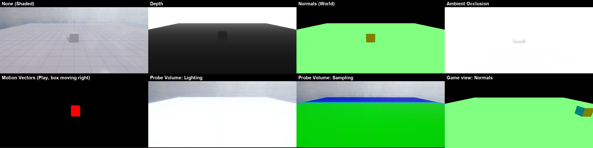

# Rendering Debugger (Scene · Game 뷰 디버그 보기)

Unity URP 의 **Window > Analysis > Rendering Debugger** 처럼, Scene 뷰와 Game 뷰를 그리는 중간 결과로 바꿔 봅니다. 그림이 왜 그렇게 나오는지 (깊이 · 노멀 · SSAO · 움직임 · 간접광) 를 눈으로 확인할 때 씁니다. 편집기 전용입니다 (게임 빌드에는 없음).



## 여는 곳

- **Window > Analysis > Rendering Debugger** — Fullscreen Debug Mode 드롭다운 + 모드마다 값 (Depth Range · Motion Vector Scale) · 설명 · Reset
- **Scene 뷰 툴바의 벌레 아이콘 (Debug Options) ▾ > Debug View** — 같은 모드를 바로 고르기
- CLI: `nova debugview <mode>`

모드는 하나 (전역) 이고 **Scene 뷰와 Game 뷰에 함께** 적용됩니다 (Unity 와 같음).

## 모드

| 모드 | CLI | 보이는 것 |
|------|-----|------|
| None | `none` | 보통 그림 |
| Depth | `depth` | 뷰 깊이: 가까우면 검정 → **Depth Range** (기본 50 m) 에서 흰색, 하늘 = 흰색 |
| Normals (World) | `normals` | 월드 노멀을 색으로 (x · y · z → 빨강 · 초록 · 파랑, 위를 보는 바닥 = 연두 (128, 255, 128), −z 면 = 올리브), 하늘 = 검정 |
| Ambient Occlusion | `ao` | SSAO 맵 (흰색 = 열림, 어두움 = 가려짐) — Volume 에 SSAO 를 켜야 보인다 ([SSAO](SSAO.md)) |
| Motion Vectors | `motion` | 화면 속도: 색 = 방향 (오른쪽 빨강 · 아래 노랑-초록 · 왼쪽 청록 · 위 파랑-보라), 밝기 = 속도 (16 픽셀 / **Motion Vector Scale** 에서 가장 밝다), 멈춤 = 검정. Scene 뷰도 이 모드일 때만 모션 벡터를 따로 그린다 ([Motion Vectors](MOTION_VECTORS.md)) |
| Probe Volume: Lighting | `apv` | Adaptive Probe Volume 의 프로브 빛만 (x 6) — 물체 셰이더가 그린다 |
| Probe Volume: Sampling | `apv-sampling` | 프로브를 섞은 방법: 초록 = 벽 검사 + 노멀, 노랑 = 노멀만, 빨강 = 삼선형만, 파랑 = 큰 단계 |

## CLI

```bash
nova debugview depth --range 20
nova debugview motion --scale 2
nova debugview none
nova debugview info    # 모드 · 값 · 마지막으로 그린 모드 (Scene · Game) · Scene 뷰 모션 벡터 정보
```

## 동작 (엔진 안)

- `Source/Graphics/DX11/RenderingDebug.*` + `Shaders/64. RenderingDebug.fx`: 뷰의 마지막 (후처리 뒤, UI 앞) 에 전체 화면 삼각형 하나로 깊이 프리패스 (노멀 · 깊이) · SSAO 맵 · 모션 벡터를 그린다
- Scene 뷰의 모션 벡터: `MotionVectors` 가 뷰마다 (Game · Scene) 타깃 · 지난 카메라 · 렌더러 기록을 따로 둔다 — 같은 프레임에 두 뷰가 그려도 서로의 "지난 프레임" 을 덮지 않는다
- APV 두 모드는 `ProbeVolumes::SetDebugView` (예전의 `nova probevolume debug --view 1|2` 와 같은 것) — 다른 모드로 나가면 끈다
- 창: `Source/Editor/Windows/RenderingDebuggerWindow.*`, 툴바: `SceneToolbar.cpp` (bug_menu)

## 검사

`Tools/tests/run_tests.ps1 -Only renderingdebug` (10 항목, 창 없는 편집기 + CLI): Depth (하늘 255 · 가까운 바닥 19 < 먼 바닥 72 · 회색), Depth Range 5 m 면 먼 바닥이 흰색, Normals (바닥 (127, 255, 127) · 상자 앞 (127, 127, 0) · 하늘 0),
AO (열린 바닥 255 · 상자 밑 226), 편집 중 Motion Vectors 검정, None 으로 돌아가면 원래 그림 (차 0.01), Play 에서 오른쪽으로 가는 상자만 빨강 (Scene · Game 뷰), Game 뷰 Normals, APV Lighting · Sampling.

## 아직 · 한계

- Unity 의 Material (Albedo · Smoothness · Metallic …) · Lighting (그림자 캐스케이드 · 빛 수) · Display Stats · Map Overlays (작은 그림 겹치기) 패널은 아직
- 투명 · 입자 · 물 · 스프라이트는 깊이 프리패스에 없어 보이지 않는다 (불투명만)
- 게임 빌드 · 안드로이드 · 웹에는 없음
