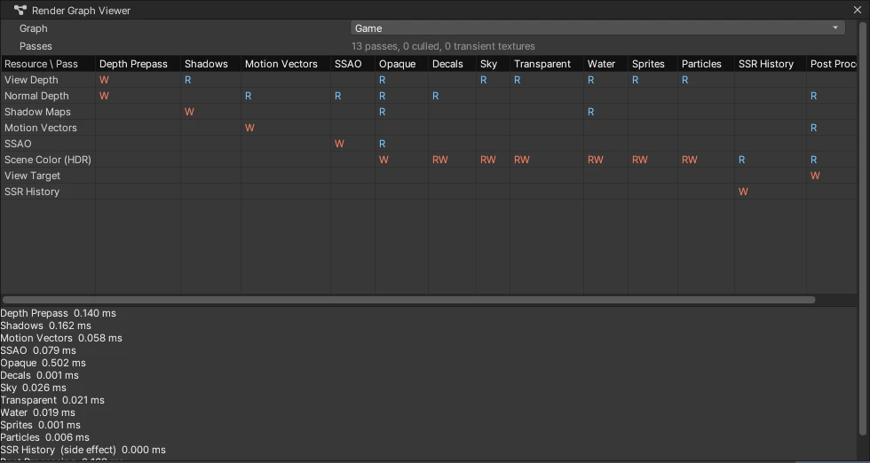

# Render Graph (동적 패스 스케줄링)

Game 뷰 · Scene 뷰의 한 프레임을 **패스 노드** 로 적습니다 (Unity URP 의 Render Graph · Frostbite Frame Graph 와 같은 생각). 패스마다 읽는 · 쓰는 텍스처를 선언하면, 그래프가 결과에 닿지 않는 패스를 빼고 임시 텍스처를 수명에 맞춰 다시 씁니다. 렌더링 현대화 2 단계 ([RENDERING_ROADMAP](RENDERING_ROADMAP.md)).

## 보는 법

- **Window > Analysis > Render Graph Viewer**: 그래프 (Game · Scene · 반사 프로브 …) 를 골라 패스 (열) x 자원 (행) 표 — **W** 쓰기 (주황), **R** 읽기 (파랑), **RW** 둘 다. 빠진 패스는 회색. 아래는 패스마다 CPU 시간과 임시 텍스처 풀
- `nova rendergraph info [--view Game|Scene]`: 패스 목록 (이름 · 빠짐 · Side Effect · 읽기 · 쓰기 · CPU ms) · 자원 · 풀

## 패스 (Game 뷰)

Depth Prepass → Shadows → Motion Vectors → SSAO → Opaque → Decals → Sky → Atmosphere → Transparent → Water → Sprites → Particles → SSR History → Post Processing → Rendering Debugger. Scene 뷰는 여기에 Grid · UI.

- **빼기 (culling)**: 출력 (뷰 타깃) 과 Side Effect (다음 프레임 히스토리 — SSR History) 에서 거꾸로 따라가 아무도 읽지 않는 패스를 뺀다. 예: **Motion Vectors** 는 읽는 쪽 (SSAO 시간 누적 · TAA · Motion Blur *Camera And Objects* · Rendering Debugger 의 Motion Vectors) 이 하나도 없으면 그리지 않는다 — 예전에는 늘 그렸다
- **판 (version)**: 같은 텍스처를 여러 패스가 이어 쓰면 (Scene Color 에 Opaque → Decals → Sky …) 쓸 때마다 새 판 → 순서가 그래프에 그대로 남는다
- **임시 텍스처 풀**: 그래프 안에서 만든 텍스처는 처음 · 마지막 쓰임 사이만 빌리고 돌려준다 (같은 모양이면 다음 패스 · 다음 뷰가 다시 쓴다). 쓰지 않은 지 오래된 것은 `TrimPool` 이 놓는다

## 코드

- `Source/Graphics/Common/RenderGraph.h/.cpp`: `Graph::AddPass(name, setup, execute)` — setup 에서 `Builder` 로 `Read` · `Write` · `Create` · `SideEffect` · `AsyncCompute` 를 선언, execute 에서 `Resources` 로 SRV · RTV · DSV · UAV 를 받는다. `Import` = 그래프 밖의 텍스처 (뷰 타깃 · 깊이 · 그림자 맵 …), `MarkOutput` = 결과
- `EditorApp::RenderGameView` · `_Editor_OnSceneRender`: 예전에 손으로 쓴 같은 순서 두 벌 → 그래프 하나씩
- `AsyncCompute` 표시는 지금은 같은 큐에서 그대로 돈다 — 큐가 둘인 백엔드 (DirectX 12 · Vulkan) 에서 다른 큐로 보내는 것은 4 단계

## 검사

`Tools/tests/run_tests.ps1 -Only rendergraph` (5 항목): Scene 뷰 패스 순서 (Depth Prepass … UI) 와 Motion Vectors 빠짐, Rendering Debugger Motion Vectors 를 켜면 돌고 끄면 다시 빠짐, Game 뷰에서 SSAO 시간 누적 · TAA · Motion Blur Camera And Objects 가 Motion Vectors 를 살림, Post Processing 의 읽기 (Scene Color · Motion Vectors) · 쓰기 (View Target) 기록, Render Graph Viewer 창. 그래픽 회귀 21 스위트 196 항목 통과.
