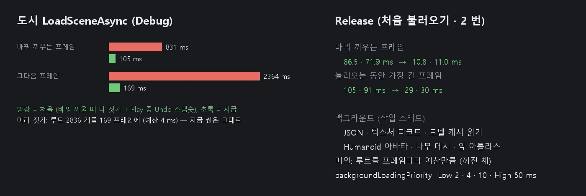

# 씬 · 에셋 스트리밍 (LoadSceneAsync)

`SceneManager.LoadSceneAsync` 로 씬을 바꿀 때 화면이 멈추지 않게 합니다. Unity 의 `AsyncOperation.progress` · `allowSceneActivation` · `Application.backgroundLoadingPriority` 동작을 그대로 따릅니다.

## 흐름

| 단계 | 어디서 | progress |
|------|------|------|
| 1. 파일 읽기 · JSON 해석 · 쓸 에셋 찾기 | 작업 스레드 | 0 → 0.5 |
| 2. 텍스처 디코드 · 모델 캐시 파일 읽기 | 작업 스레드 (1 과 겹친다) | |
| 3. 새 씬을 미리 짓기 (루트 단위, 프레임마다 예산만큼) | 메인 | 0.5 → 0.85 |
| 4. 미리 데우기 (처음 쓸 때 만드는 캐시) | 메인 (예산) + 작업 스레드 | → 0.9 |
| 5. `allowSceneActivation` 을 기다린다 | | 0.9 |
| 6. 바꿔 끼우기: 앞 씬 정리 · Awake · 물리 바디 · Start | 메인 (한 프레임) | 1 |

- 작업은 요청한 차례대로 끝난다. 미리 짓기는 맨 앞 작업만 하고, 뒤의 작업은 그동안 파싱 · 디코드를 해 둔다.
- 동기 `LoadScene` 은 예전처럼 다음 프레임에 한 번에 짓는다 (Unity 와 같음).

### 프레임 예산 — `Application.backgroundLoadingPriority`

| ThreadPriority | 프레임마다 |
|------|------|
| `Low` | 2 ms |
| `BelowNormal` (기본) | 4 ms |
| `Normal` | 10 ms |
| `High` | 50 ms |

- 높을수록 적은 프레임에 끝나고, 그 프레임은 길어진다. 도시 (루트 2836 개, Debug): Low 292 프레임 · 가장 긴 4.8 ms, High 12 프레임 · 가장 긴 50 ms.
- Play 를 멈추면 기본으로 돌아간다.
- 루트 하나 · 미리 데우기 하나는 나눌 수 없다. 예산을 크게 넘으면 무엇이었는지 Editor.log 에 남긴다 (`staging root …` · `prewarm … took …`).

## 미리 짓는 씬이 지금 씬에 끼어들지 않게

- 새 씬은 아직 현재 씬이 아닌 `Scene` 에 짓는다. 그 씬의 **힙** (Single) 또는 지금 씬의 힙 (Additive — 바꿔 끼울 때 옮긴다) 에 짓는다.
- 미리 짓는 루트는 **꺼진 것으로 보인다** (`GameObject::SetStaged`).
  - `IsActive` · `IsActiveInHierarchy` 가 false 다. 그래서 전역 목록 (나무 · 카메라 · 볼륨 · 지형 · 파티클 · UI · 오디오 리스너 …) 이 지금 씬에 끼워 그리지 않는다.
  - 저장 · 인스펙터 (`m_IsActive`) 와 C# 의 `activeSelf` 는 그대로다. 바꿔 끼우기 전에는 스크립트에도 보이지 않는다.
  - 검사 전에는 지금 씬 화면에 미리 지은 도시의 나무가 그려졌다.
- **Light** 는 `LightManager` 에 넣지 않고 모아 두었다가 바꿔 끼울 때 넣는다.
- 컬링은 렌더러가 생성자에서 들어오지만, 씬 표시 (`CullSceneStamp`) 로 지금 씬 것만 추적한다.

## 미리 데우기 — 처음 쓸 때 만드는 캐시를 바꿔 끼우기 전에

`Component::PrewarmStaged()` (기본은 아무것도 안 함). 다 지은 뒤 같은 예산으로 부르고, 무거운 계산은 작업 스레드로 보낸다 (`SceneStreaming::QueuePrewarmJob` — 미리 짓기는 이 잡이 끝나야 0.9 에 이른다).

| 컴포넌트 | 무엇 | 어디서 |
|------|------|------|
| Animator | 자기 스켈레톤 · 기본 상태 클립의 원본 스켈레톤의 **Humanoid 아바타 표** (리타깃 — 원본 하나에 약 120 ms, Debug) | 작업 스레드 (캐시에 잠금) |
| Tree | 절차 **나무 메시** (LOD 0 · 1) · **잎 아틀라스** (잎 SDF + 밉 덮임 + RGBA8 변환) | 작업 스레드 — 처음 그리기는 GPU 로 올리기만 (111 → 0.6 ms, 37 → 0.4 ms) |
| Terrain | 칠한 나무의 메시 · 위치 캐시 | 메시는 작업 스레드, 위치는 메인 |
| Physics | 바디 형상 (상자 · 메시 · 합성) — 바꿔 끼운 뒤 첫 동기화가 그대로 쓰고 바디를 한 번에 넣는다 ([PHYSICS_SYNC](PHYSICS_SYNC.md)) | 작업 스레드 |
| Tree · Terrain 나무 (GPU) | 메시 올리기 · 잎 · 껍질 텍스처 · **임포스터 굽기** — 나무 종류마다 한 번 | 메인 (`SceneStreaming::QueueMainPrewarm`) — 잡이 다 끝난 뒤 예산만큼, 다 하면 다음 프레임에 바꿔 끼운다 |

## 에셋 미리 불러오기

파싱 잡이 씬 JSON 과 재질 파일 (`.mat`) 에서 경로를 모은다.
- **텍스처** (`.png` `.jpg` `.tga` `.dds` `.bmp`): 작업 스레드가 디코드한다 (`Utils::PrefetchTexture` — 파일 · DDS/WIC 디코드 · Import Settings · DDS 캐시. WIC 은 그 스레드에서 COM 을 연다).
  - 메인 `LoadTexture` 는 디코드가 끝났으면 GPU 로 올리기만 한다.
  - 디코드 중이면 끝날 때까지 기다린다.
  - 아직 시작 전이면 메인이 가져가 직접 디코드한다. 그래서 일꾼이 바빠도 멈추지 않는다.
- **모델** (`.fbx` `.glb` `.gltf` `.vrm`): 캐시 파일 (`.mesh` · `.animations` · `.skeletons`) 을 미리 읽어 OS 파일 캐시를 데운다.
- 불러오기가 다 끝나면 쓰지 않은 디코드 결과를 버린다.

## 함께 고친 것

- **Undo 스냅숏**: Play 중에도 씬이 바뀌면 (Play 시작 · LoadSceneAsync) 편집기 Undo 가 씬 전체를 JSON 으로 떴다. Play 중에는 Undo 를 기록하지 않아 쓰이지 않는데, 도시에서 980 ms 였다 (Debug). 이제 Play 중에는 뜨지 않고, Stop 해 편집 씬이 돌아올 때 뜬다.
- **런타임으로 읽은 씬의 힙**: 예전에는 지금 씬 (곧 지울 씬) 의 힙에 지어, 앞 씬을 지운 뒤에도 그 힙이 남았다. 이제 새 씬의 힙에 짓는다.

## 측정 — 도시 (오브젝트 2852 · 루트 2836)

**Release** (새 편집기마다 처음 불러오기, 번갈아 2 번. 예전 = `NOVA_DEV_NO_STAGING=1` — 바꿔 끼우는 프레임에 다 짓기. Undo 수정은 둘 다 들어 있다)

| | 예전 | 지금 |
|------|------|------|
| 바꿔 끼우는 프레임 | 86.5 · 71.9 ms | **10.8 · 11.0 ms** |
| 불러오는 동안 가장 긴 프레임 | 105 · 91 ms | **29 · 30 ms** |
| 미리 짓기 | — | 33 · 36 프레임, 한 프레임 최대 11 ms |

**Debug** (처음 → 지금)

| | 처음 | 지금 |
|------|------|------|
| 바꿔 끼우는 프레임 | 831 ms (짓기 601 · Start 220) | 105 ms (짓기 0 · Start 17 · 물리 바디 76) |
| 그다음 프레임 | 2364 ms (Undo 980 · 나무 144) | 169 ms |
| 미리 짓는 동안 가장 긴 프레임 | — | 15 ~ 18 ms (예산 4 ms) |

## 검사

`Tools/tests/run_tests.ps1 -Only streaming` (8 항목):

| 검사 | 결과 |
|------|------|
| 텍스처 미리 디코드 | 처음 불러오는 Materials 장면의 텍스처를 작업 스레드가 디코드하고 메인은 올리기만 한다. 화면은 바로 연 것과 같다 |
| 미리 짓기 · 0.9 대기 | 루트 2836 개를 여러 프레임에 짓고 `allowSceneActivation = false` 면 0.9 에서 기다린다 |
| 끼어들지 않음 | 미리 짓는 동안 지금 씬 화면이 그대로다 |
| 바꿔 끼우는 프레임 | 짓기 없이 들어가기만 한다 |
| 화면 | 스트리밍한 도시가 바로 연 도시와 같다 |
| 힙 | 새 씬은 자기 힙에 있고, 남는 힙이 없다 |
| `backgroundLoadingPriority` | C# 이 엔진까지 닿는다. High 는 Low 보다 적은 프레임에 짓는다 |
| Stop | 짓는 중에 멈추면 미리 지은 씬을 버린다 (충돌 · 남은 힙 없음) |

`scenes` 스위트 (Additive · 0.9 대기 · DontDestroyOnLoad · 알림 순서) 도 그대로 통과한다.

### 바꿔 끼운 뒤 끊김 (2026-10-10)

`frameAfterMs` (바꿔 끼운 프레임의 나머지 + 다음 프레임, 벽시계) 가 50 ~ 56 ms 였다. 쪼개 보니 세 가지였다:

- 바꿔 끼우는 프레임 CPU 35 ms 중 26 ms 가 **프로파일 구간 밖**이었다. 끝난 작업 (`PendingOp`) 을 놓으며 파싱한 씬 JSON (오브젝트 2852 개 트리) 을 메인이 지웠다 → 작업 스레드로 (`Scene.ReleaseOp`). 미리 디코드한 이미지 버퍼도 작업 스레드에서 놓는다.
- 다음 프레임의 나무 7.5 ms: 처음 그리는 나무 종류의 임포스터 굽기 (5.9 ms) · 껍질 텍스처 (3.1 ms) · 잎 텍스처 · 메시 올리기 → 바꿔 끼우기 전 메인 GPU 미리 데우기 (`Scene.PrewarmGpu` — 따로 한 프레임, 그다음 프레임에 바꿔 끼운다).
- 바꿔 끼우는 프레임의 물리 6 → 4 ms (형상 미리 만들기 — 위).

| Release 도시 (2 · 3 번째 측정) | 전 | 뒤 |
|------|------|------|
| 바꿔 끼우는 프레임 CPU | 30 ~ 35 ms | **11 ~ 12 ms** |
| 다음 프레임 CPU | 21 ~ 23 ms | 18 ~ 20 ms |
| `frameAfterMs` | 50 ~ 56 ms | **28 ~ 30 ms** |

다음 프레임에 남은 것은 새 씬의 첫 그리기 (오클루전 버퍼를 키우고 처음 올리기 3.8 ms, 그리기 목록 모으기 1.2 ms) 다.

## CLI — `nova scenestream`

- `load --path Assets/Scenes/X.scene [--additive true] [--allow false]` — Play 중 `LoadSceneAsync`
- `status --id N` — progress · 단계별 ms (미리 짓기 · 바꿔 끼우기 · 다음 프레임) · 루트 · 오브젝트
- `allow --id N --allow true` — `allowSceneActivation`
- `priority [--value 0|1|2|4]` — `backgroundLoadingPriority`
- `stats` · `reset` — 캐시에 없어 불러온 텍스처 · 재질 · 메시 파일 (수 · ms), 미리 디코드 (요청 · 쓰임 · 기다림 · 메인이 가져감)
- `profile --on true` → `slowframes --minMs 50 --depth 3 [--scopeMs 1]` — Profiler 기록의 긴 프레임 구간 (`scopeMs` 보다 짧은 구간은 뺀다)

## 아직

- 바꿔 끼우는 프레임의 물리 4 ms: 미리 짓기 때 모은 소유자 묶음 · 서명을 그대로 쓰면 더 준다.
- 다음 프레임의 오클루전 버퍼 (3.8 ms): 미리 짓기 때 새 씬의 렌더러 수만큼 키워 두기.
- 모델 (FBX · glTF) 파일의 메시 GPU 버퍼 · 텍스처는 아직 메인에서 만든다 (파일 읽기만 미리).
- Additive 로 미리 지은 루트의 fileID 다시 매기기는 바꿔 끼우는 프레임에 한다.
