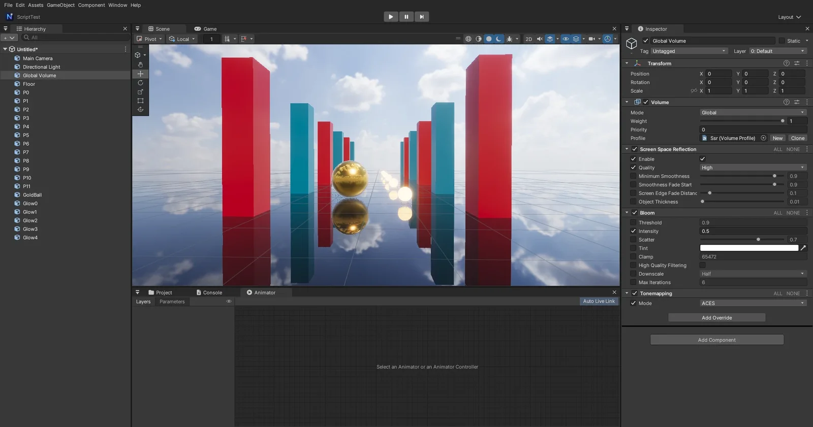

# Screen Space Reflection

HDRP 의 Volume 효과 **Screen Space Reflection** 과 같은 이름 · 필드입니다 (URP 에는 없습니다). 화면에 보이는 물체를 반질한 면에 비춥니다 — 물웅덩이, 매끈한 바닥, 금속. Reflection Probe 가 못 담는 움직이는 물체와 가까운 반사를 채웁니다.

## 쓰는 법

1. 씬의 **Global Volume** (또는 Local Volume) 을 고르고 Profile 의 **Add Override > Lighting > Screen Space Reflection**
2. **Enable** 을 켭니다 (덮어쓰기 칸 + 값)
3. 반사가 보일 재질: **Smoothness 가 Minimum Smoothness (기본 0.9) 이상** — 매끈한 재질일수록, 비스듬히 볼수록 (프레넬) 강하게 비칩니다. 금속은 정면에서도 비칩니다
4. Game 뷰 · Scene 뷰 모두 (Scene 뷰는 툴바 Effects 와 상관없이 Volume 을 따름)

## Inspector

| 항목 | 뜻 |
|------|-----|
| Enable | 켜기 |
| Quality | Low · Medium · High = 광선 걸음 16 · 32 · 64 (HDRP 의 Max Ray Steps) |
| Minimum Smoothness | 이보다 거친 면은 화면 반사 없음 (프로브 · 하늘만) |
| Smoothness Fade Start | Minimum Smoothness ~ 이 값 사이는 서서히 (이 값 이상은 온전히) |
| Screen Edge Fade Distance | 화면 가장자리에서 흐려지는 폭 (화면 비율) — 화면 밖은 비출 정보가 없다 |
| Object Thickness | 깊이 버퍼 속 물체의 두께 (깊이에 대한 비율). 이 안으로 들어간 광선만 맞음 |

## 동작 (엔진 안)

- 포워드 렌더러라 G 버퍼 (재질 값) 가 없다 → **본 패스의 `ShadeLit` 안에서** 계산한다. 그래서 재질의 매끈함 · 금속성 · 프레넬이 그대로 적용되고, 엔진 Lit · 지형 · 나무 · 바위 · Shader Graph Lit 모두 같은 반사
- 광선: 표면에서 반사 방향으로 깊이 프리패스 (뷰 노멀 · 뷰 깊이 — SSAO · 데칼 · DoF 가 쓰는 것) 를 걷는다. 화면에서 고르게 (원근 보정 — 가까운 곳이 촘촘), 화면을 벗어나는 지점까지만, 픽셀마다 고정 무늬로 시작점을 어긋나게 해 띠를 흩뜨린다
  - 면 뒤 (Object Thickness 안) 로 들어가면 이분 탐색으로 좁히고, 좁힌 점이 면에 붙어 있어야 맞음 (물체 위를 살짝 넘어 그 뒤로 지나간 광선은 버림)
  - 두 걸음 사이 깊이가 크게 끊기면 (면 → 하늘 · 먼 곳) 그 사이를 따로 좁혀 본다 — 물체 가장자리에서 면 뒤로 짧게 들어간 광선을 걸음이 건너뛰어 생기던 털 같은 띠를 없앤다
  - 하늘 · 면의 뒷면에 맞으면 버림
- 맞은 점의 색 = **지난 프레임 장면 색** (후처리 전 — 톤매핑 · 블룸이 두 번 들지 않게). 맞은 월드 위치를 지난 프레임 ViewProj 로 되돌려 찾으므로 카메라가 움직인 첫 프레임도 제자리. 장면 색은 밉을 만들어 거친 면일수록 흐린 밉
- 믿음 (매끈함 페이드 × 화면 가장자리 × 광선 끝) 만큼 프로브 · 하늘 반사를 대신한다. 못 맞으면 예전 그대로
- Game · Scene 뷰마다 장면 색을 따로 둔다 (Scene 뷰는 격자 · 스프라이트 · 입자 전에 저장 — 격자 선이 반사에 비치지 않게). Reflection Probe · APV 찍기에는 없다. 켠 첫 프레임은 장면 색이 없어 프로브 · 하늘만
- 비용: Minimum Smoothness 이상인 픽셀만 광선을 걷는다. 컴퓨트 없이 픽셀 셰이더만 — DirectX 11 · OpenGL 같은 결과
- 화면 공간 반사의 본래 한계: 화면 밖 · 가려진 곳 (구의 밑면 등) 은 비출 수 없다 → 그 자리는 프로브 · 하늘
- 파일: `Source/Graphics/DX11/ScreenSpaceReflection.*` (Volume 값 · 장면 색 저장 · 밉 · 이펙트에 넣기), `Shaders/32. InstancedBasic.fx` (`ScreenSpaceReflection` · `ShadeLit` 의 반사 항), `Source/Graphics/Common/VolumeProfile.cpp` (효과 정의), `Source/Editor/EditorApp.cpp` (두 뷰에서 Prepare · Bind · StoreHistory)

## 검사

`Tools/tests/run_tests.ps1 -Only ssr` — 거울 바닥 위 빨간 상자:

1. Enable: 바닥의 반사 자리 빨강 0 % → 100 %
2. Minimum Smoothness 0.9: 매끈함 0.8 바닥은 반사 없음
3. 카메라를 옮긴 첫 프레임 (지난 프레임 색을 되돌려 찾음) = 안정된 프레임
4. Game 뷰 (Main Camera) 에도 반사

## 아직

- 시간 누적 (TAA) 이 없어 거친 면 반사는 밉으로만 흐림 — Minimum Smoothness 를 많이 낮추면 거칠어 보일 수 있다
- 투명 · 물 표면은 자기 셰이더 (물은 따로 반사)
