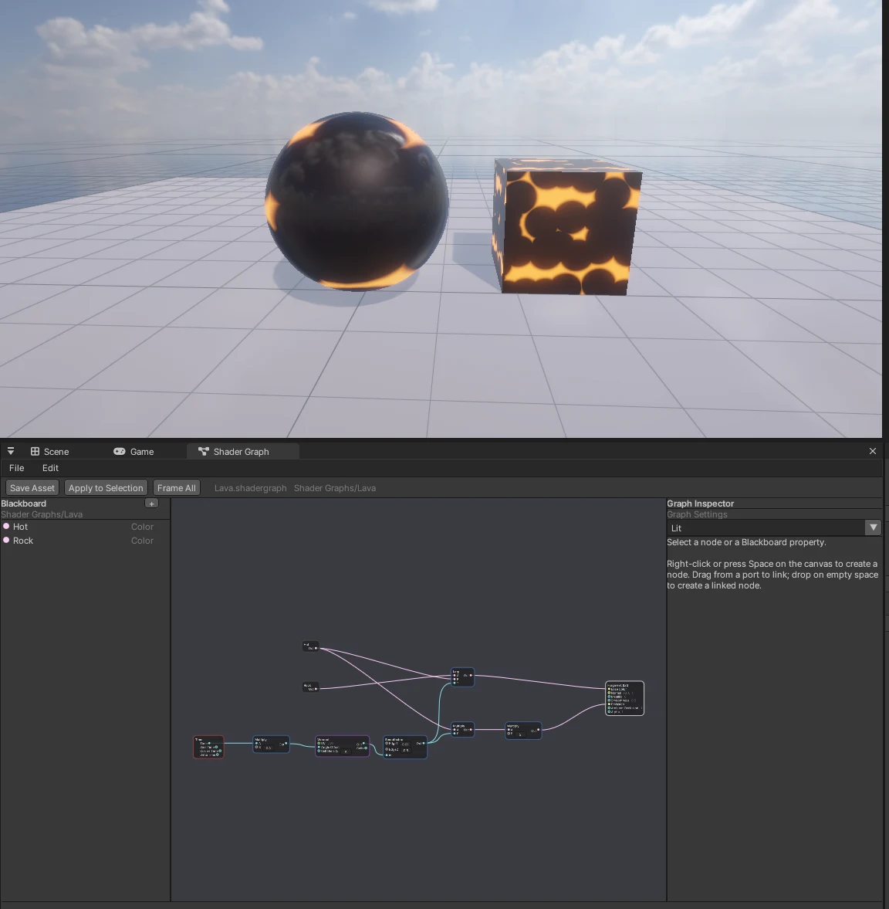
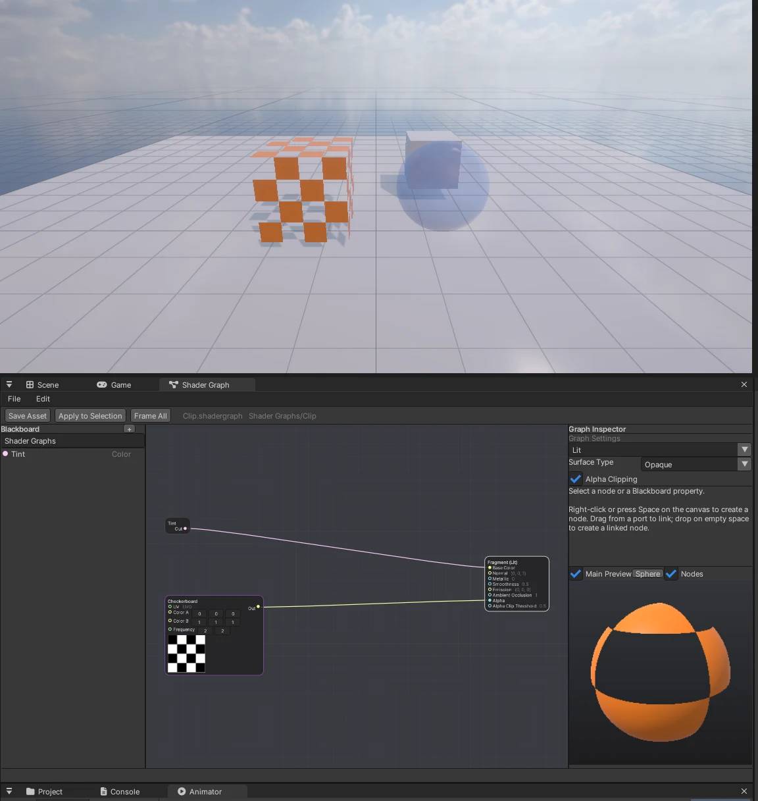
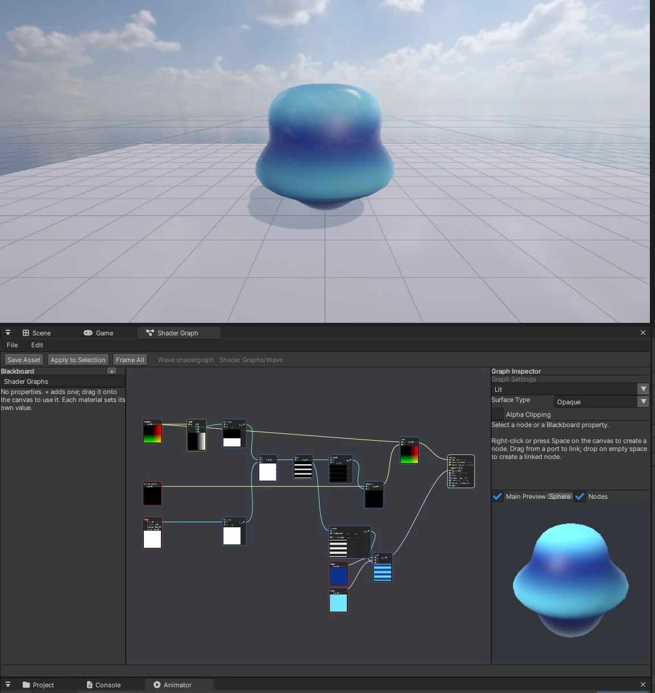

# Shader Graph

Unity 의 Shader Graph 처럼 **노드를 이어 재질 셰이더를 만듭니다**. 엔진 코어 기능이라 패키지 없이 쓸 수 있고, 게임 빌드에서도 동작합니다.







## 쓰는 법

1. Project 창 **Create > Shader Graph** → `New Shader Graph.shadergraph` (더블클릭 = **Window > Shader Graph** 로 열기)
2. 캔버스에서 **오른쪽 클릭 또는 Space** = Create Node (검색 · 분류 메뉴). 출력 핀을 끌어 입력 핀에 놓아 잇습니다. 핀을 끌어 **빈 곳에 놓으면** Create Node 가 열리고, 만든 노드를 그 핀에 자동으로 잇습니다
3. 오른쪽 **Fragment** 노드 (Master) 의 입력에 이어 표면을 정합니다: Lit = Base Color · Normal (Tangent Space) · Metallic · Smoothness · Emission · Ambient Occlusion · Alpha, Unlit = Base Color · Alpha
4. 왼쪽 **Blackboard** 의 `+` 로 속성 (Float · Color · Vector2/3/4 · Texture2D) 을 만들고 캔버스로 끌어 놓습니다. 속성 값은 **재질마다** (재질 Inspector 의 Properties)
5. **Save Asset (Ctrl+S)** = 저장 + 셰이더 만들기. 셰이더는 **백그라운드에서 컴파일** (에디터가 멈추지 않는다 — 그동안 예전 셰이더로 그림, 상태 줄 "Compiling …"). 오류는 창 아래 상태 줄 (HLSL 컴파일러 메시지 포함)
6. **Apply to Selection** = 그래프 옆 `<이름>.mat` 를 만들어 (없으면) 고른 Mesh Renderer 에 넣습니다. 재질 Inspector 의 Shader 목록에도 `Shader Graphs/<이름>` 이 나옵니다

### Vertex 단계 (정점 옮기기)

Master 위쪽 **Vertex** 블록: **Vertex Position · Vertex Normal · Vertex Tangent** (오브젝트 공간 — 이어지지 않으면 메시 값 그대로). 물결치는 바다, 바람에 흔들리는 풀 · 깃발, 부풀었다 줄어드는 물체 ([예제: 물결](examples/shadergraph_wave.txt)).

- **Position · Normal Vector** 노드의 Space = World (기본) / **Object** — Vertex 단계에서는 옮기기 전 값, Fragment 에서는 옮긴 뒤 값
- 깊이 프리패스 · 그림자도 같은 위치로 옮깁니다 (그림자 모양도 바뀜). Time 은 프레임마다 한 값이라 모든 패스가 같은 자리
- Vertex 단계에서 Sample Texture 2D 는 mip 0 (Unity 의 Sample Texture 2D LOD), 화면 미분을 쓰는 노드 (Checkerboard · Ellipse · Rectangle) 는 쓸 수 없다고 알려 줍니다
- Main Preview 는 실제 구 / 상자 메시라 정점 이동이 보입니다

### Sub Graph (.shadersubgraph)

Project 창 **Create > Shader Sub Graph**. 노드 묶음을 다른 그래프에서 **노드 하나**로 씁니다 (HLSL 함수 하나로 만들어짐).

- Sub Graph 의 **Blackboard 속성 = 노드 입력** (기본값 = 속성 값, Texture2D 도), Graph Inspector 의 **Outputs** (이름 · 형) = 노드 출력. Master 자리에 **Output** 노드
- 그래프에서 Create Node > **Sub Graphs** 메뉴, 또는 Project 창에서 캔버스로 끌어 놓기. 노드를 고르고 **Open Sub Graph**
- Sub Graph 를 저장하면 **그것을 쓰는 그래프가 다시 만들어집니다** (1 초 안 — 파일 시각을 봄). Sub Graph 안에서 Sub Graph 도 (8 단계까지), 자기 자신은 안 됨
- Sub Graph 안의 그림은 Texture2D 속성으로 (노드에 바로 넣은 그림은 안 됨)

### Custom Function

Create Node > Utility > **Custom Function** — HLSL 을 직접 씁니다 (Unity 와 같은 두 방식).

| Type | 내용 |
|---|---|
| String | Body = `void 함수(입력들, out 출력들) { … }` 의 안쪽. 예: `Out = A.zyx;` |
| File | `.hlsl` 파일 (Project 창에서 끌어 놓기) 안의 `void <Name>_float(입력들, out 출력들)` 를 부릅니다 |

입력 · 출력은 Graph Inspector 에서 이름 · 형 (Float · Vector2/3/4 · Color, 입력은 Texture2D 도) 을 정합니다. 그림은 `samSG` 샘플러로 (`tex.Sample(samSG, uv)`). `.hlsl` 을 고치면 쓰는 그래프가 다시 만들어집니다.

### 미리보기

- **노드 미리보기**: 노드마다 첫 출력의 값을 색으로 (float = 회색, Vector2 = 빨강 · 초록 …). Time 노드에 이어진 것은 움직입니다
- **Main Preview** (오른쪽 아래): 엔진 기본 구 / 상자 메시 (버튼으로 바꿈) 에 지금 그래프 (정점 이동 포함) — 고정 빛 · 하늘 (씬과 무관), **끌어 돌리기**. Alpha Clipping 은 잘린 곳이 뚫리고, Transparent 는 배경과 섞입니다. Sub Graph 는 첫 출력을 색으로
- 그래프를 바꾸고 잠시 뒤 (값을 끄는 동안은 기다림) 작은 미리보기 셰이더를 백그라운드에서 다시 만듭니다 (엔진 셰이더를 포함하지 않아 수십 ms). Nodes · Main Preview 체크로 끌 수 있습니다

### Graph Settings (Graph Inspector)

| 설정 | 내용 |
|---|---|
| Material | Lit (엔진 URP Lit 조명) / Unlit / **Decal** (Decal Projector 의 재질 — UV = 투영 UV, [DECAL.md](DECAL.md)) |
| Surface Type | **Opaque** / **Transparent** — 투명은 불투명 · 하늘 · 대기 다음, 물 앞에 **먼 것부터** 알파로 섞어 그립니다 (깊이는 읽기만, 그림자 · 깊이 프리패스에는 없음) |
| Alpha Clipping | 켜면 Master 에 **Alpha Clip Threshold** — Alpha 가 그보다 작은 곳을 잘라냅니다. **깊이 프리패스 · 그림자도 같은 구멍** (잎 · 철망 · 체커) |
| Tessellation | 켜면 Vertex 블록에 **Displacement** (m, 법선 쪽) — 카메라 가까이에서 삼각형을 잘게 나누고 나눈 정점마다 민다 (Tessellation Factor · Triangle Size · Fade Distance). 불투명만, 깊이 프리패스 · 그림자도 같은 모양 — [TESSELLATION.md](TESSELLATION.md#shader-graph) ([예제](examples/shadergraph_tessellation.txt)) |
| 경로 (Blackboard 제목 아래) | 셰이더 이름 = `<경로>/<파일 이름>` (기본 `Shader Graphs`). 다른 폴더에 같은 이름의 그래프가 있으면 저장할 때 알려 주므로 한쪽 경로를 바꿉니다 (Unity 와 같은 방법) |

- 이어지지 않은 입력은 노드 안에서 값을 바로 바꿉니다 (UV · Position 같은 입력은 기본으로 메시 값)
- 노드를 고르면 오른쪽 **Graph Inspector** 에 설명 · 입력 값 · 노드 설정 (Color 노드의 색, Swizzle 의 mask, Sample Texture 2D 의 Type (Default / Normal) · 그림)
- Delete = 노드 · 선 지우기, Ctrl+Z / Ctrl+Y, 휠 = 확대, 오른쪽 끌기 = 화면 이동, Frame All
- 그래프 기본값을 바꿔도 **이미 만든 재질은 제 값**을 지킵니다 (Unity 와 같다). 새 재질은 새 기본값

## 노드 (67 종)

| 분류 | 노드 |
|---|---|
| Input / Basic | Float, Vector2/3/4, Color, Time (Time · Sine Time · Cosine Time · Delta Time) |
| Input / Geometry | UV, Position (World / Object), Normal Vector (World / Object), View Direction, Screen Position |
| Input / Texture | Sample Texture 2D (RGBA · R · G · B · A, Type = Normal 이면 탄젠트 노멀로 풀어 줌) |
| Math | Add, Subtract, Multiply, Divide, Power, Square Root, Absolute, Negate, One Minus, Reciprocal, Exponential, Log, Modulo, Posterize, Saturate, Fraction, Minimum, Maximum, Clamp, Remap, Floor, Ceiling, Round, Step, Lerp, Smoothstep, Sine, Cosine, Tangent, Dot Product, Cross Product, Normalize, Length, Distance, Fresnel Effect |
| Channel | Split, Combine, Swizzle |
| UV | Tiling And Offset, Rotate, Polar Coordinates |
| Procedural | Simple Noise, Gradient Noise, Voronoi, Checkerboard, Ellipse, Rectangle |
| Artistic | Normal Strength, Normal Blend, Contrast, Saturation |
| Utility | Branch, Property (Blackboard), **Custom Function**, **Sub Graph** |

형 규칙은 Unity 와 같습니다: **동적 포트** (Add · Multiply · Lerp …) 는 이은 것 중 가장 큰 폭, 작은 벡터 → 큰 벡터는 float 이면 모든 칸에 · 나머지는 0, 큰 → 작은 은 앞 칸만. Texture2D 는 Texture 입력에만, 고리는 거절합니다. Procedural 노드의 식은 Unity Shader Graph 문서의 생성 코드와 같습니다.

## CLI (AI 에이전트)

창과 같은 연산을 `nova shadergraph <op>` 로 합니다 (`nova shadergraph help`, 노드 목록 = `nova shadergraph nodes`).

```bash
nova shadergraph new Assets/Shaders/Lava.shadergraph            # (--material Unlit)
nova shadergraph batch docs/examples/shadergraph_lava.txt       # 한 줄에 연산 하나, Undo 한 번
nova shadergraph save                                           # 저장 + 셰이더 (오류가 돌아온다)
nova shadergraph material                                       # Assets/Shaders/Lava.mat
nova set Sphere --component MeshRenderer --values '{"m_MaterialPaths":["Assets/Shaders/Lava.mat"]}'
```

| 연산 | 내용 |
|---|---|
| `new <path> [--material Lit\|Unlit\|Decal] [--force]` · `open <path>` · `save [path]` · `info` | 문서 (info = 속성 · 노드 (입력: 이은 것 / 값) · Master) |
| `node.add --type T [--x --y] [--values '{"B":[1,0,0,1]}'] [--options '{"mask":"xy"}']` | 노드 id 는 새 그래프에서 1 부터 차례로 |
| `node.set --id N [--values] [--options] [--x --y]` · `node.delete --id N` | values · options 는 합친다 (null = 지움) |
| `connect --from N [--out Port] --to M\|Master --in Port` · `disconnect --to M --in Port` | 입력 하나에 선 하나 (새로 이으면 바꾼다) |
| `property.add --name --type [--value] [--range a,b] [--texture] [--ref] [--node]` · `property.set` · `property.delete` | Blackboard |
| `settings [--material Lit\|Unlit\|Decal] [--surface Opaque\|Transparent] [--alpha-clip true\|false] [--path "Shader Graphs"]` | Graph Settings (`info` 에 surface · alphaClip · shaderPath · compiling) |
| `compile [--hlsl]` · `material [--mat path]` · `undo` · `redo` · `window` | `save` 는 CLI 에서 컴파일이 끝날 때까지 기다려 오류를 돌려준다 (Sub Graph 를 저장하면 그것을 쓰는 그래프를 다시 만들고 기다림) |
| `new <path.shadersubgraph>` · `output.add --name --type` · `output.set --name [--rename] [--type]` · `output.delete --name` | Sub Graph (출력 하나 Out (Vector3) 로 시작) |
| `node.add --type "Sub Graph" --options '{"asset":"Assets/x.shadersubgraph"}'` | Sub Graph 노드 (입력 = 그 Blackboard 속성 이름) |
| `node.add --type "Custom Function" --options '{"name":"Flip","mode":"String","body":"Out = A.zyx;","inputs":[{"name":"A","type":"Vector3"}],"outputs":[{"name":"Out","type":"Vector3"}]}'` | File 이면 `"mode":"File","file":"Assets/x.hlsl"` |
| `node.add --type Position --options '{"space":"Object"}'` · `connect ... --in "Vertex Position"` | Vertex 단계 ([예제](examples/shadergraph_wave.txt)) |
| `settings --tessellation true [--tessFactor 32 --tessTriangleSize 12 --tessFadeDistance 50]` · `connect ... --in Displacement` | 테셀레이션 ([예제](examples/shadergraph_tessellation.txt)) |

## 구조 (엔진 코드)

- `Source/ShaderGraph/ShaderGraph.*` — 그래프 (JSON `.shadergraph`), 노드 정의 (포트 · 코드 생성 람다), 형 변환, `Generate()` → `.fx`
- `ShaderGraphRuntime.*` — `CustomShaders` Provider: 재질의 Shader 이름이 프로젝트의 그래프 (`<경로>/<파일 이름>`) 면 처음 찾을 때 그래프 → `<프로젝트>/Library/ShaderGraph/<이름>_<경로 해시>.fx` → **작업 스레드에서 컴파일** (셰이더 캐시만 채움) → 끝나면 `LoadEffect` (캐시 적중) → 등록. 그동안 재질은 Fallback (다시 만들 때는 예전 셰이더). 그리기 = `DrawInstanced` (Mesh Renderer — 본 · 투명 · 깊이 · 그림자 패스) · `DrawSkinned` (Skinned Mesh Renderer — 본 · 깊이 · 그림자). 재질 값 = `.mat` 의 `Properties` (`{"_Tint": [1,0,0,1]}`)
- `ShaderGraphPreview.*` — 창의 노드 · Main 미리보기 (`GeneratePreview()` — 독립 이펙트 `SGPreviewNodeTech` (화면 삼각형) · `SGPreviewMainTech` (엔진 기본 메시 + Vertex 단계))
- 노드 포트: 보통은 종류마다 (`FindDef`), Sub Graph · Custom Function 은 노드 설정에서 (`DefOf(node)` — asset 파일 시각 / 설정 JSON 으로 캐시). Sub Graph = `void SGSub_<이름>_<해시>_F|V(입력들, sg_uv … sg_normalO, out 출력들)` 함수 (단계마다 — Vertex 는 SampleLevel), Custom Function = `SGCF_<이름>_<해시>` 또는 `#include` 한 `.hlsl` 의 `<Name>_float`
- Vertex 단계: `SG_EvaluateVertex()` 가 VS 입력 (PosL · NormalL · TangentL) 을 바꾼 뒤 엔진 `VS_Batch` / `VS_Skinned` 에 넘깁니다 (`VS_GraphBatch` · `VS_GraphSkinned`). 단계 사이 구조 `SGVOut` = 엔진 VertexOut + 오브젝트 위치 · 노멀. 정점을 옮기거나 잘라내면 `GraphDepth*` · `GraphShadow*` 기법도 만들어 깊이 · 그림자 패스를 이 셰이더가 그립니다 (`CustomShaders::Shader::CustomDepth`)
- 게임 빌드: 재질의 `"Shader"` 이름을 그래프 파일로 풀어 그 그래프와 그래프만 쓰는 그림까지 넣습니다. 게임은 처음 쓸 때 셰이더를 백그라운드에서 만듭니다
- `ShaderGraphOps.*` — 문서 + 연산 (창 · CLI 공용, Undo 스냅숏)
- `ShaderGraphWindow.*` — imgui-node-editor 캔버스, Blackboard, Graph Inspector, `.shadergraph` 에셋 종류, CLI 등록
- 만든 `.fx` 는 엔진 `32. InstancedBasic.fx` 를 포함해 `ShadeLit` (URP Lit — 빛 · 그림자 · 하늘 · SSAO · 안개 · Light Culling Mask) 을 그대로 씁니다. 노드 코드는 `SG_Evaluate()` 하나 (모든 PS 가 같이 씀). 기법 `GraphBatchTech` (VS_Batch) · `GraphSkinnedTech` (VS_Skinned), Alpha Clipping 이면 `GraphDepth{Batch,Skinned}Tech` (깊이 프리패스 — SsaoNormalDepth 와 같은 출력) · `GraphShadow{Batch,Skinned}Tech` (그림자 — 엔진과 같은 바이어스)

## 아직

Keyword (Boolean · Enum 분기), Sampler State 노드, Gradient · Sample Gradient, Triplanar, 노드 그룹 · 메모, Sub Graph 안의 노드 그림 (지금은 Texture2D 속성으로), 스킨 메시의 Transparent (지금은 Mesh Renderer 만 — 스킨은 불투명으로), 투명 물체의 그림자, Render Face (양면), 스킨 메시의 Vertex 단계는 뼈 이전 (바인드 자세) 공간, OpenGL 경로 검사

## GPU 인스턴싱 속성 (MaterialPropertyBlock)

Reference 가 `_BaseColor` · `_Color` (Color), `_EmissionColor` (Color), `_Metallic` · `_Smoothness` · `_Glossiness` (Float) 인 속성은 Mesh Renderer 의
MaterialPropertyBlock 값을 **인스턴스 값** 으로 받는다 — 값이 렌더러마다 달라도 한 묶음 (Unity 의 Per-instance 속성). 만든 코드에서는 상수 버퍼에 `gSGm_<Reference>`,
그래프가 읽는 `gSG_<Reference>` 는 `static` 이고 진입점마다 `SG_InstanceProps` 가 인스턴스 값 또는 재질 값으로 채운다 (배치 정점 셰이더는 `VertexIn_Batch`).
스킨 · 미리보기 · 데칼은 재질 값. 재질의 `SetColor("_BaseColor", …)` 도 이 그래프 속성을 바꾼다 — 자세한 규칙은 [MATERIAL_SCRIPTING.md](MATERIAL_SCRIPTING.md).

