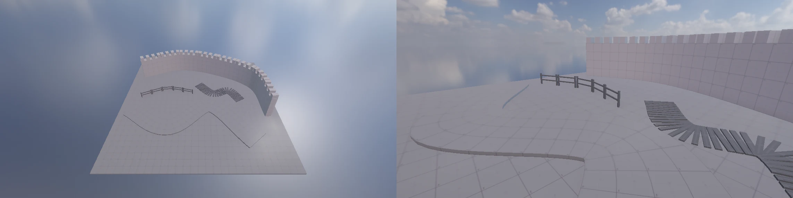

# 스플라인 (Spline Container · Spline Instantiate)

Unity Splines 패키지의 Spline Container · Spline Instantiate 와 같은 일을 한다. 여기에 메시를 곡선을 따라 **휘는** 배치 (Deform) 를 더했다.
성벽 · 길 · 울타리 · 판자 길을 곡선 하나로 놓는다. GameObject > Spline 메뉴에 미리 정한 것이 있다.

## Spline Container

| 값 | 뜻 |
|------|------|
| Knots | 점 (이 오브젝트의 로컬). Scene 뷰에서 끌기 · Ctrl+클릭 더하기 · Shift+클릭 / Delete 지우기 (Edit Points). 점은 지면 (지형) 위에 놓인다 |
| Interpolation | Smooth = centripetal Catmull-Rom (점 간격이 고르지 않아도 고리 · 뾰족함이 없다), Linear = 직선 (꺾인 성벽) |
| Closed | 끝이 처음으로 돌아온다 (성곽 둘레) |

곡선은 0.25 m 마다 나눈 누적 길이 표로 거리를 묻는다. 표는 점이 바뀔 때만 다시 만든다.

## Spline Instantiate

| 값 | 뜻 |
|------|------|
| Items | 프리팹 목록 (Project 창에서 끌어다 놓기) · Weight (여럿이면 무작위로 고를 비율) |
| Method | **Repeat** = 프리팹 인스턴스를 그대로 반복한다 (휘지 않음 — 판자 · 울타리 · 가로등). **Deform** = 프리팹의 메시를 곡선을 따라 휜다 (성벽 · 길 · 다리) |
| Spacing | Item Length (조각 길이 + Gap 으로 이어 붙인다) · Distance (고정 간격) · Count (개수) |
| Fit To Length | 곡선 길이에 꼭 맞춘다 (Deform 은 조각을 조금 늘이거나 줄이고, Repeat 은 간격을 맞춘다) |
| Forward Axis | 프리팹의 어느 축이 곡선을 따라갈지 (X · Z · -X · -Z). 프로토타입 벽은 X, 판자처럼 가로로 놓을 것은 Z |
| Keep Upright | 경사에서도 세로가 그대로다 (성벽 · 울타리). 끄면 경사를 따라 기운다 (길 · 판자) |
| Deform Resolution | Deform: 진행 방향으로 나눌 길이 (m). 정점이 적은 상자도 휘게, 세모를 이 길이로 잘게 나눈다 |
| Generate Colliders | Deform: 휜 조각마다 Mesh Collider. Repeat 은 프리팹의 콜라이더를 그대로 쓴다 |
| Offset · Rotation Y | 곡선 기준 옮기기 (옆 X · 위 Y · 앞 Z) · 더 돌리기 |
| Random Yaw · Random Scale · Seed | Repeat: 무작위 회전 · 크기 |

- 만든 조각은 이 오브젝트의 자식이다. 다만 저장하지 않고 계층 창에서도 숨긴다 (Unity 의 HideFlags.HideAndDontSave — `GameObject::SetHideAndDontSave`).
  점 · 설정이 바뀌면 다시 만든다 (끄는 동안은 0.08 초에 한 번). Scene 뷰에서 조각을 누르면 스플라인 오브젝트가 골라진다.
- **Bake Instances** (Repeat) 는 조각을 보통 (저장되는) 오브젝트로 바꾸고 컴포넌트를 끈다. Deform 조각은 메시 파일이 없어서 굽지 않는다.
- Deform 은 프리팹을 한 번만 읽어 메시 · 재질 · 범위를 기억한다. 조각마다 원본 메시를 복사해 정점을 곡선 틀 (앞 · 위 · 옆) 로 옮기고, 노멀 · 접선도 돌린다.

## CLI

- `nova create spline --preset 0..4 --name X` — 0 곡선, 1 성벽 (Deform), 2 울타리 (Repeat), 3 판자 길 (Repeat), 4 길 (Deform)
- `nova set X --component SplineContainer --values "{\"knots\":[[0,0,0],[10,0,5]],\"closed\":false,\"interpolation\":0}"`
- `nova set X --component SplineInstantiate --values "{\"method\":1,\"items\":[{\"prefab\":\"Assets/Wall.prefab\"}]}"`
- `nova spline info --target X` (길이 · 조각 수 · 휜 정점 수) · `nova spline rebuild --target X` · `nova spline bake --target X`
