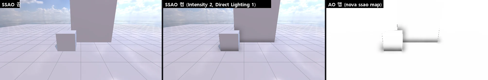
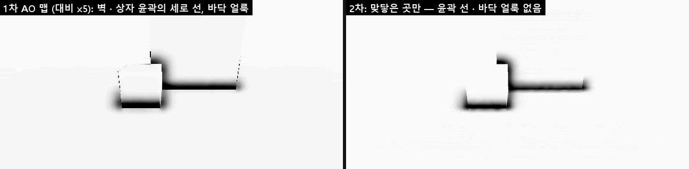

# Screen Space Ambient Occlusion (SSAO)

Unity URP 의 **Screen Space Ambient Occlusion** 과 같은 값을 **Volume** 효과로 다룹니다. 깊이 프리패스의 노멀 · 깊이로 물체가 맞닿은 곳 · 모서리 · 틈의 환경광을 가립니다. Volume 이라 장소마다 (Local Volume) 다르게 섞을 수 있습니다.



## 쓰는 법

1. 씬의 **Global Volume** (또는 Local Volume) 을 고르고 Profile 의 **Add Override > Lighting > Screen Space Ambient Occlusion**
2. 바꿀 칸의 덮어쓰기를 켜고 값을 줍니다. 기본 = **켜짐** (URP 기본 렌더러처럼), 끄려면 **Enable** 을 끕니다
3. 모든 Lit 재질 · 지형 · 나무 · 바위 · 디테일에 적용됩니다 (재질마다 켜는 칸은 없다 — Unity 와 같음). Game 뷰 · Scene 뷰 모두

## Inspector

| 항목 | 기본 | 뜻 |
|------|------|-----|
| Enable | 켬 | 끄면 AO 맵을 흰색으로 (계산하지 않음) |
| Intensity | 1 | 가려짐 세기 (0 ~ 4, 0 = 없음) |
| Radius | 0.5 m | 표본 반지름 (뷰 공간). 크면 넓게 어두워진다 |
| Direct Lighting Strength | 0.25 | 직접광 (해 · 점광) 에도 곱하는 몫. 0 = 환경광만, 1 = 모두 |
| Samples | Medium | 픽셀마다 표본 Low 4 · Medium 8 · High 14 |
| Falloff Distance | 100 m | 카메라에서 이 거리까지 (끝 20 % 에서 사라진다) |
| Temporal Accumulation | 켬 | 프레임마다 표본 무늬를 돌리고 지난 결과와 섞는다 (HDRP 와 같음). TAA 의 지터로 깜빡이던 AO 가 고르다 |
| Full Resolution | 끔 | AO 를 화면 크기로 계산 (기본 = 반 해상도 — URP 의 Downsample). 약 2.5 배 비용 |

## 동작 (엔진 안)

- 깊이 프리패스가 뷰 노멀 · 뷰 깊이를 그린다 (`28. SsaoNormalDepth.fx` — SSR · 데칼 · DoF 도 이것을 쓴다)
- **AO** (`28. Ssao.fx`, 기본 반 해상도): 픽셀의 뷰 위치를 깊이와 화면 방향으로 되짚고, 노멀 쪽 반구에 고르게 퍼진 표본 (정육면체 꼭짓점 · 면 14 방향을 픽셀마다 무작위 방향으로 반사) 을 놓아 그 자리의 깊이가 앞을 막는 만큼 가린다. AO = 1 − 가림 × Intensity × (거리 페이드)
  - 화면 방향은 **그 프레임 카메라의 투영에서** (TAA 지터 포함) — 시야각 · 화면비를 바꿔도 바로 맞다
  - 노멀 · 깊이는 늘 **점으로** 읽는다 (반 해상도 = 2 x 2 의 왼쪽 위 픽셀, 방향도 그 픽셀 가운데) — 윤곽을 사이에 둔 값이 섞이지 않는다
- **시간 누적** (Temporal Accumulation): 표본 무늬를 프레임마다 옮기고 (R2 수열), 이번 위치를 지난 프레임의 뷰 · 투영으로 되돌려 히스토리 (AO · 뷰 깊이) 를 찾는다. 깊이가 맞을 때만 (가려졌다 드러난 곳은 버림), 이웃 3 x 3 의 범위로 잘라 (옮긴 물체의 잔상 없음) 0.9 의 비중으로 섞는다. Volume 값 · 크기가 바뀌면 히스토리를 버린다
- 가장자리를 지키는 흐림 (노멀이 다르거나 깊이가 깊이의 5 % 넘게 다른 이웃은 섞지 않음) — 시간 누적이면 한 번, 아니면 두 번. Game · Scene 뷰 모두
- **전체 해상도로** (Upsample): 둘레 AO 텍셀 4 개 중 이 픽셀과 깊이 · 노멀이 비슷한 것만 섞는다 — 앞 물체가 뒤의 AO 를 받지 않는다 (윤곽 후광 없음). 32 는 이 전체 해상도 맵을 읽는다
- `32. InstancedBasic.fx` 의 `ShadeLit`: 환경광 (하늘 · Adaptive Probe Volume) × AO, 직접광 × lerp(1, AO, Direct Lighting Strength)
- 반사 프로브 · APV 찍기 · 재질 미리보기에는 없다 (흰 맵)
- 컴퓨트 없이 픽셀 셰이더만 — DirectX 11 · OpenGL 같은 결과 (검사에서 AO 맵 차이 0)
- 파일: `Source/Graphics/DX11/Ssao.*` (타깃 · 계산 · 흐림 · Volume 값), `Source/Graphics/Common/VolumeProfile.cpp` (효과 정의), `Source/Editor/EditorApp.cpp` (두 뷰)

## 예전과 달라진 것 (2026-10-08)

- AO 맵은 계산했지만 **어떤 재질에도 쓰지 않았다** (재질의 숨은 `UseSsaoMap` 칸이 기본 0) → 모든 Lit 에 적용
- 표본이 **1 개** (`PS(1)`) 에 `pow(…, 16)` 로 대비를 올려 거의 0 / 1 인 노이즈를 흐림이 뭉갰다 → 4 · 8 · 14 표본, 세기는 Intensity
- 무작위 방향 텍스처에 float 를 RGBA8 로 그대로 올렸고, 방향을 정규화하지 않았다
- 화면 구석 방향을 뷰를 만들 때의 시야각 · 크기로만 정해, 시야각이 바뀌면 위치를 잘못 되짚었다
- Scene 뷰는 흐림 없이 노이즈 그대로였다
- 값이 셰이더에 고정 (반지름 0.5 m 등) → Volume 으로

## 비용

Game 뷰 1143 x 572, 이 개발 PC (`nova perf` 의 SSAO 단계 GPU 시간):

| 설정 | GPU |
|------|-----|
| 꺼짐 | 0.008 ms |
| 반 해상도 · 시간 누적 없음 | 0.29 ms |
| **반 해상도 · 시간 누적 (기본)** | **0.23 ms** (흐림이 한 번이라 더 싸다) |
| 전체 해상도 | 0.55 ms |
| 전체 해상도 · High (14) | 0.62 ms |

## 2 차 (2026-10-08)



- 윤곽의 얇은 선: AO · 흐림이 전체 해상도 노멀 · 깊이를 **선형으로** 읽어 윤곽을 사이에 둔 깊이 · 노멀이 섞였다 → 점으로, 반 해상도 AO 를 전체로 늘릴 때도 깊이 · 노멀이 비슷한 텍셀만
- 비스듬한 바닥 전체의 옅은 가림 (평균 0.993): 깊이를 읽은 픽셀과 방향을 구한 자리가 반 픽셀 어긋났다 → 같은 픽셀에서 (평균 0.9998)
- 시간 누적 · 전체 해상도 선택 추가. TAA 와 함께 연속 프레임의 AO 차이 0.38 → 0.15 (/255)

## CLI

```bash
nova ssao info
nova ssao map ao.png --view game
nova set "Global Volume" --component Volume --values '{"profile":"Assets/Settings/MyProfile.volumeprofile"}'
```

- `ssao info`: 이번 프레임에 쓴 값 (enabled · active · intensity · radius · directLightingStrength · samples · falloffDistance · temporalAccumulation · fullResolution) · 결과 크기 `mapSize` · 계산 크기 `aoSize` · 히스토리 (`historyValid` · `accumulatedFrames`)
- `ssao map <png> [--view game|scene]`: AO 맵을 회색 PNG 로 (흰 = 가림 없음) + 평균 · 최소
- Volume Profile JSON 의 효과 이름 `AmbientOcclusion`, 키: `enabled` · `intensity` · `radius` · `directLightingStrength` · `samples` (0 · 1 · 2) · `falloffDistance` · `temporalAccumulation` · `fullResolution`

## 검사

`Tools/tests/run_tests.ps1 -Only ssao` — 바닥 위 상자 · 벽:
끄면 AO 맵이 흰색, 켜면 맞닿은 곳만 어둡고 평평한 바닥 · 하늘은 1 (자기 가림 없음), 최종 그림도 맞닿은 곳만 어두워짐,
Intensity 2 > 1 · 0 = 없음, Radius 1.5 m 가 더 넓게, Samples 4 · 14, Falloff Distance 1 m = 없음, Direct Lighting Strength 1 이 직접광도 가림,
Game 뷰 = Scene 뷰 · 시야각을 좁혀도 바닥이 가려지지 않음, OpenGL = DirectX 11,
2 차: 열린 바닥 평균 ≥ 0.998 (얼룩 없음), 시간 누적의 히스토리, 옮긴 상자의 잔상이 6 프레임 안에 사라짐, Full Resolution (계산 크기 = 화면),
벽 앞 3.5 m 에 떠 있는 상자 둘레에 선 없음 (고정 표본 · 누적 · 전체 해상도 각각), TAA 에서 바닥이 열려 있고 연속 프레임 차이가 줄어듦 (17 항목).

## 아직 · 한계

- 화면 공간의 본래 한계: 화면 밖 · 앞의 물체에 가려진 것은 가리지 못한다
- 뷰 깊이가 16 비트라 카메라를 비스듬히 보는 먼 면에 아주 옅은 가로줄이 남을 수 있다 (검사 장면의 벽: 최소 0.98, 0.99 아래 0.07 %)
- 시간 누적은 카메라 움직임만 되돌린다 (움직이는 물체는 이웃 범위로 자를 뿐 — 모션 벡터 없음). 파란 노이즈 · After Opaque (URP) 는 아직
