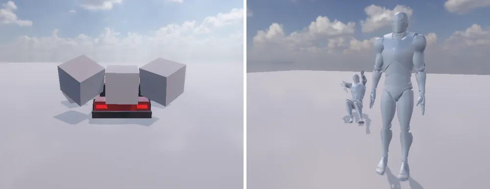
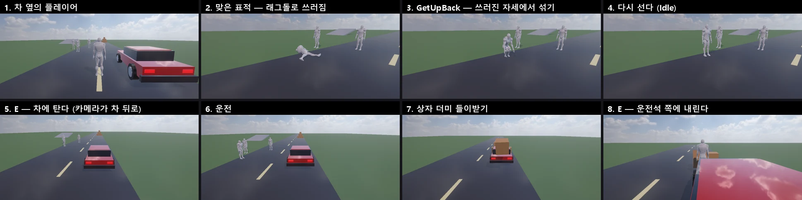

# Starter Assets — 3인칭 캐릭터 · 차 · 래그돌 표적

바로 Play 해 볼 수 있는 예제 (패키지 `com.nova.starter-assets`, C# 스크립트 — Unity Starter Assets 처럼).
메뉴 **GameObject > 3D Object** 의 아래 항목을 고르면 패키지가 없을 때 프로젝트에 넣고 (Cameras 도), 필요한 컴포넌트 · Main Camera 설정까지 붙인다.

<p align="center"><br/><sub>차가 상자 더미를 들이받는다 (Follow Camera 가 뒤에서) · 맞은 표적이 래그돌로 쓰러진다</sub></p>
<p align="center"><br/><sub>쓰러진 표적이 일어나기 클립으로 일어선다 · 플레이어가 E 로 차에 타서 운전하고 내린다</sub></p>

| 메뉴 / CLI | 만드는 것 | 조작 (Play) |
|---|---|---|
| Third Person Character · `nova create third-person-character` | 기본 캐릭터 + Character Controller + `ThirdPersonController` + `VehicleEnterExit` + Main Camera 의 Follow Camera | WASD · 화살표 이동, Left Shift 달리기, Space 점프, 오른쪽 버튼 끌기 = 카메라, 차 옆에서 E = 타기 · 내리기 |
| **Car** · `nova create car` | 차 (프리팹 `Assets/StarterAssets/Car.prefab`) + Main Camera 의 Follow Camera | W · ↑ 가속, S · ↓ 브레이크 → 멈추면 후진, A D · ← → 조향, Space 손 브레이크, R 뒤집힌 차 세우기 |
| **Ragdoll Target** · `nova create ragdoll-target` | 기본 캐릭터 + Ragdoll (꺼짐 — 서 있음) + `RagdollTarget`, Main Camera 에 `RagdollShooter` | 왼쪽 클릭 = 쏘기 → 맞은 표적이 맞은 자리에서 밀려 쓰러진다 |

## 차 (CarController)

처음 만들 때 차를 조립해 **프리팹** 과 재질 (`Assets/StarterAssets/Materials` — 차체 · 유리 · 타이어 · 휠 · 전조등 · 후미등) 로 저장하고,
다음부터는 그 프리팹의 인스턴스를 놓는다 (프리팹을 고치면 모든 차에). 새로 만든 차를 Main Camera 가 따라간다.

- 구조: `Car` (Rigidbody 1200 kg) — `Body` · `Cabin` (상자 콜라이더, 합쳐서 하나의 바디), 범퍼 · 등 (그림만),
  `Wheel FL · FR · RL · RR` (Wheel Collider — 반지름 0.36, 서스펜션 0.22 m, 40000 · 4500), `Wheel XX Mesh` (그림 바퀴 — 콜라이더 없음)
- `CarController`: 뒷바퀴 굴림 (`allWheelDrive` 로 네 바퀴), 빠를수록 조향을 줄인다 (`highSpeedSteer`), 가속을 놓으면 엔진 브레이크,
  달리는 중의 S = 네 바퀴 브레이크 → 멈추면 후진 (`maxReverseSpeed`), 속도² 에 비례하는 다운포스. 바퀴 그림은 `GetWorldPose` 로
- 키보드 대신 (UI 버튼 · AI · 시험): `readKeyboard = false` 로 두고 `throttle` (-1 ~ 1) · `steer` · `handbrake` 를 넣는다. 읽기: `speed` (m/s, 뒤 = -) · `speedKmh` · `groundedWheels`

```csharp
var car = GameObject.Find("Car").GetComponent<StarterAssets.CarController>();
car.readKeyboard = false;
car.throttle = 1f;     // 가속
car.steer = 0.5f;      // 오른쪽
Debug.Log(car.speedKmh);
```

## 래그돌 표적 (RagdollTarget · RagdollShooter)

[Ragdoll Wizard](RAGDOLL.md) 로 바디 11 개를 만들어 **꺼 둔다** (바디가 애니메이션을 따라감 — 서 있다).
`RagdollShooter` (Main Camera) 가 클릭한 화면 자리로 광선 (`Camera.ScreenPointToRay`) 을 쏘아 `RagdollTarget` 을 맞히면:
Ragdoll 을 켜고 (Animator 는 자동으로 꺼진다) 맞은 자리에 가장 가까운 바디를 광선 방향으로 민다 (`force`, N·s — 바디가 다이내믹이 된 다음 스텝에).
Character Controller · ThirdPersonController 가 있으면 함께 끈다. 다른 Rigidbody 를 맞히면 그 자리를 민다.

| RagdollTarget | 기본 | 내용 |
|---|---|---|
| `hitsToFall` | 1 | 몇 번 맞으면 쓰러지나 |
| `recoverAfter` | 0 | 쓰러진 뒤 다시 서기까지 (초, 0 = 그대로) — `Recover()` 로 직접 |
| `getUpBackState` · `getUpFrontState` | GetUpBack · GetUpFront | 등을 대고 누웠을 때 · 엎드렸을 때 재생할 Animator 상태 (비우면 섞기만) |
| `getUpTime` | 2.3 | 일어나는 시간 (초) — 끝나면 Character Controller · ThirdPersonController 를 다시 켠다 |

**일어나기** (`Recover()`): Ragdoll 이 꺼질 때 루트를 쓰러진 골반 자리로 옮기고, 등을 대고 누웠으면 발 쪽 · 엎드렸으면 머리 쪽으로 돌린 뒤
쓰러진 자세에서 애니메이션으로 `Ragdoll.blendTime` (0.5 초) 동안 섞는다 ([RAGDOLL](RAGDOLL.md#일어나기)). 누운 방향 (`ragdoll.isFaceUp`) 에 맞는
일어나기 클립이 기본 캐릭터 애니메이션 `Nova_Basic.glb` 에 있다 — **GetUpBack** (앉았다 무릎 당겨 서기, 2.2 초) · **GetUpFront** (팔로 밀고 네 발 → 쪼그려 서기, 2.4 초),
모델 편집기로 만든 것 ([examples/anim_basic.txt](examples/anim_basic.txt)). `DefaultCharacter.controller` 는 두 상태에서 끝나면 (Exit Time 0.92) Idle 로 간다.

```csharp
var shooter = Camera.main.GetComponent<StarterAssets.RagdollShooter>();
shooter.readMouse = false;
shooter.ShootAt(target.GetComponent<Animator>().GetBonePosition(HumanBodyBones.Chest));
```

함께 생긴 C# API (Unity 와 같은 이름): `Camera.ScreenPointToRay · ViewportPointToRay`, `Rigidbody.AddForceAtPosition`.

## 차에 타고 내리기 (VehicleEnterExit)

Third Person Character 에 붙어 있다 (다른 플레이어에는 Add Component). Play 중 차 (`CarController`) 가 `enterDistance` (3.5 m) 안에 있으면 **E** 로 탄다:
캐릭터를 숨기고 (렌더러 끔) Character Controller · ThirdPersonController 를 끄고 차가 키보드를 읽는다. Main Camera 의 Follow Camera 는 차 뒤로
(`carDistance` 7 · `carHeight` 2.6, 차를 따라 돈다). 다시 **E** = 운전석 쪽 (차의 왼쪽 `exitSideOffset` 1.8 m) 땅 위에 내려 원래 카메라 · 조작으로.
장면의 차는 플레이어가 탈 때까지 키보드를 읽지 않고 손 브레이크로 서 있다 (걷는 WASD 로 차가 움직이지 않게).

```csharp
var v = player.GetComponent<StarterAssets.VehicleEnterExit>();
v.readKeyboard = false;          // UI 버튼 · 시험
v.Enter(v.NearestCar());         // 가장 가까운 차 (없으면 null → false)
v.car.throttle = 1f;             // 탄 차를 스크립트로 (readKeyboard 를 끄면 차도 키보드를 읽지 않는다)
v.Exit();
```

## 데모 장면

`docs/examples/starter/build_starter_demo.ps1 -Project <프로젝트>` — 에디터를 연 채로 돌리면 `Assets/StarterDemo/StarterDemo.scene` 을 만든다:
길 · 경사로 · 상자 더미, 플레이어 옆의 차, 3 초 뒤 일어나는 표적 셋 (`nova set "Dummy A" --component RagdollTarget --values '{\"recoverAfter\":3}'` —
CLI 의 `--component` 는 C# 스크립트를 클래스 이름으로 고르고 값은 Inspector 의 public 칸).

## 검사

`Tools/tests/run_tests.ps1 -Only starter` — 차: 프리팹 · 재질 저장, 다음 차 = 인스턴스, 바퀴 4 · CarController · Follow Camera · 1200 kg,
네 바퀴로 쉬기, 가속 (12 m/s, 카메라가 뒤 9 m), 오른쪽 조향 (90°, 똑바로), S = 멈춤 → 후진,
래그돌 표적: 바디 11 (꺼짐) · RagdollTarget · RagdollShooter, ScreenPointToRay (가운데 = 앞, 가장자리 = 가로 시야각의 절반), 쏘면 쓰러져 밀려남,
일어나기 (누운 방향의 클립 · 루트가 골반 자리 · 끝나면 Idle, 머리 높이 0.35 → 1.68), 차 타기 (가까운 차 · 숨김 · 카메라가 차로) · 운전 (숨은 캐릭터가 따라감) ·
내리기 (운전석 쪽 땅 · 카메라가 캐릭터로 · 다시 걷기) (13 항목).
