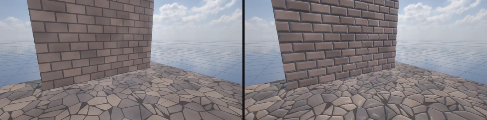
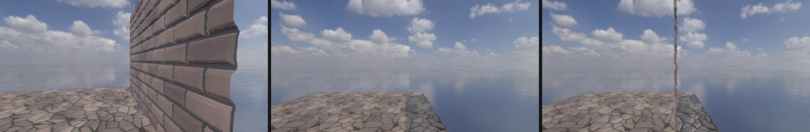
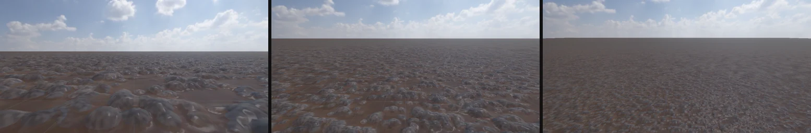
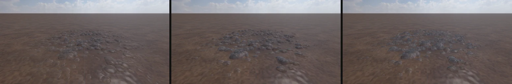
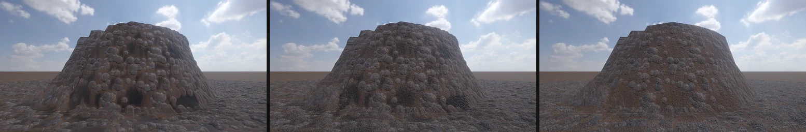
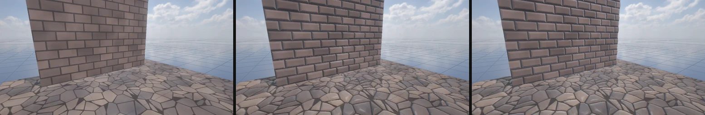
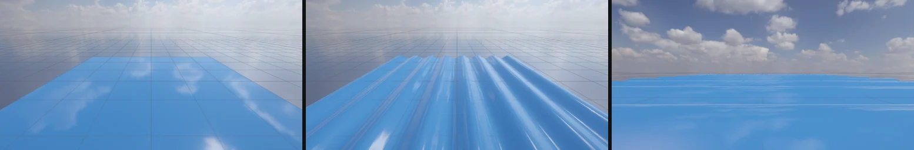
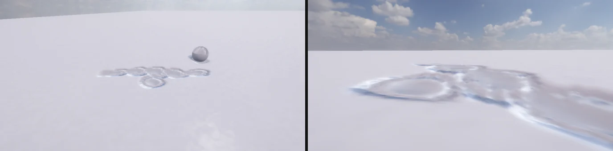

# Tessellation (높이 변위)

Lit 재질 · Terrain Layer · Shader Graph 의 높이만큼 표면을 실제로 밀어냅니다 (HDRP 의 Tessellation Displacement). 벽돌 벽 · 자갈 바닥 · 흙에 박힌 돌이 가까이서 진짜 입체가 되고, 옆에서 보면 윤곽이 울퉁불퉁하며 그림자도 그 모양을 따릅니다. 나눔이 끝나는 거리 너머와 테셀레이션이 없는 기기는 **POM** (시차 가림) 이 깊이감을 이어 받습니다.





## 재질 (Lit)

1. **Surface Options > Displacement Mode** 를 **Tessellation Displacement** 로
2. **Surface Inputs > Height Map** 에 높이 맵 (회색, 흰색 = 높다) — 오른쪽 칸 = **Amplitude** (m, 흰색과 검정의 높이 차)
3. **Base** (0..1): 원래 면의 자리. 0.5 면 회색은 그대로, 밝은 곳은 나오고 어두운 곳은 들어간다
4. **Tessellation Options**: Tessellation Factor (변 하나를 최대 몇 조각으로, 1 ~ 64) · Triangle Size (원하는 삼각형 변, 1080p 화면의 픽셀) · Fade Distance (이 거리 너머는 나누지 않는다, m)

높이 맵이 sRGB (색 텍스처) 로 가져와져 있으면 Inspector 가 **Fix Now** 를 보여 준다 — 누르면 Import Settings 를 선형 (sRGB 끔) + High Quality (BC7 — BC1 은 높이가 계단이 된다) 로 바꿔 다시 가져온다. sRGB 그대로면 높이가 감마로 휘어 Base 0.5 가 가운데가 아니다.

| 재질 값 (`.mat`) | 기본 | |
|---|---|---|
| `DisplacementMode` | `None` | `Tessellation` 이면 민다 |
| `HeightMapPath` | | 높이 맵 |
| `HeightAmplitude` | 0.05 | 높이 (m) |
| `HeightBase` | 0.5 | 원래 면의 자리 |
| `TessellationFactor` | 16 | 최대 나눔 |
| `TessellationTriangleSize` | 12 | 픽셀 |
| `TessellationFadeDistance` | 50 | m |

메시는 너무 거칠면 안 된다: 삼각형 하나가 최대 나눔 (16 이면 변 하나 16 조각) 보다 훨씬 크면 높이 맵을 다 담지 못한다. 벽 · 바닥은 Unity 의 Plane (10 × 10 칸) 처럼 몇 m 마다 정점이 있으면 된다. 메시의 모서리가 갈라진 곳 (Cube 의 면 경계처럼 정점이 따로인 곳) 은 면마다 다른 법선으로 밀려 틈이 생긴다 — HDRP 와 같다.

## 지형 (Terrain Layer)

지형 Inspector 의 **Paint Texture** 에서 레이어를 고르고 **Height Map** · **Amplitude** (m) · **Base** 를 넣는다 (`.terrainlayer` 의 `height` · `heightAmplitude` · `heightBase`). 색 (Diffuse) 과 같은 타일 · 같은 타일 없애기 무늬로 밀어 돌의 색과 모양이 맞고, 레이어마다 컨트롤 맵 가중치로 섞인다. 절벽은 색처럼 삼평면.

- 가까운 40 m 는 쿼드트리를 가장 잘게 (평평한 지형도 칸이 높이맵 한 칸) + 최대 32 조각 — 높이 맵의 돌 하나하나가 솟는다
- **Normal Map** · **Normal Scale** (Unity TerrainLayer 와 같은 칸, `.terrainlayer` 의 `normalMap` · `normalScale`): 삼평면 노멀 (투영마다 화이트아웃으로 지형 법선에 얹는다), 높이 기반 섞기와 같은 가중치. Normal map 으로 가져오지 않은 텍스처면 Fix Now
- 레이어 높이 맵 · Normal Map 여덟 장은 엔진이 **배열 하나** (Texture2DArray R10G10B10A2 1024² + 밉: R = 높이, G · B = 노멀 xy — 바뀔 때만 GPU 로 모은다) 로 읽는다 — 샘플러 하나라 OpenGL · GLES 의 픽셀 단계 샘플러 32 개 한도 안에서 지형 픽셀 셰이더도 높이 · 노멀을 쓴다
- 법선: 픽셀마다 높이의 화면 미분으로 범프 (모든 거리, 250 m 까지 줄어든다)
- 나눔 거리 (40 m) 끝부터 100 m 까지 **POM** 이 깊이감을 이어 받는다 — 평평한 땅은 위 투영, 절벽은 옆 투영 (가장 큰 삼평면 투영으로, 투영이 고르게 섞이는 비탈은 줄인다). 테셀레이션이 없는 기기는 가까이서도 POM + 범프
- 깊이 프리패스 · 그림자 · 덮개 맵도 같은 모양. CLI: `nova terrain-layer <지형> --add <.terrainlayer>` · `--fill <번호> [--center x,z --radius m --soft m]`



### 높이 기반 섞기 (Height-Based Blend)

지형 Inspector 의 **Terrain Settings > Height-Based Blend** (HDRP TerrainLit 과 같은 이름 · 기본 끔) 를 켜면, 레이어 경계에서 (높이 + 가중치) 가 큰 레이어부터 드러난다 — 돌이 흙 위로 또렷이 솟고 그 사이를 흙이 채운다 (선형 섞기는 경계의 돌이 유령처럼 옅다). **Height Transition** (0..1) = 전환 폭. 색 · 변위 · 범프가 같은 가중치. 높이 맵이 없는 레이어는 Base 높이로 친다. `Terrain` 값 `heightBasedBlend` · `heightTransition`.





## 성능

Release, GeForce GTX 1660 SUPER, Scene 뷰 1904 × 1001, 화면 가득 돌 지형 (흙 + 돌, 높이 기반 섞기 · Normal Map · 눈높이 카메라). 같은 세션에서 번갈아 세 번 잰 중앙값 (GPU ms):

| | 프레임 | 그림자 | 깊이 프리패스 | 본 패스 |
|---|---|---|---|---|
| 높이 · 노멀 없음 | 0.92 | 0.25 | 0.04 | 0.28 |
| Normal Map 만 | 1.09 | 0.27 | 0.04 | 0.39 |
| 테셀레이션 끔 (POM + 범프 + 노멀) | 1.85 | 0.27 | 0.04 | 1.17 |
| 테셀레이션 켬 | 2.16 | 0.38 | 0.16 | 1.24 |

줄인 것 (테셀레이션 켬 2.40 → 1.72 ms, Normal Map 앞): 화면 밖 패치를 Hull 에서 버린다 (본 · 깊이 — 카메라 아래 지형 노드는 뒤로도 62 m 라 반이 화면 밖이었다, 그림자는 화면 밖 물체도 드리우니 그대로), 방향광의 먼 캐스케이드 (1 ~ 3) 는 나누지 않는다 (받는 표면이 나눔 거리 끝).

## POM (시차 가림)

나눔이 끝나는 거리 (Fade Distance 의 끝 1/4) 너머는 픽셀 셰이더가 높이 맵을 시선 따라 걸어 내려가며 (6 ~ 16 걸음) 처음 닿는 곳의 uv 로 그린다 — 깊이는 바꾸지 않아 깊이 프리패스와 그대로 맞는다. Fade Distance 의 2.5 배에서 사라진다. 테셀레이션이 없는 기기 (일부 OpenGL ES) · `nova tessellation set --enabled false` 에서는 가까이서도 POM + 픽셀 높이 법선 (`PomBatchTech`).



## Shader Graph

Graph Settings 의 **Tessellation** 을 켜면 Master 의 Vertex 블록에 **Displacement** (m, 법선 쪽) 가 생긴다 (HDRP 의 Tessellation Displacement). 나눈 정점마다 Vertex 단계 노드를 다시 계산해 그만큼 민다 — 시간 · 위치 · 높이 맵 (Sample Texture 2D 는 Vertex 단계에서 밉 0) 무엇이든. 민 면의 법선은 옆의 두 점도 밀어 기울기로 다시 만든다. Tessellation Factor · Triangle Size · Fade Distance 도 Graph Settings 에. 깊이 프리패스 · 그림자도 같은 모양 (불투명 Lit · Unlit, 정적 · 움직이는 Mesh Renderer).

예: [docs/examples/shadergraph_tessellation.txt](examples/shadergraph_tessellation.txt) — `sin(x · 8 + 시간) · 8 cm` 물결



## 하는 일

| | |
|---|---|
| 나눔 | 카메라에 가까울수록 잘게 (원하는 변 길이 = Triangle Size 픽셀, 거리만큼 길게). 변마다 가운데 점의 거리로 정해 이웃 삼각형과 같은 값 → 틈이 없다. Fade Distance 의 끝 1/4 에서 1 로 줄어든다 |
| 변위 | (높이 − Base) × Amplitude 만큼 법선 쪽으로. 높이 맵의 밉은 정점 간격에 맞춘다 — 정점보다 잘게 바뀌는 높이는 흐린 밉으로 (날카로운 줄눈이 톱니가 되지 않는다) |
| 음영 | 재질 · 지형: 픽셀마다 높이 맵의 기울기로 법선 (재질은 Normal Map 을 함께 쓰면 그 위에 더한다). Shader Graph: Domain 에서 민 면의 법선 |
| 깊이 · 그림자 | 깊이 프리패스 (SSAO · EQUAL 깊이 검사) · 그림자 패스도 같은 함수로 같은 자리를 민다. 자리 계산은 `precise` + 덧셈 · 곱셈만 (OpenGL 은 `invariant gl_Position`) — 셰이더마다 비트까지 같아야 본 패스가 깊이 검사를 통과한다 |
| 그리기 | GPU 인스턴싱 (MeshBatcher) 그대로 — 같은 메시 · 재질은 한 번에. 패치 (3 정점) 로 그린다 |
| 켜기 · 끄기 | `nova tessellation set --enabled false` = 테셀레이션 없는 기기처럼 (성능 비교 · 확인용) |

### 쌓인 눈 (Weather)

[날씨](WEATHER.md) 의 눈이 쌓이면 **지형** 도 테셀레이션으로 실제로 올라간다: 눈 덮임 × Snow Depth 만큼, 발자국 자리는 땅까지. 가까운 40 m 만 잘게 (10 픽셀 삼각형). 깊이 프리패스 · 그림자는 맨 지형 (레이어 높이는 같이) — 눈은 위로만 쌓이니 본 패스가 늘 그 앞이고 (LESS_EQUAL), 그 위의 캐릭터 발은 눈에 묻힌다.



## 백엔드

| | |
|---|---|
| DirectX 11 | hs_5_0 · ds_5_0 |
| OpenGL 4.5 · Vulkan | 같은 .fx → DXC (hs_6_0 · ds_6_0) → SPIR-V → GLSL (TCS · TES) / Vulkan 파이프라인 |
| OpenGL ES 3.2 (안드로이드) | 같은 GLSL ES (TCS · TES, `invariant gl_Position`). 테셀레이션이 없는 기기는 그 기법을 만들지 못한다 → 재질 · 지형은 POM + 픽셀 높이 법선, 눈은 시차 발자국 (`FxPass::IsUsable`) |

## 한계

- 재질 · Shader Graph 는 MeshBatcher 로 그리는 메시만 (보통의 정적 · 움직이는 Mesh Renderer). 스킨 메시 · 투명 · Alpha Clipping (재질) 은 테셀레이션 없이
- 높이 맵은 R 채널 (Fix Now 로 선형)
- 지형 POM 은 가장 큰 삼평면 투영 하나로 — 투영이 고르게 섞이는 45° 안팎 비탈은 약하다. 100 m 너머는 범프만

## 검사

```bash
powershell -ExecutionPolicy Bypass -File Tools\tests\run_tests.ps1 -Only tessellation,tessellationgl,tessellationvk
```

```bash
powershell -ExecutionPolicy Bypass -File Tools\tests\android_tessellation.ps1
```

PC 13 개 (OpenGL · Vulkan 은 눈 지형 빼고 12 개): 켬 · 끔의 표면이 다르다, 검은 얼룩 없음 (깊이 프리패스 = 본 패스), 벽면 안에서 본 벽돌 윤곽, 가까우면 잘게 · Fade Distance 너머는 그대로, 테셀레이션 없이 POM, Shader Graph 의 Displacement 물결, Terrain Layer 의 돌, 높이 기반 섞기, 테셀레이션 없는 지형의 POM · 범프, Terrain Layer Normal Map, 절벽 POM, 쌓인 눈의 지형 (삼각형이 늘고 공 자국이 파인다), 테셀레이션 셰이더 오류 없음.
안드로이드: GLES 셰이더 (32 · 28 · 26 의 TCS · TES · invariant), 게임 데이터의 높이 맵, APK, 기기 그림을 DX11 기준과 비교. `-SkipBuild` = 지난 APK 로 기기만.
