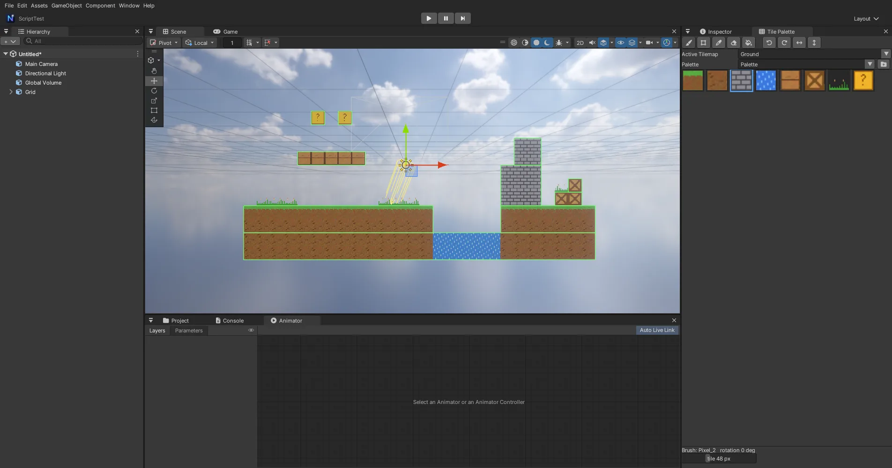

# 2D Tilemap (com.nova.tilemap) — Unity 와 같은 Grid · Tilemap · Tile Palette

Unity 의 2D Tilemap 과 같은 구조입니다: **Grid** (부모) 아래 **Tilemap** 을 두고, Tile 에셋 (`.tile`) 으로 칸을 칠합니다.
칠하기는 Window > **Tile Palette** 의 붓으로 Scene 뷰에서, 또는 `nova tilemap <op>` · C# 으로 합니다.

- 넣기: Window > Package Manager 에서 **2D Tilemap**, 또는 `nova package add com.nova.tilemap`
- 만들기: GameObject > 2D Object > **Tilemap > Rectangular** (Grid + 자식 Tilemap. Grid 를 고른 채 만들면 그 아래 Tilemap 만), 또는 `nova tilemap create --name Ground --collider`



## 컴포넌트

| 컴포넌트 | 값 |
|---|---|
| **Grid** | Cell Size (기본 1, 1), Cell Gap. Cell Layout = Rectangle, Cell Swizzle = XYZ (Unity 의 기본값 — 다른 배치는 아직) |
| **Tilemap** | 칸마다 타일 + 회전 (90° 단위) · 뒤집기. Color (전체에 곱하기), Tile Anchor (기본 0.5, 0.5 = 칸 가운데), Info (타일 수 · 칸 상자) |
| **Tilemap Renderer** | Sorting Layer · Order in Layer — Sprite Renderer 와 같이 정렬한다 (Mode = Chunk: 타일맵 하나가 한 덩어리). 조명 없음 |
| **Tilemap Collider 2D** | 콜라이더가 있는 타일 → 상자. **맞닿은 칸은 큰 사각형으로 합친다** (모양은 같고 Box2D 모양 수가 줄며, 칸 사이에 걸리지 않는다 — Unity 에서 Composite Collider 2D 를 붙인 것과 비슷). Is Trigger · Offset · Material 은 다른 2D 콜라이더와 같다 |

- 칸 (x, y) 의 왼쪽 아래 = Tilemap 로컬 (x · (Cell Size.x + Gap.x), y · (Cell Size.y + Gap.y)). **y 위**.
- 타일 그림은 스프라이트 기준점 (Pivot) 이 칸의 Tile Anchor 에 놓인다. 크기 = 그림 픽셀 / Pixels Per Unit (텍스처 가져오기 설정). 16 px 타일이면 **Pixels Per Unit 16** 으로 두면 칸 하나에 맞는다.
- 도트 그림은 텍스처 Filter Mode = **Point** (가져오기 설정).

## Tile 에셋 (.tile)

```json
{ "sprite": "Assets/Tiles/terrain.png#terrain_3", "color": [1, 1, 1, 1], "colliderType": "sprite" }
```

| 값 | 뜻 |
|---|---|
| Sprite | 그림 하나 또는 잘라 놓은 스프라이트 (`그림.png#이름`, Sprite Mode = Multiple), 내장 도형 `builtin:Square` 도 된다 |
| Color | 그림에 곱하기 |
| Collider Type | **None** (부딪히지 않음) · **Sprite** (그림 사각형 — Unity 의 기본) · **Grid** (칸 전체) |

Project 창 Create > **Tile**, 고르면 Inspector 에서 Sprite (⊙ 목록 · 끌어 놓기) · Color · Collider Type, 더블클릭 = 팔레트 붓으로 고르기.

## Tile Palette (Window > Tile Palette)

- **팔레트 = `.tile` 이 들어 있는 폴더.** 폴더 단추 = Create New Palette (`Assets/Palettes/<이름>`).
- 그림을 팔레트에 끌어 놓으면 스프라이트마다 `.tile` 을 만든다 (잘라 놓은 타일셋은 조각마다 — Unity 의 "Generate tiles"). 이미 있는 `.tile` 은 그대로 둔다.
- **Active Tilemap**: Hierarchy 에서 Tilemap 을 고르면 그것, 아니면 목록에서.
- 도구 (Scene 뷰 위에서 단축키):

| 도구 | 키 | 동작 |
|---|---|---|
| Brush | B | 끌면 지나간 칸을 모두 칠한다. **Shift** = 지우기, **Ctrl** = 고르기 |
| Box Fill | U | 끈 사각형을 채운다 (Shift = 지우기) |
| Picker | I | 칸의 타일 (회전 · 뒤집기 포함) 을 붓으로 고르고 Brush 로 |
| Eraser | D | 지우기 |
| Flood Fill | G | 같은 타일 (빈 칸이면 빈 칸) 로 이어진 칸을 바꾼다. 범위 = 타일이 있는 칸 상자 (Unity 와 같다) |
| 회전 · 뒤집기 | `[` `]` / Shift+`[` `]` | 붓 타일을 반시계 · 시계 90°, X · Y 뒤집기 |

Esc · Q/W/E/R/T/Y 를 누르거나 켠 도구를 다시 누르면 붓이 꺼진다 (이동 핸들 · 클릭 선택으로). 칠하기는 마우스를 뗄 때 Undo 한 단계.

## CLI

```bash
nova package add com.nova.tilemap
nova sprite-slice Assets/Tiles.png --cell 16,16 --ppu 16 --filter point          # 타일셋 자르기
nova tilemap tile.fromtexture --texture Assets/Tiles.png --folder Assets/Palettes/Main --collider grid
nova tilemap create --name Ground --collider                                     # Grid + Tilemap (+ 콜라이더)
nova tilemap box --tilemap Ground --from -8,-3 --to 7,-3 --tile Assets/Palettes/Main/Tiles_0.tile
nova tilemap set --x 6 --y 1 --tile Assets/Palettes/Main/Tiles_2.tile --rotation 90 --flipx
nova tilemap fill --x -5 --y 4 --tile Assets/Palettes/Main/Tiles_3.tile
nova tilemap info --tilemap Ground --json      # count · bounds · tiles · quads · shapes (합친 콜라이더 상자 수)
```

| 연산 | 인자 |
|---|---|
| `create` | `[--name] [--grid <Grid 오브젝트>] [--collider] [--order n]` |
| `tile.create` | `--path x.tile --sprite <스프라이트> [--color r,g,b,a] [--collider none\|sprite\|grid]` |
| `tile.fromtexture` | `--texture <그림> [--folder <팔레트>] [--collider ...]` |
| `set` · `erase` · `get` | `--x --y` (또는 `--cell x,y`) `[--tile] [--rotation 0\|90\|180\|270] [--flipx] [--flipy]` |
| `box` | `--from x,y --to x,y [--tile]` (타일이 없으면 지우기) |
| `fill` · `clear` · `info` · `collider [--remove]` | |
| `window` · `palette [--folder] [--create 이름]` · `select --tile` · `tool --tool brush\|box\|picker\|eraser\|fill\|none` · `active --tilemap` · `paint --x --y [--tool]` · `state` | Tile Palette (paint = Scene 뷰 클릭과 같은 함수) |
| `batch` | `nova tilemap batch steps.txt` — 줄마다 연산 하나, Undo 한 번 |

`--tilemap` 을 빼면 Tile Palette 의 Active Tilemap.

## C#

Unity 와 같은 이름 (`NovaEngine.Tilemaps`). 타일은 Inspector 필드 대신 경로로 가리킨다.

```csharp
using NovaEngine;
using NovaEngine.Tilemaps;

public class Digger : MonoBehaviour
{
    Tilemap map;
    TileBase stone = new Tile("Assets/Palettes/Main/Tiles_2.tile");
    void Start() => map = GameObject.Find("Ground").GetComponent<Tilemap>();
    void Update()
    {
        Vector3Int cell = map.WorldToCell(transform.position + Vector3.down);
        if (Input.GetKeyDown(KeyCode.E)) map.SetTile(cell, null);          // 파기
        if (Input.GetKeyDown(KeyCode.Q)) map.SetTile(cell, stone);         // 놓기
    }
}
```

`SetTile` · `SetTiles` · `GetTile` · `HasTile` · `BoxFill` · `FloodFill` · `ClearAllTiles` · `GetUsedTilesCount` · `cellBounds` (BoundsInt) · `WorldToCell` · `CellToWorld` · `GetCellCenterWorld` · `color` · `tileAnchor`, `Grid.cellSize` · `cellGap` · `WorldToCell`, `TilemapRenderer.sortingOrder`. 정수 좌표 `Vector2Int` · `Vector3Int` · `BoundsInt` 는 엔진에 있다.

## 아직 없는 것

Hexagonal · Isometric 배치, Rule Tile · Animated Tile (2D Tilemap Extras), Tilemap Renderer 의 Individual 모드, 칸마다 색.
