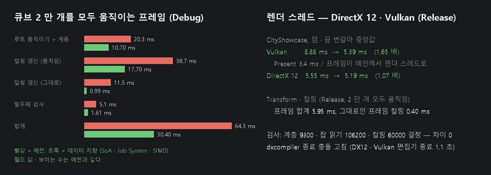

# 데이터 지향 Transform · 컬링 (SoA · Job System · SIMD)

Transform 의 월드 값을 SoA 배열에 두고, 바뀐 계층만 프레임마다 한 번 Job System 으로 나눠 계산합니다. 컬링은 바뀐 렌더러만 다시 보고, 절두체 검사를 SIMD 로 4 개씩 합니다.
공개 API (`GetPosition` · `SetLocalRotation` · `GetWorldMatrix` …) 와 그 뜻은 그대로입니다. Set 직후의 Get 도 늘 새 값입니다.

## Transform 저장소 (`Source/Scene/TransformStore.*`)

**SoA 배열** (Transform 하나 = 자리 하나)

| 배열 | 무엇 |
|------|------|
| `LocalPos` · `LocalRot` · `LocalScale` | 로컬 TRS (Transform 멤버의 사본 — 바꿀 때 복사) |
| `World` | 월드 행렬. 행렬마다 64 바이트 (캐시 라인) 에 맞춘 연속 배열 |
| `WorldRot` · `WorldScale` | 월드 회전 · 크기 (Unity 의 lossyScale 과 같은 근사) |
| `Parent` · `ParentGen` · `Gen` | 부모 자리와 세대. 부모가 먼저 놓이고 자리가 다시 쓰이면 세대가 어긋나 루트로 본다 (예전 weak_ptr 부모가 사라진 것과 같다) |
| `Dirty` · `Version` | 다시 계산해야 하나 · 월드가 다시 계산될 때마다 +1 |

**바꿀 때** (`SetLocalPosition` · `SetRotation` · `SetParent` …)
- 로컬 값을 배열에 복사한다.
- 그 Transform 과 아래 계층에 '더러움' 표시만 한다. 이미 더러운 자식에서 멈춘다 (그 아래도 이미 더럽다).
- 예전에는 바꿀 때마다 하위 계층 전체의 행렬 · 회전 · 오일러 각 (atan2) 을 즉시 다시 계산했다. 한 프레임에 같은 물체를 여러 번 바꾸면 그만큼 다시 계산했다.

**읽을 때** (`GetWorldMatrix` · `GetPosition` …)
- 깨끗하면 배열을 그대로 읽는다.
- 더러우면 그 자리와 더러운 조상 사슬만 위에서 아래로 계산한다.
- 메인 스레드가 아니거나 `ParallelFor` 가 도는 중이면 배열을 바꾸지 않고 그 자리에서 계산해 돌려준다. 메인도 한 몫을 돌기 때문에, 이때 고치면 일꾼과 같은 사슬을 함께 만질 수 있다.
- 오일러 각 (`GetEulerAngle`) 은 요청할 때만, 월드가 바뀐 뒤 처음 한 번 구한다.

**프레임마다 Flush** (컬링 · 그리기 전, `SceneCulling::Update` 처음)
1. 더러움 표시를 시작한 자리 (그때 부모가 깨끗했다) 목록에서, 조상이 목록에 있는 자리는 뺀다. 남은 것끼리는 하위 계층이 겹치지 않는다.
2. 하위 계층마다 위에서 아래로 계산한다. 이 일을 Job System (`ParallelFor`) 으로 나눈다. 한 잡은 자기 하위 계층의 자리만 쓰고, 부모는 이미 깨끗하다.
- 그 뒤의 병렬 읽기 (컬링 · MeshBatcher) 는 계산 없이 배열만 읽는다.

## 컬링 (`Source/Scene/SceneCulling.*`)

**렌더러 목록**
- Mesh Renderer · Skinned Mesh Renderer 가 생성자에서 목록에 들어가고 소멸자에서 나간다. 지워진 렌더러의 자리는 그때 옥트리에서 바로 뺀다.
- 예전에는 프레임마다 씬의 모든 GameObject 에서 렌더러를 찾았다 (`GetComponent` 두 번 — dynamic_cast).
- 이 씬의 렌더러인지는 프레임마다 씬 오브젝트에 찍는 번호로 가린다 (프리팹 · 다른 씬의 렌더러는 넣지 않는다).

**바뀐 것만** (잡으로 정하고, 옥트리는 차례로)
| 렌더러 | 하는 일 |
|------|------|
| 같은 Transform · 같은 월드 번호 · 메시 연결 그대로 | 아무것도 (표시만) |
| 움직이기만 했다 | 잡이 저장해 둔 로컬 상자 + 새 월드로 새 상자를 바로 구한다 (메시를 다시 찾지 않는다) |
| 메시 · 연결이 바뀌었을 수 있다 | 메시를 찾아 로컬 상자부터 |

- **메시 연결 번호** (`Component::s_BindingSerial`): 컴포넌트를 GameObject 에 붙이거나 (`SetGameObject`), MeshFilter · Mesh Renderer 의 메시를 바꿀 때 오른다. 같으면 렌더러마다 메시를 다시 찾지 않는다.
- **돌아가며 확인**: 프레임마다 렌더러 512 개는 메시를 실제로 확인한다. 번호를 올리지 않고 메시를 바꾸는 경로가 있어도 1 ~ 2 초 안에 바로잡힌다. Debug 빌드는 그런 경로를 찾으면 Editor.log 에 한 번 남긴다.
- **옥트리 칸 재사용**: 새 상자가 지금 칸에 그대로 들어가면 (중심이 칸 안, 반폭 ≤ 칸 반폭 — 느슨한 영역 안) 다시 넣지 않는다. 예전에는 움직일 때마다 뿌리부터 다시 내려갔다.

**절두체 검사**
- 자리마다 월드 상자의 중심 · 반폭을 SoA 배열에 둔다. 칸의 물체를 4 개씩 한 번에 검사한다 (DirectXMath — SSE · 안드로이드 NEON).
- 렌더러가 8192 개 이상이면, 위쪽 두 단계 칸을 펼쳐 겹치지 않는 하위 나무로 나눈 뒤 잡으로 돈다. 물체마다 다른 렌더러의 표시만 써서 경쟁이 없다.

## 측정 — `nova transform bench`

지금 씬에 큐브 계층을 만들고, 프레임마다 모든 루트를 움직이며 단계마다 잰다.

**Debug (이 PC, 같은 조건 — 바꾸기 전 → 뒤)**

| 단계 | 2 만 개 (루트 2000 × 자식 9) | 6.8 만 개 (루트 200, 4 갈래 · 깊이 4) |
|------|------|------|
| 루트 움직이기 (예전: 하위 계층 즉시 계산) | 20.3 → 4.3 ms | 72.3 → 12.9 ms |
| Flush (병렬) | — → 6.4 ms | — → 21.7 ms |
| 컬링 갱신 — 모두 움직임 | 38.7 → 17.7 ms | 110.7 → 42.9 ms |
| 컬링 갱신 — 아무것도 안 움직임 | 11.5 → 0.99 ms | 47.8 → 4.0 ms |
| 절두체 검사 | 5.06 → 1.61 ms | 9.18 → 3.04 ms |
| **움직이는 프레임 합계** | **64.3 → 30.4 ms** | **193.3 → 82.3 ms** |

- 월드 값은 바꾸기 전과 비트 단위로 같다 (측정 합계값 `checksum` 이 같다).
- 보이는 수도 같다 (15824 · 68200).

**Release (이 PC — 바뀐 뒤)**

| 단계 | 2 만 개 | 6.8 만 개 |
|------|------|------|
| 루트 움직이기 | 0.78 ms | 3.96 ms |
| Flush (병렬) | 0.21 ms | 1.04 ms |
| 월드 행렬 읽기 (전부) | 0.11 ms | 0.75 ms |
| 컬링 갱신 — 모두 움직임 | 3.85 ms | 11.9 ms |
| 컬링 갱신 — 아무것도 안 움직임 | 0.40 ms | 2.14 ms |
| 절두체 검사 | 1.00 ms | 2.48 ms |
| **움직이는 프레임 합계** | **5.95 ms** | **20.1 ms** |

- 그대로인 프레임의 컬링 갱신은 처음 Release 측정 (렌더러 표시를 메인이 차례로) 의 0.60 · 5.17 ms 에서 위 값으로 줄었다. 표시를 잡이 바로 찍고, 추적 수만큼 다 봤으면 마지막 훑기를 건너뛴다.

## 검사

`Tools/tests/run_tests.ps1 -Only transform`:
- `nova transform test`:
  - **계층**: Transform 300 개의 무작위 계층에 무작위 조작 3000 번을 한다 (로컬 · 월드 위치 · 회전 · 크기, 부모 바꾸기 (제자리 유지 / 아님), 늦은 읽기, 중간 Flush). 100 번마다 모든 월드 값을 예전 방식 (사슬을 그대로 계산) 과 비교한다. 더러운 채로 잡에서 읽은 값도 비교한다.
  - **컬링**: 렌더러 1500 개를 40 프레임 동안 움직이고, 메시를 바꾸고 (MeshFilter — 상자가 커진다), 몇 프레임은 그대로 둔다. 프레임마다 보임 / 숨김을 전부 직접 한 절두체 검사와 비교한다.
- bench: 그대로인 프레임의 컬링 갱신이 모두 움직이는 프레임보다 훨씬 싸다.
- CityShowcase: Transform 이 저장소에 있고, 바뀌지 않은 렌더러를 프레임마다 건너뛴다.

## CLI

- `nova transform info` — 저장소 (Transform 수 · Flush · 마지막 Flush 의 하위 계층 · 계산 수 · ms · 늦은 계산 · 잡에서 그 자리 계산) + 컬링 (렌더러 · 추적 · 건너뛴 · 다시 계산한 · 확인이 바로잡은 수)
- `nova transform test` — 위의 두 검사
- `nova transform bench [--roots 2000 --children 9 --depth 1 --frames 30]`

## 아직

- 하나의 큰 계층 (루트 하나 아래 모든 것) 은 Flush 를 나누지 못한다 (하위 계층 단위). 깊이별로 나누면 된다.
- Rigidbody · 애니메이션 본처럼 매 프레임 움직이는 Transform 은 '더러움 → Flush' 를 거친다. 물리 결과를 배열에 바로 쓰는 경로가 있으면 더 빠르다.
- 렌더러의 그리기 목록 (MeshBatcher) 도 바뀐 렌더러만 다시 모으기
