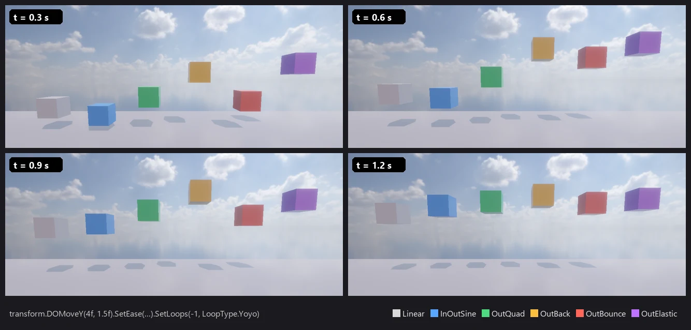

# Nova Tween (패키지 `com.nova.tween`)

C# 스크립트 한 줄로 위치 · 회전 · 크기 · 색 · 투명도 · UI · 빛 · 카메라 · 소리, 또는 아무 값이나 시간에 따라 바꾼다.
Unity 의 대표 트윈 도구 (DOTween) 와 같은 쓰임 — 단축 메서드 이름 (`DOMove` · `DOFade` …) · 설정 체인 · Sequence 가 같아서 옮기기 쉽다.
순수 C# 패키지라 Windows · 안드로이드 · 웹 (WebGPU) 에서 똑같이 돈다.

<p align="center"><br/><sub>같은 DOMoveY 를 곡선만 바꿔 — Linear · InOutSine · OutQuad · OutBack · OutBounce · OutElastic</sub></p>

**Window > Package Manager** → Nova Tween → Add (또는 `nova package add com.nova.tween`)

```csharp
using NovaEngine;
using NovaEngine.Tweening;

public class Door : MonoBehaviour
{
    void Start()
    {
        transform.DOMove(new Vector3(0, 3, 0), 1f).SetEase(Ease.OutBack);

        NovaTween.Sequence()
            .Append(transform.DOScale(1.2f, 0.2f))
            .Append(transform.DOScale(1f, 0.2f))
            .AppendCallback(() => Debug.Log("열림"))
            .SetLoops(-1, LoopType.Restart);
    }
}
```

DOTween 코드를 옮길 때: `using DG.Tweening;` → `using NovaEngine.Tweening;`, `DOTween.` → `NovaTween.` (단축 메서드 · 설정 · Sequence 는 그대로).

## 단축 메서드

| 대상 | 메서드 |
|---|---|
| Transform | `DOMove` · `DOMoveX/Y/Z` · `DOLocalMove(X/Y/Z)` · `DORotate` (RotateMode: Fast · FastBeyond360 · WorldAxisAdd · LocalAxisAdd) · `DOLocalRotate` · `DORotateQuaternion` · `DOLookAt` · `DOScale` (Vector3 · float) · `DOScaleX/Y/Z` · `DOPunchPosition/Rotation/Scale` · `DOShakePosition/Rotation/Scale` · `DOJump` · `DOLocalJump` · `DOPath` · `DOLocalPath` (Linear · CatmullRom) |
| 색 · 투명도 | `Material.DOColor` (· 속성 이름) · `DOFade` · `DOFloat`, `SpriteRenderer.DOColor/DOFade`, UI `Graphic` (Image · Text) `.DOColor/DOFade`, `Image.DOFillAmount`, `Text.DOText` (타자기) · `DOCounter` (숫자 세기) |
| UI | `RectTransform.DOAnchorPos(X/Y)` · `DOSizeDelta` · `DOPunchAnchorPos` · `DOShakeAnchorPos` |
| 빛 · 카메라 · 소리 | `Light.DOIntensity/DOColor/DOShadowStrength`, `Camera.DOFieldOfView/DOOrthoSize/DOShakePosition/DOShakeRotation`, `AudioSource.DOFade/DOPitch` |
| 아무 값 | `NovaTween.To(() => v, x => v = x, 끝 값, 시간)` (float · int · Vector2/3/4 · Quaternion · Color · string), `DOVirtual.Float/Int/Vector3/Color`, `DOVirtual.DelayedCall` |

## 설정 · 콜백 · 제어

- 설정 (체인): `SetEase(Ease | 넘침 | 진폭 · 주기 | 함수)` · `SetLoops(n | -1, Restart · Yoyo · Incremental)` · `SetDelay` · `SetRelative` · `From()` · `From(값)` · `SetId` · `SetTarget` · `SetUpdate(timeScale 무시 | UpdateType)` · `SetAutoKill` · `SetSpeedBased`
- 곡선 30 가지: Linear, (In/Out/InOut) Sine · Quad · Cubic · Quart · Quint · Expo · Circ · Elastic · Back · Bounce. 기본 OutQuad
- 콜백: `OnStart` · `OnPlay` · `OnPause` · `OnRewind` · `OnUpdate` · `OnStepComplete` · `OnComplete` · `OnKill`
- 제어: `Play` · `Pause` · `TogglePause` · `Restart` · `Rewind` · `Complete` · `Kill` · `Goto` · `PlayForward` · `PlayBackwards` · `Flip`, 대상마다 `transform.DOKill()` · `DOComplete()` …, 한꺼번에 `NovaTween.Kill(대상 | id)` · `KillAll` · `PauseAll` · `PlayAll`
- 상태: `IsActive` · `IsPlaying` · `IsComplete` · `Duration` · `Elapsed` · `ElapsedPercentage` · `CompletedLoops`
- 기다리기: 코루틴 `yield return t.WaitForCompletion()` (· `WaitForKill` · `WaitForElapsedLoops` · `WaitForPosition` · `WaitForStart`), `await t.AsyncWaitForCompletion()`
- Sequence: `Append` · `Join` · `Insert` · `Prepend` · `AppendInterval` · `PrependInterval` · `AppendCallback` · `InsertCallback` — 뒤 트윈은 앞 트윈이 끝난 값에서 이어서 시작한다
- 전체: `NovaTween.defaultEaseType` · `defaultAutoKill` · `defaultLoopType` · `timeScale`

대상 오브젝트가 지워지면 그 트윈은 조용히 끝난다 (오류 없이). 트윈은 Play 중 숨긴 `[NovaTween]` 오브젝트가 프레임마다 진행하고, Play 를 멈추면 함께 정리된다.

## Tween Animation 컴포넌트 (코드 없이)

Add Component → **Tween Animation**: 종류 (Move · LocalMove · Rotate · Scale · Color · Fade · FillAmount · Punch · Shake · Jump · AnchorPos · UI Width/Height · Camera FOV · Light Intensity),
끝 값, 시간, 지연, 곡선, 반복 · 반복 방식, Relative, From, Auto Play, Auto Kill, Id. 색 · 투명도는 SpriteRenderer → Image → Text → Light → MeshRenderer 재질 차례로 찾는다.
UI Button 의 OnClick 에서 `DOPlay` · `DORestart` · `DOPlayBackwards` … 를 부를 수 있다.

## 검사

`Tools/tests/run_tests.ps1 -Only tween` — 검사 스크립트 (`Tools/tests/tween_probe.cs`) 로 곡선 값, 이동 + 끝 콜백, 시퀀스 차례, Yoyo, From, Incremental, 튀기기 · 흔들기 · 뛰기, DOVirtual · DelayedCall · async, 대상 지움 · Kill · 거꾸로, 빛 · 카메라 · Tween Animation (11 항목).
