# Visual Effect Graph (VFX Graph)

Unity 의 Visual Effect Graph 처럼 **GPU 에서 수십만 개의 파티클**을 시뮬레이션하고 그립니다. 엔진 코어 기능 (패키지 없이), Game · Scene 뷰 · 게임 빌드 (PC · 안드로이드) 에서 동작합니다.
대화로 이펙트를 만드는 **VFX Assistant** 는 이 PC 에 설치된 Claude Code 를 그대로 씁니다 (API 키 없이, 구독 로그인으로만).

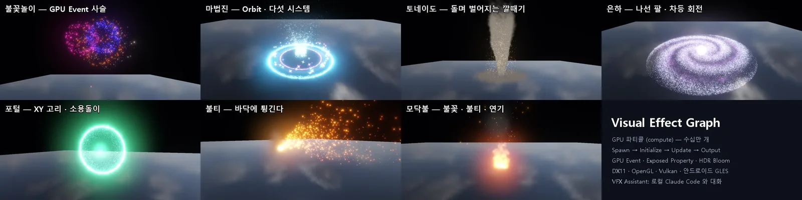

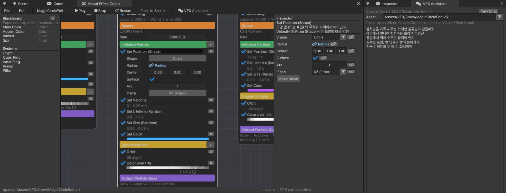

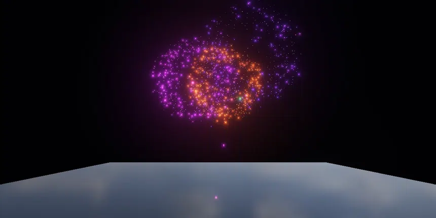

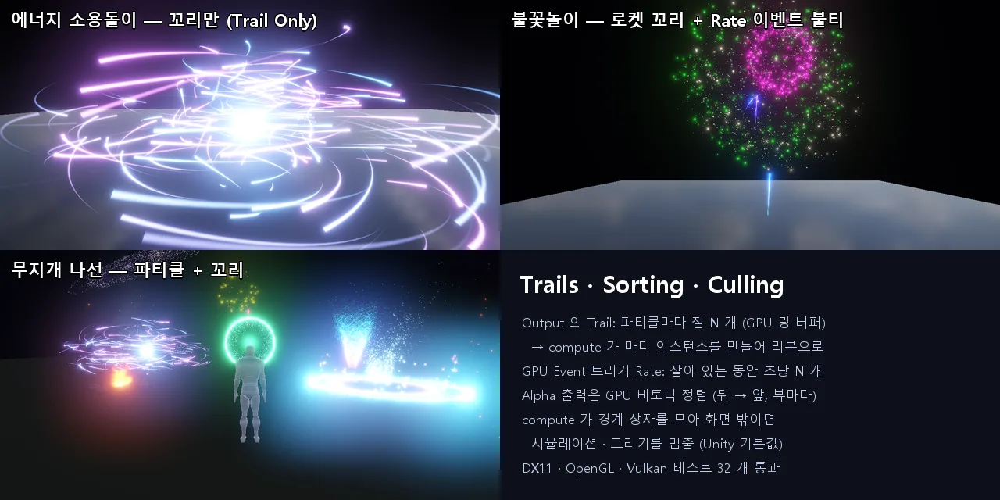

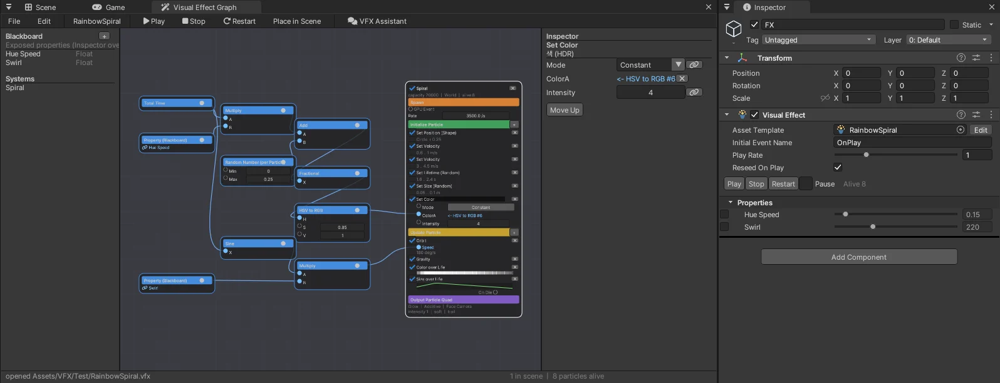

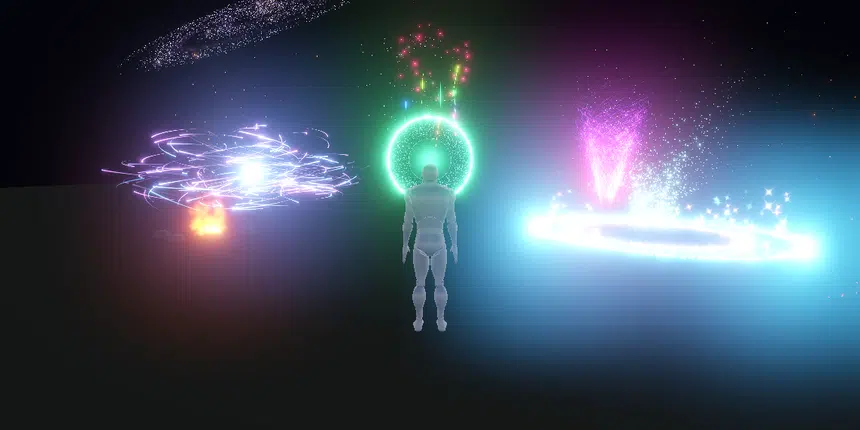

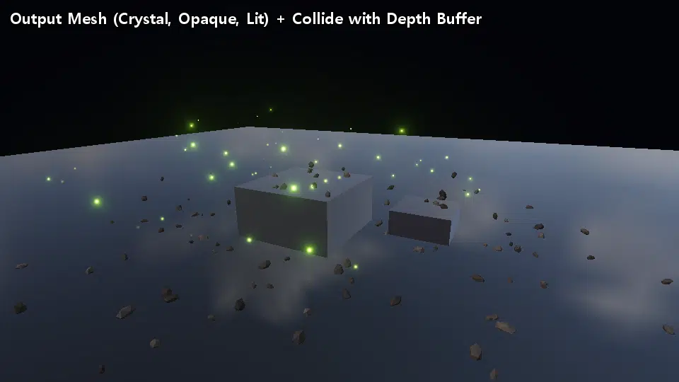

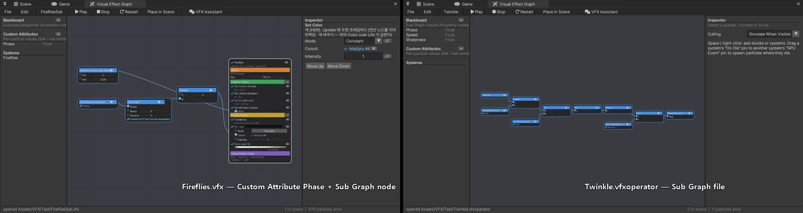

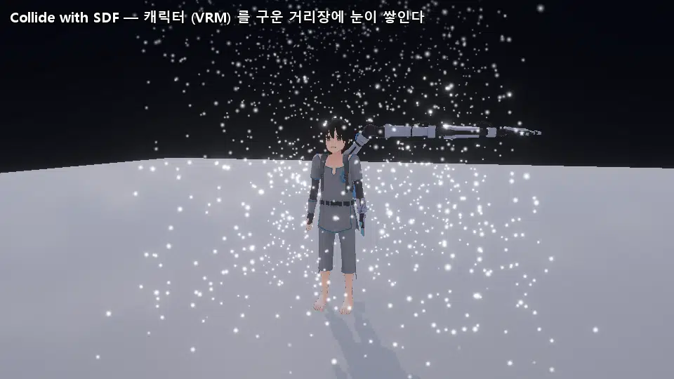

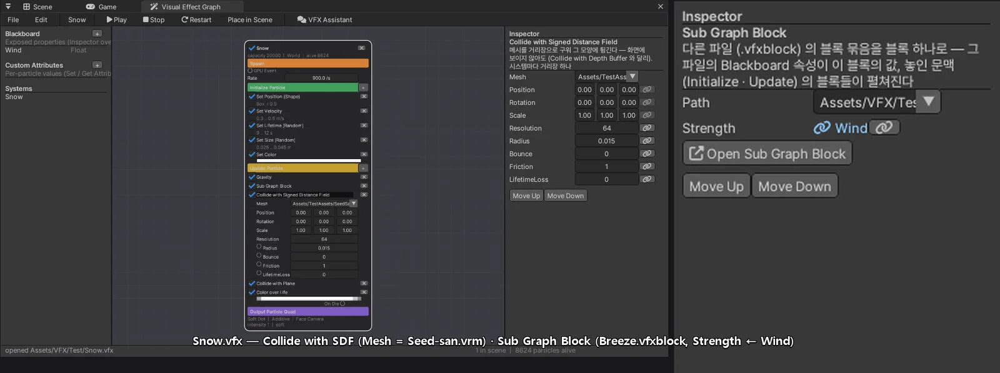

## 쓰는 법

1. Project 창 **Create > Visual Effect Graph** → `New VFX.vfx` (더블클릭 = **Window > Visual Effect Graph**). 창의 **File > New from Template** 로 견본 (Fireworks · Magic Circle · Tornado · Sparks · Galaxy · Fire · Portal · Energy Swirl · Rainbow Spiral · Debris · Fireflies) 에서 시작해도 됩니다
2. 장면에 놓기: **GameObject > Effects > Visual Effect** 의 Asset Template 에 `.vfx` (끌어 놓기 · ⊙), 또는 그래프 창 메뉴 **Place in Scene**. Unity 처럼 **Play 모드가 아니어도** 장면에서 재생됩니다
3. 그래프의 **시스템** 하나 = 세로로 쌓인 문맥 네 개: **Spawn** (주황 — 초당 수 · Burst · Loop/Duration/Delay · Start/Stop 이벤트) → **Initialize Particle** (초록 — 태어날 때) → **Update Particle** (노랑 — 프레임마다) → **Output Particle Quad** (보라 — 모양 · 섞기 · 방향 · HDR 세기)
4. 문맥의 **+** 또는 캔버스에서 **Space / 오른쪽 클릭** = 검색 창 (문맥을 골랐으면 그 문맥의 블록, 아니면 새 시스템 · 견본의 시스템). 블록의 값은 노드 안 (짧게) 과 오른쪽 **Inspector** (곡선 · 그라디언트 · 콤보 · 색 고르기 · 속성 연결 🔗)
5. 왼쪽 **Blackboard** 의 `+` = Exposed Property (Float · Int · Bool · Vector3 · Color). 블록 값의 🔗 로 속성에 잇고, 장면의 Visual Effect Inspector 에서 **오브젝트마다 덮어쓰기** (Unity 와 같은 왼쪽 체크)
6. **GPU Event**: 시스템의 **On Die** 핀을 다른 시스템의 **GPU Event** 핀으로 끌면, 부모 파티클이 죽은 자리에서 자식이 태어납니다 (Unity 의 Trigger Event On Die → GPU Event). 불꽃놀이: 로켓 → 폭발 → 반짝임
7. **연산 노드 (Operator)**: 검색 창의 `Operator / …` (수 · 속성 · 파티클 값 · 수학 · 벡터 · 곡선 · 잡음 · 색). 블록 값 왼쪽의 **핀** 으로 노드의 출력을 끌면 그 값이 수식이 된다 (파티클마다 GPU 에서 계산). 노드끼리도 출력 → 입력으로 잇는다. 이은 값은 `<- HSV to RGB #6` 처럼 보이고 ✕ 로 끊는다. 노드를 고르고 Delete
8. 고칠 때마다 장면의 Visual Effect 가 **저장 전에도 바로** 따라옵니다. **Ctrl+S** 저장, Ctrl+Z / Ctrl+Y

### 블록

| 문맥 | 블록 | 하는 일 |
|---|---|---|
| Initialize | **Set Position (Shape)** | 점 · 구 · 원 · 상자 · 원뿔 · 선 · 토러스 (표면 / 부피, 호, **평면 XZ · XY · YZ** — 세운 고리 = 포털) |
| | **Set Position (Spiral Arms)** | 나선 팔 (팔 수 · 감김 · 흩어짐 · 두께) — 은하 · 소용돌이 |
| | **Set Velocity** | 방향 · 모든 방향 · 모양 바깥 (From Shape) · 원뿔. 여러 개면 더해진다 (바깥 + 위 = 깔때기) |
| | Set Lifetime · Set Size (Random) · **Set Color** (고정 · 둘 사이 · 무지개, HDR 세기) · Set Angle · Angular Velocity | |
| | **Inherit Source (GPU Event)** | 부모 파티클의 속도 (배율) · 색 |
| Update | Gravity · Linear Drag · Speed Limit | |
| | **Turbulence** | 3D 잡음 힘 (옥타브 · 흐름) — 연기 · 불 · 마법 가루 |
| | **Vortex** · **Conform to Sphere (Attractor)** | 축 둘레 회전 + 당김, 한 점 / 구 표면으로 |
| | **Orbit** | 축 둘레로 위치 · 속도를 돌린다 (Falloff = 멀수록 느리게 — 은하의 차등 회전) |
| | **Collide with Plane** | 튕김 · 마찰 · 부딪힐 때 수명 줄이기 |
| | **Collide with Signed Distance Field** | 메시 (기본 · 모델 파일) 를 거리장으로 구워 그 모양에 튕긴다 — 자리 · 회전 · 크기, 해상도, 파티클 반지름 |
| | **Collide with Depth Buffer** | 화면에 보이는 장면 (깊이) 에 튕긴다 — 바닥 · 벽 · 물체 모양 그대로, 두께 (표면 뒤 몇 m 까지 속으로 볼지) |
| | **Collide with Weather Cover** | 날씨 패키지의 덮개 맵 (위에서 본 맨 위 표면 — 지붕 · 나무 · 땅) 에 부딪힌다. 화면 밖도, 집 안에 비가 들지 않게 — [WEATHER](WEATHER.md). 날씨가 없으면 아무것도 하지 않는다 |
| 둘 다 | **Set Color** | Update 에 두면 프레임마다 (연산 노드로 반짝임 · 색 바꾸기, 뒤의 Color over Life 가 곱한다) |
| | **Set Attribute (Custom)** | 사용자 속성에 Set · Add · Multiply (값에 연산 노드를 이을 수 있다) |
| | **Sub Graph Block** | `.vfxblock` 파일의 블록 묶음을 블록 하나로 — 그 파일의 Blackboard 속성이 이 블록의 값 |
| | **Color over Life · Size over Life** | 그라디언트 (HDR) · 곡선 |

Output 모양은 그림 없이 셰이더가 만듭니다: Soft Dot · Glow · Star · Sparkle · Ring · **Spark** (속도로 늘린 불꽃 줄기) · **Smoke** (잡음 덩어리) · Square · Heart, 또는 **Texture** (+ 플립북 열 × 행, 수명 동안 한 번 / 초당 칸).
Additive 는 빛 · 불 · 마법 (HDR 1 보다 크면 Bloom 으로 빛난다), Alpha Blend 는 연기 · 먼지, **Opaque** 는 깊이를 쓰는 단단한 것 (사각형은 알파 0.5 로 잘림). Soft Particles (장면 깊이에 닿는 곳을 부드럽게).

**Output Mesh** (Unity 의 Output Particle Mesh): Shape = Mesh 이면 파티클마다 메시 하나 — Cube · Sphere · Cylinder · Cone · Crystal (크기 1 → 파티클 크기) 또는 **모델 파일** (`Assets/…/x.fbx` · glTF · GLB · VRM — 메시 크기 × 파티클 크기. 번호가 없으면 스킨 메시는 모두 합치고 (캐릭터 전체 — 바인드 자세), 정적 메시는 첫 메시, `#n` 이면 n 번째). 회전은 Set Angle 의 각 · 각속도로: Face Camera = 파티클마다 무작위 축 (구르는 파편), Along Velocity = +Y 를 속도 방향으로, Horizontal = Y 축. **Lit** 이면 방향광 0 · 환경광 (Volume 의 Indirect Lighting) 으로 음영. 메시 정점 + 파티클 버퍼를 인스턴스로 그리기 한 번 (정렬 · Alpha · Additive · Opaque 모두).

### 공간 · 이벤트

- **World** (기본): Visual Effect 가 움직여도 이미 태어난 파티클은 월드에 남는다. 위치 값 (Attractor · Vortex · Orbit 의 가운데, 충돌 평면) 은 Visual Effect 를 따라간다
- **Local**: 파티클이 Visual Effect 와 함께 움직인다
- Spawn 의 **Start Event** (기본 `OnPlay`) · **Stop Event** (`OnStop`) — 다른 이름으로 바꾸면 `SendEvent("Burst")` 로만 시작. Visual Effect 의 **Initial Event Name** (기본 OnPlay, 비우면 스스로 시작하지 않음)
- Spawn **Rate Property**: 초당 수를 Float 속성에 연결 (예: 불꽃놀이 Launch Rate)
- GPU Event 의 **Trigger**: `On Die` (죽을 때) 또는 **`Rate`** (Unity 의 Trigger Event Rate — 부모 파티클이 살아 있는 동안 초당 N 개, 예: 로켓을 따라가는 불티)

### 꼬리 · 정렬 · 컬링

- Output 의 **Trail** (Unity 의 Output Particle Strip 과 같은 쓰임): 파티클마다 지나온 점 N 개 (Points, 기본 12) 를 Length 초 동안 남기고, 너비 = 파티클 크기 × Width, 끝으로 갈수록 가늘고 흐려지는 리본. **Trail Only** 면 파티클 점은 그리지 않고 꼬리만 (에너지 소용돌이)
- **Sort** (Auto · On · Off): Alpha Blend 출력은 기본으로 GPU 에서 **카메라 거리로 정렬** (비토닉 정렬, 뷰마다 — Scene 과 Game 이 따로), Additive 는 순서가 상관없어 하지 않는다. On 이면 Additive 도
- **Collide with Depth Buffer**: 프레임의 첫 뷰 (Play 중 Game, 편집 중 Scene) 의 장면 깊이를 compute 가 읽는다 — 다음 자리 (자리 + 속도 × dt) 가 보이는 표면 뒤 두께 안이면, 이웃 화소 깊이로 되살린 법선으로 튕긴다. 화면 밖 · 가려진 곳은 지나간다 (Unity 와 같은 한계 — 바닥이 화면 밖으로 나가면 Collide with Plane 을 함께)
- **Collide with Signed Distance Field** (Unity 의 Collide with SDF + SDF Bake Tool 을 한 블록으로): Mesh 를 처음 쓸 때 CPU 에서 거리장으로 굽는다 (가장 긴 변 Resolution 칸 — 표면 둘레는 삼각형까지 정확한 거리, 나머지는 가장 가까운 점을 물려받기, 안 · 밖은 상자 가장자리에서 칠하기 + 정점 법선). 캐릭터 (Seed-san VRM, 64 칸) 350 ms. compute 가 세 방향 보간 거리 · 기울기 (법선) 로 다음 자리를 표면 밖으로 밀고 튕긴다 — 화면에 보이지 않아도 (깊이 충돌과 다른 점). 시스템마다 거리장 하나. 닫히지 않은 메시는 구멍으로 바깥이 새고, 움직이는 캐릭터는 바인드 자세 그대로 (Unity 와 같은 한계)
- **Culling** (Visual Effect 에셋): `Simulate When Visible` (기본, Unity 와 같음) = 어느 카메라에도 보이지 않으면 시뮬레이션도 쉰다. compute 가 파티클의 경계 상자를 모으고 (크기 · 꼬리 포함) 카메라 절두체 밖이면 그리지 않는다. `Always Simulate` = 화면 밖에서도 계속. 고른 Visual Effect 는 Scene 뷰에 경계 상자를 그린다

### 연산 노드 (Operator)

| 갈래 | 노드 |
|---|---|
| 값 | Float · Vector3 · Color · **Property (Blackboard)** |
| 시간 · 무작위 | Total Time · Delta Time · Random Number (per Particle — 파티클마다 고정, per Frame — 프레임마다) |
| 파티클 | Get Age · Get Lifetime · Age over Lifetime · Get Position · Get Velocity · Get Color · Get Size · Get Speed |
| 수학 | Add · Subtract · Multiply · Divide · Minimum · Maximum · Power · Modulo · Step · Lerp · Clamp · Smoothstep · Remap · Absolute · Sine · Cosine · Fractional · Saturate · One Minus · Negate · Floor · Round · Square Root |
| 벡터 | Length · Normalize · Dot Product · Cross Product · Distance · Split (Component) · Combine (Vector) |
| 곡선 · 잡음 · 색 | Sample Curve · Sample Gradient · Noise (Value · Vector) · HSV to RGB |
| 사용자 속성 | **Get Attribute (Custom)** |
| 논리 | **Compare** (같음 · 다름 · 작음 · 작거나 같음 · 큼 · 크거나 같음) · **Branch** (참이면 True, 아니면 False — 벡터 · 색도) · Logical And · Or · Not (참 = 1) |
| Sub Graph | **Sub Graph** (파일 하나 = 노드 하나) · **Output (Sub Graph)** (Sub Graph 파일의 결과) |

- 블록 값 (숫자 · 벡터 · 색 · 곡선 X 위치처럼 블록 목록의 칸이 되는 것) 에 잇는다. 셰이더는 그대로 — 연결은 블록 목록 뒤에 붙는 **작은 스택 명령** 이 되어, 블록마다 한 번 계산한다 (DirectX 11 의 fxc 를 위해 스택은 고정 레지스터 10 개 → 식의 깊이 10 까지)
- World 시스템에 이은 위치 · 방향 값은 Visual Effect 의 변환을 따라간다 (블록 값과 같은 규칙)
- 예: 견본 **Fireflies** — 태어날 때 Set Attribute 로 `Phase` = 무작위, Update 의 Set Color 가 Get Attribute (Phase) 로 제각각 깜빡인다
- 예: 견본 **Rainbow Spiral** — 색 = HSV(Total Time × Hue Speed + 파티클마다 무작위 → Fractional), Orbit 의 빠르기 = Sine(Time) × Swirl (나선이 번갈아 거꾸로 돈다)

### 사용자 속성 (Custom Attribute)

Blackboard 의 **Custom Attributes** `+` 로 Float · Vector3 를 만든다 — 파티클마다 float **4 칸** (Float 1 칸, Vector3 3 칸, 선언 순서대로). **Set Attribute** 블록 (Initialize · Update) 이 쓰고 **Get Attribute** 연산 노드가 읽는다. 이름을 바꾸면 블록 · 노드가 따라간다. 태어날 때 한 번 정한 값 (무작위 위상 · 종류 번호 · 처음 자리) 을 Update 의 식에서 쓰는 데 알맞다. 파티클 112 바이트 (96 + 16).

### Sub Graph (Visual Effect Subgraph Operator)

Project 창 **Create > Visual Effect Subgraph Operator** → `.vfxoperator` (그래프 창으로 열린다). 파일의 **Blackboard 속성 = 입력**, 안의 Property 노드가 그 입력을 읽고, **Output (Sub Graph)** 노드에 이은 값이 결과. 다른 그래프에서 **Sub Graph** 노드의 Path 에 그 파일을 고르면 입력 핀이 생긴다 (잇지 않으면 노드의 값 → 파일의 기본값). 블록 목록을 만들 때 펼쳐 넣으므로 셰이더 · 성능은 같다. 파일을 고치면 그 파일을 쓰는 Visual Effect 가 바로 다시 만든다. Sub Graph 안의 Sub Graph 는 8 겹까지 (자기를 부르면 오류). 게임 빌드는 `.vfx` 가 가리키는 `.vfxoperator` 를 따라 넣는다.

### Block Sub Graph (Visual Effect Subgraph Block)

Project 창 **Create > Visual Effect Subgraph Block** → `.vfxblock`. 파일의 **Blackboard 속성 = 입력**, 첫 시스템의 Initialize · Update 블록이 그 묶음 — 블록 값을 입력에 🔗 로 잇는다. 다른 그래프에서 **Sub Graph Block** 블록 (두 문맥 모두) 의 Path 에 그 파일을 고르면 입력이 블록의 값이 되고 (값 · 바깥 Blackboard 속성 연결), 놓인 문맥의 블록들이 그 자리에 펼쳐진다 (4 겹까지). 파일을 고치면 쓰는 Visual Effect 가 다시 만든다. 입력에 연산 노드는 이을 수 없고 (속성 연결은 된다), 파일 안의 연산 노드는 그 파일의 것을 쓴다.

## 어떻게 동작하나

- `Shaders/58. VFX.fx` 하나: compute 커널 Reset · **Spawn** · **Update** + 그리기 (Additive · Alpha). 블록은 **목록 (float4 칸) 을 셰이더가 차례로 읽어 실행** — 그래프를 바꿔도 셰이더를 다시 컴파일하지 않는다 (Shader Graph 와 다른 점. 고치는 즉시 장면에 보임)
- 파티클 하나 = 96 바이트 (GPU 만 쓰는 raw 버퍼). 칸은 원자적 카운터로 고른다 (용량을 넘으면 가장 오래된 칸부터). 죽은 칸은 그리기에서 화면 밖으로
- **그리기 = 파티클 버퍼를 그대로 인스턴스 정점 버퍼로** (CPU 로 읽어 오지 않는다 — 안드로이드 GLES 도 같은 길). 시스템마다 그리기 한 번
- GPU Event: 부모의 Update 가 죽는 파티클의 위치 · 속도 · 색을 이벤트 버퍼에 (프레임마다 최대 4096), 자식의 Spawn 이 이벤트마다 N 개. 부모가 먼저 돌도록 시스템 순서를 정한다 (고리는 거부)
- 꼬리: Update 가 점 링 버퍼 (파티클 × 점) 에 기록 간격마다 위치를 넣고, compute 가 이웃한 두 점마다 마디 인스턴스 (64 바이트) 를 만들어 인스턴스 그리기 한 번
- 정렬: 키 (카메라 앞 방향 거리) → 그룹 공유 메모리의 512 칸 비토닉 정렬 + 큰 단계는 전역 → 정렬된 순서로 파티클을 정점 버퍼에 모은다 (용량 2 의 거듭제곱으로 올림)
- 경계: Update 가 그룹마다 최소 · 최대를 모아 원자적으로 합치고 (몇 프레임 늦게 읽음), 지난 프레임에 그렸는지로 컬링을 정한다 (`nova vfx stats` 의 `culled`)
- 살아 있는 수는 몇 프레임 늦게 읽는다 (기다리지 않음) — Inspector · `nova vfx stats` · C# `aliveParticleCount`
- 시뮬레이션은 프레임의 첫 그리기 (Game 또는 Scene 뷰) 에서 한 번 — DirectX 11 · OpenGL 4.5 · Vulkan · **OpenGL ES 3.2 (안드로이드)**. compute 가 없는 장치 (`SupportsGpuDriven` = false) 에서는 그리지 않는다
- GLES 주의: 횟수가 값에 따라 바뀌는 셰이더 고리는 쓰지 않는다 — Turbulence 의 옥타브 고리 (`for (o < n)`) 가 MuMu GLES 3.2 에서 파티클을 통째로 망가뜨렸다 (자리가 NaN, 그려지지 않음). 지금은 4 번 정해진 고리 + 안 쓰는 옥타브 건너뛰기
- 코드: `Source/Effects/VfxAsset.*` (에셋 · 블록 정의표 · 블록 목록 만들기), `VfxOperators.cpp` (연산 노드 정의표 · 스택 명령으로 옮기기), `VfxTemplates.cpp` (견본), `VisualEffect.*` (컴포넌트 · 이벤트 · Spawn 수), `VfxRuntime.*` (GPU),
  `VfxScripting.cpp` (C#), `Source/Editor/Windows/VfxGraphWindow.*` · `VfxAssistantWindow.*`, `Source/Editor/VfxCli.*`

## VFX Assistant (Claude Code)

**Window > VFX Assistant** (그래프 창 메뉴의 VFX Assistant). "밤하늘을 가득 채우는 화려한 불꽃놀이" 처럼 말하면 Claude 가 `.vfx` 를 만들고 장면에 놓습니다.

- **이 PC 의 Claude Code** 를 headless 로 실행합니다 (`claude -p --output-format stream-json`). PATH 의 `claude.exe`, npm 설치 (`node` + `cli.js`), Claude 데스크톱 앱에 딸린 `claude.exe` 중 **판이 가장 높은 것**
- **API 키를 쓰지 않습니다**: 자식 프로세스 환경에서 `ANTHROPIC_*` · `CLAUDE_CODE_*` 를 지운다 → 그 PC 의 로그인 (`~/.claude`, Claude 구독) 으로만. Claude Code 가 없거나 로그인하지 않았으면 동작하지 않고 안내를 띄운다
  - 처음 한 번: 터미널에서 `claude` → `/login` (Claude 계정으로)
- Claude 가 쓸 수 있는 도구는 **`nova vfx …` · `nova create visual-effect` · `nova camera` · `nova screenshot` 과 파일 읽기뿐** (`--allowedTools`, Edit · Write · 웹은 막음). 그래서 사람이 쓰는 CLI 와 같은 길로 고치고, 그래프 창 · 장면이 바로 따라온다. 결과를 스크린샷으로 찍어 보고 다듬기도 한다
- 대화는 이어진다 (`--resume`), **New Chat** 으로 새로. Stop = 프로세스 나무를 끈다 (Job 객체)
- 터미널 · 자동 검사: `nova vfx assistant.send --message "…" [path]`, `nova vfx assistant.status`, `nova vfx assistant.stop`

## C# (Unity 와 같은 API)

```csharp
using NovaEngine.VFX;

var vfx = GetComponent<VisualEffect>();
vfx.SetFloat("Spin", 90f);
vfx.SetVector4("Main Color", new Vector4(1f, 0.3f, 0.1f, 1f));   // Color 속성
vfx.SendEvent("OnPlay");
vfx.Stop();  vfx.Reinit();  vfx.playRate = 2f;  vfx.pause = true;
if (vfx.HasFloat("Spin")) Debug.Log(vfx.aliveParticleCount);
vfx.visualEffectAsset = "Assets/VFX/Portal.vfx";   // 다른 에셋으로 (다시 시작)
```

Play · Stop · Reinit · SendEvent, Set/Get/Has Float · Int · Bool · Vector2 · Vector3 · Vector4, ResetOverride, aliveParticleCount, playRate, pause, startSeed, resetSeedOnPlay, initialEventName, visualEffectAsset (경로), enabled, HasAnySystemAwake

## nova vfx (CLI)

```
nova vfx new Assets/VFX/Boom.vfx --template Fireworks
nova vfx blocks                                   블록 종류 · 값 (기본값 · 범위 · 설명)
nova vfx info Assets/VFX/Boom.vfx                 에셋 JSON + 문제
nova vfx block.add Assets/VFX/Boom.vfx --system Explosion --context update --type Turbulence --params '{"Intensity":4}'
nova vfx block.set Assets/VFX/Boom.vfx --system Explosion --context update --index 0 --bind '{"Force":"Wind"}'
nova vfx system.set Assets/VFX/Boom.vfx --system Rocket --data '{"spawn":{"rate":3},"output":{"shape":"Star"}}'   (JSON 합치기)
nova vfx property.add Assets/VFX/Boom.vfx --name Wind --type Vector3 --value 1,0,0
nova vfx set Assets/VFX/Boom.vfx --file boom.json  에셋 통째로 (--data '{...}' 도)
nova create visual-effect --asset Assets/VFX/Boom.vfx --name Boom --position 0,0,0
nova vfx event --object Boom --name OnStop        장면의 Visual Effect 에 이벤트
nova vfx override --object Boom --name Wind --value 0,3,0
nova vfx stats                                    시스템마다 살아 있는 수
nova vfx window Assets/VFX/Boom.vfx [--system Rocket --context update --block 0]
nova vfx operators                                연산 노드 종류 (입력 · 설정)
nova vfx op.add Assets/VFX/Boom.vfx --type Sine   → id
nova vfx op.connect Assets/VFX/Boom.vfx --from 1 --to 2 --input X
nova vfx block.link Assets/VFX/Boom.vfx --system Explosion --context initialize --index 3 --param ColorA --from 2
nova vfx block.unlink ... --param ColorA          op.set · op.remove · op.disconnect
nova vfx encode Assets/VFX/Boom.vfx               블록 목록 (셰이더가 읽는 칸 — 문제 찾기)
nova vfx attribute.add Assets/VFX/Boom.vfx --name Phase --type Float      (attribute.remove)
nova vfx subgraph.new Assets/VFX/Twinkle.vfxoperator                      Sub Graph 파일 (property.* · op.* 로 고친다)
nova vfx op.add Assets/VFX/Boom.vfx --type SubGraph --params '{"Path":"Assets/VFX/Twinkle.vfxoperator"}'
nova vfx blockgraph.new Assets/VFX/Breeze.vfxblock                        Block Sub Graph 파일
nova vfx block.add Assets/VFX/Boom.vfx --system S --context update --type SubgraphBlock --params '{"Path":"Assets/VFX/Breeze.vfxblock","Strength":5}'
nova vfx stats                                    + bounds (월드 경계)
```

`.vfx` 는 JSON (`properties` · `systems[{name, capacity, space, spawn, initialize[], update[], output, editor}]` · `operators[{id, type, params, inputs, x, y}]` · `attributes[{name, type}]` · `culling`, 블록 = `{type, params, bind, links}`, output 의 `mesh` · `lit`) — 게임 빌드는 씬이 가리키는 `.vfx` 를 따라 넣습니다.

## 검사

- `run_tests.ps1 -Only vfx,vfxgl,vfxvk` — CLI 편집 (속성 이름 바꾸면 연결도 따라감, 잘못된 문맥 거부, 없는 부모 알림), 세 API 의 GPU Spawn · Update (마법진 다섯 시스템), **GPU Event 사슬** (로켓 → 폭발 → 반짝임), OnStop · OnPlay, 속성 덮어쓰기 (Launch Rate 0 → 로켓 없음), 그리기 (켬 · 끔 화면 차이), **연산 노드 + GPU 정렬** (위치 → Split → Remap → Lerp 색, 정렬해야 가까운 빨강이 위), 연산 노드로 수명 줄이기, **꼬리** 그리기, **화면 밖 컬링** (카메라 뒤 = culled · 멈춤, 다시 보이면 이어서), C# API, 컴포넌트 JSON, Assistant 상태
- 추가 (2): **Compare · Branch** (수명을 고른다), **Collide with SDF** (glTF 모델로 구운 거리장의 판 위에 멈춤 · 블록을 끄면 지나 떨어짐), 모델 파일 **Output Mesh**, **Block Sub Graph** (입력 → 안의 Set Lifetime) — 세 API 56 개, 안드로이드 MuMu 13 개
- 추가: **깊이 버퍼 충돌** (상자 윗면에 멈춤 · 블록을 끄면 지나 떨어짐 — `vfx stats` 의 경계), **사용자 속성** (Set Attribute → Get Attribute → 수명), **Sub Graph** (파일 입력 · 파일을 고치면 다시 만든다), **Output Mesh** 그리기 — 세 API 44 개
- `Tools/tests/android_vfx.ps1` — MuMu (OpenGL ES 3.2): GLES 셰이더에 VFX 커널, `.vfx` 가 게임 데이터에, 기기의 compute 로 마법진 · 불꽃놀이 GPU Event, 파편 메시 · 깊이 충돌 · 반딧불, 그리기 시간, Turbulence (기본 견본) 의 파티클 자리가 유한한가

## 성능 (PC Release)

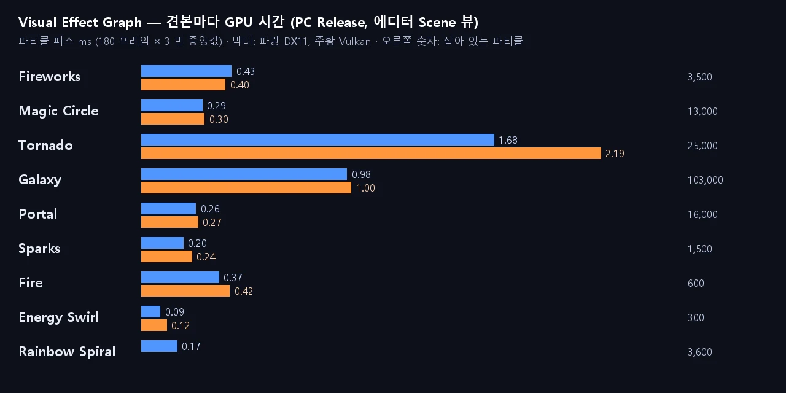

에디터 Scene 뷰, 견본 하나씩, 파티클 패스 GPU 시간 (180 프레임 × 3 번 중앙값, 끈 프레임과 번갈아). 비싼 것은 개수보다 **화면을 덮는 면적** (토네이도 — 큰 반투명 조각이 겹침, 용량을 줄여 1.85 → 1.68 ms). 은하는 별 10 만 개가 작아 0.98 ms.

| 견본 | 파티클 | DX11 ms | Vulkan ms |
|---|---|---|---|
| Fireworks | 3.5 천 | 0.43 | 0.40 |
| Magic Circle | 1.3 만 | 0.29 | 0.30 |
| Tornado | 2.5 만 | 1.68 | 2.19 |
| Galaxy | 10.3 만 | 0.98 | 1.00 |
| Portal | 1.6 만 | 0.26 | 0.27 |
| Sparks | 1.5 천 | 0.20 | 0.24 |
| Fire | 600 | 0.37 | 0.42 |
| Energy Swirl (꼬리만) | 300 | 0.09 | 0.12 |
| Rainbow Spiral (연산 노드 + 꼬리) | 3.6 천 | 0.17 | — |

## 데모: 밤 캠프장

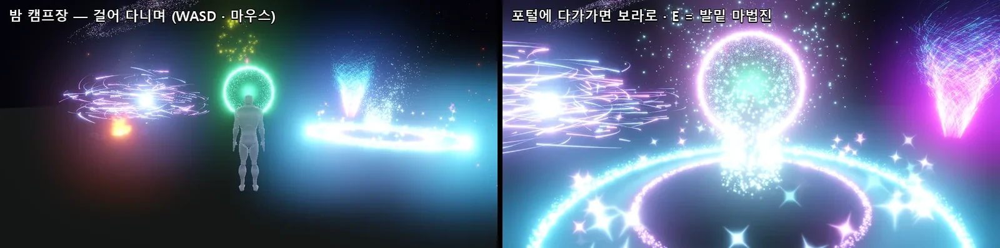

테스트 프로젝트 `E:\NovaTest\VfxDemo` 의 `Assets/Scenes/VfxDemo.scene` — Third Person Character 로 걸어 다니며 포털 · 모닥불 (돌 · 따뜻한 빛) · 마법진 · 무지개 나선 · 에너지 소용돌이 · 불티 · 하늘의 은하 · 멀리 불꽃놀이.
`Assets/Scripts/VfxDemo.cs`: **F** = 불꽃놀이 한꺼번에 (Launch Rate 를 1.6 초 올림), **E** = 발밑에 마법진 (옮기고 Reinit), 모닥불 Size 가 일렁이고, 포털은 가까울수록 초록 → 보라 (SetVector4). 모두 Exposed Property 를 C# 에서 바꾸는 예.

## 아직 없는 것

Unity VFX Graph 의 주요 기능 (시스템 · 블록 · GPU Event · 연산 노드 · Sub Graph 두 가지 · 사용자 속성 · 꼬리 · 정렬 · 컬링 · 메시 출력 · 깊이 / SDF 충돌) 은 모두 있다. 남은 작은 것:
- Trigger Event Always, 사용자 속성을 GPU Event 자식에게 물려주기 (Inherit Attribute), Block Sub Graph 안의 Get Attribute
- 블록 안의 그라디언트 · 곡선 값 통째로 잇기, 움직이는 (스킨) 메시의 거리장, 정적 여러 노드 모델을 노드 변환째 합치기
