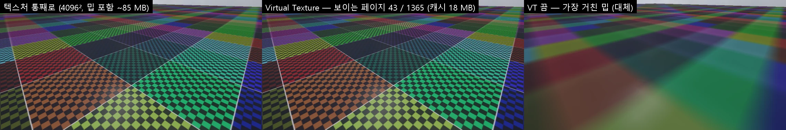

# Streaming Virtual Texturing

큰 텍스처를 통째로 GPU 에 올리지 않고 **화면에 보이는 128 x 128 페이지만** 올립니다 (Unity 의 Streaming Virtual Texturing 과 같은 생각). 렌더링 현대화 5 단계 ([RENDERING_ROADMAP](RENDERING_ROADMAP.md)). 모든 백엔드 (DX11 · DX12 · OpenGL · Vulkan) 에서 같은 그림입니다 — 스파스 리소스 (타일 자원) 없이 소프트웨어로.

## 쓰는 법

1. 텍스처의 Import Settings 에서 **Virtual Texture Only** 를 켠다 (Texture Type = Default). CLI: `nova import-settings <텍스처> --values "{\"virtualTextureOnly\":true}"`
2. 그 텍스처를 URP Lit 재질의 **Base Map** 으로 쓴다 — 따로 할 것이 없다 (재질이 가상 텍스처 길로 그린다)

- 처음 쓸 때 타일 파일을 만든다 (`Binaries/VirtualTextureCache/<이름>_<해시>.nvt` — 4096² 1 초 남짓). 원본이 바뀌면 새로
- 그림자 · 깊이 프리패스 (알파 자르기) · GI 찍기 · 재질 미리 보기는 작은 **대체** (가장 거친 밉) 를 쓴다

## 동작 (`Source/Graphics/DX11/VirtualTexturing.*`)

- **타일 파일**: 원본 → 2 의 거듭제곱 → 밉 (가장 작은 밉이 128 이상인 데까지 — 4096 이면 6 밉, 페이지 1365 개) → 페이지마다 테두리 4 텍셀 (감싸기) 을 붙인 136 x 136 RGBA8. 색 공간은 보통 텍스처와 같다 (sRGB 원본 + 가져오기 설정 sRGB = 하드웨어가 감마를 푼다, 밉도 감마를 고려해 거른다)
- **물리 캐시**: 모든 가상 텍스처가 함께 쓰는 텍스처 하나 (16 x 16 칸 = 2176², 18 MB), 형식 없는 RGBA8 에 선형 · sRGB 뷰 둘. LRU 로 비우고, 가장 거친 밉의 페이지는 늘 올라 있다
- **페이지 표**: 가상 텍스처마다 밉 사슬이 있는 작은 텍스처 (칸 = 캐시 칸 x · y + 실제로 올라 있는 밉). 없는 페이지는 올라 있는 가장 가까운 조상을 가리킨다 → 먼저 흐리게, 페이지가 오면 선명해진다
- **피드백**: Render Graph 의 **VT Feedback** 패스 (깊이 프리패스 뒤, Side Effect) 가 가상 텍스처 물체를 화면의 1/8 크기로 그려 픽셀마다 (텍스처 번호, 밉, 페이지 x · y) 를 쓴다 (`Shaders/65. VirtualTexture.fx`). 가려진 면은 프리패스 깊이와 비교해 버리고, 프레임마다 1/8 칸 안의 다른 자리를 본다. CPU 는 2 프레임 뒤에 읽는다 (GPU 를 기다리지 않는다)
- **요청 · 올리기**: 요청한 페이지와 조상들 → 작업 스레드가 타일 파일에서 읽고 → 프레임마다 24 개까지 캐시에 올리고 페이지 표를 다시 쓴다. 30 프레임 넘게 원하지 않은 읽기는 버린다
- **셰이더** (`32. InstancedBasic.fx` 의 `SampleVirtual`, 재질의 `UseBaseMap == 2`): 화면 미분으로 밉 → 페이지 표 `Load` → 캐시에서 쌍선형. 밉 사이를 섞지 않는다 (밉이 바뀌는 곳에 경계가 조금 보일 수 있다)

## 확인 · CLI

- `nova vt info`: 가상 텍스처마다 밉별 올라 있는 페이지 · 캐시 사용 · 올린 수 · 비운 수 · 마지막 프레임의 요청 · 피드백 물체
- `nova vt page --texture 1 --uv 0.1,0.1 --mip 0`: 그 페이지가 올라 있는지, 실제로 읽는 밉
- `nova vt flush`: 가장 거친 밉 밖을 모두 비운다 (피드백이 다시 채우는지)
- `nova vt set --enabled false`: 대체 (가장 거친 밉) 만 — 비교 · 문제 찾기. `--frozen true`: 피드백을 멈춘다

## 검사

`Tools/tests/run_tests.ps1 -Only virtualtexture` (8 항목): 4096² 그림 (페이지마다 다른 색 + 8 px 체커) 을 Virtual Texture Only 로, 100 m 바닥에 —
등록 (6 밉 · 1365 페이지), 스트리밍 (보이는 페이지만 — 43 / 1365, 밉 0 은 카메라 가까이 17), 그림이 같은 텍스처를 통째로 올린 것과 같다 (평균 차 1.4), flush 뒤 피드백이 다시 채운다, 끄면 흐린 대체 (평균 차 18), OpenGL · Vulkan · DX12 = DX11.

## 아직

- 밉 사이 섞기 (트릴리니어 — 두 번 찾기), 이방성
- Base Map 밖의 맵 (노멀 · 메탈릭 …), Shader Graph 의 Sample Virtual Texture 노드
- 타일 압축 (BC · ASTC) — 지금은 RGBA8 (4096² 타일 파일 ≈ 100 MB)
- 안드로이드 · 웹 플레이어 빌드에 타일 파일 넣기
