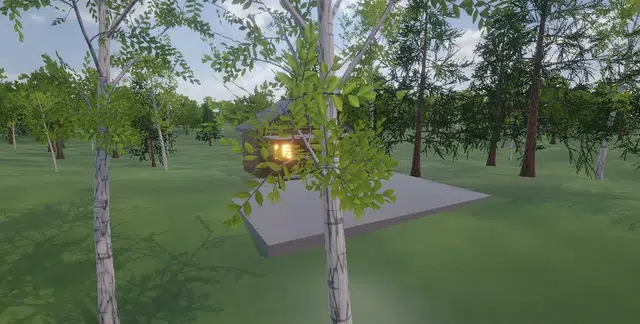
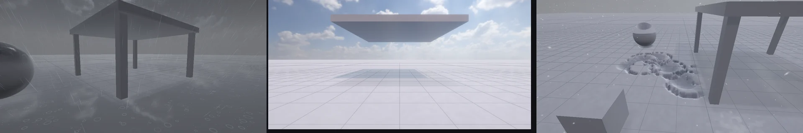
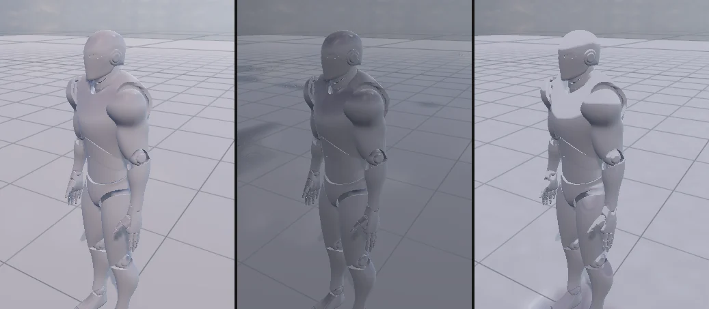
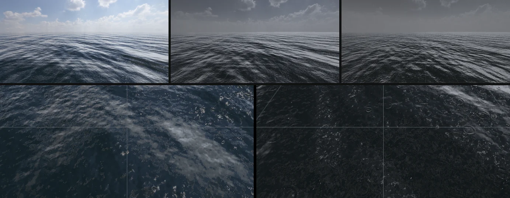
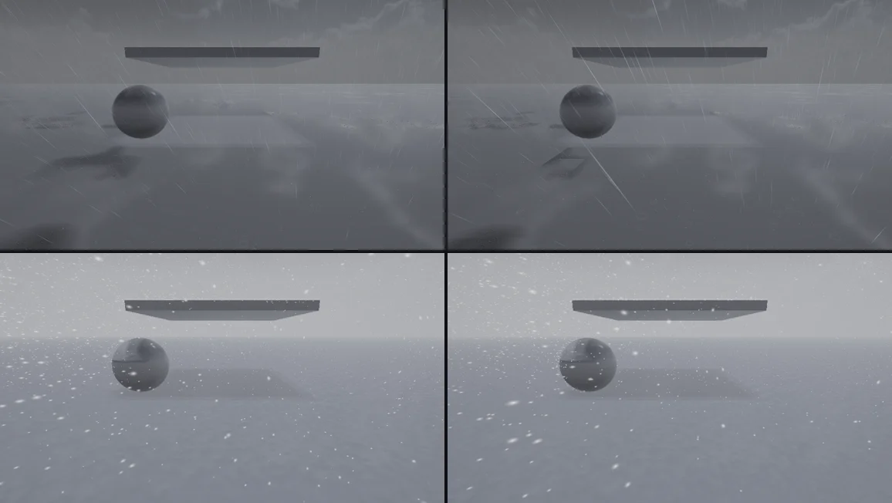

# Weather (오픈 월드 날씨)

패키지 `com.nova.weather` 의 **Weather Controller** 하나로 맑음 · 흐림 · 비 · 폭풍 · 눈 · 눈보라를 시간에 걸쳐 바꿉니다 (Unity 에셋 Enviro · UniStorm 과 비슷한 자리).
비 · 눈은 **카메라 둘레에서만 태어나는 GPU 입자** (Visual Effect Graph) 라서 월드가 아무리 커도 비용이 같습니다.







## 쓰는 법

1. **Window > Package Manager** 에서 **Weather** 를 넣는다 (`nova package add com.nova.weather`)
2. 빈 GameObject 에 **Add Component > Environment > Weather Controller**
3. Inspector 의 **Presets** 단추 (Clear · Cloudy · Rain · Storm · Snow · Blizzard) 또는 **Profile** 에서 고르면 **Transition Time** (초) 동안 넘어간다. Play 가 아니어도 Scene 뷰에서 바로 보인다
4. 나만의 날씨: Project 창 **Create > Weather Profile** (`.weather`) — Inspector 의 값 (비 · 눈 · 바람 · 방향 · 돌풍 · 먹구름 · 안개 · 안개 거리 · 분당 번개 · 젖음 · 눈 덮임) 을 고치면 바로 저장되고, 그 프로필을 쓰는 장면에 바로 보인다

| Weather Controller | |
|---|---|
| Profile | 기본 프로필 이름 또는 `.weather` 경로 |
| Transition Time | 다른 프로필로 넘어가는 시간 (초) |
| Density | 빗방울 · 눈송이 수 배율 (성능 — 0 이면 입자 없이 하늘 · 빛 · 안개만) |
| Snow Depth | 쌓인 눈 깊이 (m) — 발자국이 이만큼 꺼진다 |
| Lightning | 폭풍의 번개 (빛줄기 + 하늘 · 안개 번쩍임 + 거리만큼 늦은 천둥) |
| Sound · Volume | 비 (약 · 강) · 바람 소리 고리, 천둥 (Play 중에만) |

## 하는 일

| | |
|---|---|
| 비 | 가까운 비 (26 m 상자, 4.5 만 개 — 화면 깊이에 닿으면 튀는 물방울 2 개 + 땅의 동그라미 물결) + 먼 비 (90 m, 굵고 옅게). 바람의 반만큼 기울고, 바람에 밀리는 만큼 바람 위쪽에서 태어나 카메라 둘레를 채운다 |
| 눈 | 40 × 18 × 40 m 공간 어디서나 천천히 (난류로 흔들림), 보이는 장면에 닿으면 앉았다가 사라진다. 센 바람이면 수명을 줄이고 바람 위쪽으로 — 카메라 둘레의 눈 수가 바람과 상관없이 같다. 눈보라에서는 속도 방향으로 늘어난다 |
| 먹구름 | 해 (방향광) 0.15 배까지 · 환경광 · 하늘을 어둡고 푸른 잿빛으로 (하늘 채도를 뺀다) |
| 안개 | 장면 Volume 의 Fog 와 섞는다 (장면에 안개가 없어도). 비는 푸른 잿빛, 눈은 밝은 흰 잿빛 |
| 바람 | 나무 · 풀 (Detail) 의 바람 세기 배율, 돌풍 (느린 물결 셋을 겹친 오르내림) |
| 번개 | 보는 쪽 ±35° (60 %) 또는 아무 데나, 170 ~ 500 m. 가운데 점 밀기로 만든 지그재그 줄기 + 가지 2 ~ 4 개 (HDR — Bloom), 세 번 깜빡임. 하늘 · 해 · 환경광 · 안개가 함께 번쩍이고 `거리 / 343` 초 뒤 천둥 (가까우면 찢어지는 소리, 멀면 우르릉) |
| 젖은 세상 | 비가 오면 천천히 (센 비면 7 초쯤) 젖는다: 표면이 어둡고 반들 (흙 · 풀처럼 거친 것일수록 더 어둡고 덜 반들), 옆면은 덜, 아래를 향한 면은 마른다. 그 뒤 웅덩이가 찬다 — 위를 향한 면의 잡음 무늬 낮은 곳부터 (지형은 적게), 물 = 거울 + 빗방울 물결 (가까운 30 m). 그치면 1 ~ 2 분에 마른다 |
| 지붕 아래 | **덮개 맵**: 카메라 둘레 128 m 를 바로 위에서 본 깊이 (그림자 캐스터 패스, 풀 · 캐릭터는 빼고). 맨 위 표면보다 아래 = 지붕 · 처마 · 나무 아래 → 젖지 않고 눈도 없다. 빗방울도 지붕 · 나무 위에서 죽는다 (VFX 블록 Collide with Weather Cover — 화면 밖도) |
| 먹구름 반사 | 하늘에서 온 환경광 · 반사도 먹구름 하늘처럼 (파란 하늘 · 흰 구름을 비추지 않게) |
| 쌓이는 눈 | 눈이 내리면 천천히 쌓인다 (눈보라면 40 초쯤): 위를 향한 면부터, 덜 쌓였으면 잡음 무늬로 군데군데, 고운 눈 결. 그치면 아주 천천히, 비가 오면 빨리 녹는다 |
| 발자국 | 카메라 둘레 48 m (4.7 cm 칸) 의 눌림 맵: 움직이는 것 (스킨 메시 · RigidBody · Character Controller 의 메시) 을 **아래에서 본 깊이** 가 눈 표면 (땅 + 눈 깊이) 보다 낮으면 그만큼 눌린다 → 발 · 바퀴 · 공 모양 그대로. 12 cm 비탈의 벽, 시차 (8 걸음) 로 깊이가 보이고, 다져진 눈은 조금 어둡고 푸르다. 눈이 내리면 다시 덮인다 (센 눈이면 20 초). 고리 배치라 카메라가 움직여도 옮겨 쓰지 않는다 |
| 오픈 월드 | 비 · 눈은 카메라를 따라간다 (Play = Game 카메라, 편집 = Scene 뷰). 빠르게 움직이면 (비행 · 차) 그만큼 앞에서 태어난다. 순간 이동도 괜찮다 |

날씨 값은 **장면에 저장되지 않습니다** — 엔진의 `WeatherState` 가 그릴 때만 적용하고, 컨트롤러를 끄거나 지우면 장면 그대로 돌아옵니다. 입자 · 번개 선 · 소리를 내는 오브젝트는 장면 밖에 만들어져 Hierarchy 에 보이지 않습니다.

## 스크립트 (C#)

```csharp
using NovaEngine;

Weather.Set("Storm", 10f);          // 10 초에 걸쳐 폭풍으로 (seconds 를 빼면 Transition Time, 0 = 바로)
Weather.Set("Assets/Weather/Dusk Rain.weather");
if (Weather.rain > 0.5f) { /* 우산 */ }
Weather.Strike();                   // 연출: 보는 쪽에 번개
string now = Weather.profile;       // 지금 향하는 프로필
// rain · snow · wind (m/s) · windDirection · gust · clouds · fog · fogDistance · lightning · wetness · snowCover · transitionProgress
```

## CLI

```bash
nova weather status
nova weather set --profile Storm --seconds 10
nova weather strike
nova weather list
nova weather save --path Assets/Weather/Mine.weather
```

`status` 는 지금 섞인 값, 전환 진행, 번개 수, 해 배율 · 바람 배율, 표면 (젖음 · 웅덩이 · 쌓인 눈), Play 중이면 소리 크기를 돌려줍니다.

젖음 · 눈은 모든 Lit 표면 (메시 · 스킨 메시 캐릭터 · Shader Graph · 지형 · 나무 · 바위 · 풀) 이 같은 `ShadeLit` 에서 받는다 — 셰이더를 고치지 않아도 된다. 웅덩이는 메시 · 지형만 (나무 · 풀 · 바위 위에는 없다). 발자국은 맨 위 표면 (땅 · 지붕) 에만 — 캐릭터의 머리 · 어깨는 발밑 발자국 맵과 같은 xz 라도 눌리지 않는다 (덮개 맵으로 가린다).



**지형의 눈은 실제로 올라간다** (테셀레이션 — [TESSELLATION](TESSELLATION.md)): 눈 덮임 × Snow Depth 만큼, 발자국 자리는 땅까지 파인다. 가까운 40 m 만 잘게, 그 위의 물체는 눈에 묻힌다. 메시 바닥 (돌 마당 등) 은 예전처럼 음영 · 시차.


**물 (바다 · 호수 · 강)**: 먹구름 하늘을 비추고 (하늘과 같은 채도 · 밝기, 번개에 번쩍), 물속 색도 잿빛으로. 센 바람이면 잔물결이 거칠어지고, 비가 오면 가까운 40 m 에 빗방울 물결 (세 겹 고리).



## 데모

새 프로젝트 (예: `E:\NovaTest\WeatherDemo`) 에 [docs/examples/weather](examples/weather) 의 스크립트 둘과 장면 만들기 스크립트를 쓴다:

- `WeatherDirector.cs` — Play 하면 시간표 (0 초 맑음 → 8 흐림 → 16 비 → 28 폭풍 → 46 눈 → 62 눈보라 → 80 맑음, 되풀이) 와 오두막 둘레를 천천히 도는 카메라. 1 ~ 6 = 프로필 바로, L = 번개, Space = 시간표 멈춤, C = 카메라 멈춤
- `Walker.cs` — 캐릭터가 원을 따라 걷는다 (Animator 의 Speed · MotionSpeed · Grounded) → 눈 위 발자국
- `build_cabin_scene.ps1` — 오두막 · 돌 마당 · 처마 · 등불 · 숲 900 그루 · 걷는 사람 · Weather Controller · Director (CLI 로). Volume 에 Screen Space Reflection 을 켜면 웅덩이에 오두막 · 나무가 비친다

## 안드로이드

같은 패키지가 플레이어에 들어간다 (OpenGL ES 3.2 — 덮개 맵 · 발자국 compute 그대로, 소리는 게임 데이터의 `Packages\com.nova.weather\Resources`). MuMu 960 x 540: 폭풍 2.4 ms, 눈보라 4.7 ms (프레임 전체) — PC 와 같은 이펙트 (눈송이 Turbulence 포함).



## 한계

- 눈을 실제로 올리는 것은 지형만 — 메시 바닥 (돌 마당 등) 의 눈 두께 · 발자국 깊이는 음영 · 시차. 테셀레이션이 없는 기기 (일부 OpenGL ES) 는 지형도 시차
- 지형 눈의 깊이 프리패스 · 그림자는 맨 지형 (SSAO · 그림자가 눈 두께만큼 낮다 — 기본 25 cm 면 거의 보이지 않는다)
- 입자는 젖지 않는다
- 덮개 맵 · 발자국 맵은 카메라 둘레만 (128 m · 48 m) — 그 밖은 하늘 아래로 보고, 발자국은 창을 벗어나면 지워진다

## 검사

```bash
powershell -ExecutionPolicy Bypass -File Tools\tests\run_tests.ps1 -Only weather
```

```bash
powershell -ExecutionPolicy Bypass -File Tools\tests\android_weather.ps1 -Profile Blizzard
```

PC 14 개: 붙이면 맑음 (장면 그대로), 폭풍의 어두움 · 바람, 비 입자 (Density 0 과 비교), 3 초 전환, 번개 (밝은 화소), 눈 · 눈보라, `.weather` 저장 · 불러오기, 젖은 바닥 · 지붕 아래 마름 (같은 빛에서 젖음만 다른 프로필), 천천히 젖기, 쌓인 눈 · 지붕 아래 맨땅, RigidBody 공의 발자국, C# API, Play 의 소리, 끄면 장면 그대로.
안드로이드 11 개 (MuMu): GLES 셰이더 (눈 compute 포함), 게임 데이터의 날씨 소리, 기기 장면 · 날씨 오류 없음, 비 · 눈 입자 (살아 있고 자리가 유한), DX11 기준과 같은 밝기, 그리기 시간, 충돌 없음.
