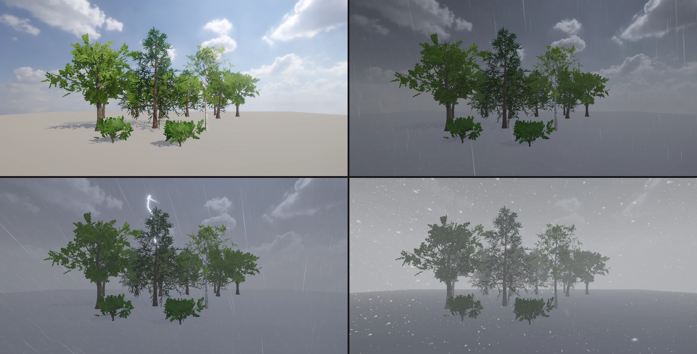
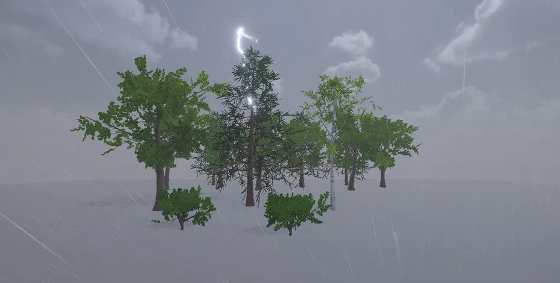

# Weather (오픈 월드 날씨)

패키지 `com.nova.weather` 의 **Weather Controller** 하나로 맑음 · 흐림 · 비 · 폭풍 · 눈 · 눈보라를 시간에 걸쳐 바꿉니다 (Unity 에셋 Enviro · UniStorm 과 비슷한 자리).
비 · 눈은 **카메라 둘레에서만 태어나는 GPU 입자** (Visual Effect Graph) 라서 월드가 아무리 커도 비용이 같습니다.





## 쓰는 법

1. **Window > Package Manager** 에서 **Weather** 를 넣는다 (`nova package add com.nova.weather`)
2. 빈 GameObject 에 **Add Component > Environment > Weather Controller**
3. Inspector 의 **Presets** 단추 (Clear · Cloudy · Rain · Storm · Snow · Blizzard) 또는 **Profile** 에서 고르면 **Transition Time** (초) 동안 넘어간다. Play 가 아니어도 Scene 뷰에서 바로 보인다
4. 나만의 날씨: Project 창 **Create > Weather Profile** (`.weather`) — Inspector 의 값 (비 · 눈 · 바람 · 방향 · 돌풍 · 먹구름 · 안개 · 안개 거리 · 분당 번개 · 젖음 · 눈 덮임) 을 고치면 바로 저장되고, 그 프로필을 쓰는 장면에 바로 보인다

| Weather Controller | |
|---|---|
| Profile | 기본 프로필 이름 또는 `.weather` 경로 |
| Transition Time | 다른 프로필로 넘어가는 시간 (초) |
| Density | 빗방울 · 눈송이 수 배율 (성능 — 0 이면 입자 없이 하늘 · 빛 · 안개만) |
| Lightning | 폭풍의 번개 (빛줄기 + 하늘 · 안개 번쩍임 + 거리만큼 늦은 천둥) |
| Sound · Volume | 비 (약 · 강) · 바람 소리 고리, 천둥 (Play 중에만) |

## 하는 일

| | |
|---|---|
| 비 | 가까운 비 (26 m 상자, 4.5 만 개 — 화면 깊이에 닿으면 튀는 물방울 2 개 + 땅의 동그라미 물결) + 먼 비 (90 m, 굵고 옅게). 바람의 반만큼 기울고, 바람에 밀리는 만큼 바람 위쪽에서 태어나 카메라 둘레를 채운다 |
| 눈 | 40 × 18 × 40 m 공간 어디서나 천천히 (난류로 흔들림), 보이는 장면에 닿으면 앉았다가 사라진다. 센 바람이면 수명을 줄이고 바람 위쪽으로 — 카메라 둘레의 눈 수가 바람과 상관없이 같다. 눈보라에서는 속도 방향으로 늘어난다 |
| 먹구름 | 해 (방향광) 0.15 배까지 · 환경광 · 하늘을 어둡고 푸른 잿빛으로 (하늘 채도를 뺀다) |
| 안개 | 장면 Volume 의 Fog 와 섞는다 (장면에 안개가 없어도). 비는 푸른 잿빛, 눈은 밝은 흰 잿빛 |
| 바람 | 나무 · 풀 (Detail) 의 바람 세기 배율, 돌풍 (느린 물결 셋을 겹친 오르내림) |
| 번개 | 보는 쪽 ±35° (60 %) 또는 아무 데나, 170 ~ 500 m. 가운데 점 밀기로 만든 지그재그 줄기 + 가지 2 ~ 4 개 (HDR — Bloom), 세 번 깜빡임. 하늘 · 해 · 환경광 · 안개가 함께 번쩍이고 `거리 / 343` 초 뒤 천둥 (가까우면 찢어지는 소리, 멀면 우르릉) |
| 오픈 월드 | 비 · 눈은 카메라를 따라간다 (Play = Game 카메라, 편집 = Scene 뷰). 빠르게 움직이면 (비행 · 차) 그만큼 앞에서 태어난다. 순간 이동도 괜찮다 |

날씨 값은 **장면에 저장되지 않습니다** — 엔진의 `WeatherState` 가 그릴 때만 적용하고, 컨트롤러를 끄거나 지우면 장면 그대로 돌아옵니다. 입자 · 번개 선 · 소리를 내는 오브젝트는 장면 밖에 만들어져 Hierarchy 에 보이지 않습니다.

## 스크립트 (C#)

```csharp
using NovaEngine;

Weather.Set("Storm", 10f);          // 10 초에 걸쳐 폭풍으로 (seconds 를 빼면 Transition Time, 0 = 바로)
Weather.Set("Assets/Weather/Dusk Rain.weather");
if (Weather.rain > 0.5f) { /* 우산 */ }
Weather.Strike();                   // 연출: 보는 쪽에 번개
string now = Weather.profile;       // 지금 향하는 프로필
// rain · snow · wind (m/s) · windDirection · gust · clouds · fog · fogDistance · lightning · wetness · snowCover · transitionProgress
```

## CLI

```bash
nova weather status
nova weather set --profile Storm --seconds 10
nova weather strike
nova weather list
nova weather save --path Assets/Weather/Mine.weather
```

`status` 는 지금 섞인 값, 전환 진행, 번개 수, 해 배율 · 바람 배율, Play 중이면 소리 크기를 돌려줍니다.

## 다음 단계

- 2 단계 — 젖은 세상: 표면이 어둡고 반들해지고, 웅덩이 · 웅덩이의 물결, 지붕 아래는 마른다 (`Wetness`)
- 3 단계 — 쌓이는 눈: 두께가 있는 눈, 밟으면 발자국 · 자국이 남았다가 다시 덮인다, 카메라를 따라가는 클립맵 (`Snow Cover`)
- 4 단계 — 시네마틱 데모 (큰 지형 + 숲, 맑음 → 폭풍 → 눈보라), 안드로이드 낮은 품질

## 검사

```bash
powershell -ExecutionPolicy Bypass -File Tools\tests\run_tests.ps1 -Only weather
```

10 개: 붙이면 맑음 (장면 그대로), 폭풍의 어두움 · 바람, 비 입자 (Density 0 과 비교), 3 초 전환, 번개 (밝은 화소), 눈 · 눈보라, `.weather` 저장 · 불러오기, C# API, Play 의 소리, 끄면 장면 그대로.
