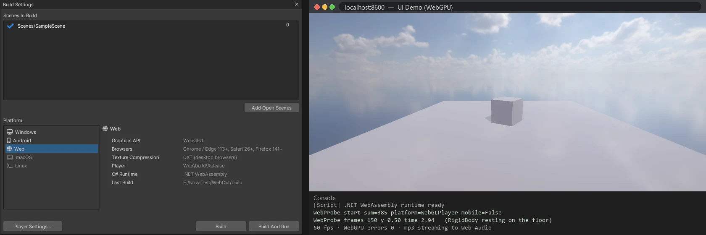
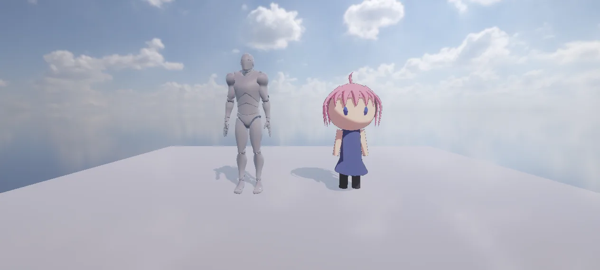

# 웹 (WebGPU)

NOVA 게임을 브라우저에서 돌리는 빌드. Unity 의 Web 빌드처럼 **Build Settings → Web → Build And Run** 으로 폴더 하나를 만들고 미리 보기 서버로 연다.
엔진 C++ 전체를 WebAssembly 로, 그래픽은 **WebGPU** (WebGL 아님), 셰이더는 HLSL → WGSL, C# 스크립트는 .NET 웹어셈블리 런타임 (Mono) 이 엔진과 한 wasm 에서 돈다.
PC DirectX 11 과 같은 그림 (화소 차이 최대 1).

<p align="center"><br/><sub>Build Settings 의 Web · 브라우저에서 도는 C# 검사 스크립트 (강체 · 소리)</sub></p>
<p align="center"><br/><sub>Chrome WebGPU — 스킨 메시 (FBX) · lilToon VRM · 그림자 · 하늘</sub></p>

## 브라우저

| 브라우저 | WebGPU |
|---|---|
| Chrome · Edge | 113+ (Windows · macOS · ChromeOS), Android 121+ |
| Safari | 26+ (macOS · iOS · iPadOS) |
| Firefox | 141+ (Windows) |

- 텍스처는 BC (DXT) — PC 브라우저. 휴대폰 브라우저 (ASTC · ETC2) 는 나중
- WebGPU 가 없는 브라우저는 페이지에 안내만 보인다 (WebGL 대체 없음)

## 만들기

**File > Build Settings** → **Web** → Build (폴더를 묻는다) / Build And Run (에디터 안의 웹 서버 `http://localhost:8600/` 로 열고 기본 브라우저로)

결과 폴더:

| 파일 | 내용 |
|---|---|
| `index.html` | 페이지 (로딩 막대 · 오류 안내). 제목 = Player Settings 의 제품 이름 |
| `game.json` · `game.data` | 게임 데이터 (Build Settings 의 씬 · 에셋 · WGSL 셰이더) 를 이어 붙인 한 덩어리 + 목록. 페이지가 메모리 파일 시스템의 `/game` 에 푼다 |
| `nova.js` · `nova.wasm` | 플레이어 — C# 스크립트가 없는 게임 (약 8 MB) |
| `_framework/` | 플레이어 — C# 스크립트가 있는 게임: `dotnet.js` · `dotnet.native.wasm` (엔진 + .NET 런타임) · 쓰는 BCL 만 (약 19.5 MB) |

다른 서버에 올릴 때는 폴더를 그대로 (정적 파일). `.wasm` 은 `application/wasm` 으로 내보내야 한다 (대부분의 서버 · GitHub Pages · Firebase Hosting 은 그렇게 한다).

## 구조

| 위치 | 하는 일 |
|---|---|
| `Web/CMakeLists.txt` · `Web/build.sh` | Emscripten 으로 엔진 · 공식 패키지를 정적 라이브러리로 (`-fwasm-exceptions -msimd128` — .NET 과 같게), `nova` = 엔진만 판. Emscripten 은 .NET wasm-tools 워크로드의 3.1.56 (`Tools/web/emenv.sh`) |
| `Web/Source/WebMain.cpp` | 진입점 `nova_web_start`: 캔버스 크기 (기기 픽셀 비율), 키보드 · 마우스 · 터치 → 안드로이드와 같은 입력 상태, `requestAnimationFrame` 마다 `App::Run` + Present |
| `Web/Source/GfxWgpu*.cpp` | **WebGPU Gfx 백엔드** (엔진 렌더러가 쓰는 D3D11 모양 층): 늦은 렌더 패스 · 지우기 = loadOp, 파이프라인 · 바인드 그룹 캐시, 프레임 링 버퍼 (`queue.writeBuffer`), 깊이 텍스처를 표본으로 읽으면 unfilterable 변형, `SV_InstanceID` 시작 인스턴스 = 정점 버퍼 오프셋 |
| `Web/Source/WgpuRhi.cpp` | 효과 (`.fx`) = `game/Shaders/<이름>.wgsl.json` (`nova web shaders` 가 만든 WGSL · 바인딩) |
| `Web/Host/` | C# 이 있는 게임의 플레이어: `NovaWebHost.csproj` (.NET 10 `Microsoft.NET.Sdk.WebAssembly`) 가 엔진 정적 라이브러리를 .NET 런타임과 함께 다시 링크. `Program.cs` 의 `Main` 이 Bridge 진입점 주소를 엔진에 넘기고 엔진을 시작한다 |
| `Web/Shell/index.html` | 페이지: WebGPU 장치 (기능 · 한계를 엔진이 쓰는 만큼), 게임 데이터 받기 (진행), `game.json` 의 `runtime` 이 `dotnet` 이면 `_framework/dotnet.js` 로 시작 |
| `Android/Source/Engine/*` | 플랫폼과 상관없는 안드로이드 판을 같이 쓴다 (경로 · 플레이어 런타임 · 입력 상태 · 소프트웨어 오디오 믹서 → Web Audio · C# 진입점) |
| `Source/Build/WebTools.*` · `WebBuild.*` | CLI `nova web …`, Build Settings 의 Web 빌드 · 미리 보기 서버 |

### 셰이더 (HLSL → WGSL)

브라우저에는 셰이더 변환기가 없어 미리 바꾼다: DXC (SPIR-V, `NOVA_WEBGPU` 정의) → **Tint** (Dawn 의 WGSL 생성기 — `Tools/web/build_tint.ps1`) → `<이름>.wgsl.json` (WGSL + 바인딩 · 표본기 짝).
테셀레이션 · 지오메트리 셰이더 패스는 WebGPU 에 없어 빠진다 (그 재질은 테셀레이션 없이). 캐시 `ShaderCache/WGSL`.

### C# 스크립트

- Windows 는 .NET (hostfxr), 안드로이드는 Mono 를 따로 띄우지만, 웹은 **.NET 웹어셈블리 런타임과 엔진이 한 wasm** (`Web/build.sh Release host`)
- 게임 스크립트 (`Assembly-CSharp.dll`) 는 게임 데이터의 `Managed/` 에서 바이트로 읽는다 (Windows · 안드로이드와 같은 Bridge) — 플레이어는 게임마다 다시 빌드하지 않는다
- 패키지 C# 의 `DllImport("NovaTilemap")` 등은 .NET 이 빌드 때 본 것만 P/Invoke 표에 넣으므로, 호스트가 패키지 `Runtime/*.cs` 를 함께 컴파일하고 모듈 이름마다 빈 네이티브 파일 (`host-modules/`) 을 둔다
- 내보낼 때 쓰는 BCL 만 남긴다 (게임 · 엔진 어셈블리의 AssemblyRef 를 따라감 — 안드로이드와 같은 규칙, 31.9 → 19.5 MB)
- `Application.platform` = `WebGLPlayer` (Unity 와 같은 값 — Unity 도 WebGPU 빌드를 이 값으로)
- 단일 스레드: 물리 (Jolt) 는 `JobSystemSingleThreaded`, 긴 소리 스트리밍은 프레임마다 채운다

### 소리

엔진의 소프트웨어 믹서 (안드로이드와 같음) → Web Audio (`ScriptProcessor`, 2 채널). 브라우저는 사용자 입력 (클릭 · 키 · 터치) 뒤에만 소리를 내므로 그때 시작한다.

## 엔진 개발

```bash
bash Web/build.sh Release        # 엔진만 판 (nova.js · nova.wasm)
bash Web/build.sh Release host   # C# 판 (.NET 웹어셈블리 — Binaries/Scripting/NovaScriptCore.dll 이 먼저 있어야 한다)
```

- 필요: Visual Studio (CMake · Ninja), .NET 10 SDK + `dotnet workload install wasm-tools`, Tint (`Tools/web/build_tint.ps1`)
- 플레이어 위치: `Binaries/Web` (배포판) → `Web/build/Release` (엔진 개발)

## CLI

| 명령 | 하는 일 |
|---|---|
| `nova web shaders --out 폴더 [--path x.fx]` | 모든 `.fx` → WGSL |
| `nova web export --out 폴더 [--scenes a.scene,b.scene] [--texture-compression dxt\|none]` | 웹 게임 (씬을 고를 수 있다) |
| `nova web build --out 폴더 [--run] [--port N] [--open]` | Build Settings 빌드. `--run` = 미리 보기 서버 (`--open` 이면 기본 브라우저도) |
| `nova web serve --path 폴더 [--port N]` · `nova web stop-server` | 에디터의 미리 보기 서버 (127.0.0.1 만, 폴더 밖은 404) |

## 검사

`Tools/tests/run_tests.ps1 -Only web` — 창 없는 Chrome (별도 프로필, 소리는 스피커로 내지 않음) 을 CDP 로 (`Tools/web/headless.mjs` · `run_scene.sh`):
C# 검사 장면 (LINQ · `WebGLPlayer` · 강체가 바닥에 선다 · mp3 스트리밍 출력 진폭), 재질 장면 그림 = DX11 (`nova android reference`), `nova web build --run` 서버 (wasm MIME · 격리 머리 · 폴더 밖 404) 에서 실행.

## 나중

- 휴대폰 브라우저 텍스처 (ASTC · ETC2 — `texture-compression-astc` 기능이 있으면)
- 스레드 (SharedArrayBuffer — 서버는 이미 교차 출처 격리 머리를 보낸다) · 물리 · 오디오 작업 스레드
- 압축 (Brotli) · 캐시 (서비스 워커) · 더 작은 BCL (IL 다듬기)
