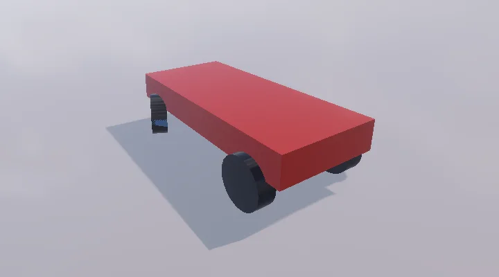

# 차량 — Wheel Collider

Unity 의 WheelCollider 와 같은 쓰임: 차체 (Rigidbody) 아래 바퀴 자리마다 빈 오브젝트를 두고 **Add Component > Physics > Wheel Collider**.
스크립트로 `motorTorque` · `brakeTorque` · `steerAngle` 을 주고, 바퀴 그림은 `GetWorldPose` 로 맞춘다.

<p align="center"><br/><sub>C# 으로 만든 1500 kg 차: 뒷바퀴 모터 + 앞바퀴 조향 25 도로 오른쪽으로 돈다 (바퀴 그림 = GetWorldPose)</sub></p>

```csharp
public class Car : MonoBehaviour
{
    public WheelCollider frontLeft, frontRight, rearLeft, rearRight;
    public Transform[] visuals;   // 바퀴 그림 (FL, FR, RL, RR)

    void FixedUpdate()
    {
        float motor = 400f * Input.GetAxis("Vertical"), steer = 25f * Input.GetAxis("Horizontal");
        rearLeft.motorTorque = rearRight.motorTorque = motor;
        frontLeft.steerAngle = frontRight.steerAngle = steer;
        float brake = Input.GetKey(KeyCode.Space) ? 3000f : 0f;
        frontLeft.brakeTorque = frontRight.brakeTorque = rearLeft.brakeTorque = rearRight.brakeTorque = brake;
    }

    void LateUpdate()
    {
        var wheels = new[] { frontLeft, frontRight, rearLeft, rearRight };
        for (int i = 0; i < 4; i++)
        {
            wheels[i].GetWorldPose(out var p, out var q);
            visuals[i].SetPositionAndRotation(p, q);
        }
    }
}
```

## 항목 (Unity 와 같은 기본값)

| 항목 | 기본 | 내용 |
|---|---|---|
| Mass | 20 | 바퀴 질량 (관성 = ½ m r²) |
| Radius | 0.5 | 바퀴 반지름 |
| Wheel Damping Rate | 0.25 | 바퀴 회전 감쇠 |
| Suspension Distance | 0.3 | 서스펜션이 늘어나는 최대 길이 (로컬 -Y) |
| Force App Point Distance | 0 | 힘을 주는 자리 (접점에서 위로) — 키우면 차가 덜 기운다 |
| Center | 0 | 바퀴 중심 (가장 눌린 자리, 오브젝트 로컬) |
| Suspension Spring | 35000 · 4500 · 0.5 | Spring · Damper · Target Position (쉬는 자리: 1 = 다 늘어남, 0 = 다 눌림) |
| Forward Friction | 0.4 · 1 · 0.8 · 0.5 · 1 | 앞 미끄러짐 곡선 (Extremum Slip · Value, Asymptote Slip · Value, Stiffness) |
| Sideways Friction | 0.2 · 1 · 0.5 · 0.75 · 1 | 옆 미끄러짐 곡선 |

C#: `motorTorque` · `brakeTorque` · `steerAngle` (도, + = 오른쪽) · `rpm` · `isGrounded` · `sprungMass` · `GetWorldPose(out pos, out rot)` ·
`GetGroundHit(out WheelHit)` (point · normal · forwardDir · sidewaysDir · force · forwardSlip · sidewaysSlip · collider) · `ConfigureVehicleSubsteps` (하는 일 없음).

## 계산 (고정 스텝마다, `Source/Scene/WheelCollider.cpp`)

1. **서스펜션**: 바퀴 중심에서 아래로 레이 (자기 차 · 트리거는 건너뜀) → 늘어난 길이. 힘 = 매달린 질량 × g + Spring × (쉬는 길이 - 길이) + Damper × 눌리는 속도 —
   PhysX 와 같이 Target Position 에서 정확히 멈춘다 (매달린 질량 = 차체 질량 ÷ 바퀴 수). 끝까지 눌리면 범프 스톱.
2. **바퀴 회전**: 모터 토크 · 감쇠 · 브레이크 → 각속도. 마찰 반작용이 한 스텝에 구르는 속도를 넘지 않게 (작은 바퀴 관성에서도 안정 — 힘 = 바퀴가 줄 수 있는 만큼).
   브레이크가 마찰 토크를 버티면 바퀴가 잠긴 채 미끄럼 마찰이 그대로 차에.
3. **타이어**: 앞 미끄러짐 = (바퀴 속도 - 앞 속도) ÷ 속도, 옆 = 미끄럼 각 → 곡선 × 하중. 낮은 속도에서 한 스텝에 없앨 속도는
   접점의 실제 질량 (회전 몫 포함, `PhysicsManager::GetEffectiveMass`) ÷ 바퀴 수의 절반까지 — 서 있는 차가 좌우로 흔들리지 않는다.
4. 힘을 접점 (+ Force App Point Distance) 에 `AddForceAtPosition`.

기즈모: 차나 바퀴를 고르면 바퀴 둘레 (초록) 와 서스펜션 선 (노랑).

## 검사

`Tools/tests/run_tests.ps1 -Only wheel` — 검사 스크립트 `Tools/tests/wheel_probe.cs` 가 C# 으로 차를 만든다:
쉬기 (차 높이 0.55 = 반지름 0.4 + 쉬는 길이 0.15, 매달린 질량 375, 하중 3679 N, 바닥 = Ground), 모터 (5 m/s 곧게, rpm = 구르는 속도),
브레이크 (멈추고 그대로 — 속도 · 각속도 0), 조향 (오른쪽으로 돌고 바퀴 그림 요 = 차 + 25 도) (5 항목).

## 아직 없는 것

무게 중심에 맞춘 매달린 질량 나누기 (지금은 똑같이), 바퀴의 레이 대신 구 · 원기둥 쓸기, 움직이는 바닥의 속도, Vehicle Substeps.
